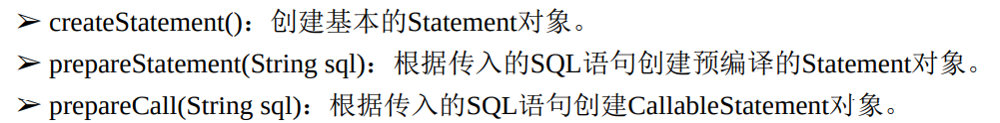
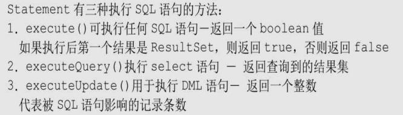

JDBC 

## 1. JDBC 基础

​	JDBC开发的应用可以跨平台，跨数据库。程序员只需要学习JDBC的api，他们只是一些接口，具体的实现类由各数据库公司提供驱动（体现了**面向接口编程**的原则）

​	jdbc编程的基本步骤：

1. 加载数据库驱动

2. 通过DriverManager获取数据库连接Connection（uri的一般格式：jdbc:数据库种类:uri）

3. 通过Connection创建Statement

   

4. 使用Statement执行sql

   

5. 操作结果集ResultSet

6. 回收资源，包括关闭ResultSet，Statement，Connection

``` java
public static void main(String[] args) throws Exception {

        Class.forName("com.mysql.cj.jdbc.Driver");
        try (
                Connection conn = DriverManager.getConnection(
                        "jdbc:mysql:///hospital?serverTimezone=UTC",
                        "root",
                        "password"
                );
                Statement stmt = conn.createStatement();
                ResultSet rs = stmt.executeQuery("select * from account");

        ) {
            while (rs.next()) {
                System.out.println(rs.getString(1) +
                        rs.getString(2) +
                        rs.getString(3) +
                        rs.getString(4));
            }

        }

    }
```

> 除了基本的statement，还可以使用它的子接口PreparedStatement，可以用？当占位符传入参数，可以提高效率，防止sql注入

## 管理结果集

​	以默认方式打开的ResultSet是不可更新的，需要额外的参数才能打开`resultSetType` ` resultSetConcurrency` 

## Blob类型数据

​	Blob（Binary Long Object）二进制长对象，通常存储大文件如图片，音频等。

​	如果需要将图片插入数据库，显然不能直接通过普通的SQL语句来完成，因为有一个 关键的问题—Blob常量无法表示。所以将Blob数据插入数据库需要使用 PreparedStatement，该对象有一个方法：setBinaryStream（int parameterIndex，InputStream x），该方法可以为指定参数传入二进制输入流，从而可以实现将Blob数据保存到数据库 的功能。

> 上面SQL语句中的img_data列使用mediumblob类型，而不是blob类型。因为MySQL 数据库里的blob类型最多只能存储64KB内容，这可能不够满足实际用途。所以使用 mediumblob类型，该类型的数据列可以存储16MB内容。

## 事务处理

​	事务是由一步或几步数据库操作序列组成的逻辑执行单元，这系列操作要么全部执 行，要么全部放弃执行。

> 事务具备4个特性：原子性（Atomicity）、一致性（Consistency）、隔离性 （Isolation）和持续性（Durability）。这4个特性也简称为ACID性。

​	一旦在MySQL的命令行窗口中输入set autocommit=0开启了事务，该命令行窗口里的 所有DML语句都不会立即生效，上一个事务结束后第一条DML语句将开始一个新的事 务，而后续执行的所有SQL语句都处于该事务中，除非显式使用commit来提交事务，或者 正常退出，或者运行DDL、DCL语句导致事务隐式提交。当然，也可以使用rollback回滚 来结束事务，使用rollback结束事务将导致本次事务中DML语句所做的修改全部失效。

