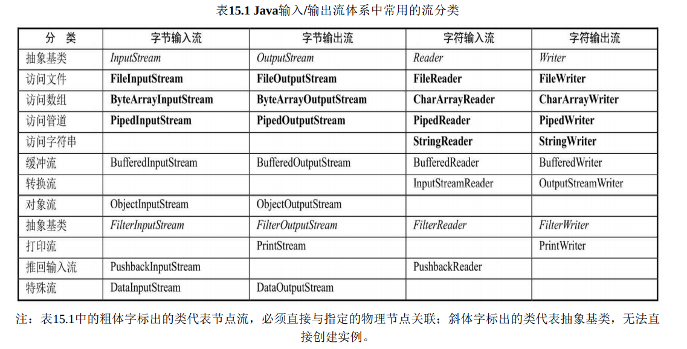
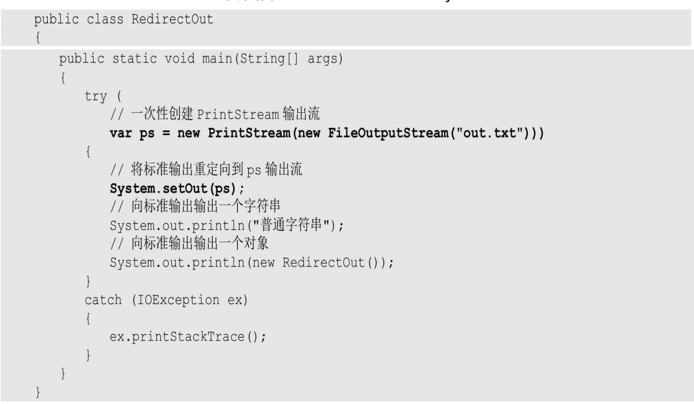

# I/O

​	分为输入 输出流， 每种又可以分为`字节流`和`字符流`

> 用到了装饰器模式，它将IO流分成底层节点流和上层处理流，其中节点流用于 和底层的物理存储节点直接关联——不同的物理节点获取节点流的方式可能存在一定的差 异，但程序可以把不同的物理节点流包装成统一的处理流，从而允许程序使用统一的输入、输出代码来读取不同的物理存储节点的资源。

## File类

​	File能新建，删除，重命名文件和目录但不能访问文件内容本身，需要使用流。

``` 
1.访问文件名相关方法
    ➢ String getName()：返回此File对象所表示的文件名或路径名（如果是路径，则返回
    最后一级子路径名）。
    ➢ String getPath()：返回此File对象所对应的路径名。
    ➢ File getAbsoluteFile()：返回此File对象的绝对路径。
    ➢ String getAbsolutePath()：返回此File对象所对应的绝对路径名。
    ➢ String getParent()：返回此File对象所对应目录（最后一级子目录）的父目录名。
    ➢ boolean renameTo(File newName)：重命名此File对象所对应的文件或目录，如果重命名成功，则返回true；否则			返回false。
2.文件检测相关方法
    ➢ boolean exists()：判断File对象所对应的文件或目录是否存在。
    ➢ boolean canWrite()：判断File对象所对应的文件和目录是否可写。
    ➢ boolean canRead()：判断File对象所对应的文件和目录是否可读。
    ➢ boolean isFile()：判断File对象所对应的是否是文件，而不是目录。
    ➢ boolean isDirectory()：判断File对象所对应的是否是目录，而不是文件。
    ➢ boolean isAbsolute()：判断File对象所对应的文件或目录是否是绝对路径。该方法
    消除了不同平台的差异，可以直接判断File对象是否为绝对路径。
4.文件操作相关方法
	➢ boolean createNewFile()：当此File对象所对应的文件不存在时，该方法将新建一个
	该File对象所指定的新文件，如果创建成功则返回true；否则返回false。
5.目录操作相关方法
    ➢ boolean mkdir()：试图创建一个File对象所对应的目录，如果创建成功，则返回
    true；否则返回false。调用该方法时File对象必须对应一个路径，而不是一个文件。
    ➢ String[] list()：列出File对象的所有子文件名和路径名，返回String数组。
    ➢ File[] listFiles()：列出File对象的所有子文件和路径，返回File数组。
    ➢ static File[] listRoots()：列出系统所有的根路径。这是一个静态方法，可以直接通
    过File类来调用。
```

​	File的list（）方法可以传入一个过滤器用：

> ```java
>  file.list((dir, name) -> name.endsWith(".md") || new File(name).isDirectory())
> ```

## 流的分类

​		Java的输入流主要由InputStream和Reader作为基类，而输出流则主要由OutputStream 和Writer作为基类。

​		字节流和字符流的用法几乎完全一样，区别在于字节流和字符流所操作的数据单元不 同——字节流操作的数据单元是8位的字节，而字符流操作的数据单元是16位的字符。 字节流主要由InputStream和OutputStream作为基类，而字符流则主要由Reader和Writer 作为基类。

​		流还可以分为节点流和处理流，节点流是低级的流，和不同的媒介打交道，到java这的时候都通过处理流的包装，用到了装饰器的设计模式

> ```java
> System.out.println(System.getProperty("user.dir")); //获取工程文件夹目录
> ```



基本的节点流都是通过读写一个单位或者读写一段数组的方式交互，把节点流包装进处理流就能获得更多高级功能

## 重定向标准输入/输出

system in/out 默认是从键盘输入，从屏幕输出。可以通过setErr,setIn,setOut来重定向输入输出流，从文件读或者写到文件里去



## NIO

​	Channel需要从stream中得到，channel的读写都需要通过buffer，buffer主要有三个参数，position，limit，capacity。在buffer初始化的时候position在0，capacity和limit都在最后，当往里输入东西时position会增加，当使用`flip（）` 之后position归0，limit变为position原来的位置。（这样做就是buff输入结束时，把指针归零，limit移到输入的最后一个地方，方便buff向其他输出时不会读到没赋值的地方）最后`clear()` 方法恢复初始状态，但里面的数据其实还在。

### Path Paths Files API

> File类的功能比较有限，它不能利 用特定文件系统的特性，File所提供的方法的性能也不高。

#### 		Path 

​		path是与系统无关的路径，可以对路径进行一些解析，如解析路径包含的层级，如c://a/b 调用`getNameCount()`会返回3，`getRoot()` 会返回c ，get(String first, String...more)方法来获取Path对象， Paths会将给定的多个字符串连缀成路径，比如Paths.get("g:", "publish", "codes")就返回 g:\publish\codes路径。

#### 	Files 

​		搜索文件夹的例子

 ``` java
 public class Test {
     public static void main(String[] args) throws IOException {
         Files.walkFileTree(Paths.get("."),new SimpleFileVisitor<>(){
             @Override
             public FileVisitResult visitFile(Path file, BasicFileAttributes attrs) throws IOException {
                 System.out.println("正在访问"+file);
                 if(file.endsWith("exception.java")){
                     System.out.println("发现");
                     return FileVisitResult.TERMINATE;
                 }
                 return FileVisitResult.CONTINUE;
             }
             @Override
             public FileVisitResult preVisitDirectory(Path dir, BasicFileAttributes attrs) throws IOException {
                 System.out.println("正在访问"+dir);
                 return  FileVisitResult.CONTINUE;
             }
         });
     }
 }
 ```

​	上面程序中使用了Files工具类的walkFileTree()方法来遍历目录下 的所有文件和子目录，如果找到的文件以“exception.java”结尾，则程序停止遍历—— 这就实现了对指定目录进行搜索，直到找到指定文件为止。

