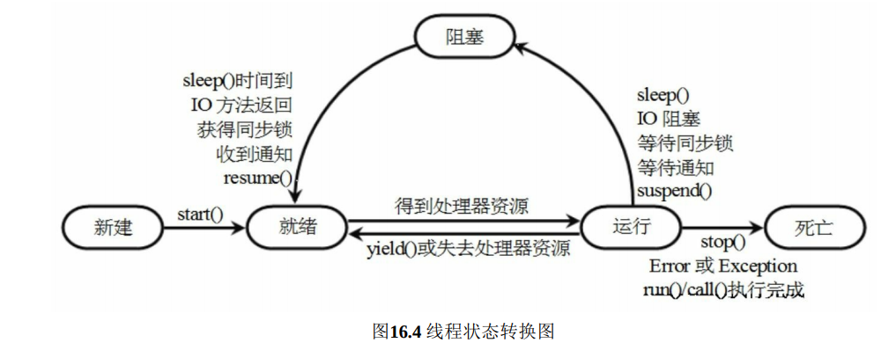

# 多线程 

### 创建线程 

**继承Thread**：

① 定义Thread类的子类，并重写该类的run()方法，该run()方法的方法体就代表了线 程需要完成的任务。因此把run()方法称为线程执行体。

② 创建Thread子类的实例，即创建了线程对象。

③ 调用线程对象的start()方法来启动该线程。

**实现Runnable接口**：

① 定义Runnable接口的实现类，并重写该接口的run()方法，该run()方法的方法体同 样是该线程的线程执行体。

 ② 创建Runnable实现类的实例，并以此实例作为Thread的target来创建Thread对象， 该Thread对象才是真正的线程对象。

③ 调用线程对象的start()方法来启动该线程。

​	采用Runnable接口的方式创建的多个线程可以共享线程类的实例变量。这是因为在这种方式 下，程序所创建的Runnable对象只是线程的target，而多个线程可以共享同一个target，所 以多个线程可以共享同一个线程类（实际上应该是线程的target类）的实例变量。

**实现Callable接口**：

> 采用实现Runnable、Callable接口的方式创建多线程的优缺点： 
>
> ➢ 线程类只是实现了Runnable接口或Callable接口，还可以继承其他类。
>
>  ➢ 在这种方式下，多个线程可以共享同一个target对象，所以非常适合多个相同线程 来处理同一份资源的情况，从而可以将CPU、代码和数据分开，形成清晰的模型， 较好地体现了面向对象的思想。
>
>  ➢ 劣势是，编程稍稍复杂，如果需要访问当前线程，则必须使用 Thread.currentThread()方法。
>
>  采用继承Thread类的方式创建多线程的优缺点： 
>
> ➢ 劣势是，因为线程类已经继承了Thread类，所以不能再继承其他父类。 
>
> ➢ 优势是，编写简单，如果需要访问当前线程，则无须使用Thread.currentThread()方 法，直接使用this即可获得当前线程。 鉴于上面分析，因此一般推荐采用实现Runnable接口、Callable接口的方式来创建多 线程。



每个线程只能调用一次`start()`方法

---


## 控制线程

	### join 

​	Thread提供了让一个线程等待另一个线程完成的方法——join()方法。当在某个程序 执行流中调用其他线程的join()方法时，调用线程将被阻塞，直到被join()方法加入的join线 程执行完为止。join()方法通常由使用线程的程序调用，以将大问题划分成许多小问题，每个小问题 分配一个线程。当所有的小问题都得到处理后，再调用主线程来进一步操作。

join()方法有如下三种重载形式。

​	 ➢ join()：等待被join的线程执行完成。 

​	➢ join(long millis)：等待被join的线程的时间最长为millis毫秒。如果在millis毫秒内被 join的线程还没有执行结束，则不		再等待。

​	 ➢ join(long millis, int nanos)：等待被join的线程的时间最长为millis毫秒加nanos毫微秒。

### 后台线程

​	后台线程有个特征：如果所有的前台线程都死亡，后台线程会自动死亡。 调用Thread对象的setDaemon(true)方法可将指定线程设置成后台线程。下面程序将执 行线程设置成后台线程，可以看到当所有的前台线程死亡时，后台线程随之死亡。当整个 虚拟机中只剩下后台线程时，程序就没有继续运行的必要了，所以虚拟机也就退出了。

### 线程睡眠 sleep

​	如果需要让当前正在执行的线程暂停一段时间，并进入阻塞状态，则可以通过调用 Thread类的静态sleep()方法来实现。

### 改变线程优先级

​	Thread类提供了setPriority（int newPriority）、getPriority()方法来设置和返回指定线程 的优先级，其中setPriority()方法的参数可以是一个整数，范围是1～10之间，也可以使用 Thread类的如下三个静态常量。

 ➢ MAX_PRIORITY：其值是10。

 ➢ MIN_PRIORITY：其值是1。

 ➢ NORM_PRIORITY：其值是5。

---


## 线程同步

``` java
sychronized(obj){
.....
}
```

​	上面的obj对象就是同步监视器，线程开始执行同步代码之前必须获得同步监视器的锁定，任何时候只有一个线程可以获得监视器的锁定，用完了会释放锁定。最好把共享资源作为同步监视器。

​	synchronized除了可以用在同步区上，还可以修饰实例方法，同步方法的监视器默认是this，同步方法可以实现线程安全的类，会具有以下的特征：

​		➢ 该类的对象可以被多个线程安全地访问。

 		➢ 每个线程调用该对象的任意方法之后都将得到正确结果。 

​		➢ 每个线程调用该对象的任意方法之后，该对象状态依然保持合理状态。


​	上面的方法加锁和解锁的过程是隐式的，显式的可以用Lock对象，Lock提供了同 步方法和同步代码块所没有的其他功能，包括用于非块结构的tryLock()方法，以及试图获 取可中断锁的lockInterruptibly()方法，还有获取超时失效锁的tryLock（long，TimeUnit） 方法。

***死锁的解决办法***：

➢ 避免多次锁定：尽量避免同一个线程对多个同步监视器进行锁定。比如上面的死 锁程序，主线程要对A、B两个对象（同步监视器）进行锁定，副线程也要对A、B 两个对象进行锁定，这就埋下了导致死锁的隐患。

 ➢ 具有相同的加锁顺序：如果多个线程需要对多个同步监视器进行锁定，则应该保 证它们以相同的顺序请求加锁。比如上面的死锁程序，主线程先对A对象（同步监 视器）加锁，再对B对象（同步监视器）加锁；而副线程则先对B对象加锁，再对 A对象加锁。这种方式很容易形成嵌套锁定，进而导致死锁。如果让主线程、副线 程按相同的顺序加锁，就可以避免死锁问题。

 ➢ 使用定时锁：程序调用Lock对象的tryLock()方法加锁时可指定time和unit参数，当 超过指定时间后会自动释放对Lock的锁定，这样就可以解开死锁了。 ➢ 死锁检测：这是一种依靠算法来实现的死锁预防机制，它主要针对那些不可能实 现按序加锁，也不能使用定时锁的场景。

---


## 线程通讯

​	为了实现这种功能，可以借助于Object类提供的wait()、notify()和notifyAll()三个方法，这三个方法并不属于Thread类，而是属于Object类。但这三个方法必须由同步监视器 对象来调用，这可分成以下两种情况。

 ➢ 对于使用synchronized修饰的同步方法，因为该类的默认实例（this）就是同步监 视器，所以可以在同步方法中直接调用这三个方法。

 ➢ 对于使用synchronized修饰的同步代码块，同步监视器是synchronized后括号里的对象，所以必须使用该对象调用这三个方法。 关于这三个方法的解释如下。

 ➢ wait()：导致当前线程等待，直到其他线程调用该同步监视器的notify()方法或 notifyAll()方法来唤醒该线程。该wait()方法有三种形式——无时间参数的wait（一 直等待，直到其他线程通知）、带毫秒参数的wait()和带毫秒、毫微秒参数的wait() （这两种方法都是等待指定时间后自动苏醒）。调用wait()方法的当前线程会释放 对该同步监视器的锁定。 

➢ notify()：唤醒在此同步监视器上等待的单个线程。如果所有线程都在此同步监视 器上等待，则会选择唤醒其中一个线程。选择是任意性的。只有当前线程放弃对该 同步监视器的锁定后（使用wait()方法），才可以执行被唤醒的线程。 

➢ notifyAll()：唤醒在此同步监视器上等待的所有线程。只有当前线程放弃对该同步 监视器的锁定后，才可以执行被唤醒的线程。

​	wait之后会释放锁资源，下次被唤醒时会接着执行wait后的代码。

​	对于没有用synchronized的，可以通过Lock获取Condition对象，使用await，signal，signalAll

----


## 线程组和未处理的异常

​	线程组可以用来统一控制多个线程，如果新建的线程没有指定分组，则默认和父线程一组，加入之后就不能改变。

创建线程组：

​	➢ ThreadGroup(String name)：以指定的线程组名字来创建新的线程组。

​	 ➢ ThreadGroup(ThreadGroup parent, String name)：以指定的名字、指定的父线程组创 建一个新线程组。

分配线程：

​	➢ Thread(ThreadGroup group, Runnable target)：以target的run()方法作为线程执行体创 建新线程，属于group线程		组。 

​	➢ Thread(ThreadGroup group, Runnable target, String name)：以target的run()方法作为 线程执行体创建新线程，该		线程属于group线程组，且线程名为name。

​	 ➢ Thread(ThreadGroup group, String name)：创建新线程，新线程名为name，属于 group线程组。

线程组的操作：

​	➢ int activeCount()：返回此线程组中活动线程的数目。

​	 ➢ interrupt()：中断此线程组中的所有线程。

​	 ➢ isDaemon()：判断该线程组是否是后台线程组。 

​	➢ setDaemon(boolean daemon)：把该线程组设置成后台线程组。后台线程组具有一个 特征——当后台线程组的最				后一个线程执行结束或最后一个线程被销毁后，后台线 程组将自动销毁。

 	➢ setMaxPriority(int pri)：设置线程组的最高优先级。

---

## 线程池

​	线程创建是有成本的，所以可以初始化一些空闲的线程，进行复用。

​	Executors工厂类来产生线程池，该工厂类包含如下几个静态工厂方 法来创建线程池。

​	ExecutorService代表尽快执行的线程池

​	ScheduledExecutorService代表延迟或者周期执行的线程池

​	
