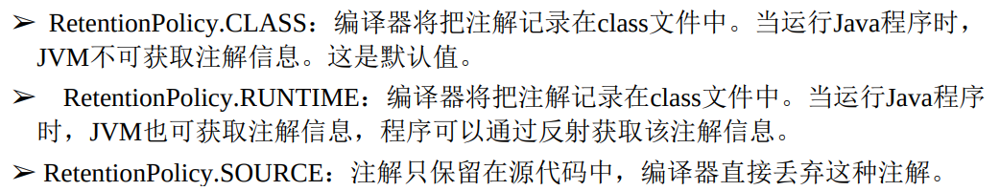

# 注解

## JDK的元注解

​	元注解都用于修饰其他的注解定义

​	`@Retention` ：用于指定注解可以保留多长时间



​	`@Target` : 用于指定注解能标注在哪些元素上,它有一个value的成员变量，值如下：

``` 
➢ ElementType.ANNOTATION_TYPE：指定该策略的注解只能修饰注解。
➢ ElementType.CONSTRUCTOR：指定该策略的注解只能修饰构造器。
➢ ElementType.FIELD：指定该策略的注解只能修饰成员变量。
➢ ElementType.LOCAL_VARIABLE：指定该策略的注解只能修饰局部变量。
➢ ElementType.METHOD：指定该策略的注解只能修饰方法定义。
➢ ElementType.PACKAGE：指定该策略的注解只能修饰包定义。
➢ ElementType.PARAMETER：指定该策略的注解可以修饰参数。
➢ ElementType.TYPE：指定该策略的注解可以修饰类、接口（包括注解类型）或枚举定义。
```

​	`@Inherited` ： 会是被修饰的注解具有继承性，被标注在类上时，子类也会自动加上注解

**标记注解** ：没有实际意义，就是添加了个标记，然后可以通过反射的方法来检测标记进行一些处理

