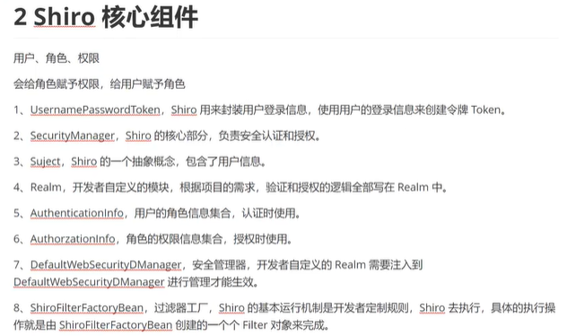
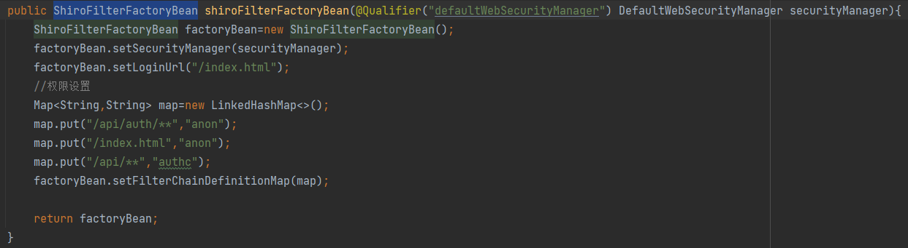

 	首先需要一个realm，里面有认证方法和授权方法，在认证方法中就可以用数据库或者其他方法来进行验证。授权的方法默认不会被调用，直到有其他地方需要用到当前用户的权限才会被执行。

​	配置一个config类，注入realm，然后再注入一个DefaultWebSecurityManager（依赖realm），最后注入ShiroFilterFactoryBean（依赖上一个），对过滤链的设置以及默认报错页面等都是对ShiroFilterFactoryBean进行设置 (注意定义过滤链条的map一定要是LinkedHashMap， 不然没有顺序会导致逻辑出错)



​	另外登录之后可以在其他地方通过SecurityUtils工具类来获取当前的用户信息，如下：

``` java
 Subject subject= SecurityUtils.getSubject();
 Account account=(Account)subject.getPrincipal();

//登录 登出的代码
subject.logout();

UsernamePasswordToken token=new UsernamePasswordToken(object.getString("username"),String.valueOf(object.getString("password"))
 subject.login(token);                                                     
```

​	

