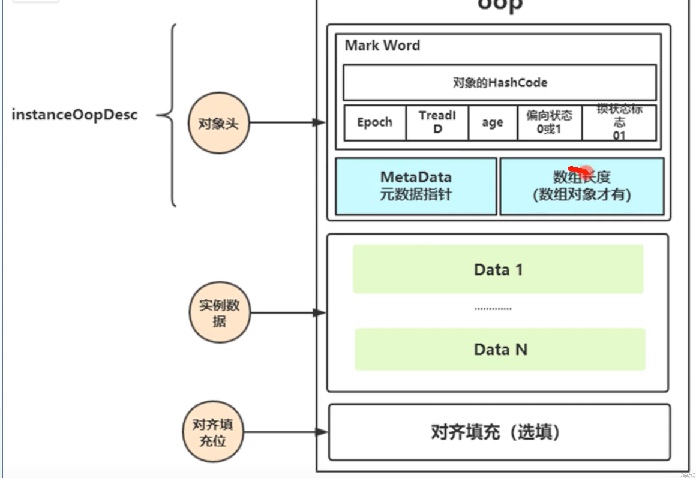
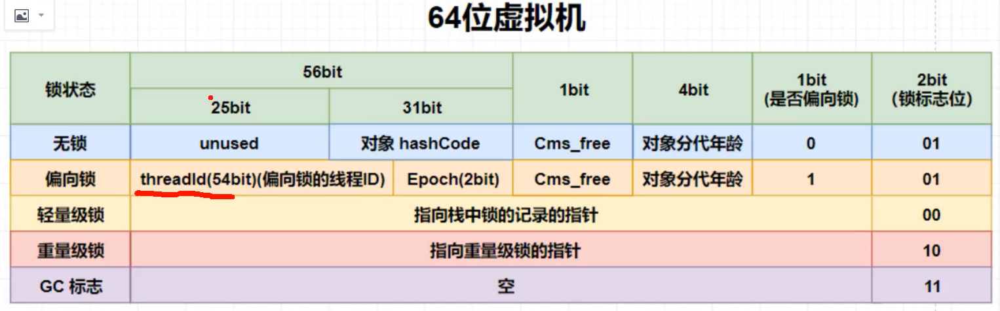
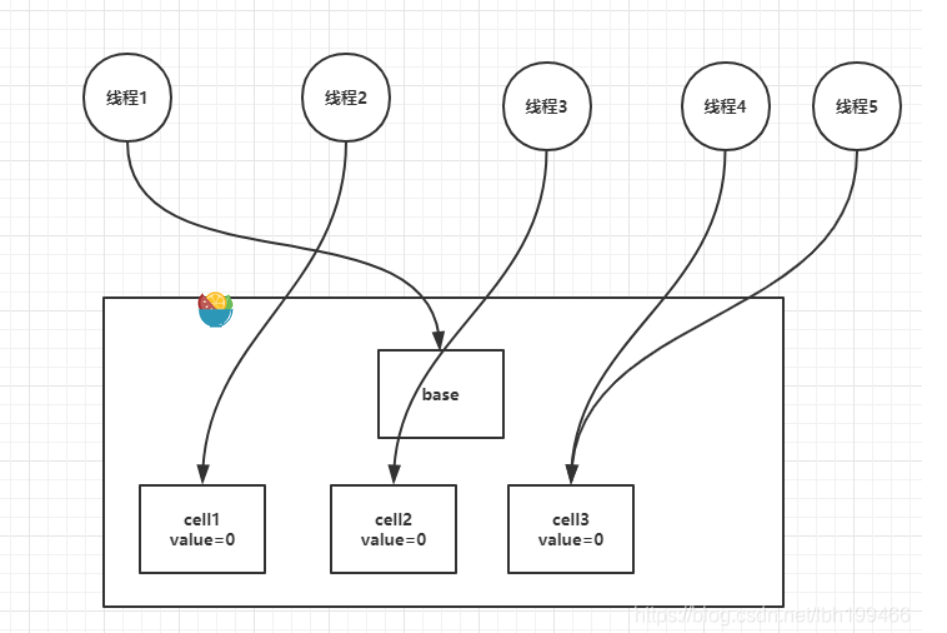

​	JAVA 线程同步有两种方法 一种是synchronized（汽车自动挡）一种是Lock（手动挡），使用不同的方法来实现了功能，synchronized主要是依靠jvm 用到了c++ 底层来实现的，而Lock则是通过java代码jdk层面上实现的。

​	synchronize的机制在java1.6之前就是直接上重锁，之后改成了锁升级的方式，而Lock的逻辑主要是AQS（abstractQueuedSynchronizer）里实现的。

## Synchronize 

​	是通过java对象结构中的对象头中的markWord来存放线程信息的，可以通过最后两位和偏向状态来判断当前对象的锁状态：

​	偏向锁会把线程id存进去，并且在同步代码块结束后也不会改回来，当又来了一个线程发现偏向锁的id不是自己的时候就会升级为轻量级锁，如果自旋了很多次没拿到就升级为重量级锁。重量级锁的指针就会指向c++中定义的monitor结构体。

​	**分段CAS**：LongAdder（实现类） 这个类在有多个线程想对一个值进行cas时，他会自动创建cell 初始值为0，分散线程自旋的对象，最后把所有的加起来。其实就是因为一个对象上太多线程自旋性能太低，分散一下，这样每个线程的平均自旋次数就下去了。

## AQS 

​	

