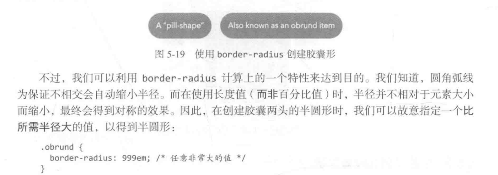

## em:

​	基于父元素的font-size来等比缩放，由于是基于最近的父级元素，所以如果父子元素都用em就会连乘，导致过大

## rem：

​	基于根元素的大小缩放，也就是html元素的font-size缩放

## opacity 和 backgroud：rgba（）设置透明度的区别：

​	opacity会使内容以透明，backgroud只会使背景透明，opacity设置后子元素只能变得更淡，不能设置回去

## 设置背景图片

background-position: 50% 50%;

 background-size: cover;

找到中间的位置，并永远都以图片原始比例会覆盖整个区域，有可能会裁切图片



## 盒阴影

```js
box-shadow: .25em .25em 5em rgba(0, 0, 0,1); // 前两个值是阴影对盒子x，y的偏移，第三个参数阴影的模糊半径，最后一个颜色
//还可以在前三个后加入一个大小参数 默认y盒子一样大
```

