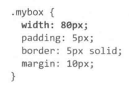
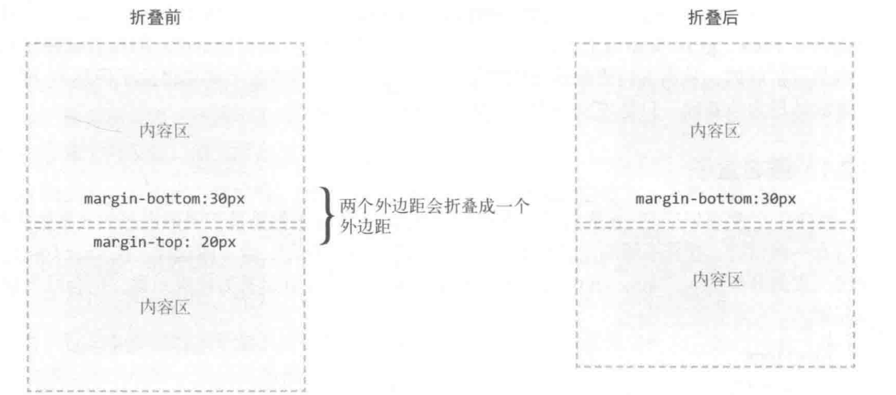
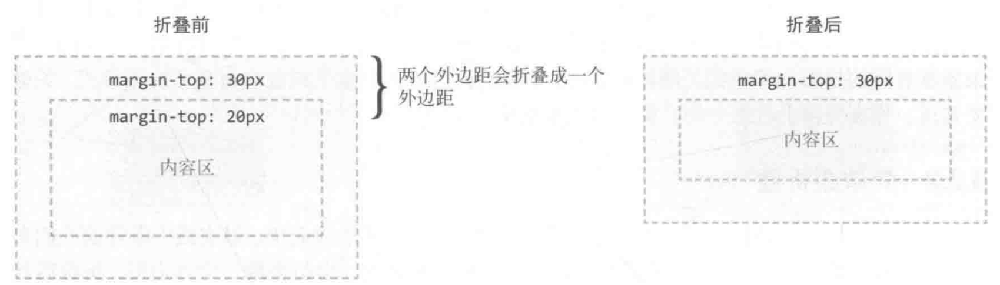
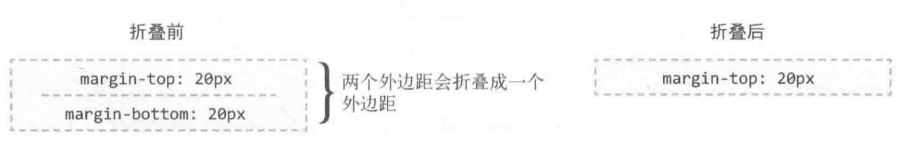
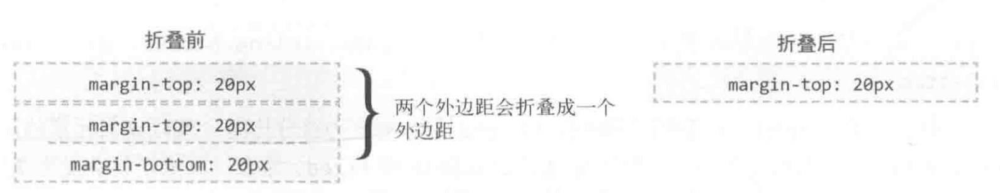
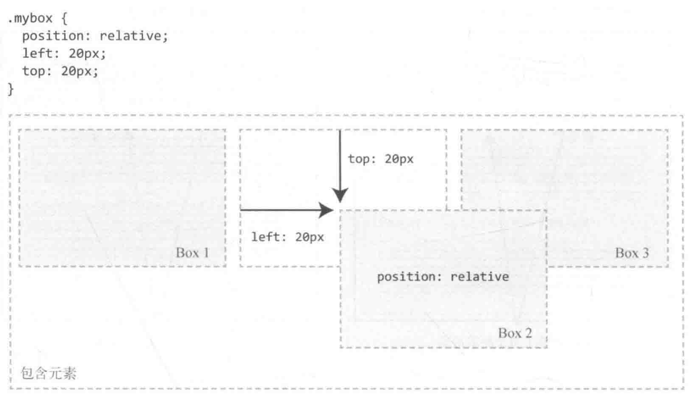
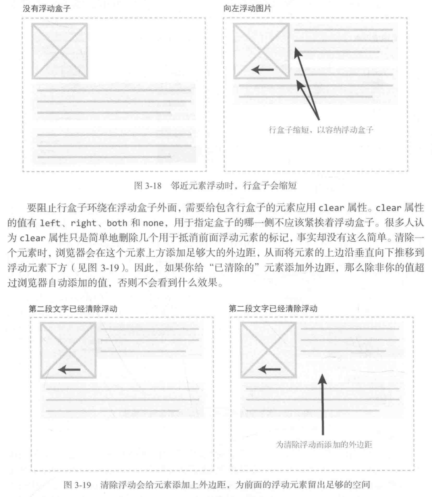

| 元素模式   | 元素排列               | 设置样式               | 默认宽度         | 包含                     |
| ---------- | ---------------------- | ---------------------- | ---------------- | ------------------------ |
| 块级元素   | 一行只能放一个块级元素 | 可以设置宽度高度       | 容器的100%       | 容器级可以包含任何标签   |
| 行内元素   | 一行可以放多个行内元素 | 不可以直接设置宽度高度 | 它本身内容的宽度 | 容纳文本或则其他行内元素 |
| 行内块元素 | 一行放多个行内块元素   | 可以设置宽度和高度     | 它本身内容的宽度 |                          |

**盒子大小：**

​	默认情况：

​		width指的只是内容区域的宽度，实际整体宽度还要加上border和padding

​	box-sizing：border-box:

​		width和height属性的值会包含内边距和边框，设大了padding和border就会占据内容空间

**外边距折叠（只会发生在常规文本流中的块级盒子）：**

 1. 上方元素的下外边距与下方元素的上外边距会折叠

    

	2. 元素的上外边距与父元素的上外边距折叠

    

	3. 元素自身的上下外边距折叠

    

	4. 空元素折叠之后还会与下一个元素的上边距折叠：

    

# 定位（position）：

## relative：

​	标准流中的位置会保持，相对初始位置进行偏移，会遮挡其他元素

## absolute：

​	元素会脱离文档流，不占位置，然后寻找最近的position不是static的祖先，如果没有就是html元素

## float：

​	元素会脱离文档流

​	

