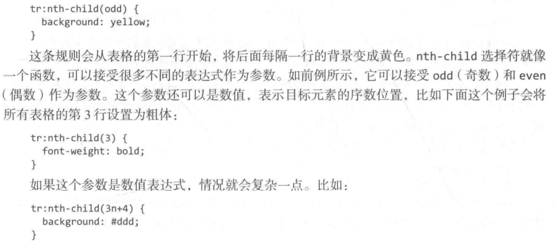
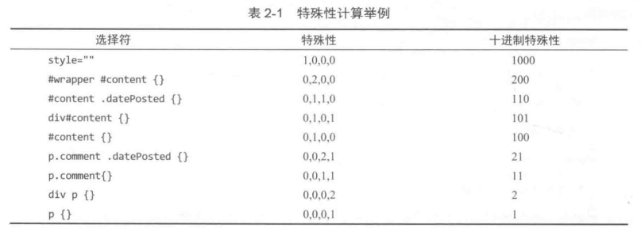
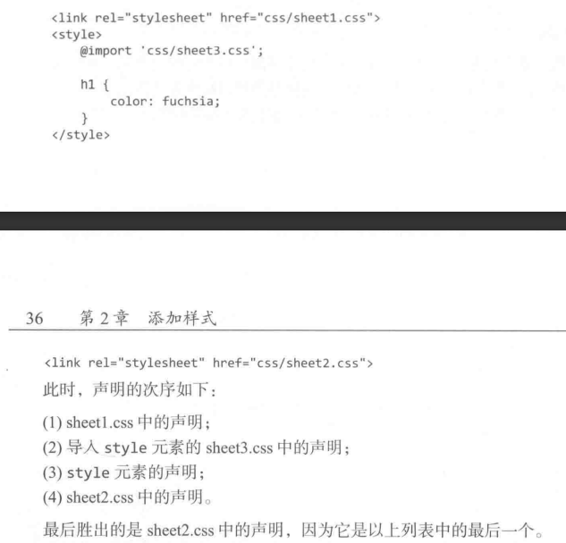

| 选择器                      | 含义                                                         |
| --------------------------- | ------------------------------------------------------------ |
| （ ）：h2 p {}              | h2中包含所有的p                                              |
| > : h2 > p {}               | h2下包含的直接子元素p，间接子元素不算                        |
| + : h2 + p {}               | 紧跟在h2元素之后的p，如果跟的不是p就无效了                   |
| ~ : h2 ~ p {}               | h2之后的所有p                                                |
| abbr[xxx] {}                | 选择所有存在xxx属性的元素                                    |
| input[type='submit'] {}     | 选择所有type属性值为submit的input元素                        |
| a[href^="http:"]            | ^:以开头  $:以结尾  *：包含                                  |
| p::before {} (双冒号伪元素) | ::brfore ::after ::first-letter ::first-line                 |
| a:link {} (单冒号伪类)      | :not() 反选                                                  |
| 结构化伪类                  |  |

## 层叠特殊性的计算 

行内 大于 id选择器 大于 类选择器 大于 类型选择器， 对相同特殊性的 优先使用后定义的

**继承**：当一个属性是可继承的时候，在子元素没有设置这个值的时候就会继承下来，继承没有特殊性，甚至连0都不算，因为通配符* {}是0都可以覆盖继承的样式

**三种引入css方式的次序优先级：**

link标签是最后引入，所以同级元素优先级更高

