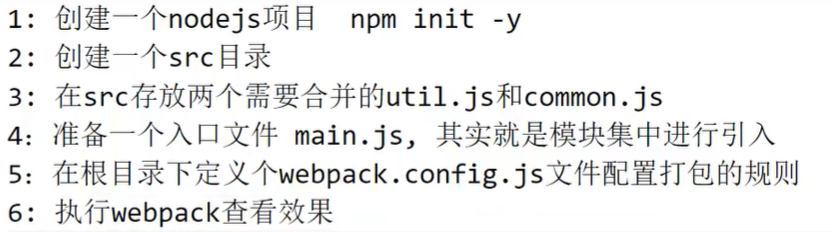

## Node

​	类似于jdk，可以运行js，不用去网页上调试了，安装之后会自带npm包管理器 就和maven一样

​	可以通过`npm init` 来初始化一个node项目，会在文件夹下生成一个package.json的文件（类似pom.xml）

​	要是用babel转码的话 需要安装对应的解码器 `npm i babel-preset-es2015`

```json
{
  "dependencies": {
    "babel-preset-es2015": "^6.24.1",	//这是依赖
    "mysql": "^2.18.1"
  },
  "name": "node",		//下面这些都是初始化的时候定义的
  "version": "1.0.0",
  "main": "test.js",	//主函数
  "devDependencies": {},
  "scripts": {
    "test": "echo \"Error: no test specified\" && exit 1",
    "dev" : "babel src -d dist"  // 可以自定义一些脚本 用npm run xxx 来运行   比如这里就用dev命令来对src下的es6文件转码成es5语法，存放在dist文件夹下
  },
  "keywords": [],
  "author": "",
  "license": "ISC",
  "description": ""
}

```

## 模块化

	### CommonJS

​	较多使用在node项目中

```js
//export.js

const sum = (a,b)=>a+b
const min = (a,b)=>a-b

module.exports = {		//exports 导出
    sum,
    min
}
//import.js

const m =require('./test')		//require 导入 类似与封装成一个对象

console.log(m.sum(1,2))
console.log(m.min(1,2))
```


### ES6的模块化

​	较多使用在web，前端项目中，有两种写法， es6的语法可能没法运行在浏览器。需要使用babel来进行转码到es5的语法

* 第一种写法（不是很常用）

  ```js
  //export.js
  export function getList() {
      console.log("getlist")
  }
  
  export function save() {
      console.log('save')
  }
  
  //import.js
  import {getList,save} from './test'		//一个一个的导出与引入，比较麻烦
  
  getList()
  save()
  
  ```

  

* 第二种写法（常用）

  ```js
  //export.js
  export default {
      getList(){
      console.log("getlist")
      },
      save() {
      console.log('save')
      }
  }			
  
  //import.js
  import user from './test'
  
  user.getList()				//整体导出，引用的时候当作一个对象引入
  user.save()
  ```

  

## Webpack



 	首先安装npm安装webpack，然后在更目录下创建一个webpack.config.js文件

```js
const path = require('path')


module.exports = {
    entry : './src/main.js',		//从哪个js开始，作为入口
    output : {
        path:path.resolve(__dirname,'./dist'),		//输出目录和文件命名
        filename : 'pack.js'
    },
    module:{
        rules:[{
            test:/\.css$/,
            use:["style-loader","css-loader"]		//匹配一些特殊格式的文件，使用不同的loader进行加载
        }]
    }
}
```

使用webpack命令就会生成了，html中直接引入就可以了，还有一个`webpack -w`可以持续监听改变，就可以和liveserver配合使用了。


​	网页中只能用es6的import语法，node.js中默认使用require语法（可以改后缀.mjs或者pakage.json的type来修改），如果一个js是使用require语法的，经过webpack的打包也可以让浏览器访问
