VsCode使用

##  快捷键

- 放大缩小视图：ctrl +  加号  和 ctrl +  减号
- 向上复制一行：alt+shift+↑ 
- 向下复制一行：alt+shift+↓ 
- 当光标点击到某一行时，默认选中全行，可以直接复制粘贴
- 按住alt+shift 再拖动鼠标，可以给一组标签输入相同的内容

##  插件
| 插件                                             | 作用                                              |
| ------------------------------------------------ | :------------------------------------------------ |
| Chinese   (Simplified) Language Pack for VS Code | 中文（简体）语言包                                |
| Open   in Browser                                | 右击选择浏览器打开html文件                        |
| JS-CSS-HTML   Formatter                          | 每次保存，都会自动格式化JS CSS和HTML 代码（对齐） |
| Auto   Rename Tag                                | 自动重命名配对的HTML / XML标签                    |
| CSS   Peek                                       | 追踪至样式                                        |

# 认识WEB


## 1. 认识网页

```
网页主要由文字、图像和超链接等元素构成。当然，除了这些元素，网页中还可以包含音频、视频以及Flash等。
```


**思考：** 

网页是如何形成的呢?


### 总结

网页有图片、链接、文字等元素组成，我们后面的任务就是要把这部分网页元素用代码写出来。。。

## 2. 浏览器（显示代码）

```
浏览器是网页显示、运行的平台，常用的浏览器有IE、火狐（Firefox）、谷歌（Chrome）、Safari和Opera等。我们平时称为五大浏览器。
```

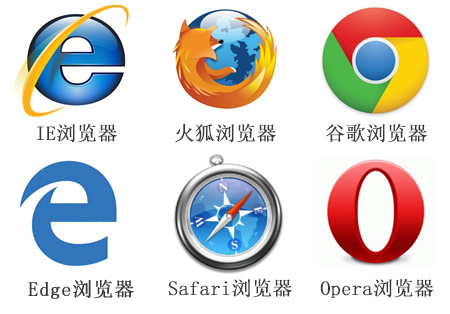

可能你最熟悉的是 IE浏览器，但是。。。


### 2.1 查看浏览器占有的市场份额

查看网站： <a href="http://tongji.baidu.com/data/browser" target="_blank">http://tongji.baidu.com/data/browser</a>


 2008年，大名鼎鼎的互联网巨头Google公司发布了它的首款浏览器Chrome浏览器。   

 跟王思聪一样，没办法，生下来人家就是富二代官二代啊，后台太强，而且确实先天能力得天独厚。 

**pink老师 一句话说出他们:**

> 出自谷歌，唯我不败；一统江湖，千秋万代。 

### 2.2 常见浏览器内核（了解）

首先解释一下浏览器内核是什么东西。英文叫做：Rendering Engine，中文翻译很多，排版引擎、解释引擎、渲染引擎，现在流行称为浏览器内核.

```
负责读取网页内容，整理讯息，计算网页的显示方式并显示页面.
```
因为浏览器太多啦， 但是现在主要流行的就是下面几个：

| 浏览器  |      内核      | 备注                                                         |
| :------ | :------------: | :----------------------------------------------------------- |
| IE      |    Trident     | IE、猎豹安全、360极速浏览器、百度浏览器                      |
| firefox |     Gecko      | 可惜这几年已经没落了，打开速度慢、升级频繁、猪一样的队友flash、神一样的对手chrome。 |
| Safari  |     webkit     | 现在很多人错误地把 webkit 叫做 chrome内核（即使 chrome内核已经是 blink 了）。苹果感觉像被别人抢了媳妇，都哭晕再厕所里面了。 |
| chrome  | Chromium/Blink | 在 Chromium 项目中研发 Blink 渲染引擎（即浏览器核心），内置于 Chrome 浏览器之中。Blink 其实是 WebKit 的分支。大部分国产浏览器最新版都采用Blink内核。二次开发 |
| Opera   |     blink      | 现在跟随chrome用blink内核。                                  |

**拓展阅读：**
```
移动端的浏览器内核主要说的是系统内置浏览器的内核。

Android手机而言，使用率最高的就是Webkit内核，大部分国产浏览器宣称的自己的内核，基本上也是属于webkit二次开发。

iOS以及WP7平台上，由于系统原因，系统大部分自带浏览器内核，一般是Safari或者IE内核Trident的
```

## 3. Web标准（重点）

目标

* 记忆
  * 能说出网页 中 web 标准三层组成
* 理解
  * 能结合人来表述web标准三层

Web标准不是某一个标准，而是由W3C组织和其他标准化组织制定的一系列标准的集合。

W3C 万维网联盟是国际最著名的标准化组织。1994年成立后，至今已发布近百项相关万维网的标准，对万维网发展做出了杰出的贡献。

**w3c就类似于现实世界中的联合国。**

### 3.1 为什么要遵循WEB标准呢？

 通过以上浏览器不同内核不同，我们知道他们显示页面或者排版就有些许差异。


### 3.2 Web 标准的好处

遵循web标准可以让不同我们写的页面更标准更统一外，还有许多优点

*1*、让Web的发展前景更广阔 
*2*、内容能被更广泛的设备访问
*3*、更容易被搜寻引擎搜索
*4*、降低网站流量费用
*5*、使网站更易于维护
*6*、提高页面浏览速度

###  3.3 Web 标准构成

**构成：** 主要包括结构（Structure）、表现（Presentation）和行为（Behavior）三个方面。

| 标准 | 说明                                                         | 备注                           |
| :--- | :----------------------------------------------------------- | :----------------------------- |
| 结构 | 结构用于对**网页元素**进行整理和分类，咱们主要学的是HTML。   |   |
| 表现 | 表现用于设置网页元素的版式、颜色、大小等**外观样式**，主要指的是CSS |     |
| 行为 | 行为是指网页模型的定义及**交互**的编写，咱们主要学的是 Javascript |  |

 理想状态我们的源码： .HTML      .css      .js 


**结合人来记忆web标准：**

* 结构标准：    是你天然的身体 


* 表现标准：     决定你是否打扮的美丽外观(衣服？化妆？)


* 行为标准：     决定你是否有吸引人的行为(动作)

****

### web标准小结

* web标准有三层结构，分别是结构（html）、表现（css）和行为（javascript）  
* 结构类似人的身体， 表现类似人的着装， 行为类似人的行为动作
* 理想状态下，他们三层都是独立的， 放到不同的文件里面

## 4. 拓展@

* **介绍一下你对浏览器内核的理解？常见的浏览器内核有哪些？**

  浏览器内核包括两部分，渲染引擎和js引擎。渲染引擎负责读取网页内容，整理讯息，计算网页的显示方式并显示页面，js引擎是解析执行js获取网页的动态效果。 后来 JS 引擎越来越独立，内核就倾向于只指渲染引擎。
  IE：Trident 
  firefox：Gecko 
  chrom、safari：webkit 
  Opera：Presto 
  Microsoft Edge：EdgeHTML

  深度阅读：[五大主流浏览器内核的源起以及国内各大浏览器内核总结](http://blog.csdn.net/summer_15/article/details/71249203) 
  
---
typora-copy-images-to: media

---

> 第01阶段.前端基础.认识HTML

## 学习目标

- 理解
  - HTML的概念
  - HTML标签的分类
  - HTML标签的关系
  - HTML标签的语义化
- 应用
  - HTML骨架格式
  - sublime基本使用

# 1. HTML 初识

- HTML 指的是超文本标记语言 (**H**yper **T**ext **M**arkup **L**anguage)是用来描述网页的一种语言。
- HTML 不是一种编程语言，而是一种标记语言 (markup language)
- 标记语言是一套标记标签 (markup tag)

**pink老师 一句话说出html作用:**

> 网页是由网页元素组成的 ， 这些元素是利用html标签描述出来，然后通过浏览器解析，就可以显示给用户了。

**所谓超文本，有2层含义：** 

1. 因为它可以加入图片、声音、动画、多媒体等内容（**超越文本限制 **）
2. 不仅如此，它还可以从一个文件跳转到另一个文件，与世界各地主机的文件连接（**超级链接文本 **）。

```html

```

**门外汉眼中的效果页面**


**我们要做的html页面**


**html 总结:**

* html 是超文本标记(标签)语言
* 我们学习html 主要学习html标签
* 我们用html标签描述网页元素。 比如 图片标签 、文字标签、链接标签等等
* 标签有自己的语法规范，所有的html标签都是用 <> 表示的
* H（很）T（甜）M（蜜）L（啦） 是很快乐的一件事情

## 1.1 HTML骨架标签

日常生活的书信，我们要遵循共同的约定。 


同理：HTML 有自己的语言语法骨架格式：（要遵循，要专业） 要求务必非常流畅的默写下来。。

```html
<html>   
    <head>     
        <title></title>
    </head>
    <body>
    </body>
</html>
```

#### html骨架标签总结

| 标签名           |    定义    | 说明                                                    |
| ---------------- | :--------: | :------------------------------------------------------ |
| <html></html>    |  HTML标签  | 页面中最大的标签，我们成为  根标签                      |
| <head></head>    | 文档的头部 | 注意在head标签中我们必须要设置的标签是title             |
| <titile></title> | 文档的标题 | 让页面拥有一个属于自己的网页标题                        |
| <body></body>    | 文档的主体 | 元素包含文档的所有内容，页面内容 基本都是放到body里面的 |

**课堂练习1： **   

书写我们的第一个HTML 页面。

1. 新建一个 01-html骨架标签  的 TXT 文件。

2. 里面写入刚才的HTML 骨架。  

3. 把后缀名改为 .HTML。

4. 右击--谷歌浏览器打开。

   ```html
   <html>   
       <head>     
           <title>我的第一个页面</title>
       </head>
       <body>
              你我之间 黑马洗练 月薪过万   一飞冲天   
       </body>
   </html>
   ```


 

为了便于记忆，我们请出刚才要辞职回家养猪的二师兄来帮忙， 我称之为  猪八戒记忆法


#### 团队约定大小写

HTML标签名、类名、标签属性和大部分属性值统一用小写

*推荐：*

```
<head>     
        <title>我的第一个页面</title>
 </head>
```

*不推荐：*

```
<HEAD>     
        <TITLE>我的第一个页面</TITLE>
</HEAD>
```

## 1.2 HTML元素标签分类

**标签：**

在HTML页面中，带有“< >”符号的元素被称为HTML标签，如上面提到的 &lt;html&gt;、&lt;head&gt;、&lt;body&gt;都是HTML骨架结构标签。

**分类：**

1. 常规元素（双标签）

```html
<标签名> 内容 </标签名>   比如 <body>  我是文字  </body>
```

* 该语法中“<标签名>”表示该标签的作用开始，一般称为“开始标签（start tag）”，“</标签名>” 表示该标签的作用结束，一般称为“结束标签（end tag）”。
* 和开始标签相比，结束标签只是在前面加了一个关闭符“/”。
* 我们以后接触的基本都是双标签

2. 空元素（单标签）

```html
<标签名 />  比如  <br />
```

* 空元素 用单标签来表示， 简单点说，就是里面不需要包含内容， 只有一个开始标签不需要关闭。
* 这种单身狗标签非常少，一共没多少，我们多记忆就好

**pink老师 一句话说出他们:**

> 世界上单身狗毕竟是少数的， 大部分还是喜欢成双成对，不要拉下你的另外一半，对待一个双标签要有始有终。

## 1.3 HTML标签关系

主要针对于**双标签** 的相互关系分为两种：  请大家务必熟悉记住这种标签关系，因为后面我们标签嵌套特别多，很容易弄混他们的关系。

1. 嵌套关系

```html
<head>  
	<title> </title> 
</head>
```


2.并列关系

```html
<head></head>
<body></body>

```


**倡议：** 

> ```html
> 如果两个标签之间的关系是嵌套关系，子元素最好缩进一个tab键的身位（一个tab是4个空格）。如果是并列关系，最好上下对齐。
> 
> ```


**pink老师 一句话说出他们:**

> html双标签 可以分为  有 一种是 父子级 包含关系的标签      一种是 兄弟级 并列关系的标签


## 1.4 课堂一练

**请问下列哪组标签关系是错误的？ **

- [ ] <head> </head><body> </body>


- [ ] <div> <strong></strong> </div>


- [x] <head> <title></head> </title>


- [ ] <body> <div></div> </body>


# 2. 代码开发工具（书写代码）

- 为了提高我们的开发效率

- 减少代码的出错我们不提倡用记事本开发，我们有更好的犀利哥。

  

- Dreamweaver

- SublimeText

- WebStorm

- HBuilder

- VScode

有人说：

  普通青年    Dreamweaver

  文艺青年    sublime

  高手和傻子  用记事本

  其实。。。。

  


感觉： 这个feel 倍儿爽 feel feel倍儿爽 爽爽爽爽！

 


sublime有非常多的优点， 最开心的就是非常轻量级，打开速度超快，后面更高的功能，后面再接触。

**sublime生成html骨架小技巧**

*  双击打开软件
*  新建文件（ctrl+n）
*  保存（ctrl+s）,保存为：文件名.html （ 注意 后缀名必须是 .html ) 
*  放大缩小代码  按住 ctrl  在 滚动鼠标滚轮  或者   ctrl+ 加号 键     和 ctrl +   减号键     
*  生成页面骨架结构
   - html: 5    按下tab键    或者  
   - !    按下tab键
*  在浏览器中预览页面
   - 右键在  浏览器中打开

# 3. 文档类型<!DOCTYPE>

**用法：**

```html
<!DOCTYPE html> 
```

**作用：**

<!DOCTYPE> 声明位于文档中的最前面的位置，处于 <html> 标签之前。此标签可告知浏览器文档使用哪种 HTML 或 XHTML 规范。


**pink老师 一句话说出他们:**

   <!DOCTYPE html>  就是告诉浏览器按照HTML5 规范解析页面.


**团队约定：**

> ```
> HTML文件必须加上 DOCTYPE 声明，并统一使用 HTML5 的文档声明
> 
> ```

# 4. 页面语言lang

~~~html
<html lang="en">  指定html 语言种类

~~~

最常见的2个：

1. `en`定义语言为英语
2. `zh-CN`定义语言为中文

**pink老师 一句话说出他们:**

>  <html lang="zh-CN">  指定该html标签 内容 所用的语言为中文

**团队约定：**

> ```
> 考虑浏览器和操作系统的兼容性，目前仍然使用 zh-CN 属性值
> 
> ```

**@拓展阅读：**

简单来说，可能对于程序来说没有太大的作用，但是它可以告诉浏览器，搜索引擎，一些处理Html的程序对页面语言内容来做一些对应的处理或者事情。
比如可以

- 根据根据lang属性来设定不同语言的css样式，或者字体
- 告诉搜索引擎做精确的识别
- 让语法检查程序做语言识别
- 帮助翻译工具做识别
- 帮助网页阅读程序做识别
  等等

# 5. 字符集

~~~html
<meta charset="UTF-8" />
~~~

~~~
字符集(Character set)是多个字符的集合。
计算机要准确的处理各种字符集文字，需要进行字符编码，以便计算机能够识别和存储各种文字。
~~~

utf-8是目前最常用的字符集编码方式，常用的字符集编码方式还有gbk和gb2312。

* gb2312 简单中文  包括6763个汉字  GUO BIAO
* BIG5   繁体中文 港澳台等用
* GBK包含全部中文字符    是GB2312的扩展，加入对繁体字的支持，兼容GB2312
* UTF-8则基本包含全世界所有国家需要用到的字符
* **这句代码非常关键， 是必须要写的代码，否则可能引起乱码的情况。**

**pink老师 一句话说出他们:**

> 这句话是让 html 文件是以 UTF-8 编码保存的， 浏览器根据编码去解码对应的html内容。

**团队约定：**

> ```
> 一般情况下统一使用 "UTF-8" 编码, 请尽量统一写成标准的 "UTF-8"，不要写成 "utf-8" 或 "utf8" 或 "UTF8"。
> ```

# 6. HTML标签的语义化

白话： 所谓标签语义化，就是指标签的含义。

**pink老师 一句话说出语义化目的:**

> 根据标签的语义，在合适的地方给一个最为合理的标签，让结构更清晰。

1. 方便代码的阅读和维护
2. 同时让浏览器或是网络爬虫可以很好地解析，从而更好分析其中的内容 
3. 使用语义化标签会具有更好地搜索引擎优化 


语义是否良好： 当我们去掉CSS之后，网页结构依然组织有序，并且有良好的可读性。(  裸奔起来一样好看 )

遵循的原则：先确定语义的HTML ，再选合适的CSS。所以，**我们接下来学习html标签，要根据语义去记忆。** HTML网页中任何元素的实现都要依靠HTML标签。

# 7. 拓展阅读@

## 单身狗的由来

单身狗一词最早是出自网络社区，起源与大话西游有关。

大话西游之大圣娶亲最后一幕“他好像一条狗”由来。

 
 
 
---
typora-copy-images-to: media

---

> 第01阶段.前端基础.HTML常用标签

## 学习目标

- 理解：
  - 相对路径三种形式
- 应用
  - 排版标签
  - 文本格式化标签
  - 图像标签
  - 链接
  - 相对路径，绝对路径的使用

# 1. HTML常用标签

 首先 HTML和CSS是两种完全不同的语言，我们学的是结构，就只写HTML标签，认识标签就可以了。 不会再给结构标签指定样式了。

 HTML标签有很多，这里我们学习最为常用的，后面有些较少用的，我们可以查下手册就可以了。 

## 1.1 排版标签

排版标签主要和css搭配使用，显示网页结构的标签，是网页布局最常用的标签。

### 1）标题标签h (熟记)

 单词缩写：  head   头部. 标题       title  文档标题

为了使网页更具有语义化，我们经常会在页面中用到标题标签，HTML提供了6个等级的标题，即

**标题标签语义：**  作为标题使用，并且依据重要性递减

其基本语法格式如下：

```html
<h1>   标题文本   </h1>
<h2>   标题文本   </h2>
<h3>   标题文本   </h3>
<h4>   标题文本   </h4>
<h5>   标题文本   </h5>
<h6>   标题文本   </h6>
```

显示效果如下：

  

**小结 :**

- 加了标题的文字会变的加粗，字号也会依次变大
- 一行是只能放一个标题的

```
    传智播客学前端，
　　 前端入门亦简单。
　　 简单知识简单看，
　　 重点勤练写三遍。
　　 标题一共六级选，
　　 具体效果刷新见。
　　        ------pink老师
```

### 2）段落标签p ( 熟记)

单词缩写：  paragraph  段落  [ˈpærəgræf]    无须记这个单词

**作用语义：**

可以把 HTML 文档分割为若干段落

 在网页中要把文字有条理地显示出来，离不开段落标签，就如同我们平常写文章一样，整个网页也可以分为若干个段落，而段落的标签就是

```html
<p>  文本内容  </p>
```

是HTML文档中最常见的标签，默认情况下，文本在一个段落中会根据浏览器窗口的大小自动换行。

### 3）水平线标签hr(认识)

单词缩写：  horizontal  横线    [ˌhɔrəˈzɑntl]    同上

在网页中常常看到一些水平线将段落与段落之间隔开，使得文档结构清晰，层次分明。这些水平线可以通过插入图片实现，也可以简单地通过标签来完成，<hr />就是创建横跨网页水平线的标签。其基本语法格式如下：

```html
<hr />是单标签
```

 在网页中显示默认样式的水平线。

课堂练习:新闻页面 

 

### 4）换行标签br (熟记)

单词缩写：  break   打断 ,换行

在HTML中，一个段落中的文字会从左到右依次排列，直到浏览器窗口的右端，然后自动换行。如果希望某段文本强制换行显示，就需要使用换行标签

```html
<br />
```

这时如果还像在word中直接敲回车键换行就不起作用了。

此处有练习题

### 5）div 和  span标签(重点)

div   span    是没有语义的     是我们网页布局主要的2个盒子   想必你听过  css+div

div 就是  division  的缩写   分割， 分区的意思  其实有很多div 来组合网页。

span   跨度，跨距；范围    

语法格式：

```html
<div> 这是头部 </div>    <span>今日价格</span>
```

他们两个都是盒子，用来装我们网页元素的， 只不过他们有区别，现在我们主要记住使用方法和特点就好了

* div标签  用来布局的，但是现在一行只能放一个div
* span标签  用来布局的，一行上可以放好多个span

后面后面讲显示模式的时候，会告诉大家

### 排版标签总结

| 标签名        | 定义       | 说明                                  |
| ------------- | :--------- | :------------------------------------ |
| <hx></hx>     | 标题标签   | 作为标题使用，并且依据重要性递减      |
| <p></p>       | 段落标签   | 可以把 HTML 文档分割为若干段落        |
| <hr />        | 水平线标签 | 没啥可说的，就是一条线                |
| <br />        | 换行标签   |                                       |
| <div></div>   | div标签    | 用来布局的，但是现在一行只能放一个div |
| <span></span> | span标签   | 用来布局的，一行上可以放好多个span    |

## 1.2 文本格式化标签(熟记)

在网页中，有时需要为文字设置粗体、斜体或下划线效果，这时就需要用到HTML中的文本格式化标签，使文字以特殊的方式显示。


**区别：**

 b  只是加粗          strong  除了可以加粗还有 强调的意思，  语义更强烈。

剩下的同理...    

> 请同学们重点记住 前两组   加粗 和 倾斜   后面两组没记住回来查


## 1.3 标签属性

 

所谓属性就是**外在特性**  比如 手机的颜色 手机的尺寸 ，总结就是手机的。。

- 手机的颜色是黑色   
- 手机的尺寸是 8寸 
- 水平线的长度是 200  
- 图片的宽度 是  300    

使用HTML制作网页时，如果想让HTML标签提供更多的信息，可以使用HTML标签的属性加以设置。其基本语法格式如下：

```html
<标签名 属性1="属性值1" 属性2="属性值2" …> 内容 </标签名>
<手机 颜色="红色" 大小="5寸">  </手机>
```


## 1.4 图像标签img (重点)

单词缩写：   image  图像

要想在网页中显示图像就需要使用图像标签，接下来将详细介绍图像标签以及和他相关的属性。（它是一个单身狗）

语法如下：

```html

```

该语法中src属性用于指定图像文件的路径和文件名，他是img标签的必需属性。

我们一般只使用图片的src和alt属性，width，height和border都是通过css设置的，**图片如果只设置宽度或者高度，另一个值会等比例缩放**。


border 后面我们会用css来做，这里童鞋们就记住这个border 单词就好了

**注意: **

1. 标签可以拥有多个属性，必须写在开始标签中，位于标签名后面。
2. 属性之间不分先后顺序，标签名与属性、属性与属性之间均以空格分开。
3. 采取  键值对 的格式   key="value"  的格式  

比如:  

```html
	正常的<br />
    <br />
     带有边框的<br />
    <br />
	有提示文本的<br />
	<br />
	有替换文本的<br />
	

```

此处有练习题

**重点掌握点：**

- [ ] 请说出 图像标签那个属性是必须要写的？
- [ ] 请说出 图像标签中 alt 和  title 属性区别？ 

## 1.5 链接标签(重点)

单词缩写：  anchor 的缩写  [ˈæŋkə(r)] 。基本解释 锚, 铁锚 的

在HTML中创建超链接非常简单，只需用标签把文字包括起来就好。

语法格式：

```html
<a href="跳转目标" target="目标窗口的弹出方式">文本或图像</a>
```

| 属性   | 作用                                                         |
| ------ | :----------------------------------------------------------- |
| href   | 用于指定链接目标的url地址，（必须属性）当为标签应用href属性时，它就具有了超链接的功能 |
| target | 用于指定链接页面的打开方式，其取值有_self和_blank两种，其中_self为默认值，__blank为在新窗口中打开方式。 |
| title  | 鼠标悬停在超链接上的时候，显示该超链接的文字注释             |

**注意：**

1. 外部链接 需要添加 http:// www.baidu.com
2. 内部链接 直接链接内部页面名称即可 比如 < a href="index.html"> 首页 </a >
3. 如果当时没有确定链接目标时，通常将链接标签的href属性值定义为“#”(即href="#")，表示该链接暂时为一个空链接。
4. 不仅可以创建文本超链接，在网页中各种网页元素，如图像、表格、音频、视频等都可以添加超链接。

**重点掌握点：**

- [ ] 请说出 链接标签那个属性是必须要写的？  
- [ ] 请说出 如何新窗口打开这个一个链接网页的？ 


## 1.6 注释标签

在HTML中还有一种特殊的标签——注释标签。如果需要在HTML文档中添加一些便于阅读和理解但又不需要显示在页面中的注释文字，就需要使用注释标签。

简单解释：

注释内容不会显示在浏览器窗口中，但是作为HTML文档内容的一部分，也会被下载到用户的计算机上，查看源代码时就可以看到。

语法格式：

```html
    <!-- 注释语句 -->     快捷键是：    ctrl + /       或者 ctrl +shift + / 

```


注释重要性：


**pink老师 一句话说出他们:**

> 注释是给人看的，目的是为了更好的解释这部分代码是干啥的， 程序是不执行这个代码的

### 团队约定

一般用于简单的描述，如某些状态描述、属性描述等

注释内容前后各一个空格字符，注释位于要注释代码的上面，单独占一行

*推荐：*

```
<!-- Comment Text -->
<div>...</div>

```

*不推荐：*

```
<div>...</div><!-- Comment Text -->	
	
<div><!-- Comment Text -->
    ...
</div>

```

# 2. 路径(重点、难点)


实际工作中，我们的文件不能随便乱放，否则用起来很难快速的找到他们，因此我们需要一个文件夹来管理他们。

**目录文件夹： **

就是普通文件夹，里面只不过存放了我们做页面所需要的 相关素材，比如 html文件， 图片 等等。

 

**根目录 **  

打开目录文件夹的第一层  就是 根目录 

 

页面中的图片会非常多， 通常我们再新建一个文件夹专门用于存放图像文件（images），这时再插入图像，就需要采用“路径”的方式来指定图像文件的位置。路径可以分为： 相对路径和绝对路径

## 相对路径

以引用文件之网页所在位置为参考基础，而建立出的目录路径。因此，当保存于不同目录的网页引用同一个文件时，所使用的路径将不相同，故称之为相对路径。


| 路径分类   | 符号  | 说明                                                         |
| ---------- | :---: | :----------------------------------------------------------- |
| 同一级路径 |       | 只需输入图像文件的名称即可，如&lt;img src="baidu.gif" /&gt;。 |
| 下一级路径 |  “/”  | 图像文件位于HTML文件同级文件夹下（例如文件夹名称为：images）                         如&lt;img src="images/baidu.gif" /&gt;。  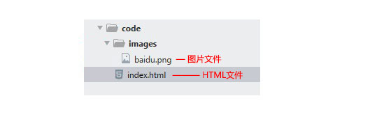 |
| 上一级路径 | “../” | 在文件名之前加入“../” ，如果是上两级，则需要使用 “../ ../”，以此类推，                    如&lt;img src="../baidu.gif" /&gt;。  |

**pink老师 一句话说出他们: **

> 相对路径，是从代码所在的这个文件出发， 去寻找我们的目标文件的，而 我们所说的 上一级 下一级 同一级  简单说，就是 图片 位于 HTML 页面的位置

## 绝对路径

绝对路径以Web站点根目录为参考基础的目录路径。之所以称为绝对，意指当所有网页引用同一个文件时，所使用的路径都是一样的。

“D:\web\img\logo.gif”，或完整的网络地址，例如“http://www.itcast.cn/images/logo.gif”。

**注意：**

绝对路径用的较少，我们理解下就可以了。  但是要注意，它的写法 特别是符号  \  并不是 相对路径的   /    

# 3. 今日总结

  每一天都有一个主题 我们HTML第一天的主题就是 <认识标签>  能用常用标签，写出最简单的页面

学HTML 之前 觉得 很神秘  

 

等你学完之后忽然发现

 


总结今天的思路贯穿线：


# 4. 综合案例：  圣诞


# 5. @拓展阅读

#### 5.1 锚点定位 （难点）

通过创建锚点链接，用户能够快速定位到目标内容。

创建锚点链接分为两步：

```html
1. 使用相应的id名标注跳转目标的位置。 (找目标)
  <h3 id="two">第2集</h3> 

2. 使用<a href="#id名">链接文本</a>创建链接文本（被点击的） （拉关系）  我也有一个姓毕的姥爷..
  <a href="#two">   

```

快速记忆法：

 好比找个人办事，  首先找到他，然后拉关系，最后看效果。

#### 5.2 base 标签

**语法：**

```html
<base target="_blank" />
```

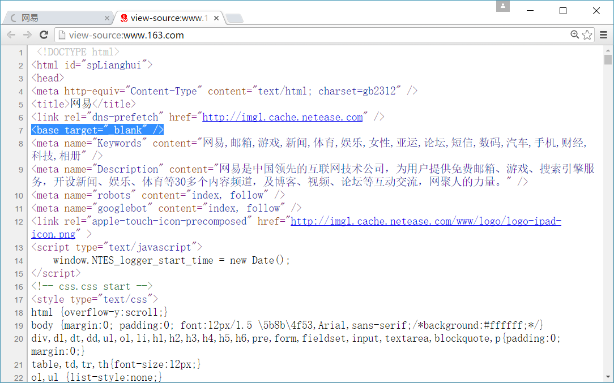

**总结： **

1. base 可以设置整体链接的打开状态   
2. **base 写到  <head>  </head>  之间**
3. 把所有的连接 都默认添加 target="_blank"

**pink老师 一句话说出他们:**

> 全体链接~ 到 ~  全体集合  所有链接 以新窗口打开页面  ~   是 

#### 5.3 预格式化文本pre标签

<pre> 标签可定义预格式化的文本。
被包围在 <pre> 标签 元素中的文本通常**会保留空格和换行符**。而文本也会呈现为等宽字体。

```html
<pre>

  此例演示如何使用 pre 标签

  对空行和 空格

  进行控制

</pre>

```

**pink老师 一句话说出他们:**

> 所谓的预格式化文本就是 ，按照我们预先写好的文字格式来显示页面， 保留空格和换行等。 

有了这个标签，里面的文字，会按照我们书写的模式显示，不需要段落和换行标签了。但是，比较少用，因为不好整体控制。


#### 5.4 特殊字符 （理解）

 一些特殊的符号，我们再html 里面很难或者 不方便直接 使用， 我们此时可以使用下面的替代代码。


**虽然有很多，但是我们平时用的比较较少， 大家重点记住   空格    大于号 小于号   就可以了，剩下的回来查阅。**

**总结：**

1. 是以**运算符**`&`开头,以**分号运算符**`;`结尾。
2. 他们不是标签，而是符号。
3. HTML 中不能使用小于号 “<” 和大于号 “>”特殊字符，浏览器会将它们作为标签解析，若要正确显示，在 HTML 源代码中使用字符实体

**团队约定**

   *推荐：*

```
   <a href="#">more &gt;&gt;</a>
```

   *不推荐：*

```
   <a href="#">more >> </a>
```


#### 5.5 html5发展之路


 


#### 5.6 什么是XHTML

XHTML 是更严格更纯净的 HTML 代码。

- XHTML 指**可扩展超文本标签语言**（EXtensible HyperText Markup Language）。
- XHTML 的目标是取代 HTML。
- XHTML 与 HTML 4.01 几乎是相同的。
- XHTML 是更严格更纯净的 HTML 版本。
- XHTML 是作为一种 XML 应用被重新定义的 HTML。
- XHTML 是一个 W3C 标准。

#### 5.7 HTML和 XHTML之间有什么区别?

- XHTML 指的是可扩展超文本标记语言
- XHTML 与 HTML 4.01 几乎是相同的
- XHTML 是更严格更纯净的 HTML 版本
- XHTML 是以 XML 应用的方式定义的 HTML
- XHTML 是 2001 年 1 月发布的 W3C 推荐标准
- XHTML 得到所有主流浏览器的支持
- XHTML 元素是以 XML 格式编写的 HTML 元素。XHTML是严格版本的HTML，例如它要求标签必须小写，标签必须被正确关闭，标签顺序必须正确排列，对于属性都必须使用双引号等。

# 6. @深入阅读

[HTML5的崛起之路](http://www.chinaz.com/manage/2015/0720/424831.shtml)

# 7. 预习内容

- 表格标签

- 能够通过表格标签能够写出一个简版表格数据展示 

  例如： 

  

    可以把你今天学习的内容放在表格内，再次作为总结

---
typora-copy-images-to: media

---

> 第01阶段.前端基础.表格

# HTML 第二天目标

 能够利用表格、列表和表单完成注册页面的综合案例

* 能出说表格用来做什么的
* 能说出列表用来做什么的
* 能说出表单用来做什么的

为了让我们页面显示的更加整齐，我们需要学习三个表（表格、表单、列表）


# 表格 table(会使用)

目标：

* 理解：
  - 能说出表格用来做什么的
  - 表格的基本结构组成
* 应用：
  - 能够熟练写出n行n列的表格
  - 能简单的合并单元格
    ​

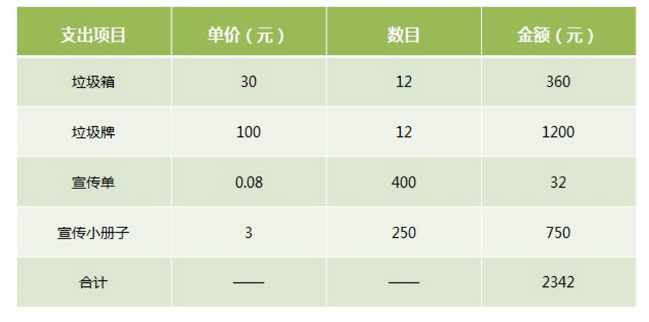


**表格作用：**

存在即是合理的。  表格的现在还是较为常用的一种标签，但不是用来布局，**常见显示、展示表格式数据。**

因为它可以让数据显示的非常的规整，可读性非常好。

**特别是后台展示数据的时候表格运用是否熟练就显得很重要**，一个清爽简约的表格能够把繁杂的数据表现得很有条理，虽然 div 布局也可以做到，但是总没有表格来得方便。


ps:  这些地方用表格，你会觉得生活还是那么美好。。。。忍不住想说  PPAP i hava a pen  

## 1. 创建表格

在HTML网页中，要想创建表格，就需要使用表格相关的标签。

**创建表格的基本语法：**

```html
<table>
  <tr>
    <td>单元格内的文字</td>
    ...
  </tr>
  ...
</table>
```

要深刻体会表格、行、单元格他们的构成。

在上面的语法中包含基本的三对HTML标签，分别为 table、tr、td，他们是创建表格的基本标签，缺一不可，下面对他们进行具体地解释

1. table用于定义一个表格标签。

2. tr标签 用于定义表格中的行，必须嵌套在 table标签中。

3. td 用于定义表格中的单元格，必须嵌套在<tr></tr>标签中。

4. 字母 td 指表格数据（table data），即数据单元格的内容，现在我们明白，表格最合适的地方就是用来存储数据的。

   


**总结： **

* 表格的主要目的是用来显示特殊数据的
* 一个完整的表格有表格标签（table），行标签（tr），单元格标签（td）组成，没有列的标签

- <tr></tr>中只能嵌套<td></td> 类的单元格
- <td></td>标签，他就像一个容器，可以容纳所有的元素

## 2. 表格属性

表格有部分属性我们不常用，这里重点记住 cellspacing 、 cellpadding。


我们经常有个说法，是三参为0，  平时开发的我们这三个参数    border  cellpadding  cellspacing  为  0


**案例1：**

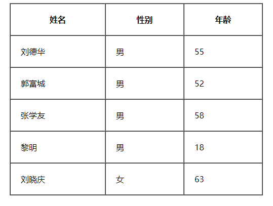

```html
<table width="500" height="300" border="1" cellpadding="20" cellspacing="0" align="center">
   <tr>  <th>姓名</th>   <th>性别</th> <th>年龄</th>  </tr>
   <tr>  <td>刘德华</td> <td>男</td> <td>55</td>  </tr>
   <tr>  <td>郭富城</td> <td>男</td> <td>52</td>  </tr>
   <tr>  <td>张学友</td> <td>男</td> <td>58</td>  </tr>
   <tr>  <td>黎明</td>   <td>男</td> <td>18</td>  </tr>
   <tr>  <td>刘晓庆</td> <td>女</td> <td>63</td>  </tr>
</table>
```

## 3. 表头单元格标签th

- 作用：
  - 一般表头单元格位于表格的第一行或第一列，并且文本加粗居中
- 语法：
  - 只需用表头标签&lt;th&gt;</th&gt;替代相应的单元格标签&lt;td&gt;</td&gt;即可。 

 

**案例2：**

​	效果图


​	代码：

***

```html
<table width="500" border="1" align="center" cellspacing="0" cellpadding="0">
		<tr>  
			<th>姓名</th> 
			<th>性别</th>
			<th>电话</th>
		</tr>
		<tr>
			<td>小王</td>
			<td>女</td>
			<td>110</td>
		</tr>
		<tr>
			<td>小明</td>
			<td>男</td>
			<td>120</td>
		</tr>	
	</table>
```

**pink老师 一句话说出他们:**

> th 也是一个单元格   只不过和普通的 td单元格不一样，它会让自己里面的文字居中且加粗

## 4. 表格标题caption

**定义和用法**

```html
<table>
   <caption>我是表格标题</caption>
</table>
```

**注意： **

1. caption 元素定义**表格标题**，通常这个标题会被**居中且显示于表格之上**。
2. caption 标签必须紧随 table 标签之后。(显示在table上但是要写到table内)
3. 这个标签只存在 表格里面才有意义。你是风儿我是沙

**案例3：**

根据要求完成以下案例：


## 5. 合并单元格(难点)

合并单元格是我们比较常用的一个操作，但是不会合并的很复杂。


###  5.1 合并单元格2种方式

* 跨行合并：rowspan="合并单元格的个数"      
* 跨列合并：colspan="合并单元格的个数"


### 5.2 合并单元格顺序

> **合并的顺序我们按照   先上 后下     先左  后右 的顺序 **

跟我们以前学习汉字的书写顺序完全一致。

### 5.3 合并单元格三步曲

1. 先确定是跨行还是跨列合并
2. 根据 先上 后下   先左  后右的原则找到目标单元格    然后写上 合并方式 还有 要合并的单元格数量  比如 ： <td colspan="3">   </td>
3. 删除多余的单元格 单元格      

## 6. 总结表格

| 标签名              | 定义           | 说明                                         |
| ------------------- | :------------- | :------------------------------------------- |
| <table></table>     | 表格标签       | 就是一个四方的盒子                           |
| <tr></tr>           | 表格行标签     | 行标签要再table标签内部才有意义              |
| <td></td>           | 单元格标签     | 单元格标签是个容器级元素，可以放任何东西     |
| <th></th>           | 表头单元格标签 | 它还是一个单元格，但是里面的文字会居中且加粗 |
| <caption></caption> | 表格标题标签   | 表格的标题，跟着表格一起走，和表格居中对齐   |
| clospan 和 rowspan  | 合并属性       | 用来合并单元格的                             |

1. 表格提供了HTML 中定义表格式数据的方法。
2. 表格中由行中的单元格组成。
3. 表格中没有列元素，列的个数取决于行的单元格个数。
4. 表格不要纠结于外观，那是CSS 的作用。
5. 表格的学习要求：  能手写表格结构，并且能简单合并单元格。


## 7. 拓展阅读@

### 表格划分结构（了解）

```
对于比较复杂的表格，表格的结构也就相对的复杂了，所以又将表格分割成三个部分：题头、正文和脚注。而这三部分分别用:thead,tbody,tfoot来标注， 这样更好的分清表格结构
```

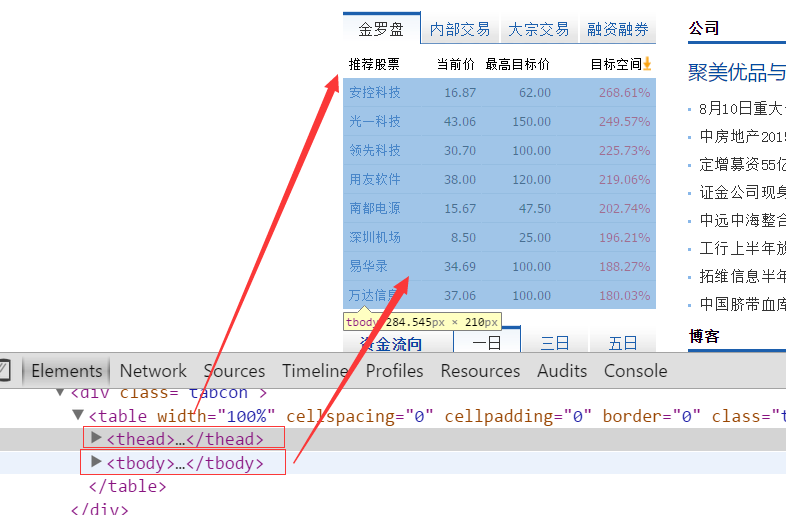

**注意：**

1. <thead></thead>：用于定义表格的头部。用来放标题之类的东西。<thead> 内部必须拥有 <tr> 标签！
2. <tbody></tbody>：用于定义表格的主体。放数据本体 。
3. <tfoot></tfoot>放表格的脚注之类。
4. 以上标签都是放到table标签中。
---
typora-copy-images-to: media

---

> 第01阶段.前端基础.列表和表单

# 1. 列表标签（重点）

## 学习目标

- 理解
  - 无序列表的应用场景
  - 自定义列表的应用场景
- 应用
  - 无序列表语法
  - 自定义列表语法

问？

前面我们知道表格一般用于数据展示的，但是网页中还是有很多跟表格类似的布局，如下图~~ 我们用什么做呢？

 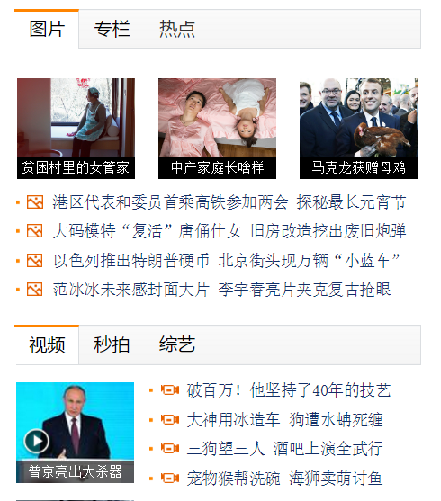

答：

答案是列表， 那什么是列表？  表格是用来显示数据的，那么列表就是用来布局的。 因为非常整齐和自由

 

- 概念：

  容器里面装载着结构，样式一致的文字或图表的一种形式，叫列表

- 特点：

  列表最大的特点就是  整齐 、整洁、 有序，跟表格类似，但是他可组合自由度会更高。

## 1.1 无序列表 ul （重点）

无序列表的各个列表项之间没有顺序级别之分，是并列的。其基本语法格式如下：

```html
<ul>
  <li>列表项1</li>
  <li>列表项2</li>
  <li>列表项3</li>
  ......
</ul>
```

比如下面这些，新闻是没有顺序的，不用排队，先到先得，后发布先显示。

 

**脚下留心：**

```
 1. <ul></ul>中只能嵌套<li></li>，直接在<ul></ul>标签中输入其他标签或者文字的做法是不被允许的。
 2. <li>与</li>之间相当于一个容器，可以容纳所有元素。
 3. 无序列表会带有自己样式属性，放下那个样式，一会让CSS来！
```

## 1.2  有序列表 ol （了解）


有序列表即为有排列顺序的列表，其各个列表项按照一定的顺序排列定义，有序列表的基本语法格式如下：

```html
<ol>
  <li>列表项1</li>
  <li>列表项2</li>
  <li>列表项3</li>
  ......
</ol>
```

  所有特性基本与ul 一致。  但是实际中比 无序列表 用的少很多。

## 1.3 自定义列表（理解）

定义列表常用于对术语或名词进行解释和描述，定义列表的列表项前没有任何项目符号。其基本语法如下：

```html
<dl>
  <dt>名词1</dt>
  <dd>名词1解释1</dd>
  <dd>名词1解释2</dd>
  ...
  <dt>名词2</dt>
  <dd>名词2解释1</dd>
  <dd>名词2解释2</dd>
  ...
</dl>
```

  


用的还可以：


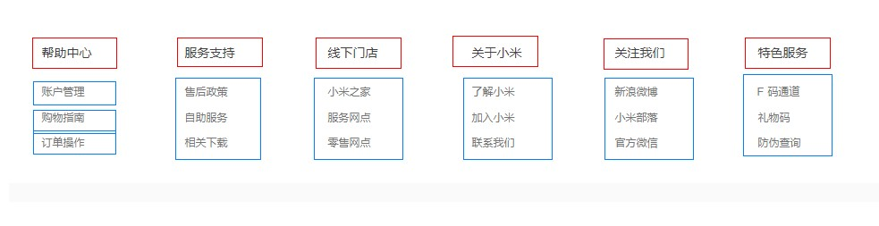

## 1.4 列表总结

| 标签名    |     定义     | 说明                                                   |
| --------- | :----------: | :----------------------------------------------------- |
| <ul></ul> | **无序标签** | 里面只能包含li    没有顺序，我们以后布局中最常用的列表 |
| <ol></ol> |   有序标签   | 里面只能包含li    有顺序， 使用情况较少                |
| <dl></dl> |  自定义列表  | 里面有2个兄弟， dt 和 dd                               |

我们现在还没有学布局，现在只要保证2个点：

1. 学会什么时候用无序列表， 学会什么时候用自定义列表
2. 无序列表和自定义列表代码怎么写？
3. 具体的我们刚才看的布局，等我们学了css 在来全面布局。

# 2. 表单标签(掌握)

目标：

* 能写出最常用的注册类表单
* 能说出input表单常见属性

现实中的表单，类似我们去银行办理信用卡填写的单子。 如下图


**作用： **

表单目的是为了收集用户信息。

在我们网页中， 我们也需要跟用户进行交互，收集用户资料，此时也需要表单。

> 在HTML中，一个完整的表单通常由表单控件（也称为表单元素）、提示信息和表单域3个部分构成。


  **表单控件： **

​       包含了具体的表单功能项，如单行文本输入框、密码输入框、复选框、提交按钮、重置按钮等。

  **提示信息：**

​        一个表单中通常还需要包含一些说明性的文字，提示用户进行填写和操作。

  **表单域：**  

​      他相当于一个容器，用来容纳所有的表单控件和提示信息，可以通过他定义处理表单数据所用程序的url地址，以及数据提交到服务器的方法。如果不定义表单域，表单中的数据就无法传送到后台服务器。

## 2.1 input 控件(重点)

- 语法：

  ```html
  <input type="属性值" value="你好">
  ```

  - input 输入的意思 
  - <input /&gt;标签为单标签
  - type属性设置不同的属性值用来指定不同的控件类型
  - 除了type属性还有别的属性

- 常用属性：


#### 1. type 属性

* 这个属性通过改变值，可以决定了你属于那种input表单。
* 比如 type = 'text'  就表示 文本框 可以做 用户名， 昵称等。
* 比如 type = 'password'  就是表示密码框   用户输入的内容 是不可见的。

```html
用户名: <input type="text" /> 
密  码：<input type="password" />
```

#### 2. value属性   值

```html
用户名:<input type="text"  name="username" value="请输入用户名"> 
```

* value 默认的文本值。 有些表单想刚打开页面就默认显示几个文字，就可以通过这个value 来设置。

#### 3. name属性

~~~html
用户名:<input type="text"  name=“username” />  
~~~

name表单的名字， 这样，后台可以通过这个name属性找到这个表单。  页面中的表单很多，name主要作用就是用于区别不同的表单。

* name属性后面的值，是我们自己定义的。


* radio  如果是一组，我们必须给他们命名相同的名字 name   这样就可以多个选其中的一个啦

```html
<input type="radio" name="sex"  />男
<input type="radio" name="sex" />女

```

* name属性，我们现在用的较少， 但是，当我们学ajax 和后台的时候，是必须的。

#### 4. checked属性

* 表示默认选中状态。  较常见于 单选按钮和复选按钮。

```html
性    别:
<input type="radio" name="sex" value="男" checked="checked" />男
<input type="radio" name="sex" value="女" />女 

```

上面这个，表示就默认选中了 男 这个单选按钮

#### 5. input 属性小结

| 属性    | 说明     | 作用                                                   |
| ------- | :------- | ------------------------------------------------------ |
| type    | 表单类型 | 用来指定不同的控件类型                                 |
| value   | 表单值   | 表单里面默认显示的文本                                 |
| name    | 表单名字 | 页面中的表单很多，name主要作用就是用于区别不同的表单。 |
| checked | 默认选中 | 表示那个单选或者复选按钮一开始就被选中了               |

## 2.2 label标签(理解)

**目标：**

label标签主要目的是为了提高用户体验。 为用户提高最优秀的服务。

**概念：**

label 标签为 input 元素定义标注（标签）。

**作用：** 

 用于绑定一个表单元素, 当点击label标签的时候, 被绑定的表单元素就会获得输入焦点。

**如何绑定元素呢？**

1. 第一种用法就是用label直接包括input表单。

```html
<label> 用户名： <input type="radio" name="usename" value="请输入用户名">   </label>

```

   适合单个表单选择

2. 第二种用法 for 属性规定 label 与哪个表单元素绑定。

```html
<label for="sex">男</label>
<input type="radio" name="sex"  id="sex">

```

**pink老师 一句话说出他们:**

>  当我们鼠标点击 label标签里面的文字时， 光标会定位到指定的表单里面

## 2.3 textarea控件(文本域)


- 语法：

```html
<textarea >
  文本内容
</textarea>

```

- 作用：

  通过textarea控件可以轻松地创建多行文本输入框.

  cols="每行中的字符数" rows="显示的行数"  我们实际开发不用

#### 文本框和文本域区别

| 表单              |  名称  |       区别       |                  默认值显示 |             用于场景 |
| :---------------- | :----: | :--------------: | --------------------------: | -------------------: |
| input type="text" | 文本框 | 只能显示一行文本 | 单标签，通过value显示默认值 | 用户名、昵称、密码等 |
| textarea          | 文本域 | 可以显示多行文本 |  双标签，默认值写到标签中间 |               留言板 |

## 2.4 select下拉列表

**目的：**

如果有多个选项让用户选择，为了节约空间，我们可以使用select控件定义下拉列表.


**语法：**

```html
<select>
  <option>选项1</option>
  <option>选项2</option>
  <option>选项3</option>
  ...
</select>

```

* 注意：

1. &lt;select&gt;  中至少包含一对 option 
2. 在option 中定义selected =" selected "时，当前项即为默认选中项。
3. 但是我们实际开发会用的比较少

# 3. form表单域

- 收集的用户信息怎么传递给服务器？

  通过form表单域

- 目的：

  在HTML中，form标签被用于定义表单域，以实现用户信息的收集和传递，form中的所有内容都会被提交给服务器。

**语法: **

```html
<form action="url地址" method="提交方式" name="表单名称">
  各种表单控件
</form>

```


**常用属性：**

| 属性   | 属性值   | 作用                                               |
| ------ | :------- | -------------------------------------------------- |
| action | url地址  | 用于指定接收并处理表单数据的服务器程序的url地址。  |
| method | get/post | 用于设置表单数据的提交方式，其取值为get或post。    |
| name   | 名称     | 用于指定表单的名称，以区分同一个页面中的多个表单。 |

**注意:**  

每个表单都应该有自己表单域。我们现在做页面，不写看不到效果，但是 如果后面学 ajax 后台交互的时候，必须需要 form表单域。

## 2.6 团队约定

### 元素属性

- 元素属性值使用双引号语法
- 元素属性值可以写上的都写上

*推荐：*

```html
<input type="text" />	
<input type="radio" name="name" checked="checked" />

```

*不推荐：*

```html
<input type=text  />	
<input type='text' />	
<input type="radio" name="name" checked />

```

# 4.综合案例（注册页面）


# 5. 查文档

经常查阅文档是一个非常好的学习习惯。

W3C :  http://www.w3school.com.cn/

MDN: https://developer.mozilla.org/zh-CN/

# 6. 总结


---
typora-copy-images-to: media

---

> 第01阶段.前端基础.CSS初识

# CSS层叠样式表

## 学习目标

- 理解
  - css的目的作用
  - css的三种引入方式
- 应用
  - css三种引用方式的书写
  - 通过样式规则给标签添加简单的样式


# 1.HTML的局限性

说起HTML，这其实是个非常单纯的家伙， 他只关注内容的语义， 

比如<h1>表明这是一个大标题，用<p> 表明这是一个段落，用 表明这儿有一个图片， 用<a> 表示此处有链接。

很早的时候，世界上的网站虽然很多，但是他们都有一个共同的特点： **丑**。

这个是一个外国比较早的购物网站

 

有些人就忍受不了了，你就不能把自己打扮得漂亮一点吗？

HTML说，我试试...

如果要改变下 高度或者变一个颜色，就需要大量重复操作

 

**总结：**

- HTML满足不了设计者的需求
- 操作html属性不方便
- HTML里面添加样式带来的是无尽的臃肿和繁琐

# 2.CSS 网页的美容师

- 让我们的网页更加丰富多彩，布局更加灵活自如。   
- CSS的最大贡献就是：  让 HTML 从样式中脱离，  实现了 HTML 专注去做 结构呈现，样式交给css 

> **我们理想中的结果： 结构(html)与样式(css)相分离**  这句话要记住

而且。。。。。 CSS 做的很出色，如果JavaScript是网页的魔法师，那么CSS它是我们网页的美容师，不信，你看:

 

# 3.CSS初识

- 概念：

  ​	CSS(Cascading Style Sheets)  ，通常称为CSS样式表或层叠样式表（级联样式表）

- 作用：

  - 主要用于**设置** HTML页面中的文本内容（字体、大小、对齐方式等）、图片的外形（宽高、边框样式、边距等）以及**版面的布局和外观显示样式。**
  - CSS以HTML为基础，提供了丰富的功能，如字体、颜色、背景的控制及整体排版等，而且还可以针对不同的浏览器设置不同的样式。

# 4. 引入CSS样式表（书写位置）

~~~
要书写css样式，那css样式书写的位置在哪呢？
~~~

## 4.1 行内式（内联样式）

- 概念：

  ​	称行内样式、行间样式.

  ​	是通过标签的style属性来设置元素的样式


- 其基本语法格式如下：

```html
<标签名 style="属性1:属性值1; 属性2:属性值2; 属性3:属性值3;"> 内容 </标签名>
```

实际上任何HTML标签都拥有style属性，用来设置行内式。

- 案例：

~~~css
<div style="color: red; font-size: 12px;">青春不常在，抓紧谈恋爱</div>
~~~

- 注意：
  - style其实就是标签的属性
  - 样式属性和值中间是`:`
  - 多组属性值之间用`;`隔开。
  - 只能控制当前的标签和以及嵌套在其中的字标签，造成代码冗余
- 缺点：
  - 没有实现样式和结构相分离

## 4.2 内部样式表（内嵌样式表）

- 概念：

  ​	称内嵌式

  ​	是将CSS代码集中写在HTML文档的head头部标签中，并且用style标签定义

- 其基本语法格式如下：

```html
<head>
<style type="text/CSS">
    选择器（选择的标签） { 
      属性1: 属性值1;
      属性2: 属性值2; 
      属性3: 属性值3;
    }
</style>
</head>
```

~~~css
<style>
	 div {
	 	color: red;
	 	font-size: 12px;
	 }
</style>
~~~

- 注意：

  - style标签一般位于head标签中，当然理论上他可以放在HTML文档的任何地方。
  - type="text/css"  在html5中可以省略。
  - 只能控制当前的页面

- 缺点：

  没有彻底分离

### 综合案例

~~~css
<style>
   /*选择器{属性:值；}*/
   p {
   	  color:#06C; 
   	  font-size:14px;  
   	}  /*文字的颜色是 蓝色*/
   h4 {
   	 color:#900;
   }
   h1 {
   	 color:#090; 
   	 font-size:16px; 
   	}
   body { 
   	 background:url(bg2.jpg);
   }
</style>
~~~

**展示**


~~~css
思考：
 1. 如何实现结构与样式完全分离？
 2. 如何实现css样式共享？
~~~


## 4.3 外部样式表（外链式）

- 概念：

  ​	称链入式

  ​	是将所有的样式放在一个或多个以**.CSS**为扩展名的外部样式表文件中，

  ​	通过link标签将外部样式表文件链接到HTML文档中

- 其基本语法格式如下：

```html
<head>
  <link rel="stylesheet" type="text/css" href="css文件路径">
</head>
```

- 注意：  
  - link 是个单标签
  - link标签需要放在head头部标签中，并且指定link标签的三个属性

| 属性 | 作用                                                         |
| ---- | :----------------------------------------------------------- |
| rel  | 定义当前文档与被链接文档之间的关系，在这里需要指定为“stylesheet”，表示被链接的文档是一个样式表文件。 |
| type | 定义所链接文档的类型，在这里需要指定为“text/CSS”，表示链接的外部文件为CSS样式表。我们都可以省略 |
| href | 定义所链接外部样式表文件的URL，可以是相对路径，也可以是绝对路径。 |

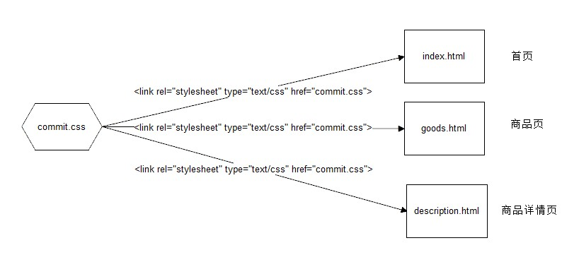

## 4.4 三种样式表总结（位置）

| 样式表     | 优点                     | 缺点                     | 使用情况       | 控制范围           |
| ---------- | ------------------------ | ------------------------ | -------------- | ------------------ |
| 行内样式表 | 书写方便，权重高         | 没有实现样式和结构相分离 | 较少           | 控制一个标签（少） |
| 内部样式表 | 部分结构和样式相分离     | 没有彻底分离             | 较多           | 控制一个页面（中） |
| 外部样式表 | 完全实现结构和样式相分离 | 需要引入                 | 最多，强烈推荐 | 控制整个站点（多） |

### 团队约定-代码风格

样式书写一般有两种：

- 一种是紧凑格式 (Compact)

```css
h3 { color: deeppink;font-size: 20px;}

```

- 一种是展开格式（推荐）

```css
h3 {
	color: deeppink;
    font-size: 20px;    
}

```

### 团队约定-代码大小写

样式选择器，属性名，属性值关键字全部使用小写字母书写，属性字符串允许使用大小写。

```css
/* 推荐 */
h3{
	color: pink;
}
	
/* 不推荐 */
H3{
	COLOR: PINK;
}

```


# 5. 总结CSS样式规则

使用HTML时，需要遵从一定的规范。CSS亦如此，要想熟练地使用CSS对网页进行修饰，首先需要了解CSS样式规则，

具体格式如下：                                          


**总结：**

1. 选择器用于指定CSS样式作用的HTML标签，花括号内是对该对象设置的具体样式。
2. 属性和属性值以“键值对”的形式出现。
3. 属性是对指定的对象设置的样式属性，例如字体大小、文本颜色等。
4. 属性和属性值之间用英文“:”连接。
5. 多个“键值对”之间用英文“;”进行区分。


# @拓展阅读

[CSS的发展史](https://mp.weixin.qq.com/s?__biz=MzAwNTAzMjcxNg%3D%3D&mid=2651424749&idx=1&sn=f58bca144f50bff00ba7d1675cc8b8e7&scene=4)

---
typora-copy-images-to: media

---

> 第01阶段.前端基础.CSS基础选择器

# CSS选择器（重点）

 学习目标：

- 理解
  - 能说出选择器的作用
  - id选择器和类选择器的区别
- 应用
  - 能够使用基础选择器给页面元素添加样式

## 1. CSS选择器作用（重点）


如上图所以，要把里面的小黄人分为2组，最快的方法怎办？  

很多， 比如 一只眼睛的一组，剩下的一组  

### 选择器的作用

​	找到特定的HTML页面元素

**pink老师一句话说出他们： ※※※※**

> **CSS选择器干啥的？   选择标签用的， 把我们想要的标签选择出来 **  必须记住的

css 就是 分两件事， 选对人，  做对事。 

~~~css
h3 { 
	color: red;
}
~~~

这段代码就是2件事， 把  h3选出来， 然后 把它变成了 红色。 以后我们都这么干。

选择器分为基础选择器和 复合选择器，我们这里先讲解一下 基础选择器。

## 2. CSS基础选择器

### 2.1 标签选择器

- 概念：

  标签选择器（元素选择器）是指用**HTML标签名**称作为选择器，按标签名称分类，为页面中某一类标签指定统一的CSS样式。

- 语法：

~~~
标签名{属性1:属性值1; 属性2:属性值2; 属性3:属性值3; } 
~~~

- 作用：

  标签选择器 可以把某一类标签**全部**选择出来  比如所有的div标签  和 所有的 span标签

- 优点：

  是能快速为页面中同类型的标签统一样式

- 缺点：

  不能设计差异化样式。

 

**总结 口诀：**

   标签选择器，
   页面同选起。
   直接写标签，
   全部不放弃。

~~~
思考： 如果想要差异化选择不同的标签，怎么办呢？ 就是说 我想单独选一个或者某几个标签呢？
~~~

### 2.2 类选择器

类选择器使用“.”（英文点号）进行标识，后面紧跟类名.

- 语法：

  - 类名选择器

  ~~~
  .类名  {   
      属性1:属性值1; 
      属性2:属性值2; 
      属性3:属性值3;     
  }
  ~~~

  - 标签

  ~~~
  <p class='类名'></p>
  ~~~

- 优点：

  - 可以为元素对象定义单独或相同的样式。 可以选择一个或者多个标签 

- 注意

  - 类选择器使用“.”（英文点号）进行标识，后面紧跟类名(自定义，我们自己命名的)
  - 长名称或词组可以使用**中横线（-）**来为选择器命名。
  - 不要纯数字、中文等命名， 尽量使用英文字母来表示。

命名规范：  见附件（Web前端开发规范手册.doc）

命名是我们通俗约定的，但是没有规定必须用这些常用的命名。

* **记忆口诀**

  差异化选择
  一个或多个
  上面点定义
  类名别写错
  谁用谁调用
  class来做。

  嘿嘿，工作类最多。

**课堂案例：**

 


```html
<head>
        <meta charset="utf-8">
        <style>
    
        .blue {
        	color: blue;
            font-size: 100px;
        }
        .red {
        	color: red;
            font-size: 100px;
        }
        .orange {
			color: orange;
            font-size: 100px;
        }
		.green {
			color: green;
            font-size: 100px;
		}
        </style>
    </head>
    <body>
    	<span class="blue">G</span>
    	<span class="red">o</span>
    	<span class="orange">o</span>
    	<span class="blue">g</span>
    	<span class="green">l</span>
    	<span class="red">e</span>
    </body>
```


### 2.3 类选择器特殊用法- 多类名

我们可以给标签指定多个类名，**这样一个类名只对应最简单的一个样式，通过类名的组合和设置元素样式，方便我们使用和修改样式**。


注意：

- 各个类名中间用空格隔开。
- 多类名选择器在后期布局比较复杂的情况下，还是较多使用的。

```html
<div class="pink fontWeight font20">亚瑟</div>
<div class="font20">刘备</div>
<div class="font14 pink">安其拉</div>
<div class="font14">貂蝉</div>
```

### 2.4 id选择器

id选择器使用`#`进行标识，后面紧跟id名

- 其基本语法格式如下：

  - id选择器

    ~~~
    #id名 {属性1:属性值1; 属性2:属性值2; 属性3:属性值3; }
    ~~~

  - 标签

    ~~~
    <p id="id名"></p>
    
    ~~~

- 元素的id值是唯一的，只能对应于文档中某一个具体的元素。

- 用法基本和类选择器相同。

####  id选择器和类选择器区别

 

- W3C标准规定，在同一个页面内，不允许有相同名字的id对象出现，但是允许相同名字的class。
  - 类选择器（class） 好比人的名字，  是可以多次重复使用的， 比如  张伟  王伟  李伟  李娜
  - id选择器     好比人的身份证号码，  全中国是唯一的， 不得重复。 只能使用一次。

***id选择器和类选择器最大的不同在于 使用次数上。***

**pink老师 总结他们**

* 类选择器我们在修改样式中，用的最多。
* id选择器一般用于页面唯一性的元素身上，经常和我们后面学习的javascript 搭配使用。

### 2.6 通配符选择器

- 概念

  通配符选择器用`*`号表示，  *   就是 选择所有的标签      他是所有选择器中作用范围最广的，能匹配页面中所有的元素。

- 其基本语法格式如下：

```
* { 属性1:属性值1; 属性2:属性值2; 属性3:属性值3; }

```

例如下面的代码，使用通配符选择器定义CSS样式，清除所有HTML标记的默认边距。

```css
* {
  margin: 0;                    /* 定义外边距*/
  padding: 0;                   /* 定义内边距*/
}

```

- 注意：

  **会匹配页面所有的元素，降低页面响应速度，不建议随便使用**

### 2.7 基础选择器总结

| 选择器       | 作用                          | 缺点                     | 使用情况   | 用法                 |
| ------------ | ----------------------------- | ------------------------ | ---------- | -------------------- |
| 标签选择器   | 可以选出所有相同的标签，比如p | 不能差异化选择           | 较多       | p { color：red;}     |
| 类选择器     | 可以选出1个或者多个标签       | 可以根据需求选择         | 非常多     | .nav { color: red; } |
| id选择器     | 一次只能选择器1个标签         | 只能使用一次             | 不推荐使用 | #nav {color: red;}   |
| 通配符选择器 | 选择所有的标签                | 选择的太多，有部分不需要 | 不推荐使用 | * {color: red;}      |

基础选择器我们一共学了4个，  每个都有自己的价值， 可能再某个地方都能用到。但是如果说，一定要找个最常用的，那么，肯定是类选择器。

### 2.8 团队约定

选择器

- 尽量少用通用选择器 `*`
- **尽量少用 ID 选择器**
- **不使用无具体语义定义的标签选择器 div span** 

```
/* 推荐 */
.jdc {}
li {}
p{}

/* 不推荐 */
*{}
#jdc {}
div{}   因为div 没有语义，我们尽量少用

```
# CSS字体样式属性调试工具

 目标

- 应用
  - 使用css字体样式完成对字体的设置
  - 使用css外观属性给页面元素添加样式
  - 使用常用的emment语法
  - 能够使用开发人员工具代码调试

# 1.font字体

## 1.1 font-size:大小

- 作用：

  font-size属性用于设置字号

~~~css
p {  
    font-size:20px; 
}
~~~

- 单位：

  - 可以使用相对长度单位，也可以使用绝对长度单位。
  - 相对长度单位比较常用，推荐使用像素单位px，绝对长度单位使用较少。


**注意：**

* **我们文字大小以后，基本就用px了，其他单位很少使用**
* 谷歌浏览器默认的文字大小为16px
* 但是不同浏览器可能默认显示的字号大小不一致，我们尽量给一个明确值大小，不要默认大小。**一般给body指定整个页面文字的大小**

## 1.2 font-family:字体

- 作用：

  font-family属性用于设置哪一种字体。

~~~
p{ font-family:"微软雅黑";}
~~~

- 网页中常用的字体有宋体、微软雅黑、黑体等，例如将网页中所有段落文本的字体设置为微软雅黑
- **可以同时指定多个字体**，中间以逗号隔开，表示如果浏览器不支持第一个字体，则会尝试下一个，直到找到合适的字体， 如果都没有，则以我们电脑默认的字体为准。

~~~
p{font-family: Arial,"Microsoft Yahei", "微软雅黑";}
~~~

> 常用技巧：

```
1. 各种字体之间必须使用英文状态下的逗号隔开。
2. 中文字体需要加英文状态下的引号，英文字体一般不需要加引号。当需要设置英文字体时，英文字体名必须位于中文字体名之前。
3. 如果字体名中包含空格、#、$等符号，则该字体必须加英文状态下的单引号或双引号，例如font-family: "Times New Roman";。
4. 尽量使用系统默认字体，保证在任何用户的浏览器中都能正确显示。
```

### CSS Unicode字体

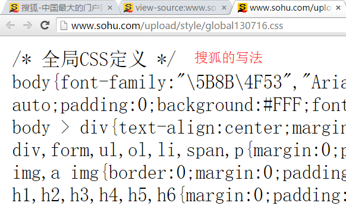

- 为什么使用 Unicode字体

  - 在 CSS 中设置字体名称，直接写中文是可以的。但是在文件编码（GB2312、UTF-8 等）不匹配时会产生乱码的错误。（防止乱码）
  - xp 系统不支持 类似微软雅黑的中文。

- 解决：

  - 方案一： 你可以使用英文来替代。 比如` font-family:"Microsoft Yahei"`。

  - 方案二： 在 CSS 直接使用 Unicode 编码来写字体名称可以避免这些错误。使用 Unicode 写中文字体名称，浏览器是可以正确的解析的。

    ~~~
    font-family: "\5FAE\8F6F\96C5\9ED1";   表示设置字体为“微软雅黑”。
    ~~~

| 字体名称    | 英文名称        | Unicode 编码         |
| ----------- | --------------- | -------------------- |
| 宋体        | SimSun          | \5B8B\4F53           |
| 新宋体      | NSimSun         | \65B0\5B8B\4F53      |
| 黑体        | SimHei          | \9ED1\4F53           |
| 微软雅黑    | Microsoft YaHei | \5FAE\8F6F\96C5\9ED1 |
| 楷体_GB2312 | KaiTi_GB2312    | \6977\4F53_GB2312    |
| 隶书        | LiSu            | \96B6\4E66           |
| 幼园        | YouYuan         | \5E7C\5706           |
| 华文细黑    | STXihei         | \534E\6587\7EC6\9ED1 |
| 细明体      | MingLiU         | \7EC6\660E\4F53      |
| 新细明体    | PMingLiU        | \65B0\7EC6\660E\4F53 |

为了照顾不同电脑的字体安装问题，我们尽量只使用宋体和微软雅黑中文字体

## 1.3 font-weight:字体粗细

- 在html中如何将字体加粗我们可以用标签来实现
  - 使用 b  和 strong 标签是文本加粗。
- 可以使用CSS 来实现，但是CSS 是没有语义的。

| 属性值  | 描述                                                         |
| ------- | :----------------------------------------------------------- |
| normal  | 默认值（不加粗的）                                           |
| bold    | 定义粗体（加粗的）                                           |
| 100~900 | 400 等同于 normal，而 700 等同于 bold  我们重点记住这句话**（后边一定不要写单位）** |

提倡：

  我们平时更喜欢用数字来表示加粗和不加粗。

## 1.4 font-style:字体风格

- 在html中如何将字体倾斜我们可以用标签来实现
  - 字体倾斜除了用 i  和 em 标签，
- 可以使用CSS 来实现，但是CSS 是没有语义的

font-style属性用于定义字体风格，如设置斜体、倾斜或正常字体，其可用属性值如下：

| 属性   | 作用                                                    |
| ------ | :------------------------------------------------------ |
| normal | 默认值，浏览器会显示标准的字体样式  font-style: normal; |
| italic | 浏览器会显示斜体的字体样式。                            |

小技巧： 

```
平时我们很少给文字加斜体，反而喜欢给斜体标签（em，i）改为普通模式。
```

## 1.5 font:综合设置字体样式 (重点)

font属性用于对字体样式进行综合设置

- 基本语法格式如下：

```css
选择器 { font: font-style  font-weight  font-size/line-height  font-family;}
```

- 注意：
  - 使用font属性时，**必须按上面语法格式中的顺序书写，不能更换顺序**，各个属性以**空格**隔开。
  - 其中不需要设置的属性可以省略（取默认值），但**必须保留font-size和font-family属性，否则font属性将不起作用**。

## 1.6 font总结

| 属性        | 表示     | 注意点                                                       |
| :---------- | :------- | :----------------------------------------------------------- |
| font-size   | 字号     | 我们通常用的单位是px 像素，**一定要跟上单位**（不写单位不起作用） |
| font-family | 字体     | 实际工作中按照团队约定来写字体                               |
| font-weight | 字体粗细 | 记住加粗是 700 或者 bold  不加粗 是 normal 或者  400  **记住数字不要跟单位** |
| font-style  | 字体样式 | 记住倾斜是 italic     不倾斜 是 normal  工作中我们最常用 normal |
| font        | 字体连写 | 1. 字体连写是有顺序的  不能随意换位置 2. 其中字号 和 字体 必须出现 |

# 2. CSS外观属性

## 2.1 color:文本颜色

- 作用：

  color属性用于定义文本的颜色，

- 其取值方式有如下3种：

| 表示表示       | 属性值                                  |
| :------------- | :-------------------------------------- |
| 预定义的颜色值 | red，green，blue，还有我们的御用色 pink |
| 十六进制       | #FF0000，#FF6600，#29D794               |
| RGB代码        | rgb(255,0,0)或rgb(100%,0%,0%)           |

- 注意

  我们实际工作中， 用 16进制的写法是最多的，而且我们更喜欢**简写方式**（红绿蓝若**每个分量两个字母都一样则可以简写**）比如  #f00（#ff0000） 代表红色

## 2.2 text-align:文本水平对齐方式

- 作用：

  text-align属性用于设置文本内容的水平对齐，相当于html中的align对齐属性**(对行内元素和行内块元素都有效)**

- 其可用属性值如下：

| 属性   |       解释       |
| ------ | :--------------: |
| left   | 左对齐（默认值） |
| right  |      右对齐      |
| center |     居中对齐     |

- 注意：

  是让盒子里面的内容水平居中， 而不是让盒子居中对齐

## 2.3 line-height:行间距

- 作用：

  line-height属性用于设置行间距，就是行与行之间的距离，即字符的垂直间距，一般称为行高。

- 单位：

  - line-height常用的属性值单位有三种，分别为像素px，相对值em和百分比%，实际工作中使用最多的是像素px

- 技巧：

```
一般情况下，行距比字号大7到8像素左右就可以了。
line-height: 24px;
```

## 2.4 text-indent:首行缩进

- 作用：

  text-indent属性用于设置首行文本的缩进，

- 属性值

  - 其属性值可为不同单位的数值、em字符宽度的倍数、或相对于浏览器窗口宽度的百分比%，允许使用负值,
  - 建议使用em作为设置单位。

**1em 就是一个字的宽度   如果是汉字的段落， 1em 就是一个汉字的宽度**

~~~css
p {
      /*行间距*/
      line-height: 25px;
      /*首行缩进2个字  em  1个em 就是1个字的大小*/
      text-indent: 2em;  
 }
~~~

## 2.5 text-decoration 文本的装饰

text-decoration   通常我们用于给链接修改装饰效果

| 值           | 描述                                                  |
| ------------ | ----------------------------------------------------- |
| none         | 默认。定义标准的文本。 取消下划线（最常用）           |
| underline    | 定义文本下的一条线。下划线 也是我们链接自带的（常用） |
| overline     | 定义文本上的一条线。（不用）                          |
| line-through | 定义穿过文本下的一条线。（不常用）                    |

## 2.6 CSS外观属性总结

| 属性            | 表示     | 注意点                                                  |
| :-------------- | :------- | :------------------------------------------------------ |
| color           | 颜色     | 我们通常用  十六进制   比如 而且是简写形式 #fff         |
| line-height     | 行高     | 控制行与行之间的距离                                    |
| text-align      | 水平对齐 | 可以设定文字水平的对齐方式                              |
| text-indent     | 首行缩进 | 通常我们用于段落首行缩进2个字的距离   text-indent: 2em; |
| text-decoration | 文本修饰 | 记住 添加 下划线  underline  取消下划线  none           |

# 3.开发者工具（chrome）

**此工具是我们的必备工具，以后代码出了问题**

**我们首先第一反应就是：**

- “按F12”或者是 “shift+ctrl+i”   打开 开发者工具。
- 菜单：   右击网页空白出---检查


- 通过开发人员工具小指针工具，查找页面元素
- 左侧是html页面结构，右侧是css样式

小技巧：

1. ctrl+滚轮 可以 放大开发者工具代码大小。
2. 左边是HTML元素结构   右边是CSS样式。
3. 右边CSS样式可以改动数值和颜色查看更改后效果。
4. ctrl + 0  复原浏览器大小


# 4. emmet语法快捷操作

Emmet的前身是Zen coding,它使用缩写,来提高html/css的编写速度。

1. 生成标签 直接输入标签名 按tab键即可   比如  div   然后tab 键， 就可以生成 <div></div>

2. 如果想要生成多个相同标签  加上 * 就可以了 比如   div*3  就可以快速生成3个div

3. 如果有父子级关系的标签，可以用 >  比如   ul > li就可以了

4. 如果有兄弟关系的标签，用  +  就可以了 比如 div+p  

5. 如果生成带有类名或者id名字的，  直接写  p.demo  或者  p#two   tab 键就可以了(直接写.demo则会生成div标签)

6. 如果生成的div 类名是有顺序的， 可以用 自增符号  $      

   ~~~
   .demo$*3        
   <div class="demo1"></div>
   <div class="demo2"></div>
   <div class="demo3"></div>
   ~~~

    

# 5. 综合案例


# 6. 今日总结


# 7. 拓展阅读@

[emment语法](https://www.w3cplus.com/tools/emmet-cheat-sheet.html)

---
typora-copy-images-to: media

---

> 第01阶段.前端基础

# CSS 第二天

今天我们围绕一个 导航栏案例进行学习知识点。

今日重点：

* 复合选择器
  * 后代选择器
  * 并集选择器
* 标签显示模式
* CSS背景
  * 背景位置
* CSS三大特性
  * 优先级


# 1. CSS复合选择器

 目标

- 理解

  - 理解css复合选择器分别的应用场景

- 应用

  - 使用后代选择器给元素添加样式
  - 使用并集选择器给元素添加样式
  - 使用伪类选择器


**为什么要学习css复合选择器**

  CSS选择器分为 基础选择器 和 复合选择器 ，但是基础选择器不能满足我们实际开发中，快速高效的选择标签。

- 目的是为了可以选择更准确更精细的目标元素标签。
- 复合选择器是由两个或多个基础选择器，通过不同的方式组合而成的

## 1.1 后代选择器（重点）

- 概念：

  后代选择器又称为包含选择器

- 作用：

  用来选择元素或元素组的**子孙后代**

- 其写法就是把外层标签写在前面，内层标签写在后面，中间用**空格**分隔，先写父亲爷爷，在写儿子孙子。 

~~~
父级 子级{属性:属性值;属性:属性值;}
~~~

- 语法：

~~~
.class h3{color:red;font-size:16px;}
~~~


- 当标签发生嵌套时，内层标签就成为外层标签的后代。
- 子孙后代都可以这么选择。 或者说，它能选择任何包含在内 的标签。

## 1.2 子元素选择器

- 作用：

  子元素选择器只能选择作为某元素**子元素(亲儿子)**的元素。

- 其写法就是把父级标签写在前面，子级标签写在后面，中间跟一个 `>` 进行连接

- 语法：

~~~
.class>h3{color:red;font-size:14px;}
~~~


**pink老师一句话说出他们**

> 这里的子 指的是 亲儿子  不包含孙子 重孙子之类。

白话：  

```
 比如：  .demo > h3 {color: red;}   说明  h3 一定是demo 亲儿子。  demo 元素包含着h3。
```

## 1.3 交集选择器

- 条件

  交集选择器由两个选择器构成，找到的标签必须满足：既有标签一的特点，也有标签二的特点。


- 语法：


- 其中第一个为标签选择器，第二个为class选择器，两个选择器之间**不能有空格**，如h3.special。

**记忆技巧：**

交集选择器 是 **并且**的意思。  即...又...的意思

```
比如：   p.one   选择的是： 类名为 .one  的 段落标签。  
```

用的相对来说比较少，不太建议使用。

## 1.4 并集选择器（重点）

- 应用：
  - 如果某些选择器定义的** 相同样式**，就可以利用并集选择器，可以让代码更简洁。
- 并集选择器（CSS选择器分组）是各个选择器通过`,`连接而成的，通常用于集体声明。
- 语法：


- 任何形式的选择器（包括标签选择器、class类选择器id选择器等），都可以作为并集选择器的一部分。

- 记忆技巧：

  并集选择器通常用于集体声明  ，逗号隔开的，所有选择器都会执行后面样式，逗号可以理解为 和的意思。

```
比如  .one, p , #test {color: #F00;}  
表示   .one 和 p  和 #test 这三个选择器都会执行颜色为红色。 
通常用于集体声明。  
```

他和他，在一起， 在一起    一起的意思

## 测试题

```html
 <!-- 主导航栏 -->
<div class="nav">   
  <ul>
    <li><a href="#">公司首页</a></li>
	<li><a href="#">公司简介</a></li>
	<li><a href="#">公司产品</a></li>
	<li><a href="#">联系我们</a></li>
  </ul>
</div>
<!-- 侧导航栏 -->
<div class="sitenav">    
  <div class="site-l">左侧侧导航栏</div>
  <div class="site-r"><a href="#">登录</a></div>
</div>
```

在不修改以上结构代码的前提下，完成以下任务：

1. 链接 登录 的颜色为红色
2. 主导航栏里面的所有的链接改为橙色    
3. 主导航栏和侧导航栏里面文字都是14像素并且是微软雅黑。

## 1.5  链接伪类选择器（重点）

 伪类选择器：

 为了和我们刚才学的类选择器相区别
类选择器是一个点 比如 .demo {}   
而我们的伪类 用 2个点 就是 冒号  比如  :link{}    伪娘 

作用：

用于向某些选择器添加特殊的效果。比如给链接添加特殊效果， 比如可以选择 第1个，第n个元素。

因为伪类选择器很多，比如链接伪类，结构伪类等等。我们这里先给大家讲解链接伪类选择器。

- a:link      /* 未访问的链接 */
- a:visited   /* 已访问的链接 */
- a:hover     /* 鼠标移动到链接上 */
- a:active    /* 选定的链接 */（鼠标按下不松开的时候）


  **注意**

* 写的时候，他们的顺序尽量不要颠倒  按照  lvha 的顺序。否则可能引起错误。  
* 记忆法  
  *    **l**o**v**e   **ha**te     爱上了讨厌    
  *    **lv **包包   非常 **ha**o   
* 因为叫链接伪类，所以都是 利用交集选择器  a:link    a:hover  
* 因为a链接浏览器具有默认样式，所以我们实际工作中都需要给链接单独指定样式。
* 实际工作开发中，我们很少写全四个状态，一般我们写法如下：

~~~css
a {   /* a是标签选择器  所有的链接 */
			font-weight: 700;
			font-size: 16px;
			color: gray;
}
a:hover {   /* :hover 是链接伪类选择器 鼠标经过 */
			color: red; /*  鼠标经过的时候，由原来的 灰色 变成了红色 */
}

~~~

## 1.6 复合选择器总结

| 选择器             | 作用                     | 特征                 | 使用情况 | 隔开符号及用法                          |
| ------------------ | ------------------------ | -------------------- | -------- | --------------------------------------- |
| **后代选择器**     | 用来选择元素后代         | 是选择所有的子孙后代 | 较多     | 符号是**空格** .nav a                   |
| 子代选择器         | 选择 最近一级元素        | 只选亲儿子           | 较少     | 符号是**>**   .nav>p                    |
| 交集选择器         | 选择两个标签交集的部分   | 既是 又是            | 较少     | **没有符号**  p.one                     |
| **并集选择器**     | 选择某些相同样式的选择器 | 可以用于集体声明     | 较多     | 符号是**逗号** .nav, .header            |
| **链接伪类选择器** | 给链接更改状态           |                      | 较多     | 重点记住 a{} 和 a:hover  实际开发的写法 |

# 2. 标签显示模式（display）重点

目标：

- 理解
  - 标签的三种显示模式
  - 三种显示模式的特点以及区别
  - 理解三种显示模式的相互转化
- 应用
  - 实现三种显示模式的相互转化

## 2.1 什么是标签显示模式

- 什么是标签的显示模式？

  标签以什么方式进行显示，比如div 自己占一行， 比如span 一行可以放很多个

- 作用： 

  我们网页的标签非常多，再不同地方会用到不同类型的标签，以便更好的完成我们的网页。

- 标签的类型(分类)

  HTML标签一般分为块标签和行内标签两种类型，它们也称块元素和行内元素。

## 2.2 块级元素(block-level)

- 例：

```
常见的块元素有<h1>~<h6>、<p>、<div>、<ul>、<ol>、<li>等，其中<div>标签是最典型的块元素。

```


- **块级元素的特点（背下来）**

**（1）比较霸道，自己独占一行**

**（2）高度，宽度、外边距以及内边距都可以控制。**

**（3）宽度默认是容器（父级宽度）的100%，高度由内容撑开**

**（4）是一个容器级盒子，里面可以放行内或者块级元素。**（p、h和dt特殊，里边只能放文字，不能放块级元素）

- 注意：
  - 只有 文字才 能组成段落  因此 p  里面不能放块级元素，特别是 p里不能放div 
  - 同理还有这些标签h1,h2,h3,h4,h5,h6,dt，他们都是**文字类块级标签，里面不能放其他块级元素**。

## 2.3 行内元素(inline-level)

- 例：

```
常见的行内元素有<a>、<strong>、<b>、<em>、<i>、<del>、<s>、<ins>、<u>、<span>等，其中<span>标签最典型的行内元素。有的地方也成内联元素

```


- 行内元素的特点：

（1）相邻行内元素在一行上，一行可以显示多个。

（2）高、宽直接设置是无效的。

（3）默认宽度就是它本身内容的宽度。

（4）**行内元素只能容纳文本或则其他行内元素。**

      注意：

- 链接里面不能再放链接。
- 特殊情况a里面可以放块级元素，但是给a转换一下块级模式最安全。

## 2.4 行内块元素（inline-block）

- 例：

```
在行内元素中有几个特殊的标签——、<input />、<td>，可以对它 们设置宽高和对齐属性，有些资料可能会称它们为行内块元素。

```


- 行内块元素的特点：

  （1）和相邻行内元素（行内块）在一行上,但是之间会有空白缝隙。一行可以显示多个
  （2）默认宽度就是它本身内容的宽度。
  （3）高度，行高、外边距以及内边距都可以控制。

  

## 2.5 三种模式总结区别

| 元素模式   | 元素排列               | 设置样式               | 默认宽度         | 包含                     |
| ---------- | ---------------------- | ---------------------- | ---------------- | ------------------------ |
| 块级元素   | 一行只能放一个块级元素 | 可以设置宽度高度       | 容器的100%       | 容器级可以包含任何标签   |
| 行内元素   | 一行可以放多个行内元素 | 不可以直接设置宽度高度 | 它本身内容的宽度 | 容纳文本或则其他行内元素 |
| 行内块元素 | 一行放多个行内块元素   | 可以设置宽度和高度     | 它本身内容的宽度 |                          |

## 2.6 标签显示模式转换 display

- 块转行内：display:inline;
- 行内转块：display:block;
- 块、行内元素转换为行内块： display: inline-block;

此阶段，我们只需关心这三个，其他的是我们后面的工作。

# 3. 行高那些事（line-height）

目标

- 理解
  - 能说出 行高  和 高度  三种关系
  - 能简单理解为什么行高等于高度单行文字会垂直居中
- 应用
  - 使用行高实现**单行文字**垂直居中
  - 能会测量行高

## 3.1 行高测量

行高的测量方法：

 


## 3.2 单行文本垂直居中

 行高我们利用最多的一个地方是： 可以让单行文本在盒子中垂直居中对齐。

> **文字的行高等于盒子的高度。**

这里情况些许复杂，开始学习，我们可以先从简单地方入手学会。

行高   =  上距离 +  内容高度  + 下距离 

 


上距离和下距离总是相等的，因此文字看上去是垂直居中的。

**行高和高度的三种关系**

- 如果 行高 等 高度  文字会 垂直居中
- 如果行高 大于 高度   文字会 偏下 
- 如果行高小于高度   文字会  偏上 

# 4. CSS 背景(background)

目标

- 理解
  - 背景的作用
  - css背景图片和插入图片的区别
- 应用
  - 通过css背景属性，给页面元素添加背景样式
  - 能设置不同的背景图片位置

## 4.1 背景颜色(color)

- 语法：

  ```
  background-color:颜色值;   默认的值是 transparent  透明的
  
  ```

## 4.2 背景图片(image)

- 语法： 

```css
background-image : none | url (url) 
```

| 参数 |              作用              |
| ---- | :----------------------------: |
| none |       无背景图（默认的）       |
| url  | 使用绝对或相对地址指定背景图像 |

```css
background-image : url(images/demo.png);

```

- **我们提倡 背景图片后面的地址，url不要加引号。**
- 背景图片的优先级比背景颜色高，同时设置则背景颜色不会显示了。

## 4.3 背景平铺（repeat）

- 语法： 

```css
background-repeat : repeat | no-repeat | repeat-x | repeat-y 

```

| 参数      |                 作用                 |
| --------- | :----------------------------------: |
| repeat    | 背景图像在纵向和横向上平铺（默认的） |
| no-repeat |            背景图像不平铺            |
| repeat-x  |         背景图像在横向上平铺         |
| repeat-y  |          背景图像在纵向平铺          |

## 4.4 背景位置(position) 重点

（**正值是图片相对于背景区域移动**，如果背景图很大或者很多，**想让背景区域显示背景图片的一块区域，即移动背景区域，应该用负值，比如用精灵图做背景图片的时候**）

- 语法： 

```css
background-position : length || length

background-position : position || position 

```

| 参数     |                              值                              |
| -------- | :----------------------------------------------------------: |
| length   |         百分数 \| 由浮点数字和单位标识符组成的长度值         |
| position | top \| center \| bottom \| left \| center \| right   方位名词（background-position: 0 0、background-position: left top、background-position: 0% 0% 将图片放到容器的左上角，并且**背景图片的左上角和容器元素的左上角对齐**） |

- 注意：
  - 前端中的X坐标和数学中的一样，但是Y坐标是向下的
  - 必须先指定background-image属性
  - position 后面是x坐标和y坐标。 可以使用方位名词或者 精确单位。
  - 如果指定两个值，**两个值都是方位名字，则两个值前后顺序无关**，比如left  top和top  left效果一致
  - **如果只指定了一个方位名词，另一个值默认居中对齐**。
  - **如果position 后面包含精确坐标， 那么第一个，肯定是 x  第二个的一定是y**
  - 如果只指定一个数值,那该数值一定是x坐标，另一个默认垂直居中
  - 如果指定的两个值是 精确单位和方位名字混合使用，则第一个值是x坐标，第二个值是y坐标

**实际工作用的最多的，就是背景图片居中对齐了。**

背景大图一般水平居中，垂直靠上

背景小图在盒子左侧垂直居中

## 4.5 背景附着

- 背景附着就是解释背景是滚动的还是固定的

- 语法： 

  ```】
  background-attachment : scroll | fixed 
  ```

| 参数   |           作用           |
| ------ | :----------------------: |
| scroll | 背景图像是随对象内容滚动 |
| fixed  |       背景图像固定       |

## 4.6 背景简写

- background：属性的值的**书写顺序官方并没有强制标准**的(与font区分)。为了可读性，建议大家如下写：
- background: 背景颜色 背景图片地址 背景平铺 背景滚动 背景位置;
- 语法：

```css
background: transparent url(image.jpg) repeat-y  scroll center top ;
```

## 4.7 背景透明(CSS3)

- 语法：

```css
background: rgba(0, 0, 0, 0.3);
```

- **最后一个参数是alpha 透明度  取值范围 0~1之间**
- 我们习惯把0.3 的 0 省略掉  这样写  background: rgba(0, 0, 0, .3);
- 注意：  背景半透明是指盒子背景半透明， 盒子里面的内容不受影响
- 因为是CSS3 ，所以 低于 ie9 的版本是不支持的。

## 4.8 背景颜色渐变(CSS3，移动端常用，PC端适配差)

background: linear-gradient(起始方向，颜色1，颜色2，...)

背景渐变**属性值必须添加浏览器私有前缀**（上边的只是理想状态下，没加前缀）

使用时：

background: -webkit-linear-gradient(left,red,blue)

background: -webkit-linear-gradient(left top,red,blue)

起始方向可以是方位名字或者角度，如果省略则是top，即从上往下渐变

## 4.9 背景总结

| 属性                  | 作用             | 值                                                           |
| --------------------- | :--------------- | :----------------------------------------------------------- |
| background-color      | 背景颜色         | 预定义的颜色值( red )/十六进制( #000 )/RGB代码( rgb(0,0,0) ) |
| background-image      | 背景图片         | url(图片路径)                                                |
| background-repeat     | 是否平铺         | repeat/no-repeat/repeat-x/repeat-y                           |
| background-position   | 背景位置         | length/position    分别是x  和 y坐标， 切记 **如果有 精确数值单位，则必须按照先X 后Y 的写法** |
| background-attachment | 背景固定还是滚动 | scroll/fixed                                                 |
| 背景简写              | 更简单           | 背景颜色 背景图片地址 背景平铺 背景滚动 背景位置;  他们没有顺序 |
| 背景透明              | 让盒子半透明     | background: rgba(0,0,0,0.3);   后面必须是 4个值              |

# 5. CSS 三大特性

目标：

* 理解
  * 能说出css样式冲突采取的原则
  * 能说出那些常见的样式会有继承
* 应用
  * 能写出CSS优先级的算法
  * 能会计算常见选择器的叠加值

## 5.1 CSS层叠性


- 概念：

  所谓层叠性是指多种CSS样式的叠加。

  是浏览器处理冲突的一个能力,如果一个属性通过两个相同选择器设置到同一个元素上，那么这个时候一个属性就会将另一个属性层叠掉

- 原则：

  - 样式冲突，遵循的原则是**就近原则。** 那个样式离着结构近，就执行那个样式。
  - **样式不冲突，不会层叠**

```
CSS层叠性最后的执行口诀：  长江后浪推前浪，前浪死在沙滩上。
```

 

## 5.2 CSS继承性


- 概念：

  **子标签会继承父标签的某些样式**，如文本颜色和字号。

   想要设置一个可继承的属性，只需将它应用于父元素即可。

简单的理解就是：  子承父业。

- **注意**：
  - 恰当地使用继承可以简化代码，降低CSS样式的复杂性。比如有很多子级孩子都需要某个样式，可以给父级指定一个，这些孩子继承过来就好了。
  - 子元素可以继承父元素的样式（**text-，font-，lin开头的属性以及color属性可以继承**）

```
CSS继承性口诀：  龙生龙，凤生凤，老鼠生的孩子会打洞。
```

 

## 5.3 CSS优先级（重点）


- 概念：

  定义CSS样式时，经常出现两个或更多规则应用在同一元素上，此时，

  （层叠性与优先级的区别）
  
  * **选择器相同，则执行层叠性**
  * **选择器不同，就会出现优先级的问题。**


#### 1). 权重计算公式

关于CSS权重，我们需要一套计算公式来去计算，这个就是 CSS Specificity（特殊性）

| 标签选择器             | 计算权重公式 |
| ---------------------- | ------------ |
| 继承或者 *             | 0,0,0,0      |
| 每个元素（标签选择器） | 0,0,0,1      |
| 每个类，伪类           | 0,0,1,0      |
| 每个ID                 | 0,1,0,0      |
| 每个行内样式 style=""  | 1,0,0,0      |
| 每个!important  重要的 | ∞ 无穷大     |

- 值从左到右，左面的最大，一级大于一级，数位之间没有进位，级别之间不可超越。 
- 关于CSS权重，我们需要一套计算公式来去计算，这个就是 CSS Specificity（特殊性）
- div {
      color: pink!important;  
  }


#### 2). 权重叠加

我们经常用交集选择器，后代选择器等，是有多个基础选择器组合而成，那么此时，就会出现权重叠加。

就是一个简单的加法计算

- div ul  li   ------>      0,0,0,3
- .nav ul li   ------>      0,0,1,2
- a:hover      -----—>   0,0,1,1
- .nav a       ------>      0,0,1,1

  注意： 

1. 数位之间没有进制 比如说： 0,0,0,5 + 0,0,0,5 =0,0,0,10 而不是 0,0, 1, 0， 所以不会存在10个div能赶上一个类选择器的情况。

应用举例：

nav里边有4个a标签，我们想将第一个变成红色，如果直接给他指定一个first类，并用.first{color:red;}的方式定义样式，则会因为权重的问题不生效、

```html
<body>
	<div> 人生四大悲 </div>
	<div class="nav">
		<a href="#" class="first">家里没宽带</a>
		<a href="#">网速不够快</a>
		<a href="#">手机没流量</a>
		<a href="#">学校无wifi</a>
	</div>
</body>
```

```css
<style>
		/*出现了权重叠加的现象 */
		/*.nav a 权重 0,0,1,0  + 0,0,0,1  = 0,0,1,1 */
		.nav a {
			color: red;
		}
		
		/*无效代码, 权重 0，0，1，0*/
		/*.first {
			color: pink;
		}*/
		/*因为权重问题，没有生效，想要生效必须把父级元素也写上*/
		/*，这时就大于0011，可以生效了*/


		/*生效代码，权重0，0，2，0*/
		.nav .first {
			color: pink;
		}
	</style>
```


#### 3). 继承的权重是0

这个不难，但是忽略很容易绕晕。其实，**我们修改样式，一定要看该标签有没有被选中，被不同选择器选中再比较权重**。
1） 如果选中了，那么以上面的公式来计权重。谁大听谁的。 
2） 如果没有选中，那么权重是0，因为继承的权重为0.

应用举例：

```html
<body>
	<div class="demo" id="test">
		<p>继承的权重为 0</p>
	</div>
</body>
```

```css
<style>
		div {
			color: red;
		}
		p {
			color: green;
		}
		/*因为demo 没有选中p标签，所以对于p标签来说，这个是继承，它的权重为0，设置蓝色不起作用*/
		.demo {
			color: blue;
		}
		/*同理，也不起作用*/
		#test {
			color: pink;
		}
	</style>
```

一句话总结：**不管用什么方法选中父亲，它的孩子都是继承，权重都是0（父亲的样式加了!import,儿子的权重也为0）！**

# 6. CSS注释

**CSS注释规则：**

```
/*  需要注释的内容  */  进行注释的，即在需要注释的内容前使用 "/*" 标记开始注释，在内容的结尾使用 "*/"结束。

```

   例如：

```css
p {
 /* 所有的字体是14像素大小*/
  font-size: 14px;                 
}

```

# 7. 今日总结


---
typora-copy-images-to: media

---

> 第01阶段.前端基础.盒子模型

# 盒子模型（CSS重点）

css学习三大重点： css 盒子模型   、  浮动  、  定位  

主题思路：


目标： 

- 理解：
  - 能说出盒子模型有那四部分组成
  - 能说出内边距的作用以及对盒子的影响
  - 能说出padding设置不同数值个数分别代表的意思
  - 能说出块级盒子居中对齐需要的2个条件
  - 能说出外边距合并的解决方法
- 应用：
  - 能利用边框复合写法给元素添加边框
  - 能计算盒子的实际大小
  - 能利用盒子模型布局模块案例

## 1.看透网页布局的本质

网页布局中，我们是如何把里面的文字，图片，按照美工给我们的效果图排列的整齐有序呢？


- 看透网页布局的本质：
  -   首先利用CSS设置好盒子的大小，然后摆放盒子的位置。
  -  最后把网页元素比如文字图片等等，放入盒子里面。
  -  以上两步 就是网页布局的本质

 

我们明白了，盒子是网页布局的关键点，所以我们更应该弄明白 这个盒子有什么特点。

## 2. 盒子模型（Box Model）

- 所谓盒子模型：

  - 就是把HTML页面中的布局元素看作是一个矩形的盒子，也就是一个盛装内容的容器。

  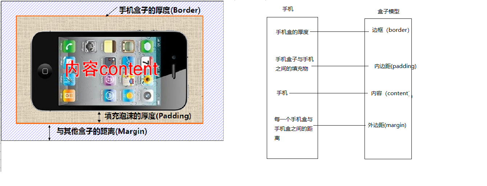

   

  **pink老师总结：**

  * **盒子模型有元素的内容、边框（border）、内边距（padding）、和外边距（margin）组成**。
  * 盒子里面的文字和图片等元素是 内容区域
  * 盒子的厚度 我们成为 盒子的边框 
  * 盒子内容与边框的距离是内边距（类似单元格的 cellpadding)
  * 盒子与盒子之间的距离是外边距（类似单元格的 cellspacing）

**标准盒子模型**


 

## 3. 盒子边框（border） 

​	

- 语法：

~~~css
border : border-width || border-style || border-color 
~~~

| 属性         |          作用          |
| ------------ | :--------------------: |
| border-width | 定义边框粗细，单位是px |
| border-style |       边框的样式       |
| border-color |        边框颜色        |

- 边框的样式：
  - none：没有边框即忽略所有边框的宽度（默认值）
  - solid：边框为单实线(最为常用的)
  - dashed：边框为虚线  
  - dotted：边框为点线

### 3.1 边框综合设置

**三个属性值之间没有顺序** 

```
border : border-width || border-style || border-color 
```

例如：

~~~css
 border: 1px solid red;   
~~~

### 3.2 盒子边框写法总结表

去除盒子的默认边框：border:0

很多情况下，我们不需要指定4个边框，我们是可以单独给4个边框分别指定的。

| 上边框                     | 下边框                        | 左边框                      | 右边框                       |
| :------------------------- | :---------------------------- | :-------------------------- | :--------------------------- |
| border-top-style:样式;     | border-bottom-style:样式;     | border-left-style:样式;     | border-right-style:样式;     |
| border-top-width:宽度;     | border- bottom-width:宽度;    | border-left-width:宽度;     | border-right-width:宽度;     |
| border-top-color:颜色;     | border- bottom-color:颜色;    | border-left-color:颜色;     | border-right-color:颜色;     |
| border-top:宽度 样式 颜色; | border-bottom:宽度 样式 颜色; | border-left:宽度 样式 颜色; | border-right:宽度 样式 颜色; |

### 3.3 表格的细线边框

 

- 通过表格的`cellspacing="0"`,将单元格与单元格之间的距离设置为0，

- 但是两个单元格之间的边框会出现重叠，从而使边框变粗

- 通过css属性：

  ~~~
  table{ border-collapse:collapse; }  
  ~~~

  - collapse 单词是合并的意思
  - border-collapse:collapse; 表示相邻边框合并在一起。

~~~css
<style>
	table {
		width: 500px;
		height: 300px;
		border: 1px solid red;
	}
	td {
		border: 1px solid red;
		text-align: center;
	}
	table, td {
		border-collapse: collapse;  /*合并相邻边框*/
	}
</style>
~~~

 **给表格tr设置边框没有效果**


## 4. 内边距（padding）

 

### 4.1 内边距：

​	padding属性用于设置内边距。 **是指 边框与内容之间的距离。**

### 4.2 设置

| 属性           | 作用     |
| -------------- | :------- |
| padding-left   | 左内边距 |
| padding-right  | 右内边距 |
| padding-top    | 上内边距 |
| padding-bottom | 下内边距 |

当我们给盒子指定padding值之后， 发生了2件事情：

1. 内容和边框 有了距离，添加了内边距。
2. **盒子会变大了。**

 **注意：  后面跟几个数值表示的意思是不一样的。**

我们分开写有点麻烦，我们可以不可以简写呢？

| 值的个数 | 表达意思                                        |
| -------- | ----------------------------------------------- |
| 1个值    | padding：上下左右内边距;                        |
| 2个值    | padding: 上下内边距    左右内边距 ；            |
| 3个值    | padding：上内边距   左右内边距   下内边距；     |
| 4个值    | padding: 上内边距 右内边距 下内边距 左内边距 ； |


**课堂一练：**

请写出如下内边距：

1. 要求盒子有一个左边内边距是 5像素
2. 要求简写的形式写出  一个盒子上下是 25像素   左右是15像素。
3. 要求简写的形式写出 一个盒子  上内边距是 12像素  下内边距是 0  左内 边距是 25像素  右内边距是 10像素

### 4.3 课堂案例：  新浪导航

新浪导航栏的核心就是**因为里面的字数不一样多，所以我们不方便给宽度，给padding撑开盒子**。

(每个a高度和盒子一样高，左右用padding撑开，注意上下不要给padding，垂直居中即可)

 

### 4.4 内盒尺寸计算（元素实际大小）


- 宽度

  Element Height = content height + padding + border （Height为内容高度）

- 高度

  Element Width = content width + padding + border （Width为内容宽度）

- 盒子的实际的大小 =   内容的宽度和高度 +  内边距   +  边框   

### 4.5 内边距产生的问题

- 问题

  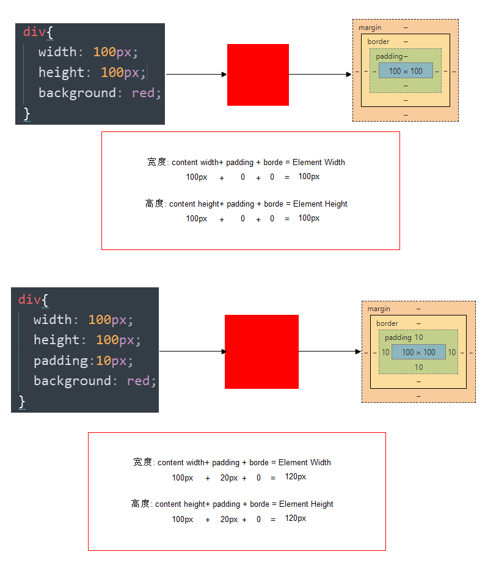

  会撑大原来的盒子

- 解决：

  **通过给设置了宽高的盒子，减去相应的内边距的值，维持盒子原有的大小**(css3中box-sizing:border-box属性可以不改变盒子大小 设置内边距和外边框)

  


**课堂一练**

1. 一个盒子宽度为100， padding为 10， 边框为5像素，问这个盒子实际的宽度的是（）

- [x] (A) 130

- [ ] (B) 135 

- [ ] (C) 125

- [ ] (D) 115

  100 +  20 + 10 

2. 关于根据下列代码计算 盒子宽高下列说法正确的是（）

```css
div {

		width: 200px;

         height: 200px;

		border: 1px solid #000000;

		border-top: 5px solid blue;

		padding: 50px;

		padding-left: 100px;

		}
```

- [ ] (A) 宽度为200px 高度为200px
- [x] (B) 宽度为352px 高度为306px
- [ ] (C) 宽度为302px 高度为307px
- [ ] (D) 宽度为302px 高度为252px

w  200 +   150   + 2   =  352

h   200 +  100 +  6   =  306 

### 4.6 padding不影响盒子大小情况

> **如果没有给一个盒子指定宽度， 此时，如果给这个盒子指定padding， 则不会撑开盒子。**

## 5. 外边距（margin）


### 5.1 外边距

​	margin属性用于设置外边距。  margin就是控制**盒子和盒子之间的距离**

### 5.2 设置：

| 属性          | 作用     |
| ------------- | :------- |
| margin-left   | 左外边距 |
| margin-right  | 右外边距 |
| margin-top    | 上外边距 |
| margin-bottom | 下外边距 |

margin值的简写 （复合写法）代表意思  跟 padding 完全相同。

### 5.3 块级盒子水平居中

- 可以让一个块级盒子实现水平居中必须： 
  - 盒子必须指定了宽度（width）
  - 然后就给**左右的外边距都设置为auto**，（设置左侧auto则左侧margin会充满，右侧auto则右侧margin会充满）

实际工作中常用这种方式进行网页布局，示例代码如下：

~~~css
.header{ width:960px; margin:0 auto;}
~~~

常见的写法，以下下三种都可以。

* margin-left: auto;   margin-right: auto;
* margin: auto;
* margin: 0 auto;

### 5.4 文字居中和盒子居中区别

1.  盒子内的文字水平居中是  text-align: center,  而且还可以让 行内元素和行内块居中对齐
2.  块级盒子水平居中  左右margin 改为 auto 

~~~css
text-align: center; /*  文字 行内元素 行内块元素水平居中 */
margin: 10px auto;  /* 块级盒子水平居中  左右margin 改为 auto 就阔以了 上下margin都可以 */
~~~

### 5.5 插入图片和背景图片区别

1. 插入图片 我们用的最多 比如产品展示类  **移动位置只能靠盒模型 padding margin**
2. 背景图片我们一般用于**小图标** 或者 **超大背景图片**  背景图片**移动位置只能通过  background-position**

~~~css
 img {  
		width: 200px;/* 插入图片更改大小 width 和 height */
		height: 210px;
		margin-top: 30px;  /* 插入图片更改位置 可以用margin 或padding  盒模型 */
		margin-left: 50px; /* 插入当图片也是一个盒子 */
	}

 div {
		width: 400px;
		height: 400px;
		border: 1px solid purple;
		background: #fff url(images/sun.jpg) no-repeat;
		background-position: 30px 50px; /* 背景图片更改位置 我用 background-position */
	}

~~~

### 5.6 清除元素的默认内外边距(重要)

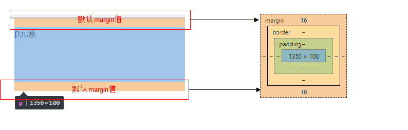

为了更灵活方便地控制网页中的元素，制作网页时，我们需要将元素的默认内外边距清除

代码： 

~~~css
* {
   padding:0;         /* 清除内边距 */
   margin:0;          /* 清除外边距 */
}

~~~

注意：  

* 行内元素为了照顾兼容性， 尽量只设置左右内外边距， 不要设置上下内外边距（因为在某些浏览器设置了也不起作用）。

### 5.7 外边距合并

使用margin定义块元素的**垂直外边距**时，可能会出现外边距的合并。

#### (1). <u>相邻</u>块元素垂直外边距的合并(注意垂直才有问题，左右是没有问题的)

- 当上下相邻的两个块元素相遇时，如果上面的元素有下外边距margin-bottom
- 下面的元素有上外边距margin-top，则他们之间的垂直间距不是margin-bottom与margin-top之和
- **取两个值中的较大者**这种现象被称为相邻块元素垂直外边距的合并（也称外边距塌陷）。

 

**解决方案：尽量只给一个盒子添加margin值**。

#### (2). <u>嵌套</u>块元素垂直外边距的合并

标准流的盒子才会出现这个问题，加了浮动和定位的盒子就不会出现这个问题了

- 对于两个嵌套关系的块元素，**如果父元素没有上内边距及边框**

- 父元素的上外边距会与子元素的上外边距发生合并作为父元素的上外边距

- 合并后的外边距为两者中的较大者
  也就是说，我们给一个大盒子里边放了一个小盒子，想直接设置小盒子顶部和大盒子有一段距离是无效的。
  下边的代码和图片演示了这个问题

```html
<body>
    <div class="father">
        <div class="son"></div>
    </div>
   
</body>
```

```css
  	   *{
            margin:0;
            padding:0;
        }
        div{
            width: 500px;
            height: 500px;
            background-color: pink;
        }
        .son{
            height: 200px;
            width: 200px;
            background-color: purple;
            margin-top: 300px;
        }
```


可以看到子元素不仅没有移动，父元素还移动了
**解决方案：**

1. 可以为父元素定义上边框。（border:1px solid transparent;）
2. 可以为父元素定义上内边距(padding-top:1px)
3. **可以为父元素添加overflow:hidden**。（最常用）

还有其他方法，比如浮动、固定、绝对定位的盒子不会有问题，后面再总结

## 6. 盒子模型布局稳定性

- 学习完盒子模型，内边距和外边距，什么情况下用内边距，什么情况下用外边距？

  - 大部分情况下是可以混用的。  就是说，你用内边距也可以，用外边距也可以。 你觉得哪个方便，就用哪个。

我们根据稳定性来分，建议如下：

按照 优先使用  宽度 （width）  其次 使用内边距（padding）    再次  外边距（margin）。   

```
  width >  padding  >   margin   
```

- 原因：
  - margin 会有外边距合并 还有 ie6下面margin 加倍的bug（讨厌）所以最后使用。
  - padding  会影响盒子大小， 需要进行加减计算（麻烦） 其次使用。
  - width   没有问题（嗨皮）我们经常使用宽度剩余法 高度剩余法来做。

## 7. ps基本操作以及常用快捷键：

因为网页美工大部分效果图都是利用ps 来做的，所以，以后我们大部分切图工作都是在ps里面完成。

- 文件--打开 --  可以打开 我们要测量的图片
- ctrl+r 可以打开标尺  或者  视图 --  标尺
- 右击标尺，  把里面的单位改为  像素  
- ctrl+ 加号 键  可以 放大  视图  ctrl+ 减号 缩小视图
- 按住空格键，  鼠标可以 变成小手 ，拖动 ps 视图
- 用选区 拖动  可以 测量 大小 
- ctrl+ d  可以取消选区  或者旁边空白处点击一下也可以取消选区


## 8. 综合案例


#### 去掉列表默认的样式

无序和有序列表前面默认的列表样式，在不同浏览器显示效果不一样，而且也比较难看，所以，我们一般上来就直接去掉这些列表样式就行了。 代码如下

~~~css
li { list-style: none; }

~~~


## 9. 今日总结


# 拓展@

以下我们讲的CSS3部分新属性， 但是我们遵循的原则是，以下内容，不会影响我们页面布局， 只是样式更好看了而已。

## 1.圆角边框(CSS3)


- 语法：

```css
border-radius:length;  
```

- 其中每一个值可以为 数值或百分比的形式。 

技巧： 让一个正方形  变成标准正圆 如下图
 

  ~~~
  border-radius: 50%;(每一个圆角的水平半径是盒子宽的50%，垂直半径是盒子高的50%)
  ~~~


* 以上效果图，让矩形的四个角变成圆角， 就不要用50%了，因为50%会让矩形盒子变成一个椭圆
* 我们这里数值的设置就只要用 高度的一半 就好了（用精确单位）

 由于我们平时使用`border-radius`绝大多数情况是都单值，例如`border-radius: 300px`，于是，久而久之可那会忽略这样一个事实，那就是`border-radius`单值实际上是一种简写。就跟`padding:300px`是一样的，是各个方位等值时候的一种简化书写形式。 

我们将`border-radius: 300px`还原成真实的模样，结果是：

```
border-radius: 300px 300px 300px 300px/300px 300px 300px 300px;
```

虽然看上去都是`300px`, 长得好像一样，实际上 表示的含义各不相同，翻译成普通话就是：

```
border-radius: 左上角水平圆角半径大小 右上角水平圆角半径大小 右下角水平圆角半径大小 左下角水平圆角半径大小/左上角垂直圆角半径大小 右上角垂直圆角半径大小 右下角垂直圆角半径大小 左下角垂直圆角半径大小;
```

也就是斜杠前的是水平方向，斜杠后面的是垂直方向，每个角的水平和垂直半径如下图所示：


#### 圆角矩形设置4个角

圆角矩形可以为4个角分别设置圆度， 但是是有顺序的，必须先写top/bottom 再写left/right

```
border-top-left-radius:20px;
border-top-right-radius:20px;
border-bottom-right-radius:20px;
border-bottom-left-radius:20px;
```

* 如果4个角，数值相同

~~~css
border-radius: 15px;
~~~

* 里面数值不同，我们也可以按照简写的形式，具体格式如下:

~~~css
border-radius: 左上角 右上角  右下角  左下角;
~~~

还是遵循的顺时针。

border-radius还有两个特性：

 **大值特性**，也就是值很大的时候，只会使用能够渲染的圆角大小渲染。 （水平半径就是宽的一般，垂直半径就是高的一半，所以我们用百分比的方式给出数值的时候，50%是最大的，大于50%也没有用。我们想让正方形盒子变成正圆，除了给50%，也可以给他一个超过边长的border-radius）

 **等比特性**，就是水平半径和垂直半径的比例是恒定不变的。 

 比如，我们的元素占据宽度200像素，高度300像素。我们给了border-radius为150，根据**大值特性**，水平方向的`150`像素只能按照`100`像素半径渲染；再根据**等比例特性**，虽然垂直方向理论上的最大半径是`150`像素，但是受制于当初设定的`150px*150px`的`1:1`比例，垂直方向最终渲染的半径大小也是100像素。于是，我们最后得到的每个角都是`100`像素*`100`像素的圆弧。 

## 2. 盒子阴影(CSS3)


- 语法:

~~~css
box-shadow:水平阴影（向x方向移动距离） 垂直阴影（向y方向移动距离） 模糊距离（虚实，数值越大越虚）  阴影尺寸（影子大小）  阴影颜色  内/外阴影；

常用写法：box-shadow: 0px 15px 30px rgba(0,0,0,.1);

其实就是盒子后边有个和盒子一边大小的盒子，这个盒子是我们设置的color这个参数的颜色，水平阴影就是这个盒子向X方向移动的距离，垂直阴影就是向Y方向移动的距离，阴影尺寸就是盒子四周向外扩张的像素值
~~~


- 前两个属性是必须写的。其余的可以省略。
- **外阴影 (outset) 是默认的 但是不能写**           想要内阴影可以写  inset 

~~~css
div {
			width: 200px;
			height: 200px;
			border: 10px solid red;
			/* box-shadow:水平位置 垂直位置 模糊距离 阴影尺寸（影子大小） 阴影颜色  内/外阴影； */
			box-shadow: 0 15px 30px  rgba(0, 0, 0, .1);
}

~~~

# CSS书写规范

开始就形成良好的书写规范，是你专业的开始。

## 空格规范

【强制】 选择器 与 { 之间必须包含空格。

示例： 

~~~css
.selector {
}

~~~

【强制】 属性名 与之后的 : 之间不允许包含空格， : 与 属性值 之间必须包含空格。

示例：

~~~css
font-size: 12px;
~~~

## 选择器规范

【强制】 并集选择器，每个选择器声明必须独占一行。

示例：

```
/* good */
.post,
.page,
.comment {
    line-height: 1.5;
}


/* bad */
.post, .page, .comment {
    line-height: 1.5;
}

```

【建议】 一般情况情况下，选择器的嵌套层级应不大于 3 级，位置靠后的限定条件应尽可能精确。

示例：

```css
/* good */
#username input {}
.comment .avatar {}

/* bad */
.page .header .login  input {}
.comment div * {}

```

## 属性规范

【强制】 属性定义必须另起一行。

示例：

```css
/* good */
.selector {
    margin: 0;
    padding: 0;
}

/* bad */
.selector { margin: 0; padding: 0; }

```

【强制】 属性定义后必须以分号结尾。

示例：

```css
/* good */
.selector {
    margin: 0;
}

/* bad */
.selector {
    margin: 0
}

```
## 1. 浮动(float)

### 目标

- **记忆**
  - 能够说出 CSS 的布局的三种机制
- **理解**
  - 能够说出普通流在布局中的特点
  - 能够说出我们为什么用浮动
  - 能够说出我们为什么要清除浮动
- **应用**
  - 能够利用浮动完成导航栏案例
  - 能够清除浮动
  - 能够使用PS切图工具

### 1.1 CSS 布局的三种机制

> 网页布局的核心——就是**用 CSS 来摆放盒子**。

CSS 提供了 **3 种机制**来设置盒子的摆放位置，分别是**普通流**（标准流）、**浮动**和**定位**，其中： 

1. **普通流**（标准流）
   - **块级元素**会独占一行，**从上向下**顺序排列；
     - 常用元素：div、hr、p、h1~h6、ul、ol、dl、form、table
   - **行内元素**会按照顺序，**从左到右**顺序排列，碰到父元素边缘则自动换行；
     - 常用元素：span、a、i、em等
2. **浮动**
   - 让盒子从普通流中**浮**起来,主要作用让多个块级盒子一行显示。
3. **定位**
   - 将盒子**定**在浏览器的某一个**位**置——CSS 离不开定位，特别是后面的 js 特效。


### 1.2 为什么需要浮动？

思考题：

 我们首先要思考以下2个布局中最常见的问题？

1. 如何让多个盒子(div)水平排列成一行？

   

2. 如何实现盒子的左右对齐？


虽然我们前面学过行内块（inline-block） 但是他却有自己的缺陷：

1. 它可以实现多个元素一行显示，但是中间会有空白缝隙，这个空白缝隙很难去除 而且缝隙距离很难统一 不能满足以上第一个问题。
2. 它不能实现以上第二个问题，盒子左右对齐 

**pink老师一句话总结他们**

> 因为一些网页布局要求，标准流不能满足我们的需要了，因此我们需要浮动来完成网页布局。

### 1.3  什么是浮动(float)

**概念**：元素的浮动是指**设置了浮动属性的元素**会

1. 脱离标准普通流的控制
2. 移动到指定位置。

#### 作用

1. **让多个盒子(div)水平排列成一行**，使得浮动成为布局的重要手段。
2. 可以实现盒子的左右对齐等等..
3. 浮动最早是用来**控制图片**，实现**文字环绕图片的效果**。


#### 语法

在 CSS 中，通过 `float`  中文，  浮 漏 特    属性定义浮动，语法如下：

```
选择器 { float: 属性值; }
```

| 属性值    | 描述                     |
| --------- | ------------------------ |
| **none**  | 元素不浮动（**默认值**） |
| **left**  | 元素向**左**浮动         |
| **right** | 元素向**右**浮动         |

pink老师教你学浮动口诀。通过 `float`   -----  浮 漏 特

#### 1). 浮动口诀之 浮

浮动——浮~浮~浮~~~漂浮在普通流的上面，脱离标准流。 俗称 “脱标”   

 

```css
.box1 {
    width: 200px;
    height: 200px;
    background-color: rgba(255, 0, 0, 0.5);
    float: left;
}
.box2 {
    width: 150px;
    height: 300px;
    background-color: skyblue;
}
```

**小结**：

- `float` 属性会让盒子漂浮在标准流的上面，所以第二个标准流的盒子跑到浮动盒子的底下了。

#### 2).  浮动口诀之 漏

浮动——漏~漏~漏~  浮动的盒子，把自己原来的位置漏给下面标准流的盒子，就是不占有原来位置，是脱离标准流的，我们俗称 “脱标”。

~~~css
.box1 {
    width: 200px;
    height: 200px;
    background-color: rgba(255, 0, 0, 0.5);
    /* 让第 1 个盒子漂浮起来，不占位置 */
    float: left;
}
.box2 {
    width: 150px;
    height: 300px;
    background-color: skyblue;
}
~~~

 所以，box2下面的其实就是跑到box1盒子下面了， 被box1给压住了，遮挡起来了

来来来，我们看个立体图


#### 3). 浮动口诀之 特

浮动——特性  div浮动之后，仍然是块级元素，但是**我们可以理解为 float会改变元素display属性为inline-block(具有行内块元素的特性)，与真正的inline-block不同的是他们之间没有缝隙**。

任何元素都可以浮动。浮动元素会生成一个块级框，而不论它本身是何种元素。 生成的块级框和我们前面的行内块极其相似。

体验案例——div 水平排列


```css
div {

    width: 200px;

    height: 200px;

    background-color: red;

    /* 转换为行内块元素，可以水平显示，不过 div 之间有间隙，不方便处理 */

    /* display: inline-block; */
    

    /* 设置浮动属性，可以让 div 水平排列，并且没有间隙 */

    float: left;
}

.two {

    background-color: green;

}
.three {
    background-color: blue;
}
```

 

**注意： 浮动的元素互相贴靠一起的，但是如果父级宽度装不下这些浮动的盒子， 多出的盒子会被挤到下一行**

### 1.4 浮动(float)小结

> 我们使用浮动的核心目的——让多个块级盒子在同一行显示。 因为这是我们最常见的一种布局方式

**float** —— **浮漏特**

| 特点 | 说明                                                         |
| ---- | ------------------------------------------------------------ |
| 浮   | 加了浮动的盒子**是浮起来**的，漂浮在其他标准流盒子的上面。   |
| 漏   | 加了浮动的盒子**是不占位置的**，它原来的位置**漏给了标准流的盒子**。 |
| 特   | **特别注意**：浮动元素会改变display属性， 类似转换为了行内块，但是元素之间没有空白缝隙 |


### 1.5 浮动(float)的应用（重要）

#### 浮动和标准流的父盒子搭配

我们知道，浮动是脱标的，会影响下面的标准流元素（下面标准流的元素会跑到浮动元素的后边去，从而显示不出来），此时，**我们需要给浮动的元素添加一个标准流的父亲**，这个标准流父亲只是占住了这块地方，没有任何样式。这样，最大化的减小了对其他标准流的影响。

**pink老师说：**

> 一个完整的网页，是 标准流 +  浮动 +  我们后面要讲的定位 一起完成的。

#### 浮动应用案例


#### 导航栏案例


注意，**实际的导航栏中，我们不会直接用链接a  而是用 li  包含链接 (li+a) 的做法**。

1. li+a 语义更清晰，一看这就是有条理的列表型内容。
2. 如果直接用a，搜索引擎容易辨别为有堆砌关键字嫌疑（故意堆砌关键字容易被搜索引擎有降权的风险），从而影响网站排名

### 1.6  浮动(float)的扩展

#### 1). 浮动元素与父盒子的关系

- 子盒子的浮动参照父盒子对齐
- 不会与父盒子的边框重叠，也不会超过父盒子的内边距(浮动的盒子不会压住内边距和外边框)
  
  ​

#### 2). 浮动元素与兄弟盒子的关系

在一个父级盒子中，如果**前一个兄弟盒子**是：

- **浮动**的，那么**当前浮动盒子**会与前一个盒子的顶部对齐；
- **普通流**的，那么**当前浮动盒子**会显示在前一个兄弟盒子的下方。 


**pink老师 要你记住：**

> 浮动只会影响当前的或者是后面的标准流盒子，不会影响前面的标准流。

 


在利用浮动布局的时候，我们经常会遇到这种布局，比如图中3这个盒子，由li组成，每个li之间都有距离（外边距），但是我们无论给margin-left还是margin-right，首个或者末尾的盒子都会因为外边距的问题，掉到下一行显示（所有li的大小加上边距超过了盒子3的宽度），这个时候，我们可以给3这个子盒子宽度大一点，超过1这个父盒子的宽度（子盒子是可以比父盒子宽的），这样虽然多出了一个margin，但是我们是看不到的，就完美解决了这个问题。

**建议**

**如果一个盒子里面有多个子盒子，如果其中一个盒子浮动了，其他兄弟也应该浮动。防止引起问题**

## 2. 清除浮动

### 2.1 为什么要清除浮动

因为父级盒子很多情况下，不方便给高度，需要由子盒子的高度填充。在标准流的情况下，父盒子可以不给高度，由子盒子的高度撑开，但是子盒子浮动就脱离标准流不占有位置，导致父盒子高度为0，就影响了下面的标准流盒子（下面的标准流盒子会占据上面的子盒子浮动的标准流父盒子的位置）。


（实际是没有那条蓝线的，蓝线代表标准流父盒子）

- 总结：
  - 由于浮动元素不再占用原文档流的位置，所以它会对后面的元素排版产生影响
  - 准确地说，并不是清除浮动，而是**清除浮动后造成的影响**

### 2.2 清除浮动本质

**听pink老师说清除浮动本质：**

​	**清除浮动主要为了解决父级元素因为子级浮动引起内部高度为0 （浮动的子元素不会撑开父元素高度）的问题。清除浮动之后， 父级就会根据浮动的子盒子自动检测高度。父级有了高度，就不会影响下面的标准流了**

### 2.3 清除浮动的方法

在CSS中，clear属性用于清除浮动，在这里，我们先记住清除浮动的方法，具体的原理，等我们学完css会再回头分析。

- 语法：

```
选择器{clear:属性值;}   clear 清除  
```

| 属性值 | 描述                                       |
| ------ | ------------------------------------------ |
| left   | 不允许左侧有浮动元素（清除左侧浮动的影响） |
| right  | 不允许右侧有浮动元素（清除右侧浮动的影响） |
| both   | 同时清除左右两侧浮动的影响                 |

但是我们实际工作中， 几乎只用 clear: both;

#### 1).额外标签法(隔墙法)

```html
是W3C推荐的做法是通过在浮动元素末尾（最后一个浮动的元素的后边）添加一个空的标签例如 <div style=”clear:both”></div>，或则其他标签br等亦可。
```

- 优点： 通俗易懂，书写方便
- 缺点： 添加许多无意义的标签，结构化较差。

#### 2).父级添加overflow属性方法

```css
可以给父级添加： overflow为 hidden| auto| scroll  都可以实现。
```

优点：  代码简洁

缺点：  内容增多时候容易造成不会自动换行导致内容被隐藏掉，无法显示需要溢出的元素。

#### 3).使用after伪元素清除浮动（使用较多）

**:after 方式是额外标签法的升级版，相当于用css的方式在使用该样式的类的内部最后边加了一个空标签，相比额外标签法，好处是不用单独加标签破坏结构了** 

使用方法为给父元素添加clearfix样式（一般习惯类名叫这个）：

```css
 .clearfix:after {  
     content: ""; 
     display: block; 
     height: 0; 
     clear: both; 
     visibility: hidden;  
	}   
 .clearfix {
     *zoom: 1;
	}   /* IE6、7 专有 */
```

- 优点： 符合闭合浮动思想  结构语义化正确
- 缺点： 由于IE6-7不支持:after，使用 zoom:1触发 hasLayout。
- 代表网站： 百度、淘宝网、网易等


#### 4).使用双伪元素清除浮动（使用较多）

使用方法：

```css
.clearfix:before,
.clearfix:after { 
    content:"";
    display:table; 
}
.clearfix:after {
    clear:both;
}
.clearfix {
    *zoom:1;/* IE6、7 专有 */
}

```

- 优点：  代码更简洁

- 缺点：  由于IE6-7不支持:after，使用 zoom:1触发 hasLayout。

- 代表网站： 小米、腾讯等

### 2.4 清除浮动总结

**pink老师告诉你我们以后什么时候用清除浮动呢？**

1. 父级没高度
2. 子盒子浮动了
3. 影响下面布局了，我们就应该清除浮动了。

| 清除浮动的方式       | 优点               | 缺点                               |
| -------------------- | :----------------- | :--------------------------------- |
| 额外标签法（隔墙法） | 通俗易懂，书写方便 | 添加许多无意义的标签，结构化较差。 |
| 父级overflow:hidden; | 书写简单           | 溢出隐藏                           |
| 父级after伪元素      | 结构语义化正确     | 由于IE6-7不支持:after，兼容性问题  |
| 父级双伪元素         | 结构语义化正确     | 由于IE6-7不支持:after，兼容性问题  |

后面两种伪元素清除浮动，大家暂且会使用就好， 深入原理，我们后面学完伪元素再讲。

## 3. Photoshop 切图

**常见的图片格式**

```
1. jpg图像格式： 
JPEG（.JPG）对色彩的信息保留较好，高清，颜色较多，我们产品类的图片经常用jpg格式的
2. gif图像格式：
GIF格式最多只能储存256色，所以通常用来显示简单图形及字体，但是可以保存透明背景和动画效果
3. png图像格式
是一种新兴的网络图形格式，结合了GIF和JPEG的优点，具有存储形式丰富的特点，能够保持透明背景
4. PSD图像格式
PSD格式是Photoshop的专用格式，里面可以存放图层、通道、遮罩等多种设计草稿。 

```

PS切图   可以 分为   利用切片工具切图 以及   利用PS的插件快速切图。

### 1). PS切片工具

 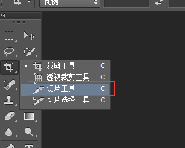


ps切图片，分两大步：

**1). 用切片选中图片**

* 利用切片工具手动划出

* 先选择图层（顶部自动选择选项要选择图层），然后在图层菜单选择---新建基于图层的切片

   

* 利用辅助线 来切图 --    基于参考线的切片 

  

   

  

**2). 导出切片**

  文件菜单   -- 存储为web设备所用格式 ----   选择  我们要的图片格式 ----  点保存  ---   别忘了选择选中的切片

#### 辅助线和切片使用及清除

视图菜单-- 清除 辅助线/ 清除切片

### 2). 切图插件

Cutterman是一款运行在photoshop中的插件，能够自动将你需要的图层进行输出， 以替代传统的手工 "导出web所用格式" 以及使用切片工具进行挨个切图的繁琐流程。 它支持各种各样的图片尺寸、格式、形态输出，方便你在pc、ios、Android等端上使用。 它不需要你记住一堆的语法、规则，纯点击操作，方便、快捷，易于上手。

官网: http://www.cutterman.cn/zh/cutterman

注意： cutterman插件要求你的ps 必须是完整版，不能是绿色版，所以大家需要从新安装完整版本。

选中图层后，在图层中新建选取，还能切出图层中选区对应的图片


# 1. 学成在线页面制作

### 目标

- **理解**
  - 能够说写单页面我们基本的流程
  - 能说出常见的css初始化语句
  - **能说出我们CSS属性书写顺序**
- **应用**
  - 能利用ps切图
  - 能引入外部样式表
  - 能把psd文件转换为html页面

学成在线的目的就是为了串联前面的所有知识。来一个春晚大联欢。

**pink老师：**

取义**学有所成**，为师之期望，君等成才者也，故曰学成网是也~~

## 1.1 前期准备素材

* 学成在线PSD源文件
* 开发工具  =  PS（切图） +  sublime（代码） + chrome（测试）

## 1.2 前期准备工作

欲先善其事，必先利其器。 先把我们的前期准备工作做好， 我们本次采取结构与样式相分离思想。

1. 创建 study 目录文件夹 (用于存放我们这个页面的相关内容)
2. study目录内新建images 文件夹 用于保存图片。
3. 新建index.html 首页html 文件（以后我们的网站首页统一规定为index.html)
4. 新建style.css 样式文件。 我们本次采用外链样式表。
5. 将样式引入到我们HTML页面文件中。
6. 样式表写入 清除内外边距样式，来检测样式表是否引入成功。

## 1.2 CSS属性书写顺序(重点)

建议遵循以下顺序：

1. 布局定位属性：display / position / float / clear / visibility / overflow（建议 display 第一个写，毕竟关系到模式）
2. 自身属性：width / height / margin / padding / border / background
3. 文本属性：color / font / text-decoration / text-align / vertical-align / white- space / break-word
4. 其他属性（CSS3）：content / cursor / border-radius / box-shadow / text-shadow / background:linear-gradient …

```css
.jdc {
    display: block;
    position: relative;
    float: left;
    width: 100px;
    height: 100px;
    margin: 0 10px;
    padding: 20px 0;
    font-family: Arial, 'Helvetica Neue', Helvetica, sans-serif;
    color: #333;
    background: rgba(0,0,0,.5);
    -webkit-border-radius: 10px;
    -moz-border-radius: 10px;
    -o-border-radius: 10px;
    -ms-border-radius: 10px;
    border-radius: 10px;
}
```

## 1.3 布局流程

为了提高网页制作的效率，布局时通常有以下的布局流程，具体如下：

1、必须确定页面的版心（可视区）， 我们测量可得知。

2、分析页面中的行模块，以及每个行模块中的列模块(先考虑行 再考虑列)。其实页面布局，就是一行行罗列而成

3、制作HTML结构。我们还是遵循，先有结构，后有样式的原则。结构永远最重要。

4、然后开始运用盒子模型的原理，通过DIV+CSS布局来控制网页的各个模块。

## 1.4 页面制作

这个页面的版心是 1200像素   每个版心都要水平居中对齐，所以，我们干脆把版心定义为：

~~~css
.w {
    width: 1200px;
    margin: auto;
}
~~~

#### 1) 头部制作

结构图如下：


* 1号是版心盒子header  1200 *  42 的盒子水平居中对齐, 上下给一个margin值就好了。
* 版心盒子 里面包含 2号盒子 logo
* 版心盒子 里面包含 3号盒子 nav导航栏
* 版心盒子 里面包含 4号盒子 search搜索框
* 版心盒子 里面包含 5号盒子 user个人信息
* 注意，要求里面的 4个盒子 必须都浮动

#### 2）banner制作

结构图如下：


* 1号盒子是通栏的大盒子banner， 不给宽度，给高度，给一个蓝色背景。
* 2号盒子是版心， 要水平居中对齐。
* 3号盒子版心内，左对齐 subnav侧导航栏。
* 4号盒子版心内，右对齐  course 课程。

#### 3）课程表模块

结构图如下：

 

* 1号盒子 是  228 * 300 的盒子 右浮动  注意 浮动的元素 不会有外边距塌陷的问题
* 1号盒子内 分为 上下 两个 子盒子
* 2号子盒子是 上部分  我们命名为 course-hd    (hd  是  head  的简写 头部的意思，我们经常用)
* 3号子盒子是 下部分  我们命名为 course-bd    (bd  是  body  的简写 主体的意思，我们经常用)

#### 4）精品推荐小模块

结构图如下：


* **复习点：**  因为里面三个盒子都要垂直居中，我们利用 继承性，给 最大的盒子 一个垂直居中的代码就好了，还记得 那些 样式可以继承吗？？？ font-  line-  text- color
* 大盒子水平居中 goods  精品 ，注意此处有个盒子阴影
* 1号盒子是标题 H3  左侧浮动
* 2号盒子 里面放链接  左侧浮动  goods-item    距离可以控制链接的 左右外边距（注意行内元素只给左右内外边距）
* 3号盒子 右浮动 mod 修改


####  5）精品推荐大模块

结构图如下：


* 1号盒子为最大的盒子 box  版心水平居中对齐
* 2号盒子为上面部分 box-hd  -- 里面   左侧标题H3 左浮动   右侧 链接 a 右浮动
* 3号盒子为底下部分 box-bd --- 里面是无序列表 有 10个 小li 组成
* 小li 外边距的问题， 这里有个小技巧。  给box-hd 宽度为 1215 就可以一行装开5个 li了
* 复习点：  我们用到清除浮动  因为 box-hd 里面的盒子个数不一定多少，我们就不给高度了，但是里面的盒子浮动了， 影响下面的布局，此时需要浮动

#### 6）底部模块制作

结构图如下：


* 1号盒子通栏大盒子 底部 footer  给高度  底色是白色
* 2号盒子版心水平居中
* 3号盒子版权 copyright  左对齐 
* 4号盒子 链接组 links  右对齐


# 2. chrome调试工具

“工欲善其事，必先利其器”

Chrome浏览器不仅可以调试页面、JS、请求、资源、cookie，还可以模拟手机进行调试。我们现在只是使用html和css，我们先讲一下现在常用的调试。

## 2.1 怎样打开Chrome的开发者工具？

直接在页面上点击右键，然后选择  “检查”     快捷键    F12  或者   ctrl+shift+i

 

基本的结构布局是左边html 右边是 css


### chrome调试数值

可以鼠标点击后面的数值，  按下键盘  上箭头 是 调大 数值， 下箭头是 调小数值


### 快速定位css所在行数


## 2.2 Chrome提示的常见布局错误

### 1). css单词书写错误提示

用下图所示的黑色箭头，点击我们需要的 html 元素。


### 2). css无显示

声明类名和html调用名不一致   或者   css文件引入不对  或者  这个样式的前面 多余了一些符号影响的

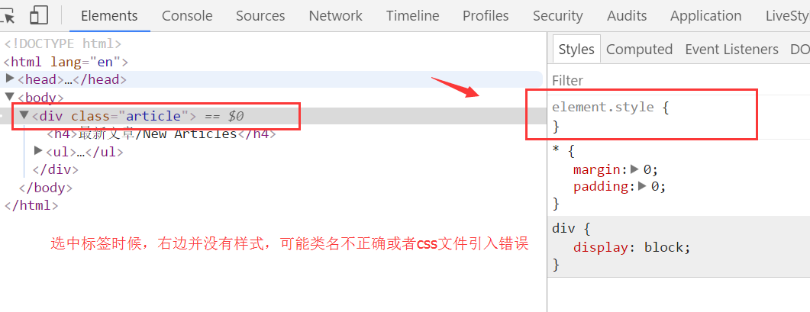

### 3). html 结构不匹配(重要) 

左侧   展开可以看到html 标签是否匹配

 

### 4). 通过颜色判断盒子

蓝色是 盒子的 宽度高度     青色是 内边距     橙色 是外边距   通过这个很方便的看到盒子给的范围

 

### 5）看看你有如下错误吗

 

 

 

 


 

# 定位(position)

## 目标  

* **理解**
  * 能说出为什么要用定位
  * 能说出定位的4种分类
  * 能说出四种定位的各自特点
  * 能说出我们为什么常用子绝父相布局
* **应用**
  * 能写出淘宝轮播图布局

## 1. CSS 布局的三种机制

> 网页布局的核心 —— 就是**用 CSS 来摆放盒子位置**。

CSS 提供了 **3 种机制**来设置盒子的摆放位置，分别是**普通流**、**浮动**和**定位**，其中：

1. **普通流**（**标准流**）

2. **浮动**
   * 让盒子从普通流中**浮**起来 —— **让多个盒子(div)水平排列成一行**。

3. **定位**
   * 将盒子**定**在某一个**位**置  自由的漂浮在其他盒子的上面  —— CSS 离不开定位，特别是后面的 js 特效。

## 2. 为什么使用定位

> 我们先来看一个效果，同时思考一下**用标准流或浮动能否实现类似的效果**？

**1. 小黄色块**在图片上移动，**吸引用户的眼球**。

 


**2. 当我们滚动窗口的时候，盒子是固定屏幕某个位置的**


> **结论**：要实现以上效果，**标准流**或**浮动**都无法快速实现

pink老师一句话说出定位：

> 将盒子**定**在某一个**位**置  自由的漂浮在其他盒子(包括标准流和浮动)的上面 

所以，我们脑海应该有三种布局机制的上下顺序

**标准流在最底层 (海底)  -------    浮动 的盒子 在 中间层  (海面)  -------   定位的盒子 在 最上层  （天空）**

## 3. 定位详解

定位也是用来布局的，它有两部分组成：

> `定位 = 定位模式 + 边偏移`

**加了定位（position:relative/absolute/fixed）之后，这个盒子就升天了（跑到了最上层），其中相对定位还占着之前的标准流位置，另外两个完全脱离了标准流。**

### 3.1 边偏移

简单说， 我们定位的盒子，是通过边偏移来移动位置的。

在 CSS 中，通过 `top`、`bottom`、`left` 和 `right` 属性定义元素的**边偏移**：（方位名词）

| 边偏移属性 | 示例           | 描述                                                     |
| ---------- | :------------- | -------------------------------------------------------- |
| `top`      | `top: 80px`    | **顶端**偏移量，定义元素相对于其父元素**上边线的距离**。 |
| `bottom`   | `bottom: 80px` | **底部**偏移量，定义元素相对于其父元素**下边线的距离**。 |
| `left`     | `left: 80px`   | **左侧**偏移量，定义元素相对于其父元素**左边线的距离**。 |
| `right`    | `right: 80px`  | **右侧**偏移量，定义元素相对于其父元素**右边线的距离**   |

定位的盒子有了边偏移才有价值。 **一般情况下，凡是有定位地方必定有边偏移**。

### 3.2  定位模式 (position)

在 CSS 中，通过 `position` 属性定义元素的**定位模式**，语法如下：

```css
选择器 { position: 属性值; }
```

定位模式是有不同分类的，在不同情况下，我们用到不同的定位模式。

| 值         |     语义     |
| ---------- | :----------: |
| `static`   | **静态**定位 |
| `relative` | **相对**定位 |
| `absolute` | **绝对**定位 |
| `fixed`    | **固定**定位 |

 


#### 3.2.1 静态定位(static) - 了解

- **静态定位**是元素的默认定位方式，无定位的意思。它相当于 border 里面的none， 不要定位的时候用。
- 静态定位 按照标准流特性摆放位置，它没有边偏移。
- **静态定位在布局时我们几乎不用的** 

#### 3.2.1 相对定位(relative) - 重要

- **相对定位**是元素**相对**于它  原来在标准流中的位置（包括Margin） 来说的。（自恋型）

  

**效果图**：


相对定位的特点：（务必记住）

- 相对于 自己原来在标准流中位置来移动的
- 原来**在标准流的区域继续占有**，后面的盒子仍然以标准流的方式对待它。（**与浮动不同**，仍然占据标准流的空间）
- **相对定位的盒子也是定位，也是在最上层的（最上层定位 中间浮动 最下层标准流）**

#### 3.2.3 绝对定位(absolute) - 重要  

**绝对定位**是元素以**带有定位**的**（父亲元素）祖先元素**来移动位置 （拼爹型）

1. **完全脱标** —— 完全不占位置；  

2. **祖先元素都没有定位**，则以**浏览器**为准定位（Document 文档）。

   

3. **祖先元素有定位**

   * 将元素依据最近的已经定位（绝对、固定或相对定位）的祖先元素进行定位。

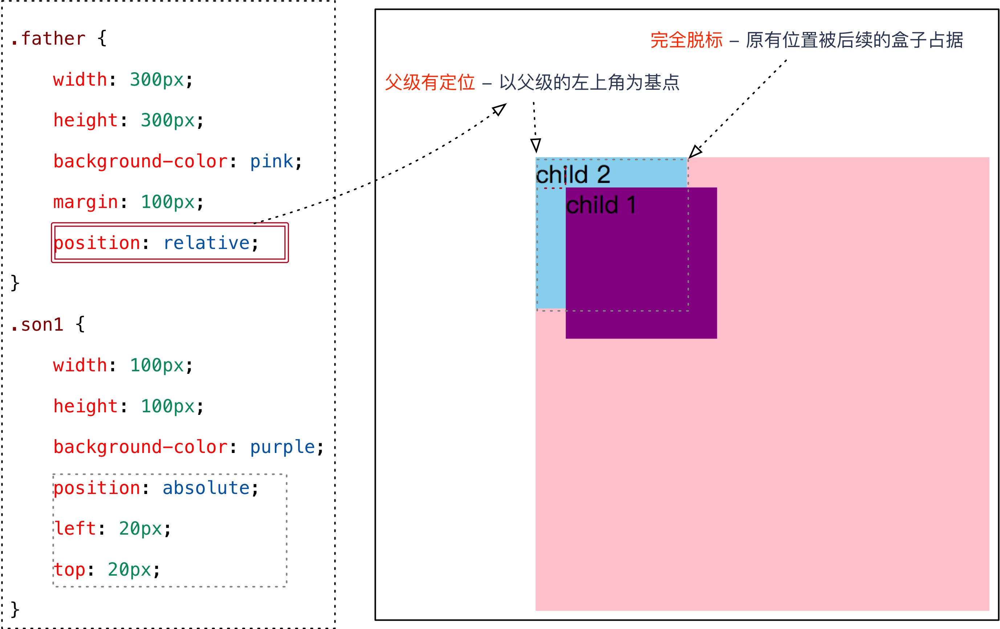

绝对定位的特点：（务必记住）

- 绝对是以最近的已经定位（绝对、固定或相对定位）的祖先元素来移动位置 （拼爹型） ，如果祖先元素都没有定位，则以浏览器文档为准移动位置
- **不保留原来的位置，完全是脱标的(类似浮动，不占据标准流的空间了)**。

因为绝对定位的盒子是拼爹的，所以要和父级搭配一起来使用。

##### 定位口诀 —— 子绝父相

刚才咱们说过，绝对定位，要和带有定位的父级搭配使用，那么父级要用什么定位呢？

**子绝父相** —— **子级**是**绝对**定位，**父级**要用**相对**定位。

> **子绝父相**是使用绝对定位的口诀，要牢牢记住！

**疑问**：为什么在布局时，**子级元素**使用**绝对定位**时，**父级元素**就要用**相对定位**呢？

观察下图，思考一下在布局时，**左右两个方向的箭头图片**以及**父级盒子**的定位方式。


**分析**：

1. **方向箭头**叠加在其他图片上方，应该使用**绝对定位**，因为**绝对定位完全脱标**，完全不占位置。
2. **父级盒子**应该使用**相对定位**，因为**相对定位不脱标**，后续盒子仍然以标准流的方式对待它。
   * 如果父级盒子也使用**绝对定位**，会完全脱标，那么下方的**广告盒子**会上移，这显然不是我们想要的。

**结论**：**父级要占有位置，子级要任意摆放**，这就是**子绝父相**的由来。

#### 3.2.4 固定定位(fixed) - 重要

**固定定位**是**绝对定位**的一种**特殊形式**： （认死理型）   如果说绝对定位是一个矩形 那么 固定定位就类似于正方形

因为固定定位是绝对定位的特殊形式，所以他们俩具有很多相对定位没有的统一特性，比如脱标，具有行内块元素的特性，需要指定宽度，可以解决外边距合并和塌陷的问题。

1. **完全脱标** —— 完全不占位置；
2. 只认**浏览器的可视窗口** —— `浏览器可视窗口 + 边偏移属性` 来设置元素的位置；
   * 跟父元素没有任何关系(相对浏览器窗口进行定位)
   * 不随滚动条滚动。

> 案例演练：固定定位案例。


**提示**：IE 6 等低版本浏览器不支持固定定位。

固定定位经常会实现一个**贴近版心**的电梯导航的效果，我们不能给这个导航设置left，因为这样设置页面缩小后导航的不会贴近版心，距离会很大，这里我们也有一个公式来计算导航的位置：

 

可以给margin-left再加一点距离，这样导航和版心之间会有一个缝隙

## 4. 定位(position)的案例

### 4.1 哈根达斯

**案例截图**：

 

#### 哈根达斯分析

1. 一个大的 `div` 中包含 `3` 张图片；
2. 大的 `div` 水平居中；
3. `2` 张小图片**重叠**在**广告**图片上方 —— 脱标，不占位置，需要使用**绝对定位**；
4. `2` 张小图片分别显示在**左上角**和**右下角** —— 需要**使用边偏移确定准确位置**。

**案例小结**：

1. **子绝父相** —— **子元素**使用**绝对定位**，**父元素**使用**相对定位**；
2. **与浮动的对比**：
   * **绝对定位**：脱标，**利用边偏移指定准确位置**；
   * **浮动**：脱标，不能指定准确位置，**让多个块级元素在一行显示**。

### 4.2 仿新浪头部和广告


#### 新浪案例分析

1. 顶部图片**固定**在浏览器可视窗口顶部，不会随窗口一起滚动；
2. 左右两侧的广告图片**固定**在浏览器可视窗口的左右两侧，不会随窗口一起滚动；
3. 注意：**底部的内容图片**初始**显示在顶部图片的下方**，如何解决？

#### 步骤 1 —— 顶部图片和底部内容

```css
.top {
    /* 注意：使用固定定位时，如果盒子中没有内容，需要指定宽度 */
    width: 100%;
    height: 44px;
    background: url(images/top.png) no-repeat top center;
    position: fixed;
    left: 0px;
    top: 0px;
}

.box {
    width: 1002px;
    /* 顶部的 44px 的 margin 可以让 box 显示在顶部图片下方 */
    margin: 44px auto;
}
```

**注意**：

1. 在使用固定和绝对定位时，如果盒子中没有内容，需要指定宽度，这是因为使用固定定位后，盒子会具有行内块的特性，宽度是盒子中内容的宽度，如果盒子中没有内容，那么盒子宽度为0，就看不到了。
2. 如果上边盒子设置了固定定位，那么会脱离标准流，下边盒子会跑到他的下边，这时候，可以设置下边盒子的**顶部 `margin`**，可以让下边盒子初始显示在上边盒子的下方，不会被上边盒子压住。

#### 步骤 2 —— 左右两侧广告

```css
.ad-left,
.ad-right {
    position: fixed;
    top: 100px;
}

.ad-left {
    left: 0px;
}

.ad-right {
    right: 0px;
}
```

**注意**：不要同时使用 `left` 和 `right` 和边偏移属性。

**案例小结**：

1. **固定定位**的应用场景：**固定在浏览器可视窗口某个位置的布局**；
2. 在使用固定和绝对定位时，如果盒子中没有内容，需要指定宽度（稍后就讲）。

## 5. 定位(position)的扩展

### 5.1 绝对定位的盒子居中

> **注意**：**绝对定位/固定定位的盒子**不能通过设置 `margin: auto` 设置**水平居中**。
>
> （盒子加了position:absolute或者position: fixed 属性之后，就不能通过margin:auto水平居中了，但是盒子加了position:relative仍然可以）

在使用**绝对定位**时要想实现水平居中，可以按照下图的方法：

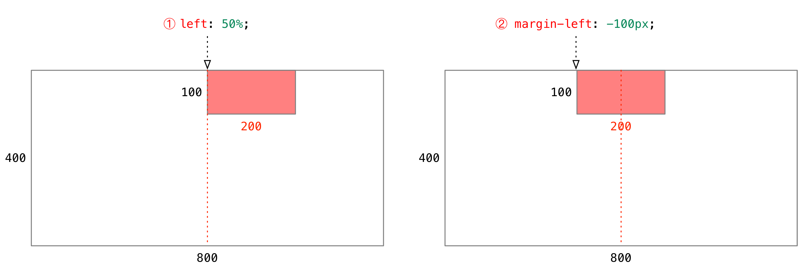

1. `left: 50%;`：让**盒子的左侧**移动到**父级元素的水平中心位置**；
2. `margin-left: -100px;`：让盒子**向左**移动**自身宽度的一半**。

> 案例演示：相对定位案例。

#### 盒子居中定位示意图

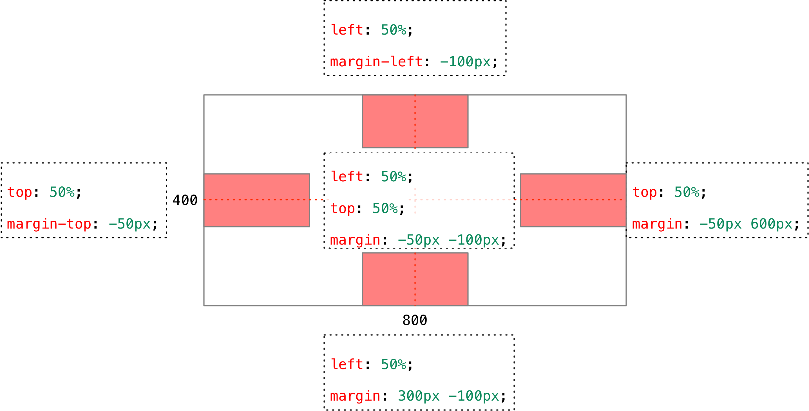

> 课堂练习：实现**盒子左中、右中、中上、中下、中中定位**（5 分钟）。

### 5.2 堆叠顺序（z-index）

**加了定位（position:relative/absolute/fixed）之后，这个盒子就升天了（跑到了最上层），其中相对定位还占着之前的标准流位置，另外两个完全脱离了标准流。**

在使用**定位**布局时，可能会**出现盒子重叠的情况**。

加了定位的盒子，默认**后来者居上**， 后面的盒子会压住前面的盒子。(**按照代码书写顺序从上到下，哪个盒子后加了定位，哪个盒子就在最上层**)

应用 `z-index` 层叠等级属性可以**调整盒子的堆叠顺序**。如下图所示：


`z-index` 的特性如下：

1. **属性值**：**正整数**、**负整数**或 **0**，默认值是 0，数值越大，盒子越靠上；
2. 如果**属性值相同**，则按照书写顺序，**后来居上**；
3. **数字后面不能加单位**。

**注意**：`z-index` 只能应用于**相对定位**、**绝对定位**和**固定定位**的元素，其他**标准流**、**浮动**和**静态定位**无效。

> 案例演示：堆叠顺序。

### 5.3 定位改变display属性

 前面我们讲过， display 是 显示模式， 可以改变显示模式有以下方式:

* 可以用inline-block  转换为行内块
* 可以用浮动 float 默认转换为行内块（类似，并不完全一样，因为浮动是脱标的）
* 绝对定位和固定定位也和浮动类似， 默认转换的特性 转换为行内块。

所以说， 一个行内元素，如果加了**浮动**、**固定定位**和**绝对定位**，不用转换，就可以给这个盒子直接设置宽度和高度等。（因为它已经具有了行内块的特性）

**同时注意：**

**定位的盒子，在很多情况下都需要指定宽度**，比如，在使用固定和绝对定位时，如果盒子中没有内容，需要指定宽度，这是因为使用固定或绝对定位后，盒子会具有行内块的特性，宽度是盒子中内容的宽度，如果盒子中没有内容，那么盒子宽度为0，就看不到了。（这也是许多盒子加了显示模式后消失的原因）

浮动元素、定位元素（绝对，固定）都不会触发塌陷的问题。 （我们以前是用padding border overflow解决的）

也就是说，我们给盒子改为了浮动或者定位（父子元素有一个加了float或者position:absolute/fixed属性），就不会有塌陷的问题了。

对于垂直外边距合并的问题，我们可以给子盒子加上浮动或者定位解决，但是不能给父盒子加，因为父盒子加了以后会脱离标准流，下边的元素还在标准流，会跑到它下边去，就看不到了。


## 6. 综合演练 - 淘宝轮播图


## 7. 定位小结

| 定位模式         | 是否脱标占有位置     | 移动位置基准           | 模式转换（行内块） | 使用情况                 |
| ---------------- | -------------------- | :--------------------- | ------------------ | ------------------------ |
| 静态static       | 不脱标，正常模式     | 正常模式               | 不能               | 几乎不用                 |
| 相对定位relative | 不脱标，占有位置     | 相对自身位置移动       | 不能               | 基本单独使用             |
| 绝对定位absolute | 完全脱标，不占有位置 | 相对于定位父级移动位置 | 能                 | 要和定位父级元素搭配使用 |
| 固定定位fixed    | 完全脱标，不占有位置 | 相对于浏览器移动位置   | 能                 | 单独使用，不需要父级     |

**注意**：

1. **边偏移**需要和**定位模式**联合使用，**单独使用无效**；
2. `top` 和 `bottom` 不要同时使用；
3. `left` 和 `right` 不要同时使用。

##  8.学成网定位总结添加

一个小技巧:

 

## 9. 网页布局总结

一个完整的网页，有标准流 、 浮动 、 定位 一起完成布局的。每个都有自己的专门用法。

#### 1). 标准流 

可以让盒子上下排列 或者 左右排列的

#### 2). 浮动

可以让多个块级元素一行显示  或者 左右对齐盒子   浮动的盒子就是按照顺序左右排列 

#### 3). 定位

定位最大的特点是有层叠的概念，就是可以让多个盒子 前后 叠压来显示。 但是每个盒子需要测量数值。

# CSS高级技巧

**目标**

* 理解
  * 能说出元素显示隐藏最常见的写法
  * 能说出精灵图产生的目的
  * 能说出去除图片底侧空白缝隙的方法
* 应用
  * 能写出最常见的鼠标样式
  * 能使用精灵图技术
  * 能用滑动门做导航栏案例

## 1. 元素的显示与隐藏

- 目的

  让一个元素在页面中消失或者显示出来

- 场景

  类似网站广告，当我们点击关闭就不见了，但是我们重新刷新页面，会重新出现！

### 1.1 display 显示（重点）

- display 设置或检索对象是否及如何显示。

  ~~~
  display: none 隐藏对象
  
  display：block 除了转换为块级元素之外，同时还有显示元素的意思。
  ~~~

- 特点： 隐藏之后，**不保留原有位置**。

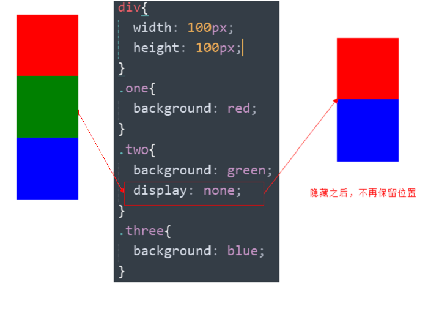

实际开发场景：

> 配合后面js做特效，比如下拉菜单，原先没有，鼠标经过，显示下拉菜单， 应用极为广泛

### 1.2 visibility 可见性 (了解)

- 设置或检索是否显示对象。

  ~~~
  visibility：visible ; 　对象可视
  
  visibility：hidden; 　  对象隐藏
  ~~~

- 特点： 隐藏之后，继续保留原有位置。（停职留薪）


### 1.3 overflow 溢出(重点)

- 检索或设置**当对象的内容超过其指定高度及宽度时如何管理**内容。 


| 属性值      | 描述                                       |
| ----------- | ------------------------------------------ |
| **visible** | 不剪切内容也不添加滚动条                   |
| **hidden**  | 不显示超过对象尺寸的内容，超出的部分隐藏掉 |
| **scroll**  | 不管超出内容与否，总是显示滚动条           |
| **auto**    | 超出自动显示滚动条，不超出不显示滚动条     |

 

实际开发场景：

1. 清除浮动
2. 隐藏超出内容，隐藏掉,  不允许内容超过父盒子。

###  1.4 显示与隐藏总结

| 属性           | 区别                     | 用途                                                         |
| -------------- | ------------------------ | ------------------------------------------------------------ |
| **display**    | 隐藏对象，**不保留位置** | 配合后面js做特效，比如下拉菜单，原先没有，鼠标经过，显示下拉菜单， 应用极为广泛 |
| **visibility** | 隐藏对象，**保留位置**   | 使用较少                                                     |
| **overflow**   | 只是隐藏超出大小的部分   | 1. 可以清除浮动 2. 保证盒子里面的内容不会超出该盒子范围      |

## 2. CSS用户界面样式

- 所谓的界面样式， 就是更改一些用户操作样式，以便提高更好的用户体验。
  - 更改用户的鼠标样式 (滚动条因为兼容性非常差，我们不研究) 
  - 表单轮廓等。
  - 防止表单域拖拽

### 2.1 鼠标样式cursor

 设置或检索在对象上移动的鼠标指针采用何种系统预定义的光标形状。

| 属性值          | 描述       |
| --------------- | ---------- |
| **default**     | 小白  默认 |
| **pointer**     | 小手       |
| **move**        | 移动       |
| **text**        | 文本       |
| **not-allowed** | 禁止       |

 鼠标放我身上查看效果哦：

```html
<ul>
  <li style="cursor:default">我是小白</li>
  <li style="cursor:pointer">我是小手</li>
  <li style="cursor:move">我是移动</li>
  <li style="cursor:text">我是文本</li>
  <li style="cursor:not-allowed">我是文本</li>
</ul>
```

### 2.2 轮廓线 outline

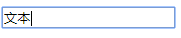

 轮廓线是绘制于元素周围的一条线，位于边框边缘的外围，可起到突出元素的作用。 

input标签默认都有轮廓线

```css
 outline : outline-color ||outline-style || outline-width 
```

 我们一般不关心怎么设置，因为我们平时都是去掉轮廓线的。 

最直接的写法是 ：  outline: 0;   或者  outline: none;

```html
 <input  type="text"  style="outline: 0;"/>
```

### 2.3 防止拖拽文本域resize


实际开发中，我们文本域右下角是不可以拖拽： 

```html
<textarea  style="resize: none;"></textarea>
```

### 2.4 用户界面样式总结

| 属性         | 用途                 | 用途                                                         |
| ------------ | -------------------- | ------------------------------------------------------------ |
| **鼠标样式** | 更改鼠标样式cursor   | 样式很多，重点记住 pointer                                   |
| **轮廓线**   | 表单默认outline      | outline 轮廓线，我们一般直接去掉，border是边框，我们会经常用 |
| 防止拖拽     | 主要针对文本域resize | 防止用户随意拖拽文本域，造成页面布局混乱，我们resize:none    |

## 3. vertical-align 垂直对齐

- 有宽度的块级元素居中对齐，是margin: 0 auto;
- 让文字居中对齐，是 text-align: center;

但是我们从来没有讲过有垂直居中的属性。

vertical-align 垂直对齐，它只针对于**行内元素**或者**行内块元素**，


```css
vertical-align : baseline |top |middle |bottom 
```

设置或检索对象内容的垂直对其方式。

- 注意：

  **vertical-align 不影响块级元素中的内容对齐**，它只针对于**行内元素**（  inline-level element ）, 说白了就是display属性值为`inline`、`inline-block`、`inline-table`另加一个`table-cell`的元素。 

  行内元素 （inline-level elements）在一行中一个挨一个地排列，一旦当前行放不下了，就在它下方创建一个新行，所有这些行都是所谓的**行盒（line box）**，用来包住这一行的所有内容。 **行盒baseline就是它里边最后一个没有设置任何对齐方式的inline-level box（内联级盒子元素）的baseline 。**
  
  **通常用来控制 图片/表单 与 文字 的对齐**。
  
  默认的对齐方式是基线对齐，而基线的位置并不是固定的：
  
  - **inline**，文本等内联元素的baseline，是里面文本字母x的下边缘线（即使没有字母x，可以想象文本中有一个字母x）(字符g的下边缘是底线) 
  
  - **inline-block**，内联块元素baseline位置的确定规则又分为以下三种（baseline位置参照下图）：
  
    （1） inline-block元素盒子里，**没有内容**是一个空的盒子时(`img`标签也属于这种情况)。baseline位置就是该盒子margin-bottom的底边界（如果没有margin-bottom值，就是盒子的底边界值）。如下图左侧div
  
    （2）inline-block元素盒子里，**有内容元素，并且overflow属性值为visible时(默认值)**，那么该盒子的baseline位置就是里面**最后一个内容元素**的baseline。如下图中间div
  
    （3）inline-block元素盒子里，**有内容元素，并且overflow属性值为非visible时 (比如overflow:hidden)，**那么该盒子的baseline位置就是该盒子margin-bottom的底边界。如下图右侧div


 **设置内联（行内）元素的vertical-align属性，并没有改变该元素的baseline位置（事实上，内联元素的baseline位置是一直不变的），改变的只是与父元素对齐的方式(默认与父元素的基线对齐)，父元素的基线是会变的，是盒子中 对齐方式为基线（没有设置对齐方式）的内联盒子中 基线最靠下 的那一个**：

top： 子元素盒子的顶部（包括margin-top）相对行盒子的顶部对齐 

bottom ： 子元素盒子的底部（包括margin-bottom）和行盒子的底部对齐 

middle： 让子元素盒子垂直中点与行盒子的baseline+字母‘x'高度的一半对齐 

`具体参考文章https://zhuanlan.zhihu.com/p/28626505`

### 3.1 图片、表单和文字对齐

我们前边已经知道了，行内元素默认对齐方式为基线对齐，下边我们接着来看一下不同对齐方式的效果。

 


### 3.2 去除图片底侧空白缝隙


- 原因：

  图片或者表单等行内块元素，他的基线会和父级盒子的基线对齐。(行框盒子内部都有一个看不见的字母x，x和图片底部对齐，但是x底部还有基线到底线的距离，所以会多出缝隙)

  但是因为图片的基线就是它的底线，所以图片底侧会有一个空白缝隙。

- 解决的方法就是：  

  - 给img vertical-align:middle | top| bottom等等。  让图片不要和基线对齐。

  - 给img 添加 display：block; 转换为块级元素就不会存在问题了。


### 3.3 图片在父盒子中垂直居中
父盒子设置line-height和高度一样，font-size设置为0
图片设置vertical-align:middle

参考文章https://www.cnblogs.com/cpt666/p/6718643.html

##  4. 溢出的文字省略号显示

###  4.1 white-space

- white-space设置或检索对象内文本显示方式。通常我们使用于强制一行显示内容 

~~~
white-space:normal ；默认处理方式

white-space:nowrap ；强制在同一行内显示所有文本，直到文本结束或者遭遇br标签对象才换行。
~~~

###  4.2 text-overflow 文字溢出

- 设置或检索是否使用一个省略标记（...）标示对象内文本的溢出

~~~
text-overflow : clip ；不显示省略标记（...），而是简单的裁切 

text-overflow：ellipsis ； 当对象内文本溢出时显示省略标记（...）

~~~

**注意**：

一定要首先强制一行内显示，再次和overflow属性  搭配使用


### 4.3 总结三步曲

~~~css
  /*1. 先强制一行内显示文本*/
      white-space: nowrap;
  /*2. 超出的部分隐藏*/
      overflow: hidden;
  /*3. 文字用省略号替代超出的部分*/
      text-overflow: ellipsis;

~~~

##  5. CSS精灵技术（sprite) 重点

###  5.1 为什么需要精灵技术


图所示为网页的请求原理图，当用户访问一个网站时，需要向服务器发送请求，网页上的每张图像都要经过一次请求才能展现给用户。

然而，一个网页中往往会应用很多小的背景图像作为修饰，当网页中的图像过多时，服务器就会频繁地接受请求发送背景图，这将大大降低页面的加载速度。

**pink老师告诉你我们为什么需要精灵技术：**

>  **为了有效地减少服务器接受请求的次数，提高页面的加载速度。**

出现了CSS精灵技术（也称CSS Sprites、CSS雪碧）。

### 5.2 精灵技术讲解

CSS 精灵其实是将网页中的一些**背景图**像整合到一张大图中（精灵图），各个网页元素通常只需要精灵图中不同位置的某个小图，精确定位到精灵图中的某个小图即可。


这样，当用户访问该页面时，只需向服务发送一次请求，网页中的背景图像即可全部展示出来。

我们需要使用CSS的

* background-image
* background-repeat
* background-position
* 其中最关键的是使用background-position 属性精确地定位。

### 5.3 精灵技术使用的核心总结

首先我们知道，**css精灵技术主要针对于背景图片，插入的图片img 是不需要这个技术的。**

1. 精确测量，每个小背景图片的**大小**和 **位置**。
2. 给盒子指定小背景图片时， 背景定位基本都是负值。（图片相对盒子走是正的，盒子相对图片走是负的 ）

### 5.4 制作精灵图(了解)

CSS 精灵其实是将网页中的一些背景图像整合到一张大图中（精灵图），那我们要做的，就是把小图拼合成一张大图。

大部分情况下，精灵图都是网页美工做。

```
我们精灵图上放的都是小的装饰性质的背景图片。 插入图片不能往上放。
我们可以横向摆放也可以纵向摆放，但是每个图片之间留有适当的空隙
在我们精灵图的最低端，留一片空隙，方便我们以后添加其他精灵图。

```

结束语：   小公司，背景图片很少的情况，没有必要使用精灵技术，维护成本太高。 如果是背景图片比较多，可以建议使用精灵技术。

##  6. 滑动门

先来体会下现实中的滑动门,或者你可以叫做推拉门：


###  滑动门出现的背景

制作网页时，为了美观，常常需要为网页元素设置特殊形状的背景，比如微信导航栏，有凸起和凹下去的感觉，最大的问题是**里面的字数不一样多**，咋办？


为了使各种特殊形状的背景能够**自适应元素中文本内容的多少**，出现了CSS滑动门技术。它从新的角度构建页面，**使各种特殊形状的背景能够自由拉伸滑动，以适应元素内部的文本内容**，可用性更强。 最常见于各种导航栏的滑动门。

http://weixin.qq.com/

###  核心技术

核心技术就是利用CSS精灵（主要是背景位置）和 盒子padding撑开宽度, 以便能适应不同字数的导航栏。

一般的经典布局都是这样的：

```html
<ul>
    <li>
        <a href="#">
            <span>首页</span>
        </a>
    </li>
    <li>
        <a href="#">
            <span>公司新闻</span>
        </a>
    </li>
</ul>
```

css样式

~~~css
li {
    list-style: none;
    float: left;
}
a,
span {
    /*因为我们是滑动门，左右推拉 跟文字内容多少有关系，需要用文字撑开盒子， 就要用到行内块*/
    display: inline-block;
    height: 33px;
    line-height: 33px;
}
/*1. a 是 设置 左侧 背景 （左门）*/
a {
    background: url(images/to.png) no-repeat;
    margin: 100px;
    padding-left: 15px;
    color: #fff;
}
/*2. span 是设置 右侧 背景 （右门）*/
a span {
    /*一定注意 span 需要背景图片 右对齐*/
    background: url(images/to.png) no-repeat right top;
    padding-right: 15px;
}
/*3 因为整个导航栏都是 链接 所以 a 要包含 span */
~~~


总结： 

1. a 设置 背景左侧，padding撑开合适宽度。    
2. span 设置背景右侧(span的背景图片设置右对齐(right top)， padding撑开合适宽度 剩下由文字继续撑开宽度。
3. 之所以a包含span就是因为 整个导航都是可以点击的。


## 7. 拓展@

### 7.1 margin负值之美

#### 1). 负边距+定位：水平垂直居中

咱们前面讲过， 一个绝对定位的盒子， 利用  父级盒子的 50%，  然后 往左(上) 走自己宽度的一半 ，可以实现盒子水平(垂直)居中。除此之外，我们还可以给margin设置负值，来实现类似表格中边框合并的效果。

#### 2). 压住盒子相邻边框 

**浮动**的盒子会水平贴在一起，若他们都有边框，则他们相邻位置的边框会变粗，这时我们可以给他们设置margin-left: -1px（边框线宽度）来解决这个问题。

假设有两个盒子，左边是A，右边是B，A有1px的有边框，B有1px的左边框，所以他们中间边框会很粗，我们给A、B都设置margin-left: 1px，这时A首先会向左走1px，而因为A，B都是浮动的，A走后，B会继续紧贴着A（此时他们中间的边框还是很粗），而他还有一个自己的margin-left: -1px属性，所以他会继续向左走1px，压住A的右边框。


这时候，如果我们想设置**鼠标经过盒子边框变色**，会出现问题，因为有的盒子**边框是被旁边盒子通过margin负值压住**的，我们用两种解决方法，一个是**给鼠标经过的盒子设置相对定位**（定位的盒子在最上层，绝对定位不占据标准流空间，后边的盒子会跑到定位盒子后边不满足要求），还有就是**给每个盒子都设置相对定位，给鼠标经过的盒子设置z-index**（用于盒子中有元素当鼠标经过需要利用绝对定位显示出来时）

```html
<body>
	<div></div>
	<div></div>
	<div></div>
	<div></div>
	<div></div>
	<div></div>
	<div></div>
	<div></div>
	<div></div>
	<div></div>
	<div></div>
	<div></div>
	<div></div>
	<div></div>
	<div></div>
	<div></div>
	<div></div>
	<div></div>
</body>
```

```css
div {
    position: relative;
    /*浮动的盒子是紧贴在一起的*/
    float: left;
    width: 200px;
    height: 300px;
    border: 1px solid #ccc;
    margin-left: -1px;
    margin-top: -1px;
}
/*鼠标经过div*/
div:hover {
    /*我要让鼠标经过的当前这个div 升到最高处来就好了*/
    border: 1px solid #f40;
    /*都是定位的盒子，我们通过z-index 来实现层级关系*/
    z-index: 1;

}
```

### 7.2 CSS三角形之美

 实现原理：

首先来看一下我们平时为一个盒子添加border的情况：

```css
div {
  width: 100px;
  height:100px;
  border: 4px solid blue;
}
```

效果如下：


这是我们平时使用 border 最常见的场景——往往只给border一个较小的宽度；然而这样的日常用法会让我们对border的形成方式产生误解，即认为border是由四个矩形边框拼接而成的。

然而事实并不是如此。实际上，border是由三角形组合而成的。为了说明这个问题，我们可以增大border的宽度，并为他们设置不同的颜色：

```css
div {
  width: 100px;
  height:100px;
  border: 40px solid;
  border-color: blue red yellow pink;
}
```

效果如下：


由此我们可以看出，border确实是由三角形组成的。那么我们把元素的内容尺寸设为0会发生什么呢？

```css
div {
  width:0;
  height:0;
  border: 40px solid;
  border-color: blue red yellow pink;
}
```

效果如下：


这样我们就得到了四个三角形，如果想要其中一个，只需要把另外三个的颜色都设为 transparent:

```css
div {
  width:0;
  height:0;
  border: 40px solid;
  border-color: transparent red transparent transparent;
}
```

效果如下：


不过其他隐藏的左边框依然占据着空间，因此我们可以把左边框的 border-width 设为 0 ：

```css
div {
  width:0;
  height:0;
  border-style: solid;
  border-width: 40px 40px 40px 0;
  border-color: transparent red transparent transparent;
} 
```

最后，为了不同浏览器的兼容性，加上line-height:0;和font-size:0;

~~~css
 div {
 	  width:0;
      height:0;
      border-style: solid;
      border-width: 40px 40px 40px 0;
      border-color: transparent red transparent transparent;
      line-height:0；
      font-size: 0;
 }
~~~

1. 我们用css 边框可以模拟三角效果
2. 宽度高度为0
3. 我们4个边框都要写， 只保留需要的边框颜色，其余的都改为 transparent 透明就好了（三角形一出现就是4个，**可以通过改变边框宽度的方式实现单独出现1个三角形**）
4. 为了照顾兼容性 低版本的浏览器，加上 font-size: 0;  line-height: 0;

代码示例：
```html
<p></p>
```

```css
/*淘宝的效果*/
p {
    width: 0;
    height: 0;
    line-height: 0;
    font-size: 0;
    border-style: solid;
    border-width: 5px 0 5px 7px;
    border-color:  transparent transparent transparent red;

}
```

一个方盒子上边有一个三角形效果：

```html
<div>
    <p></p>
</div>
```

```css
div {
    position: relative;
    width: 200px;
    height: 100px;
    background-color: pink;
    margin: 100px auto;
}
p {
    position: absolute;
    top: -40px;
    left: 50%;
    margin-left: -20px;
    width: 0;
    height: 0;
    border-style: solid;
    border-width: 20px;
    border-color: transparent transparent pink transparent;
    font-size: 0;
    line-height: 0;
}
```

## 8. 网站ico图标

一般 **网站根路径后边加上/favicon.ico都可以查看到网站图标**

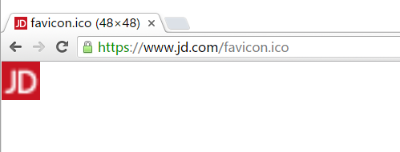 

### 1). 使用ico图标

* 首先把favicon.ico 这个图标放到根目录下。

* 再html里面，  head 之间 引入 代码。

  > <link rel="shortcut icon" href="favicon.ico"  type="image/x-icon"/>     

### 2). 制作ico图标

我们可以自己做的图片，转换为 ico图标，以便放到我们站点里面。

方法步骤：

* 首先把我们想要的切成图片。
* 要把图片转换为 ico 图标，我们借助于第三方转换网站：   http://www.bitbug.net/。  比特虫

总结：

```
<link rel="shortcut icon" href="favicon.ico"  type="image/x-icon"/>     
```

注意： 

1. 她（它）是显示在浏览器中的网页图标。
2. 它是图标形式，不是一个图片
3. 位置是放到 head 标签中间。
4. 后面的type="image/x-icon"  属性可以省略。（我相信你也愿意省略。）
5. **为了兼容性，请将favicon.ico 这个图标放到根目录下。**

## 9. 网站优化三大标签

SEO是由英文Search Engine Optimization缩写而来， 中文意译为“搜索引擎优化”！

常见的搜索引擎，比如百度，谷歌，雅虎，搜狗等等..

SEO是指通过对网站进行站内优化、网站结构调整、网站内容建设、网站代码优化等)和站外优化，从而提高网站的关键词排名以及公司产品的曝光度。 简单的说就是，把产品做好，搜索引擎就会介绍客户来。  

 我们现在阶段主要进行站内优化。网站优化，我们应该要懂。。。

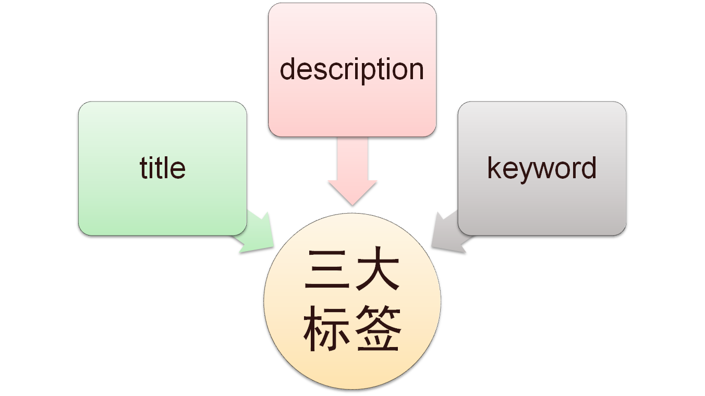

#### 1). 网页title 标题

title具有不可替代性，是我们的内页第一个重要标签，是搜索引擎了解网页的入口，和对网页主题归属的最佳判断点。


建议：

首页标题：网站名（产品名）- 网站的介绍    

例如：

品优购-综合网购首选-正品低价、品质保障、配送及时、轻松购物！

小米商城 - 小米5s、红米Note 4、小米MIX、小米笔记本官方网站

#### 2. Description  网站说明

对于关键词的作用明显降低，但由于很多搜索引擎，仍然大量采用网页的MATA标签中描述部分作为搜索结果的“内容摘要”。 就是简要说明我们网站的主要做什么的。
我们提倡，Description作为网站的总体业务和主题概括，多采用“我们是…”“我们提供…”“×××网作为…”“电话：010…”之类语句。

品优购网：

```
<meta name="description" content="品优购JD.COM-专业的综合网上购物商城,销售家电、数码通讯、电脑、家居百货、服装服饰、母婴、图书、食品等数万个品牌优质商品.便捷、诚信的服务，为您提供愉悦的网上购物体验!" />
```

注意点：

1. 描述中出现关键词，与正文内容相关，这部分内容是给人看的，所以要写的很详细，让人感兴趣， 吸引用户点击。
2. 同样遵循简短原则，字符数含空格在内不要超过 120  个汉字。
3. 补充在 title  和 keywords  中未能充分表述的说明.
4. 用英文逗号 关键词1,关键词2

```
<meta name="description" content="小米商城直营小米公司旗下所有产品，囊括小米手机系列小米MIX、小米Note 2，红米手机系列红米Note 4、红米4，智能硬件，配件及小米生活周边，同时提供小米客户服务及售后支持。" />
```

#### 3. Keywords 关键字

Keywords是页面关键词，是搜索引擎关注点之一。Keywords应该限制在6～8个关键词左右，电商类网站可以多 少许。

品优购网：

```
<meta name="Keywords" content="网上购物,网上商城,手机,笔记本,电脑,MP3,CD,VCD,DV,相机,数码,配件,手表,存储卡,品优购" />
```

小米网：

```
<meta name="keywords" content="小米,小米6,红米Note4,小米MIX,小米商城" />
```

####  4). 总结

1. 我们的网页要做的优秀，符合搜索引擎的要求，才可以让搜索引擎优先显示我们的网页。  

所以我们的网站要做很多的优化， 其中就有这三大标签。

2. 一般情况下，三大标签里面的优化词，都是专门的优化人员写的，我们大概了解一下规范就可以了。
3. 我们的主要任务是，能写出这三大标签， 然后把优化人员给我们的内容，添加到里面。


## 10. 字体图标

图片是有诸多优点的，但是缺点很明显，比如图片不但增加了总文件的大小，还增加了很多额外的"http请求"，这都会大大降低网页的性能的。更重要的是图片不能很好的进行“缩放”，因为图片放大和缩小会失真。 我们后面会学习移动端响应式，很多情况下希望我们的图标是可以缩放的。此时，一个非常重要的技术出现了，这就是字体图标（iconfont).

###  1.  字体图标优点

字体图标 本质就是 字体文件

```
可以做出跟图片一样可以做的事情,改变透明度、旋转度，等..
但是本质其实是文字，可以很随意的改变颜色、产生阴影、透明效果等等...
本身体积更小，但携带的信息并没有削减。
几乎支持所有的浏览器
移动端设备必备良药...
```

### 2.   字体图标使用流程

总体来说，字体图标按照如下流程：


### 3. 设计字体图标

假如图标是我们公司单独设计，那就需要第一步了，这个属于UI设计人员的工作， 他们在 illustrator 或 Sketch 这类矢量图形软件里创建 icon图标， 比如下图：


  之后保存为svg格式，然后给我们前端人员就好了。 

  其实第一步，我们不需要关心，只需要给我们这些图标就可以了，如果图标是大众的，网上本来就有的，可以直接跳过第一步，进入第三步。

### 4. 上传生成字体包

   当UI设计人员给我们svg文件的时候，我们需要转换成我们页面能使用的字体文件， 而且需要生成的是兼容性的适合各个浏览器的。

​    推荐网站： http://icomoon.io

* icomoon字库

IcoMoon成立于2011年，推出的第一个自定义图标字体生成器，它允许用户选择他们所需要的图标，使它们成一字型。 内容种类繁多，非常全面，唯一的遗憾是国外服务器，打开网速较慢。

* 阿里icon font字库

http://www.iconfont.cn/

这个是阿里妈妈M2UX的一个icon font字体图标字库，包含了淘宝图标库和阿里妈妈图标库。可以使用AI制作图标上传生成。 一个字，免费，免费！！

### 5. 下载兼容字体包

上一步上传完毕， 网站会给我们把UI做的svg图片转换为我们的字体格式， 然后下载下来就好了

当然，如果我们不需要自己专门的图标，而是想找网上现成的图标使用，以上2步可以直接省略了， 直接到刚才的网站上找喜欢的图标下载即可。

下边以icomoon为例：


### 6. 字体引入到HTML

从网站下载后得到一个压缩包，里边就包含了我们的字体图标（其实是字体文件）等许多我们需要用到的东西（**这个压缩包非常重要，需要一直保存，因为字体图标的更新也需要用到这个压缩包**），我们需要引入到我们页面中。

1. 首先把 fonts文件夹放入我们项目 根目录 下 。

   

   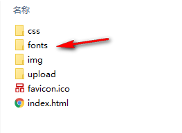

   

   fonts里边不同的字体文件格式是适配不同浏览器的
   
   ##### 2. 在html标签内里面添加结构

   打开压缩包中demo.html文件，复制如下图标到页面中：

    
   
   ```css
    <span></span>  
   ```
   
   ##### 3. 在样式里面声明字体： 告诉别人我们自己定义的字体
   
   ##### 一定注意字体文件路径的问题（两个src）
   
   ```css
   @font-face {
    font-family: 'icomoon';
     src:  url('fonts/icomoon.eot?7kkyc2');
    src:  url('fonts/icomoon.eot?7kkyc2#iefix') format('embedded-opentype'),
       url('fonts/icomoon.ttf?7kkyc2') format('truetype'),
       url('fonts/icomoon.woff?7kkyc2') format('woff'),
       url('fonts/icomoon.svg?7kkyc2#icomoon') format('svg');
     font-weight: normal;
     font-style: normal;
   }
   ```
   
   ##### 4. 给盒子使用字体
   
   ```css
   span {
   		font-family: "icomoon";
   	}
   ```

### 7. 追加字体图标

如果工作中，原来的字体图标不够用了，我们需要添加新的字体图标，但是原来的不能删除，继续使用，此时我们需要这样做：

把压缩包里面的selection.json 上传到网站中（selection.json记录了我们之前下载过的字体图标），然后，选中自己想要的新图标，再次产生字体，下载压缩包，替换原来文件（替换项目中的fonts文件夹）即可。

   

### 拓展@ 常见字体格式

不同浏览器所支持的字体格式是不一样的，我们有必要了解一下有关字体格式的知识。

1. TureType(.ttf)格式

.ttf字体是Windows和Mac的最常见的字体，是一种RAW格式，支持这种字体的浏览器有IE9+、Firefox3.5+、Chrome4+、Safari3+、Opera10+、iOS Mobile、Safari4.2+；

1. OpenType(.otf)格式

.otf字体被认为是一种原始的字体格式，其内置在TureType的基础上，支持这种字体的浏览器有Firefox3.5+、Chrome4.0+、Safari3.1+、Opera10.0+、iOS Mobile、Safari4.2+；

1. Web Open Font Format(.woff)格式

woff字体是Web字体中最佳格式，他是一个开放的TrueType/OpenType的压缩版本，同时也支持元数据包的分离，支持这种字体的浏览器有IE9+、Firefox3.5+、Chrome6+、Safari3.6+、Opera11.1+；

1. Embedded Open Type(.eot)格式

.eot字体是IE专用字体，可以从TrueType创建此格式字体，支持这种字体的浏览器有IE4+；

1. SVG(.svg)格式

.svg字体是基于SVG字体渲染的一种格式，支持这种字体的浏览器有Chrome4+、Safari3.1+、Opera10.0+、iOS Mobile Safari3.2+；

了解了上面的知识后，我们就需要为不同的浏览器准备不同格式的字体，通常我们会通过字体生成工具帮我们生成各种格式的字体，因此无需过于在意字体格式间的区别差异。

### HTML5 CSS3进阶

###### 一、什么是 `HTML5`

1. `HTML5` 的概念与定义 

   - 定义：`HTML5` 定义了 `HTML` 标准的最新版本，是对 `HTML` 的第五次重大修改，号称下一代的 `HTML` 
   - 两个概念：
     - 是一个新版本的 `HTML` 语言，定义了新的标签、特性和属性
     - 拥有一个强大的技术集，这些技术集是指： `HTML5` 、`CSS3` 、`javascript`, 这也是广义上的 `HTML5`

2. `HTML5` 拓展了哪些内容

   - 语义化标签
   - 本地存储
   - 兼容特性
   - `2D`、`3D` 
   - 动画、过渡
   - `CSS3` 特性
   - 性能与集成

3. `HTML5 ` 的现状

     绝对多数新的属性，都已经被浏览器所支持，最新版本的浏览器已经开始陆续支持最新的特性，

     总的来说：`HTML5` 已经是大势所趋

###### 二、`HTML5 ` 新增语义化标签

以前布局，我们基本用div（span）来做，div（span）对于搜索引擎来说是没有语义的

 1. 什么是语义化

 2. 新增了那些语义化标签

    - `header`   ---  头部标签
    - `nav`        ---  导航标签
    - `article` ---   内容标签
    - `section` ---   块级标签
    - `aside`     ---   侧边栏标签
    - `footer`   ---   尾部标签

    

    

 3. 使用语义化标签的注意

    - 语义化标签主要针对搜索引擎
    - 新标签可以使用一次或者多次
    - **在 `IE9` 浏览器中，需要把语义化标签都转换为块级元素**
    - 语义化标签，**在移动端支持比较友好，我们在移动端更喜欢使用这些标签**
    - 另外，`HTML5` 新增的了很多的语义化标签，随着课程深入，还会学习到其他的

###### 三、多媒体音频标签

1. 多媒体标签有两个，分别是

   - 音频  -- `audio`
   - 视频  -- `video`

2. `audio` 标签说明

   - 可以在不使用标签的情况下，也能够原生的支持音频格式文件的播放，
   - 但是：播放格式是有限的

3. audio 支持的音频格式

   - audio 目前支持三种格式

     

   

4. audio 的参数

   

   

5、audio 代码演示

```html
<body>
  <!-- 注意：在 chrome 浏览器中已经禁用了 autoplay 属性 -->
  <!--controls是controls="controls"的缩写-->
  <!-- <audio src="./media/snow.mp3" controls autoplay></audio> -->

  <!-- 
    因为不同浏览器支持不同的格式，所以我们采取的方案是 我们为这个音频准备多个文件格式
	如果浏览器支持第一个source的格式，那么会直接播放，不支持继续看是否支持后边的source中的格式，都不支持，我们输出提示信息
   -->
  <audio controls>
    <source src="./media/snow.mp3" type="audio/mpeg" />
	<source src="./media/snow.ogg" type="audio/ogg" />
	您的浏览器暂时不支持此 音频
  </audio>
</body>
```

###### 四、多媒体视频标签

1. video 视频标签

   - 目前支持三种格式

   

   

2. 语法格式

   ```html
   <video src="./media/video.mp4" controls="controls"></video>
   ```

3. video 参数

   

   

4. video 代码演示

   ```html
   <body>
     <!-- <video src="./media/video.mp4" controls="controls"></video> -->
   
     <!-- 谷歌浏览器禁用了自动播放功能，如果想自动播放，需要添加 muted 属性（autoplay和muted成对使用） -->
     <!-- 适配不同浏览器  -->
     <!-- poster一般用做控件（controls）控制视频播放时，未播放时的占位图片，设置autoplay的话poster会失效-->
     <video  autoplay muted loop poster="./media/pig.jpg">
       <source src="./media/video.mp4" type="video/mp4">
       <source src="./media/video.ogg" type="video/ogg">
     </video>
   </body>
   ```

5. 多媒体标签总结

   - 音频标签与视频标签使用基本一致
   - **多媒体标签在不同浏览器下情况不同，存在兼容性问题**
   - 谷歌浏览器把音频和视频标签的自动播放都禁止了
   - 谷歌浏览器中视频添加 muted 标签和autoplay配合使用可以自动播放，音频不可以
   - 视频标签是重点，我们经常设置自动播放，不使用controls控件，循环播放，并设置视频的width和height
   - 注意：重点记住使用方法以及自动播放即可，其他属性可以在使用时查找对应的手册

###### 五、新增 input 表单标签


**input默认是有一个边框的，可以利用border:0去除边框**

###### 六、新增input表单属性


###### 七、`CSS3 ` 属性选择器(上)

1. 什么是 `CSS3`

   - 在 `CSS2` 的基础上拓展、新增的样式

2. `CSS3` 发展现状

   - 移动端支持优于 `PC` 端
   - `CSS3` 目前还草案，在不断改进中
   - `CSS3` 相对 `H5`，应用非常广泛

3. 属性选择器列表，**属性选择器的出现让我们不用给想选中的元素添加指定的类名**，**简化开发**（E是标签名）

   

   

4. 属性选择器代码演示

   ```css
   button {
     cursor: pointer;
   }
   /*选择的是 既是button又有disabled这个属性的元素*/
   button[disabled] {
     cursor: default
   }
   ```

5. 属性选择器优先级

   **类选择器、属性选择器、伪类选择器的权重都是10**

###### 八、`CSS3 ` 属性选择器(下)

1. 代码演示

   ```css
   /*属性值可以加引号也可以不加引号 */
   input[type=search] {
     color: skyblue;
   }
   
   span[class^=black] {
     color: lightgreen;
   }
   
   span[class$=black] {
     color: lightsalmon;
   }
   
   span[class*=black] {
     color: lightseagreen;
   }
   ```

###### 九、结构伪类选择器

1. 属性列表

   

   

2. 代码演示

   ```css
   ul li:first-child {
     background-color: lightseagreen;
   }
   
   ul li:last-child {
     background-color: lightcoral;
   }
   
   ul li:nth-child(3) {
     background-color: aqua;
   }
   ```

###### 十、`nth-child` 参数详解

1. nth-child 详解

   - 注意：本质上就是选中第几个子元素

   - **n 可以是数字、关键字、公式**

   - n 如果是数字，就是选中第几个

   - 常见的关键字有 `even` 偶数、`odd` 奇数

   - 常见的公式如下(**如果 n 是公式，则从 0 开始计算**)

   - 但是不存在或者超出了范围的元素（比如第 0 个元素）会被忽略

   - 选择父元素里边的第n个孩子，不管里边的孩子是否是同一种类型

     

   

2. 代码演示

   ```css
   <style>
     /* 偶数 */
     ul li:nth-child(even) {
       background-color: aquamarine;
     }
   
     /* 奇数 */
     ul li:nth-child(odd) {
       background-color: blueviolet;
     }
   
     /*n 是公式，从 0 开始计算 */
     ul li:nth-child(n) {
       background-color: lightcoral;
     }
   
     /* 偶数 */
     ul li:nth-child(2n) {
       background-color: lightskyblue;
     }
   
     /* 奇数 */
     ul li:nth-child(2n + 1) {
       background-color: lightsalmon;
     }
   
     /* 第 0 5 10 15... */
     ul li:nth-child(5n) {
       background-color: orangered;
     }
   
     /* n + 5 从第5个开始往后选择 */
     ul li:nth-child(n + 5) {
       background-color: peru;
     }
   
     /* -n + 5 前五个 */
     ul li:nth-child(-n + 5) {
       background-color: tan;
     }
   </style>
   ```

###### 十一、`nth-child` 和  `nt-of-type` 的区别

1. 代码演示

   ```html
   	<div>
           <p>我是一个屁</p>
           <span>我是span</span>
           <span>我是span</span>
           <span>我是span</span>
       </div>
   ```
   
   ```css
   <style>
     div :nth-child(1) {/*div中的第一个子元素*/
       background-color: lightblue;
     }
     div span:nth-child(1) {/*div中的第一个子元素且是span标签（因为div中的第一个子元素是p，所以这个选择器选不到）*/
       background-color: pink;
     } 
     div :nth-child(2) {
       background-color: lightpink;
     }
     div span:nth-of-type(2) {/*div中的第二个span*/
       background-color: lightseagreen;
     }
     div span:nth-of-type(3) {
       background-color: #fff;
     }
   </style>
   ```


2. 区别

   - `nth-child`  选择父元素里面的第几个子元素，不管是第几个类型
   - `nt-of-type`  选择父元素里面的**指定类型**的第几个元素

###### 十二、伪元素选择器

1. 伪类选择器

   

   

2. 伪类选择器注意事项

   - `before` 和 `after` 必须有 `content` 属性
   - `before` 在内容前面，after 在内容后面
   - `before` 和 `after` 创建的是一个元素，但是属于**行内元素**
   - **创建出来的元素在 `Dom` 中查找不到，所以称为伪元素**
   - **伪元素和标签选择器一样，权重为 1**

3. 代码演示

   ```css
   <style>
       div {
         width: 100px;
         height: 100px;
         border: 1px solid lightcoral;
       }
   
       div::after,
       div::before {
         width: 20px;
         height: 50px;
         text-align: center;
         display: inline-block;
       }
       div::after {
         content: '德';
         background-color: lightskyblue;
       }
   
       div::before {
         content: '道';
         background-color: mediumaquamarine;
       }
     </style>
   ```

###### 十三、伪元素的案例

使用div里边嵌套span 和 p及伪元素两种方式实现

```html
	<div>
        <span></span>
    </div>

    <p></p>
```

```css
		@font-face {
            font-family: 'icomoon';
            src: url('fonts/icomoon.eot?cv013x');
            src: url('fonts/icomoon.eot?cv013x#iefix') format('embedded-opentype'), 	  url('fonts/icomoon.ttf?cv013x') format('truetype'), url('fonts/icomoon.woff?cv013x') format('woff'), url('fonts/icomoon.svg?cv013x#icomoon') format('svg');
            font-weight: normal;
            font-style: normal;
        }
        div,
        p {
            position: relative;
            width: 249px;
            height: 35px;
            border: 1px solid red;
        }
        span {
            font-family: 'icomoon';
            position: absolute;
            top: 10px;
            right: 10px;
        }
        p::after {
            content: '\ea50';
            position: absolute;
            top: 10px;
            right: 10px;
            font-family: 'icomoon';
        }
```


实现效果如下：


**在伪元素中使用字体图标就不用复制如下图后边这个看不懂的方框了，直接复制前边的Unicode编码即可，注意要转义**


###### 十四、过渡（`transition`）

过渡（transition)是CSS3中具有颠覆性的特征之一，我们可以在不使用 Flash 动画或 JavaScript 的情况下，当元素从一种样式变换为另一种样式时为元素添加效果。

过渡动画：   是从一个状态 渐渐的过渡到另外一个状态

可以让我们页面更好看，更动感十足，虽然 低版本浏览器不支持（ie9以下版本） 但是不会影响页面布局。

我们现在经常和 :hover 一起 搭配使用。

语法格式:

```
transition: 要过渡的属性  花费时间  运动曲线  何时开始;
```

| 属性                       | 描述                                         | CSS  |
| -------------------------- | -------------------------------------------- | ---- |
| transition                 | 简写属性，用于在一个属性中设置四个过渡属性。 | 3    |
| transition-property        | 规定应用过渡的 CSS 属性的名称。              | 3    |
| transition-duration        | 定义过渡效果花费的时间。默认是 0。           | 3    |
| transition-timing-function | 规定过渡效果的时间曲线。默认是 "ease"。      | 3    |
| transition-delay           | 规定过渡效果何时开始。默认是 0。             | 3    |

* 属性

​    属性就是你想要变化的 css 属性，  宽度高度 背景颜色 内外边距都可以 。**如果想要所有的属性都变化过渡， 写一个all 就可以。**

* 花费时间

  transition-duration  花费时间  单位是秒（必须写单位） 比如 0.5s    这个s单位必须写     

* 运动曲线   默认是 ease

运动曲线示意图：


* 何时开始 

  默认是 0s 立即开始过渡    可以设置延迟触发时间


**案例：**

```css
div {
			width: 200px;
			height: 100px;
			background-color: pink;
			/* transition: 要过渡的属性  花费时间  运动曲线  何时开始; 
    		   有多个过渡效果用逗号隔开
    		*/ 
			transition: width 0.6s ease 0s, height 0.3s ease-in 1s;
			/* transtion写到div里面而不是hover里面 
    		   过渡写到本身上， 谁做动画给
    		*/
}
div:hover { 
    /* 鼠标经过盒子，我们的宽度变为600,高度变为300 */
			width: 600px;
			height: 300px
}
/* 所有属性都变化用all就可以了 后面俩个属性可以省略 这是我们平时最常见的写法
   并不是说写了all 所有属性都必须要改变 而是哪个属性改变了 哪个属性就会有过渡动画
*/
transition: all 0.6s;  
```

transition: all 0.5s;

常见效果：

  按钮变换底色     图片移动      小米效果 （阴影效果）   传智导航栏效果 等等

###### 十五、`2D` 转换之 `translate`

移动盒子的位置有三种方法：定位、外边距Margin和2d转换translate

1. `2D` 转换

   - `2D` 转换是改变标签在二维平面上的位置和形状

   - 移动： `translate`
   - 旋转： `rotate`
   - 缩放： `scale`

2. `translate` 语法

   - x 就是 x 轴上水平移动
   - y 就是 y 轴上水平移动

   ```css
   /* x就是x轴上移动位置 y 就是y轴上移动位置 中间用逗号分隔*/
   transform: translate(x, y)
   /* n代表在x或y轴上移动的位置*/
   transform: translateX(n)
   transfrom: translateY(n)
   
   /*在x坐标，y坐标各移动100px： */
   transform: translate(100px, 100px); 
   /*我们如果只移动x坐标，可以用以下两种写法： */
   /* transform: translate(100px, 0); */
   /* transform: translateX(100px); */
   /*我们如果只移动y坐标 */
   /* transform: translate(0, 100px); */
   /* transform: translateY(100px); */
   ```

3. 重点知识点

   - `2D` 的移动主要是指 水平、垂直方向上的移动
   - `translate` 最大的优点就是不影响其他元素的位置，定位和外边距都会影响。
   - `translate` 中的百分比单位，是相对于本身的宽度和高度来进行计算的（**x轴移动50%是移动盒子自身宽度的50%，y轴是高度**）
   - 行内标签没有效果


###### 十六、让一个盒子水平垂直居中

利用定位和translate来实现

之前我们让一个盒子水平居中垂直居中，可以用定位来做，先让盒子往右（下）走50%，再往左（上）走自己宽度（高度）的一半，但是这样的话，我们需要计算，当盒子本身宽高变化的时候，就会出问题，利用translate，可以解决这个问题

```html
<div>
    <p></p>
</div>
```

```css
div {
    position: relative;
    width: 500px;
    height: 500px;
    background-color: pink;
}

p {
    position: absolute;
    top: 50%;
    left: 50%;
    width: 200px;
    height: 200px;
    background-color: purple;
    /*之前的方法*/
    /* margin-top: -100px;
    margin-left: -100px; */
    /*利用translate的新方法*/
    /* 盒子往左和上走自己宽度（高度）的一半   */
    transform: translate(-50%, -50%);
}
        
```


### H5C3 第二天


###### 一、`2D 转换之旋转（rotate）`

1. rotate 旋转

   - `2D` 旋转指的是让元素在二维平面内顺时针或者逆时针旋转

2. `rotate` 语法

   ```css
   /* 单位是：deg */
   transform: rotate(度数) 
   ```
   
3. 重点知识点

   - `rotate` 里面跟度数，单位是 `deg`
   - 正数代表顺时针旋转，负数代表逆时针
   - 默认旋转的中心点是元素的中心点

4. 代码演示

   ```css
   img:hover {
     transform: rotate(360deg)
   }
   ```

4. 三角
之前我们用字体图标实现的输入框中的三角，就可以用伪元素，边框和旋转来做了，输入框中放一个伪元素，只设置下边框和右边框，然后再旋转，就会出现向下的三角


代码如下：

```html
 <div></div>
```

```css
div {
    position: relative;
    width: 249px;
    height: 35px;
    border: 1px solid #000;
}

div::after {
    content: "";
    /*定位后具有行内块元素的特性，可以设置宽度和高度*/
    position: absolute;
    top: 8px;
    right: 15px;
    width: 10px;
    height: 10px;
    /*两个边框和旋转来实现三角效果*/
    border-right: 1px solid #000;
    border-bottom: 1px solid #000;
    transform: rotate(45deg);
    /*鼠标经过div时三角翻转*/
    transition: all 0.2s;
}
/* 鼠标经过div  里面的三角旋转 */

div:hover::after {
    transform: rotate(225deg);
}
```

###### 二、设置元素transform中心点(transform-origin)

1.  `transform-origin` 基础语法

   ```css
   transform-origin: x y;/*x坐标和y坐标可以*/
   ```

2.  重要知识点
   - **注意后面的参数 x 和 y 用空格隔开**
   - x y 默认旋转的中心点是元素的中心 (50% 50%)，等价于 `center`  `center`
   - 还可以给 x y 设置像素或者方位名词(`top`、`bottom`、`left`、`right`、`center`)

###### 三、旋转中心案例

```html
<div></div>
<div></div>
<div></div>
```

```css
div {
    float: left;
    width: 200px;
    height: 200px;
    border: 1px solid pink;
    overflow: hidden;
    margin: 0 10px;
}

div::after {
    content: "你好";
    display: block;
    width: 100%;
    height: 100%;
    background-color: purple;
    transform-origin: left bottom;
    transform: rotate(180deg);
    transition: all 0.5s;
}

div:hover::after {
    transform: rotate(0);
}
```

###### 四、`2D` 转换之 `scale`

1. `scale` 的作用

   - 用来控制元素的放大与缩小

2. 语法

   ```css
   transform: scale(x, y)
   ```

3. 知识要点
   - **注意，x 与 y 之间使用逗号进行分隔**
   - `transform: scale(1, 1)`: 宽高都放大一倍，相当于没有放大
   - `transform: scale(2, 2)`: 宽和高都放大了二倍
   - `transform: scale(2)`: 如果只写了一个参数，第二个参数就和第一个参数一致
   - `transform: scale(0.5, 0.5)`: 缩小
   - `scale` 相比于修改宽度和高度的最大优势：**可以设置缩放中心点**（同样使用transform-origin来设置），默认以元素中心点缩放（向四周缩放），而且**不影响其他盒子**

4. 代码演示

	```css
	   div:hover {
		   /* 注意，数字是倍数的含义，所以不需要加单位 */
		   /* transform: scale(2, 2) */
	   
		   /* 实现等比缩放，同时修改宽与高 */
		   /* transform: scale(2) */
	   
		   /* 小于 1 就等于缩放*/
		   transform: scale(0.5, 0.5) /*等价于transform: scale(0.5)*/
	   }
	```

###### 五、图片hover放大案例

```html
<div>
    <a href="#"></a>
</div>
<div>
    <a href="#"></a>
</div>
<div>
    <a href="#"></a>
</div>
```

```css
div {
    overflow: hidden;
    float: left;
    margin: 10px;
}

div img {
    transition: all .4s;
}

div img:hover {
    transform: scale(1.1);
}
```

###### 六、分页按钮hover放大案例

```html
<ul>
    <li>1</li>
    <li>2</li>
    <li>3</li>
    <li>4</li>
    <li>5</li>
    <li>6</li>
    <li>7</li>
</ul>
```

```css
li {
    float: left;
    width: 30px;
    height: 30px;
    border: 1px solid pink;
    margin: 10px;
    text-align: center;
    line-height: 30px;
    list-style: none;
    border-radius: 50%;
    cursor: pointer;
    transition: all .4s;
}

li:hover {
    transform: scale(1.2);
}
```

###### 七、 `2D` 转换综合写法以及顺序问题

1.  知识要点

   - 同时使用多个转换，其格式为 `transform: translate() rotate() scale()` 注意**用空格分隔多个**
   - **顺序会影响到转换的效果(<u>先旋转会改变坐标轴方向</u>)**
   
2.  代码演示

   ```css
   div:hover {
     transform: translate(200px, 0) rotate(360deg) scale(1.2)
   }
   ```

###### 八、 动画(animation)

动画类似于过渡，但是功能要比过渡更加强大

**动画是使元素从一个样式逐渐变化为另一个样式的效果，可以改变任意多的样式任意多的次数**

1. 什么是动画

   - 动画是 `CSS3` 中最具颠覆性的特征之一，可通过设置多个节点来精确的控制一个或者一组动画，从而实现复杂的动画效果

2. 动画的基本使用
   - 先定义动画
   - 在调用定义好的动画

3. 语法格式(定义动画)

   ```css
   @keyframes 动画名称 {
       /*动画序列*/
       0% {
           width: 100px;
       }
       100% {
           width: 200px
       }
   }
   ```


4.  语法格式(使用动画)

   ```
   div {
   	/* 调用动画 */
       animation-name: 动画名称;
    	/* 持续时间 */
    	animation-duration: 持续时间；
   }
   ```


5. 动画序列

   - 0% 是动画的开始，100 % 是动画的完成，这样的规则就是动画序列，动画序列可以设置元素在不同时间点具有不同样式，样式将在duration的时间内改变
   - 除了用百分比来设置变化发生的时间点，也可以用 `from` 和 `to`，等同于 0% 和 100%
   
6. 代码演示

   ```css
   <style>
       /* 我们想页面一打开，一个盒子就从左边走到右边 */
           /* 1. 定义动画 */
           @keyframes move {
               /* 开始状态 */
               0% {
                   transform: translateX(0px);
               }
               /* 结束状态 */
               100% {
                   transform: translateX(1000px);
               }
           }
           
           div {
               width: 200px;
               height: 200px;
               background-color: pink;
               /* 2. 调用动画 */
               /* 动画名称 */
               animation-name: move;
               /* 持续时间 */
               animation-duration: 2s;
           }
   </style>
   ```

###### 九、动画序列

实现一个div盒子转一个圈

```css
        /* from to 等价于  0% 和  100% */
        /* @keyframes move {
            from {
                transform: translate(0, 0);
            }
            to {
                transform: translate(1000px, 0);
            }
        } */
        /* 动画序列 */
        /* 1. 可以做多个状态的变化 keyframe 关键帧 */
        /* 2. 里面的百分比要是整数 */
        /* 3. 里面的百分比就是 总的时间（我们这个案例为10s）的划分 25% * 10  =  2.5s 
			  在2.5s达到25%这个状态（x坐标偏移1000px）
		*/
        
        @keyframes move {
            0% {
                transform: translate(0, 0);
            }
            25% {
                transform: translate(1000px, 0)
            }
            50% {
                transform: translate(1000px, 500px);
            }
            75% {
                transform: translate(0, 500px);
            }
            100% {
                transform: translate(0, 0);
            }
        }
        
        div {
            width: 100px;
            height: 100px;
            background-color: pink;
            animation-name: move;
            animation-duration: 10s;
        }
```


###### 十、动画常见属性

1. 常见的属性

   

   

2. 代码演示

   ```css
   div {
     width: 100px;
     height: 100px;
     background-color: aquamarine;
     /* 动画名称 */
     animation-name: move;
     /* 动画花费时长 */
     animation-duration: 2s;
     /* 动画速度曲线 */
     animation-timing-function: ease-in-out;
     /* 动画等待多长时间执行 */
     animation-delay: 2s;
     /* 规定动画播放次数 infinite: 无限循环 */
     animation-iteration-count: infinite;
     /* 是否逆行播放 */
     animation-direction: alternate;
     /* 动画结束之后的状态 */
     animation-fill-mode: forwards;
   }
   
   div:hover {
     /* 规定动画是否暂停或者播放 */
     animation-play-state: paused;
   }
   ```

###### 十一、 动画简写方式

1. 动画简写方式

   ```css
   /* animation: 动画名称 持续时间 运动曲线 何时开始 播放次数 是否反方向 起始与结束状态 */
   /* 两个时间 duration和delay有先后顺序，其他属性没有严格先后顺序*/
   animation: name duration timing-function delay iteration-count direction fill-mode
   ```

2.  知识要点

   - 简写属性里面不包含 `animation-paly-state`
   - 暂停动画 `animation-paly-state: paused`; 经常和鼠标经过配合使用
   - 要想动画走回来(下一周期)：`animation-direction: alternate`
   - 盒子动画结束后，停在结束位置：`animation-fill-mode: forwards` 

3. 代码演示

   ```css
   animation: move 2s linear 1s infinite alternate forwards;
   ```

热点图案例：

```html
	<div class="map">
        <div class="city">
            <div class="dotted"></div>
            <div class="pulse1"></div>
            <div class="pulse2"></div>
            <div class="pulse3"></div>
        </div>
        <div class="city tb">
            <div class="dotted"></div>
            <div class="pulse1"></div>
            <div class="pulse2"></div>
            <div class="pulse3"></div>
        </div>
    </div>
```

```css
 		body {
            background-color: #333;
        }
        
        .map {
            position: relative;
            width: 747px;
            height: 616px;
            background: url(media/map.png) no-repeat;
            margin: 0 auto;
        }
        
        .city {
            position: absolute;
            top: 227px;
            right: 193px;
            color: #fff;
        }
        
        .tb {
            top: 500px;
            right: 80px;
        }
        
        .dotted {
            width: 8px;
            height: 8px;
            background-color: #09f;
            border-radius: 50%;
        }
        
        .city div[class^="pulse"] {
            /* 保证我们小波纹在父盒子里面水平垂直居中 放大之后就会中心向四周发散 */
            position: absolute;
            top: 50%;
            left: 50%;
            transform: translate(-50%, -50%);
            width: 8px;
            height: 8px;
            box-shadow: 0 0 12px #009dfd;
            border-radius: 50%;
            animation: pulse 1.2s linear infinite;
        }
        
        .city div.pulse1 {
            animation-delay: 0s;
        }
        
        .city div.pulse2 {
            animation-delay: 0.4s;
        }
        
        .city div.pulse3 {
            animation-delay: 0.8s;
        }
        
        @keyframes pulse {
            0% {}
            70% {
                /* scale 会让盒子和阴影一起变大 translate(-50%, -50%)是为了保持居中 */
                /* transform: translate(-50%, -50%) scale(2); */
                /* 改变宽高只会让盒子变大，阴影不变，类似水的波纹的效果 */
                width: 40px;
                height: 40px;
                opacity: 1;
            }
            100% {
                /* transform: translate(-50%, -50%) scale(4); */
                width: 70px;
                height: 70px;
                opacity: 0;
            }
        }
```

###### 十二、速度曲线细节

1. 速度曲线细节
   - `animation-timing-function`: 规定动画的速度曲线，默认是`ease`
   - 其中的steps比较特别，可以规定多少步走到结尾，每步之间是突变的


2. 利用steps实现一个字一个字出现的效果，类似我们的打字效果

   ```html
     		<div>世纪佳缘我在这里等你</div>
   ```
   
   ```css
   		div {
               overflow: hidden;
               font-size: 20px;
               width: 0;
               height: 30px;
               background-color: pink;
               /* 让我们的文字强制一行内显示 */
               white-space: nowrap;
               /* steps 就是分几步来完成我们的动画 有了steps 就不要在写 ease 或者linear 了 */
               animation: w 4s steps(10) forwards;
           }
           
           @keyframes w {
               0% {
                   width: 0;
               }
               100% {
                   width: 200px;
               }
           }
   ```

###### 十三、奔跑的熊大

1.  代码演示

~~~html
<!DOCTYPE html>
<html lang="en">
<head>
    <meta charset="UTF-8">
    <meta name="viewport" content="width=device-width, initial-scale=1.0">
    <meta http-equiv="X-UA-Compatible" content="ie=edge">
    <title>Document</title>
    <style>
        body {
            background-color: #ccc;
        }      
        div {
            position: absolute;
            width: 200px;
            height: 100px;
            background: url(media/bear.png) no-repeat;
            /* 我们元素可以添加多个动画， 用逗号分隔 */
            animation: bear .4s steps(8) infinite, move 3s forwards;
        }
        
        @keyframes bear {
            0% {
                background-position: 0 0;
            }
            100% {
                background-position: -1600px 0;
            }
        }
        
        @keyframes move {
            0% {
                left: 0;
            }
            100% {
                left: 50%;
                /* margin-left: -100px; */
                transform: translateX(-50%);
            }
        }
    </style>
</head>

<body>
    <div></div>
</body>

</html>
~~~

### H5C3 第三天

###### 一、 认识 `3D` 转换

1. `3D` 的特点
   
   - 近大远小
   - 物体和面遮挡不可见
2. 三维坐标系
   - x 轴：水平向右  -- **注意：x 轴右边是正值，左边是负值**

   - y 轴：垂直向下  -- **注意：y 轴下面是正值，上面是负值**

   - z 轴：垂直屏幕  --  **注意：往外边的是正值，往里面的是负值**

     

     ​     

###### 二、`3D` 转换

1. `3D` 转换知识要点
   - `3D` 位移：`translate3d(x, y, z)`
   - `3D` 旋转：`rotate3d(x, y, z)`
   - 透视：`perspctive`
   - `3D`呈现 `transfrom-style`

2.  `3D` 移动 `translate3d`

   - `3D` 移动就是在 `2D` 移动的基础上多加了一个可以移动的方向，就是 z 轴方向
   - `transform: translateX(100px)`：仅仅是在 x 轴上移动
   - `transform: translateY(100px)`：仅仅是在 y 轴上移动
   - `transform: translateZ(100px)`：仅仅是在 z 轴上移动
   - `transform: translate3d(x, y, z)`：其中x、y、z 分别指要移动的轴的方向的距离
   - **注意：括号里的三个值x, y, z不能省略，不需要填写用 0 进行填充**

3.  语法

   ```css
    transform: translate3d(x, y, z)
   ```

4.  代码演示

   ```css
   transform: translate3d(100px, 100px, 100px)
   /* 注意：x, y, z 对应的值不能省略，不需要填写用 0 进行填充 */
   transform: translate3d(100px, 100px, 0)
   ```

###### 三、透视 `perspective`

1. 知识点讲解

   - 如果想要网页产生 `3D` 效果需要透视(理解成 `3D` 物体投影的 `2D` 平面上)
   - 实际上模仿人类的视觉位置，可视为安排一只眼睛去看
   - 透视也称为视距，所谓的视距就是人的眼睛到屏幕的距离
   - 距离视觉点越近的物体在电脑平面成像越大，越远成像越小
   - 透视的单位是像素

2. 知识要点

   - **透视需要写在被视察元素的父盒子上面**(不一定非要是父元素，只要是祖先元素就可以)
   - 注意下方图片
     - d：就是视距，视距就是指人的眼睛到屏幕的距离

     - z：就是 z 轴，就是物体距离屏幕的距离，z 轴越大离眼睛越近(正值)，我们看到的物体就越大

       

       ​        

3. 代码演示

   ```css
   body {
     perspective: 1000px;
   }
   ```

我们一般使用translateZ而不是透视，因为实际开发中，一个父盒子里边会有很多子盒子，我们有时候只想改变其中某一个盒子的大小。

###### 四、 `translateZ`

1.  `translateZ` 与 `perspecitve` 的区别
   - `perspecitve` 给元素的父级设置，`translateZ` 给 元素本身设置

###### 五、`3D` 旋转`rotateX`

> 3D 旋转指可以让元素在三维平面内沿着 x 轴、y 轴、z 轴 或者自定义轴进行旋转

1. 语法
   - `transform: rotateX(45deg)` -- 沿着 x 轴正方向旋转 45 度
   -  `transform: rotateY(45deg)` -- 沿着 y 轴正方向旋转 45 度
   -  `transform: rotateZ(45deg)` -- 沿着 z 轴正方向旋转 45 度
   - `transform: rotate3d(x, y, z, 45deg)` -- 沿着自定义轴旋转 45 deg 为角度

2.  代码案例

   ```css
   div {
     perspective: 300px;
   }
   
   img {
     display: block;
     margin: 100px auto;
     transition: all 1s;
   }
   
   img:hover {
     transform: rotateX(-45deg)
   }
   ```


3. 左手准则判断旋转的正方向

   - 左手的手拇指指向 旋转轴 的正方向

   - 其余手指的弯曲方向就是该元素沿着 旋转轴 旋转的正方向

     

     ​         

###### 六、`3D` 旋转 `rotateY`

1.  代码演示

   ```css
   div {
     perspective: 500px;
   }
   
   img {
     display: block;
     margin: 100px auto;
     transition: all 1s;
   }
   
   img:hover {
     transform: rotateY(180deg)
   }
   ```

2. 左手准则

   - 左手的拇指指向 y 轴的正方向

   - 其余的手指弯曲方向就是该元素沿着 y 轴旋转的正方向

     

     

###### 七、 `3D` 旋转 `rotateZ`

1.  代码演示

   ```css
   div {
     perspective: 500px;
   }
   
   img {
     display: block;
     margin: 100px auto;
     transition: all 1s;
   }
   
   img:hover {
     transform: rotateZ(180deg)
   }
   ```

2.   `rotate3d`
   - `transform: rotate3d(x, y, z, deg)` -- 沿着自定义轴旋转 deg 角度
   - x, y, z 表示旋转轴的矢量，是标识你是否希望沿着该轴进行旋转，最后一个标识旋转的角度
     - `transform: rotate3d(1, 1, 0, 180deg)` -- 沿着对角线旋转 45deg
     - `transform: rotate3d(1, 0, 0, 180deg)` -- 沿着 x 轴旋转 45deg

3. 代码演示

   ```css
   div {
     perspective: 500px;
   }
   
   img {
     display: block;
     margin: 100px auto;
     transition: all 1s;
   }
   
   img:hover {
     transform: rotate3d(1, 1, 0, 180deg)
   }
   ```

   **一个几何体（比如几个面组成一个近似正方体）旋转的时候，让旋转轴在几何体的中心位置**

   ###### 八、`3D` 呈现 `transform-style`

   1.  `transform-style`

      - ☆☆☆☆☆（非常重要）
   -  控制子元素是否开启三维立体环境
      - `transform-style: flat`  默认子元素不开启 `3D` 立体空间（看不到父元素中子元素的3D效果）
      - `transform-style: preserve-3d` 子元素开启立体空间
   -  代码写给父级，但是影响的是子盒子
      
   2. 代码演示
   
      ```html
       	<div class="box">
              <div></div>
              <div></div>
          </div>
      ```
   
      ```css
      	    .box {
                  position: relative;
                  width: 200px;
                  height: 200px;
                  margin: 100px auto;
                  transition: all 2s;
                  perspective: 500px;
                  /* 让子元素保持3d立体空间环境 */
                  transform-style: preserve-3d;
              }
              
              .box:hover {
                  transform: rotateY(60deg);
              }
              
              .box div {
                  position: absolute;
                  top: 0;
                  left: 0;
                  width: 100%;
                  height: 100%;
                  background-color: pink;
              }
              
              .box div:last-child {
                  background-color: purple;
                  transform: rotateX(60deg);
              }
      ```
###### 八、浏览器私有前缀

1.私有前缀

浏览器私有前缀是为了兼容老版本浏览器的写法，比较新版本的浏览器无须添加。

-moz-: 火狐浏览器私有属性

-ms-: ie浏览器私有属性

-webkit-: safari chrome浏览器私有属性

-o-: Opera浏览器私有属性

2.提倡的写法

-moz-border-radius: 10px;

-webkit-border-radius: 10px;

-o-border-radius: 10px;

border-radius: 10px;

# 移动web开发流式布局

### 1.0 移动端基础

#### 1.1浏览器现状

 PC端常见浏览器：360浏览器、谷歌浏览器、火狐浏览器、QQ浏览器、百度浏览器、搜狗浏览器、IE浏览器。

移动端常见浏览器：UC浏览器，QQ浏览器，欧朋浏览器，百度手机浏览器，360安全浏览器，谷歌浏览器，搜狗手机浏览器，猎豹浏览器，以及其他杂牌浏览器。

国内的UC和QQ，百度等手机浏览器都是根据Webkit修改过来的内核，国内尚无自主研发的内核，就像国内的手机操作系统都是基于Android修改开发的一样。

移动端浏览器兼容情况比PC端要好

**总结：想要兼容移动端主流浏览器，处理Webkit内核浏览器即可。**

#### 1.2 手机屏幕的现状

+ 移动端设备屏幕尺寸非常多，碎片化严重。
+ Android设备有多种分辨率：480x800, 480x854, 540x960, 720x1280，1080x1920等，还有传说中的2K，4k屏。
+ 近年来iPhone的碎片化也加剧了，其设备的主要分辨率有：640x960, 640x1136, 750x1334, 1242x2208等。
+ 作为开发者无需关注这些分辨率，因为我们常用的尺寸单位是 px 。

#### 1.3常见移动端屏幕尺寸


#### 1.4移动端调试方法

+ Chrome DevTools（谷歌浏览器）的模拟手机调试
+ 搭建本地web服务器，手机和服务器一个局域网内，通过手机访问服务器
+ 使用外网服务器，直接IP或域名访问

### 2.0 视口

视口（viewport）就是浏览器显示页面内容的屏幕区域。 视口可以分为布局视口、视觉视口和理想视口

#### 2.1 布局视口 layout viewport

布局视口就是开发者所开发网页的默认宽度

一般移动设备的浏览器都默认设置了一个布局视口（浏览器厂商默认布局视口为 980px），用于解决早期的PC端页面在手机上显示的问题（在手机上显示网页需要知道网页有多宽来进行适配）

但是因为980px的宽度大于大部分手机屏幕的宽度，为了将页面显示完全，只能对原来的页面按照屏幕实际大小进行**缩放**，这样虽然PC上的网页可以在手机上呈现了， **但是元素看上去很小，一般默认可以手动缩放网页**（就出现了滚动条）。


#### 2.2视觉视口 visual viewport

视觉视口就是浏览器的宽高。只是在 PC 端，浏览器窗口可以随意改变大小，我们可以直观的看到。而在移动端，大部分手机、平板的浏览器是不支持改变浏览器宽高的，所以视觉视口就是其屏幕大小。 


#### 2.3理想视口 ideal viewport

布局视口其实，相对于实际效果来说并没有什么影响，布局视口对于开发者来说实际意义重大，它规定开发者需要以这么一个宽度来进行开发，只有将布局视口按照视觉视口的宽度来开发，显示出来的页面兼容性才更好、视觉效果和体验也更好。 

为了使网站在移动端有最理想的浏览和阅读宽度而设定

理想视口，对设备来讲，是最理想的视口尺寸

**需要手动添写meta视口标签**通知浏览器操作

meta视口标签的主要目的：布局视口的宽度应该与视觉视口的宽度一致，简单理解就是设备有多宽，我们布局的视口就多宽

**总结：我们开发最终会用理想视口，而理想视口就是将布局视口的宽度修改为视觉视口**

#### 2.4meta标签

```html
    <meta name="viewport" content="width=device-width, initial-scale=1.0, maximum-scale=1.0,minimum-scale=1.0, user-scalable=0" />
```

最标准的viewport设置

+ 视口宽度和设备保持一致
+ 视口的默认缩放比例1.0
+ 不允许用户自行缩放
+ 最大允许的缩放比例1.0
+ 最小允许的缩放比例1.0

### 3.0二倍图

#### 3.1物理像素&物理像素比

物理像素（设备像素），是屏幕的最小物理单位，是物理真实存在的。厂商在手机出厂时就设置好了，比如苹果6 是  750* 1334。需要注意的是一个物理像素并不一定是一个小正方形区块，也没有标准的宽高，只是用于显示丰富色彩的一个“点”而已

逻辑像素（开发像素，1px）： 表示屏幕展示物体的视觉尺寸是多少。逻辑像素相同表示物体看起来或者打印出来大小一样，物理像素点越小，一个逻辑像素（1px）包含的物理像素点就越多，看起来就越清晰。 

lRetina（视网膜屏幕）是一种显示技术，可以将把更多的物理像素点压缩至一块屏幕里，从而达到更高的分辨率，并提高屏幕显示的细腻程度。


1px 不是一定等于1个物理像素的：在PC端页面，1个px等于1个物理像素，但是移动端就不尽相同

在iPhone8中，一个px等于两个物理像素

一个px等于几个物理像素叫做物理像素比


对于一张 50px ×50px 的图片，在手机或 Retina 屏中打开，按照刚才的物理像素比，需要更多的物理像素点（放到iPhone8中，需要100×100个像素点），这样会造成图片模糊，

在标准的viewport设置中，使用倍图来提高图片质量，解决在高清设备中的模糊问题

通常使用二倍图， 解决方法是：

我们放一个100×100的图片，然后手动的把这个图片缩小为50×50

我们准备的图片比我们实际需要的图片大两倍，这种方式就是二倍图

```html
 	<!-- 模糊的 -->
    
    <!-- 我们采取2倍图 -->
    
```

```css
	img:nth-child(2) {
            width: 50px;
            height: 50px;
        }
```

#### 3.2背景缩放background-size

background-size 属性规定**背景图像**的尺寸

```
background-size: 背景图片宽度 背景图片高度;
```

单位： 长度|百分比|cover|contain;

1.如果**只写一个参数**是宽度 高度会**等比例**缩放

2.单位可以是% 相对于父盒子来说的

3.cover 高度和宽度**等比例**拉伸 使**背景图片完全覆盖div盒子**（背景图片可能不会显示全）

4.contain 高度和宽度**等比例**拉伸 当**宽度或者高度铺满div盒子**就不再进行拉伸了 可能有部分空白区域

背景图片二倍图：

```html
 <div></div>
```

```css
 div {
            width: 50px;
            height: 50px;
            border: 1px solid red;
            background: url(images/apple100.jpg) no-repeat;
            background-size: 50px 50px;
        }
```
#### 3.3二倍精灵图（非常重要！）
1.在Ps或者Fireworks等软件中把精灵图等比例缩放为原来的一半，之后根据大小 测量坐标 写到background-position属性中
2.精灵图的坐标是把精灵图缩放为原来的一半测量出来的，所以在代码里也要用background-size把精灵图缩放为原来的一半（background-size写原来宽度的一半或者原来高度的一半都可以，另一个值也会等比例缩放）


### 4.0 移动开发选择和技术解决方案

#### 4.1移动端主流方案

1.单独制作移动端页面（主流）

通常情况下，网址域名前面加 m(mobile)可以打开移动端。

通过判断设备：如果是pc端，则打开pc端页面，如果是移动设备打开，则跳到移动端页面。  

也就是说，PC端和移动端为两套网站，pc端是pc端的样式，移动端在写一套，专门针对移动端适配的一套网站

京东pc端：


京东移动端：


2.响应式页面兼容移动端（其次）


响应式网站：即pc和移动端共用一套网站，只不过样式会根据屏幕的不同大小进行适配

#### 4.2 移动端技术解决方案

1.移动端浏览器兼容问题

**移动端浏览器基本以 webkit 内核为主**，因此我们就考虑webkit兼容性问题。

我们可以放心使用 H5 标签和 CSS3 样式。

同时我们浏览器的私有前缀我们只需要考虑添加 webkit 即可

2.移动端公共样式(css样式初始化)

移动端 CSS 初始化推荐使用 normalize.css/

Normalize.css：保护了有价值的默认值

Normalize.css：修复了浏览器的bug

Normalize.css：是模块化的

Normalize.css：拥有详细的文档

官网地址： <http://necolas.github.io/normalize.css/>

#### 4.3 移动端大量使用 CSS3盒子模型box-sizing

传统盒子模型（content-box）盒子宽度 = CSS中设置的width + border + padding **（也就是说给一个盒子设置宽度，只是content的宽度，若还有padding和border 会撑大盒子）**

CSS3盒子模型（border-box）盒子宽度=  CSS中设置的宽度width 里面包含了 border 和 padding **（也就是说给一个盒子设置的宽度，是已经包含了padding和border的宽度，若padding和border变大，则content会变小）**

**CSS3中的盒子模型， padding 和 border 不会撑大盒子了**

```
/*CSS3盒子模型*/
box-sizing: border-box;
/*传统盒子模型*/
box-sizing: content-box; 
```

移动端可以全部用CSS3 盒子模型

PC端如果需要考虑兼容性问题，就用传统盒子模型，如果不考虑兼容性，我们就选择 CSS3 盒子模型

#### 4.4移动端特殊样式

```
    /*CSS3盒子模型*/
    box-sizing: border-box;
    -webkit-box-sizing: border-box;
    /*清除点击高亮（类似于背景色）  设置为transparent 透明*/
    -webkit-tap-highlight-color: transparent;
    /*清楚苹果浏览器默认的样式，在iOS上加上这个属性才能给input标签（比如按钮和输入框）自定义样式*/
    -webkit-appearance: none;
    /*禁用长按时的弹出菜单*/
    img,a { -webkit-touch-callout: none; }
```

### 5.0移动端常见布局

单独制作移动端页面

+ 流式布局（百分比布局）
+ flex 弹性布局（强烈推荐）
+ less+rem+媒体查询布局
+ 混合布局

响应式页面兼容移动端

+ 媒体查询
+ bootstarp

流式布局：

流式布局，就是百分比布局，也称非固定像素布局。

流式布局方式是移动web开发使用的比较常见的布局方式。

通过盒子的**宽度**（流式布局主要考虑宽度，高度还可以写px）设置成百分比来**根据屏幕的宽度来进行伸缩，不受固定像素的限制**，内容向两侧填充。但盒子也不能无限拉大或者无限缩小，一般还要设置最小和最大宽度：

max-width:最大宽度

max-width:最小宽度

# 移动web开发——flex布局

## 1.0传统布局和flex布局对比

### 1.1传统布局

+ 兼容性好
+ 布局繁琐
+ 局限性，不能在移动端很好的布局

### 1.2 flex布局

+ 操作方便，布局极其简单，**移动端使用比较广泛**
+ **pc端浏览器支持情况比较差**
+ IE11或更低版本不支持flex或仅支持部分

### 1.3 建议

+  如果是pc端页面布局，还是采用传统方式
+ 如果是移动端或者是不考虑兼容的pc端页面布局，采用flex弹性布局

## 2.0 flex布局原理

+ flex 是 flexible Box 的缩写，意为"弹性布局"，用来为盒状模型提供最大的灵活性，**任何一个容器**都可以指定为 flex 布局。
+ **当我们为父盒子设为 flex 布局以后，子元素的 float、clear 和 vertical-align 属性将失效。**
+ flex布局又叫伸缩布局 、弹性布局 、伸缩盒布局 、弹性盒布局 
+ 采用 Flex 布局的元素，称为 Flex 容器（flex container），简称"容器"。它的所有子元素自动成为容器成员，称为 Flex 项目（flex item），简称"项目"。
+ 设置flex后，子元素都会沿着主轴排列，因为flex布局默认是不换行的（可以通过flex-wrap属性改变），所以所有子元素都会在父元素的一行（一列）中显示，如果装不开，会缩小子元素的宽度，继续放到一行（一列中）。

**总结**：就是**通过给父盒子添加flex属性，来控制子盒子的位置和排列方式**

## 3.0 父项常见属性

+ flex-direction：设置主轴的方向
+ justify-content：设置主轴上的子元素排列方式
+ flex-wrap：设置子元素是否换行  
+ align-content：设置侧轴上的子元素的排列方式（多行）
+ align-items：设置侧轴上的子元素排列方式（单行）
+ flex-flow：复合属性，相当于同时设置了 flex-direction 和 flex-wrap

### 3.1 flex-direction

flex-direction设置主轴的方向

+ 在 flex 布局中，是分为主轴和侧轴两个方向，同样的叫法有 ： 行和列、x 轴和y 轴
+ 默认主轴方向就是 x 轴方向（行、row），水平向右
+ 默认侧轴方向就是 y 轴方向，水平向下


+ 注意： 主轴和侧轴是会变化的，就看 flex-direction 设置谁为主轴，剩下的就是侧轴。而**我们的子元素是跟着主轴来排列的**

+ flex-direction决定主轴的方向，即项目的排列方向

+ 常见属性值如下：

row:x轴为主轴，且元素从左到右排列
row-reverse:x轴为主轴，且元素从右到左排列
column:y轴为主轴，且元素从上到下排列
column-reverse:y轴为主轴，且元素从下到上排列

  

  

### 3.2 justify-content

justify-content 设置<u>主轴上</u>的子元素排列方式

**justify-content属性只能实现元素在主轴上的居中（水平或者垂直居中）**

以主轴是x轴为例：

flex-start:居左对齐(y轴是主轴的话居上对齐)

flex-end:居右对齐(y轴是主轴的话居下对齐)

center:水平居中

space-around:平分父元素剩余空间（剩余空间是父元素宽度减去子元素宽度和），**会造成首尾元素左右缝隙不一样大**

space-between:两头元素贴着父元素的两边，然后再平分剩余空间

space-around如下：


space-between如下：


### 3.3 flex-wrap

flex-wrap设置是否换行

+ 默认情况下，flex布局中的项目都排在一条线（又称”轴线”）上。flex-wrap属性定义子元素是否换行，flex布局中默认是不换行的，如果装不开，会缩小子元素的宽度，放到父元素里边。
+ nowrap 不换行
+ wrap 换行

### 3.4 align-items 

align-items 设置侧轴上的子元素排列方式（单行 ）

前边的**justify-content属性只能实现元素在主轴上的居中（水平或者垂直居中）**，如果我们想让元素水平垂直同时居中，只用这一个属性无法实现，在子元素只有一行时，结合align-items属性就可以做到。

+ 该属性是控制子项在侧轴（默认是y轴）上的排列方式  在子项为单项（单行）的时候使用

+ flex-start 从头部开始

+ flex-end 从尾部开始

+ center 居中显示

+ stretch 拉伸（align-items和align-content的stretch属性使用时子盒子不要给高度或者宽度，也就是主轴是x轴不要给高度，主轴是y轴时不要给宽度，在主轴是x轴的情况下，可以让子盒子和父盒子一样高，主轴是y轴时，可以让子盒子和父盒子一样宽）

注意：**justify-content和align-items是有先后顺序的**，先执行justify-content再执行align-items，也就是说，**先主轴对齐，再侧轴对齐**（同样设置了justify-content:center和align-items:center，主轴不同，效果也不同）

### 3.5 align-content  

align-content  设置侧轴上的子元素的排列方式（多行）

设置子项在侧轴上的排列方式 并且只能用于子项出现 换行 的情况（多行），在单行下是没有效果的。

注意区分把主轴设置成y轴和多行的区别，出现了两行或者两列才是多行的情况

space-around和space-between和justify-content的效果一样


### 3.6 align-content 和align-items区别

+ align-items  适用于单行情况下， 只有上对齐、下对齐、居中和 拉伸
+ align-content适应于换行（多行）的情况下（单行情况下无效）， 可以设置 上对齐、下对齐、居中、拉伸以及平均分配剩余空间等属性值。 
+ 总结就是单行找align-items  多行找 align-content

### 3.7 flex-flow 

flex-flow 属性是 flex-direction 和 flex-wrap 属性的复合属性，设置主轴方向和子元素是否换行（换列）

```
flex-flow:row wrap;
```

## 4.0 flex布局子项常见属性

+ flex子项目占的份数
+ align-self控制子项自己在侧轴的排列方式
+ order属性定义子项的排列顺序（前后顺序）

### 4.1  flex 

flex 属性定义子项目**分配父元素的剩余空间**，用flex来表示占多少**份数**，可以写数字和百分比（相对于父元素来说）。

```
.item {
    flex: <number>; /* 默认值 0 */
}
```

子元素不写宽度，设置flex:1就可以平分父亲空间

```html
	<p>
        <span>1</span>
        <span>2</span>
        <span>3</span>
    </p>
```

```css
	  p {
            display: flex;
            width: 60%;
            height: 150px;
            background-color: pink;
            margin: 100px auto;
        }
        
        p span {
            flex: 1;
        }
```


同时，还可以设置一行中三个元素，左右元素的宽度固定，中间元素宽度自适应：

```html
    <section>
        <div></div>
        <div></div>
        <div></div>
    </section>
```

```css
        section {
            display: flex;
            width: 60%;
            height: 150px;
            background-color: pink;
            margin: 0 auto;
        }
        /*因为第一个元素和第三个元素给了宽度，父元素的宽度减去1和3的宽度就是剩余空间，全给了第二个元素，父元素宽度变化时，第二个元素的宽度也会变*/
        section div:nth-child(1) {
            width: 100px;
            height: 150px;
            background-color: red;
        }
        
        section div:nth-child(2) {
            flex: 1;
            background-color: green;
        }
        
        section div:nth-child(3) {
            width: 100px;
            height: 150px;
            background-color: blue;
        }
```


### 4.2 align-self

align-self控制子项自己在侧轴上的排列方式，前边的align-items是父项的属性，设置所有子项在侧轴上的排列方式

**align-self 属性**允许单个项目有与其他项目不一样的对齐方式，**可覆盖 align-items 属性**。

默认值为 auto，表示继承父元素的 align-items 属性，如果没有父元素，则等同于 stretch。

````
span:nth-child(2) {
      /* 设置自己在侧轴上的排列方式 */
      align-self: flex-end;
}
````

### 4.3 order 

order 属性定义项目的排列顺序（不改变Html结构，通过Css样式来改变排列顺序）

数值越小，排列越靠前，默认为0。

注意：和 z-index 不一样。

```
.item {
    order: <number>;
}
```

## 5.0 携程网首页案例制作

携程网链接：http://m.ctrip.com

1.技术选型

方案：我们采取单独制作移动页面方案

技术：布局采取flex布局

2.搭建相关文件夹


3.设置视口标签以及引入初始化样式

```
<meta name="viewport" content="width=device-width, user-scalable=no,initial-scale=1.0, maximum-scale=1.0, minimum-scale=1.0">

<link rel="stylesheet" href="css/normalize.css">
<link rel="stylesheet" href="css/index.css">
```

4.常用初始化样式

```
body {
  max-width: 540px;
  min-width: 320px;
  margin: 0 auto;
  font: normal 14px/1.5 Tahoma,"Lucida Grande",Verdana,"Microsoft Yahei",STXihei,hei;
  color: #000;
  background: #f2f2f2;
  overflow-x: hidden;
  -webkit-tap-highlight-color: transparent;
}

```

5.模块名字划分


# 移动web开发之rem布局

页面布局文字能否随着屏幕大小变化而变化？

流式布局和flex布局主要针对于宽度布局，那高度如何设置？

怎么样让屏幕发生变化的时候，元素高度和宽度等比例缩放？

### 1.0 rem基础

#### 1.1 em 和 rem

em和rem都是相对单位，em是相对于**父元素字体大小的单位**，rem是相对于**html元素字体大小的单位**。

```html
    <div>
        <p></p>
    </div>
```

```css
		html {
            font-size: 14px;
        }
        
        div {
            font-size: 12px;
            width: 15rem;
            height: 15rem;
            background-color: purple;
        }
        
        p {
            /* 1. em相对于父元素 的字体大小来说的 此时宽高都是120px */
            /* width: 10em;
            height: 10em; */
            /* 2. rem 相对于 html元素 字体大小来说的 此时宽高都是140px*/
            width: 10rem;
            height: 10rem;
            background-color: pink;
            /* 3.rem的优点就是可以通过修改html里面的文字大小 来改变页面中元素的大小(可以整体控制) */
        }
```

rem的优势：父元素文字大小可能不一致， 但是整个页面只有一个html，当屏幕大小发生变化时，通过修改Html的字体大小， 可以很好来**控制整个页面的元素大小**。

### 2.0 媒体查询

#### 2.1 什么是媒体查询 

媒体查询（Media Query）是CSS3新语法。

+ 使用 @media查询，可以针对不同的媒体类型定义不同的样式
+ **@media 可以针对不同的屏幕尺寸设置不同的样式**
+ 当你改变浏览器大小（屏幕大小）的过程中，页面也会根据浏览器的宽度和高度**重新渲染**页面 
+ 目前针对很多苹果手机、Android手机，平板等设备都用得到媒体查询

#### 2.2 媒体查询语法规范

+ 用 @media开头 注意@符号
+ mediatype（媒体类型）
+ 关键字：and  not  only
+ media feature（媒体特性）：必须有小括号包含

```
@media mediatype and|not|only (media feature) {
    CSS-Code;
}
```

1. mediatype 

​       将不同的终端设备划分成不同的类型，称为媒体类型

| 值     | 解释说明                           |
| ------ | ---------------------------------- |
| all    | 用于所有设备                       |
| print  | 用于打印机和打印预览               |
| screen | 用于电脑屏幕，平板电脑，智能手机等 |

2. 关键字

​       关键字将 媒体类型 或 多个媒体特性 连接到一起做为媒体查询的条件。

+ and：可以将多个媒体特性连接到一起，相当于“且”的意思。
+ not：排除某个媒体类型，相当于“非”的意思，可以省略。
+ only：指定某个特定的媒体类型，可以省略。    

3. 媒体特性

   每种媒体类型都具体各自不同的特性，根据不同媒体类型的媒体特性设置不同的展示风格。我们暂且了解三个。

   **注意他们要加小括号**

   | 值        | 解释说明                             |
   | --------- | ------------------------------------ |
   | width     | 定义输出设备中页面可见区域的宽度     |
   | min-width | 定义输出设备中页面最小可见区域的宽度 |
   | max-width | 定义输出设备中页面最大可见区域的宽度 |

   + 最大值max-width和最小值min-width都是包含等于的。
   + (max-width: 500px)，屏幕小于等于500的时候执行对应样式 

4. 媒体查询书写规则

   注意： 为了防止混乱，媒体查询我们要按照从小到大或者从大到小的顺序来写,但是我们最喜欢的还是从小到大来写，这样代码更简洁

   ```css
        /* 1. 媒体查询一般按照从大到小或者 从小到大的顺序来 */
           /* 2. 小于540px 页面的背景颜色变为蓝色 */
        
           @media screen and (max-width: 539px) {
               body {
                   background-color: blue;
               }
           }
           /* 3. 540 ~ 970 我们的页面颜色改为 绿色 
   			下边的两种写法是等价的 根据CSS层叠性，第三档会覆盖第二档中>=970的部分
   		*/
           /* @media screen and (min-width: 540px) and (max-width: 969px) {
               body {
                   background-color: green;
               }
           } */
           
           @media screen and (min-width: 540px) {
               body {
                   background-color: green;
               }
           }
           /* 4. 大于等于970 我们页面的颜色改为 红色 */
           
           @media screen and (min-width: 970px) {
               body {
                   background-color: red;
               }
           }
           /* 5. screen 还有 and 必须带上不能省略的 */
           /* 6. 我们的数字后面必须跟单位  970px   这个 px 不能省略的 */
   ```
   
   
   
#### 2.3 媒体查询+rem实现元素动态大小变化

rem单位是随着html字体大小变化的，有了rem，页面元素可以用相对值设置不同大小尺寸

媒体查询可以根据不同设备宽度来修改样式

媒体查询+rem 就可以实现页面元素大小随着不同设备的宽度动态变化

```html
		<div class="top">购物车</div>
```

```css
        * {
            margin: 0;
            padding: 0;
        }
        /* 从小到大的顺序 */
        
        @media screen and (min-width: 320px) {
            html {
                font-size: 50px;
            }
        }
        
        @media screen and (min-width: 640px) {
            html {
                font-size: 100px;
            }
        }
        
        .top {
             /* 屏幕尺寸变化的时候，元素高度和文字大小都会变 */
            height: 1rem;
            font-size: .5rem;
            background-color: green;
            color: #fff;
            text-align: center;
            line-height: 1rem;
        }
```

#### 2.4 引入资源

当样式比较繁多的时候，我们可以针对不同的设备尺寸，使用不同的CSS，引入资源就是针对不同的屏幕尺寸，调用不同的css文件

原理：直接在link中判断设备的尺寸，然后引用不同的css文件

```css
    <link rel="stylesheet" href="style320.css" media="screen and (min-width: 320px)">
    <link rel="stylesheet" href="style640.css" media="screen and (min-width: 640px)">
```

### 3.0 less 基础

#### 3.1 维护css弊端

CSS 是一门非程序式语言，没有变量、函数、SCOPE（作用域）等概念。

+ CSS 需要书写大量看似没有逻辑的代码，**冗余度比较高**。
+ 不方便维护及扩展，不利于复用。
+ CSS **没有很好的计算能力**
+ 非前端开发工程师来讲，往往会因为缺少 CSS 编写经验而很难写出组织良好且易于维护的 CSS 代码项目。 

#### 3.2 Less 介绍 

Less（LeanerStyle Sheets 的缩写）是一门 CSS扩展语言，也称为**CSS预处理器**。

做为 CSS的一种形式的扩展，它并没有减少CSS的功能，而是在现有的CSS语法上，为CSS加入程序式语言的特性。

它在CSS 的语法基础之上，引入了**变量**，Mixin（**混入**），**运算**以及**函数**等功能，大大简化了 CSS 的编写，并且降低了 CSS的维护成本，就像它的名称所说的那样，Less可以让我们用更少的代码做更多的事情。

Less中文网址：[http://](http://lesscss.cn/)[less](http://lesscss.cn/)[css.cn/](http://lesscss.cn/)

常见的CSS预处理器：Sass、Less、Stylus

一句话：**Less是一门 CSS 预处理语言，它扩展了CSS的动态特性**。

#### 3.3 Less安装 


①安装nodejs，可选择版本(8.0)，网址：<http://nodejs.cn/download/>

②检查是否安装成功，使用cmd命令（win10是window+r 打开运行输入cmd）  ---输入“node –v”查看版本即可

③基于nodejs在线安装Less，使用cmd命令“npm install -g less”即可

④检查是否安装成功，使用cmd命令“ lessc -v ”查看版本即可

#### 3.4 Less 使用 

**Less语句末尾都要加分号（；）**

##### 3.4.1 Less 变量

变量是指没有固定的值，可以改变的。因为我们CSS中的一些颜色和数值等经常反复使用，所以可以将他们声明成变量。

```
@变量名:值;
```

+ 必须有@为前缀
+ 不能包含特殊字符
+ 不能以数字开头
+ 大小写敏感（区分大小写）

```
@color: pink;
```

##### 3.4.2 Less 编译 

本质上，Less包含一套自定义的语法以及一个解析器，用户根据这些语法定义自己的样式规则，这些规则最终会通过解析器，**编译生成对应的CSS文件**

所以，我们**需要把**我们的**Less文件**，**编译生成CSS文件**，这样我们的**Html页面才能使用**(我们最终使用的时候，是通过link标签引入编译生成的CSS文件)

VsCode Less 插件

**Easy LESS 插件**用来把Less文件编译为CSS文件

只要保存一下Less文件，会自动编译生成CSS文件。


##### 3.4.3 Less 嵌套

```less
/*css*/
#header .logo {
  width: 300px;
}
/*less*/
#header {
    .logo {
       width: 300px;
    }
}

```

如果遇见 （交集|伪类|伪元素选择器） ，利用&进行连接

1. 内层选择器的前面如果没有&符号，则它被解析为父元素的后代（空格分隔）
2. 如果有&符号，他就被解析为交集|伪类|伪元素选择器，是连到一起的

```less
/*css*/
a:hover{
    color:red;
}
/*less*/
a{
  &:hover{
      color:red;
  }
}
```

**在一个Less文件中，还可以引入另一个Less文件**，语法如下：

@import "Less文件名（加不加后缀名都可以）";

比如我们在index.less文件中写了@import "common";

这样index.less编译生成的index.css文件中，就包含了common.less编译生成的common.css的全部内容

最终，我们在Html页面中，只需要引入index.css文件即可

##### 3.4.3 Less 运算

任何数字、颜色或者变量都可以参与运算。就是Less提供了加（+）、减（-）、乘（*）、除（/）算术运算。

```less
/*Less 里面写*/
@witdh: (10px + 5);
div {
    border: @witdh solid red;
}
/*生成的css*/
div {
  border: 15px solid red;
}

/*Less 甚至还可以这样 */
width: ((@width + 5) * 2);
/*颜色也可以进行运算*/
background-color: (#666 - #222);
```

+ **最外层要加括号**，否则会出现没有进行计算的情况
+ 注意乘号（*）和除号（/）的写法  
+ 运算符左右都有空格隔开 1px + 5
+ 两个数参与运算 如果只有一个数有单位，则最后的结果就以这个单位为准
+ 两个数参与运算，如果两个数都有单位而且不同，最后的结果**以第一个单位为准**

### 4.0 rem适配方案（如何通过rem去布局移动端页面）

#### 4.1 原理及目标

按照设计稿与设备宽度的比例，动态计算并设置Html根标签的font-size的大小（媒体查询）

CSS中，设计稿元素的宽、高、相对位置等取值，等比例换算为以rem为单位的值

达到当设备尺寸发生改变的时候，等比例适配当前设备的效果

具体技术方案：

方案1.less+rem+媒体查询

方案2.flexible.js+rem

总结： 

两种方案现在都存在。

方案2 更简单，现阶段大家无需了解里面的js代码。

#### 4.2 方案1

less+rem+媒体查询

1. 首先我们选一套**标准尺寸**，比如以屏幕宽度是750px为准 
2. 我们用屏幕尺寸 除以 我们划分的份数就得到了 html 里面的文字大小（不同屏幕下得到的Html文字大小是不一样的）
3. 页面元素的rem值 = 页面元素在标准尺寸下的px值 / html 文字大小

这样，就实现了以标准尺寸作为依据，在不同尺寸设备上可以缩放的样式

注意：

①**屏幕宽度/划分的份数** 就是 **html中font-size 的大小**，就是**1rem**

②页面元素的rem值 =  页面元素值（px） /  （屏幕宽度  /  划分的份数）

③或者说：**页面元素的rem值 =  页面元素值（px） /  html中font-size的大小**

例子：

1. 假设设计稿宽度是750px（标准尺寸）

2. 假设我们把整个屏幕划分为15等份（划分标准不同，还可以是20份也可以是10等份）

3. 每一份的大小作为html的字体大小，这里就是50px

4. 一个在750宽度屏幕下大小为100×100像素的页面元素， 转换为rem就是 (100/ 50) 2rem×2rem  比例是1比1

5. 320屏幕下，Html字体大小为21.33(320/15)  则 2rem=  42.66px  此时宽和高都是 42.66px  但是宽和高的比例还是1比1

6. 这样就实现了不同屏幕下  页面元素等比例缩放

##### 4.2.1 苏宁首页

苏宁首页地址 ：[苏宁首页](m.suning.com)

1、 技术选型

方案：我们采取单独制作移动页面方案

技术：布局采取rem适配布局（less + rem  + 媒体查询）

设计图： 本设计图采用 750px 设计尺寸

2、搭建文件结构


3、设置视口标签以及引入初始化样式

```
<meta name="viewport" content="width=device-width, user-scalable=no,         initial-scale=1.0, maximum-scale=1.0, minimum-scale=1.0">

<link rel="stylesheet" href="css/normalize.css">
```

4、设置公共common.less文件

+ 新建common.less    设置好最常见的屏幕尺寸，利用媒体查询设置不同的html字体大小，因为除了首页其他页面也需要
+ 我们关心的尺寸有 320px、360px、375px、384px、400px、414px、424px、480px、540px、720px、750px
+ 划分的份数我们定为 15等份
+ 因为我们pc端也可以打开我们苏宁移动端首页，我们默认html字体大小为 50px，注意这句话写到最上面

#### 4.3 方案2

flexible.js+rem（其实就是flexible.js这个文件帮我们根据当前屏幕的宽度写了媒体查询，修改了Html文字大小）

手机淘宝团队出的简洁高效 移动端适配库

我们再也不需要写不同屏幕的媒体查询，因为flexible.js做了相应处理

它把当前设备的宽度划分为10等份 作为Html的文字大小

我们要做的，就是确定好设计稿对应的的html 文字大小就可以了（设计稿宽度 / 10）

比如当前设计稿是 750px， 则 html 文字大小为 75px(750px / 10)

页面元素大小的rem值计算方法为： 页面元素的px 值 /  75  

剩余的，让flexible.js来去算

github地址：[https://github.com/amfe/lib-flexible](https://link.jianshu.com/?t=https://github.com/amfe/lib-flexible)

注意：

因为flexible是默认将屏幕分为10等分，但是当屏幕大于750的时候，他还会继续为我们重新设置Html字体，这是我们不希望的，我们希望它大于设计稿宽度的时候就不要再去重置html字体了，所以要自己通过媒体查询设置一下，并且要把权重提到最高

```css
@media screen and (min-width: 750px) {
    html {
        font-size: 75px !important;
    }
}
```

#### 4.4 VsCode cssrem插件

上边两种方案都需要将设计稿中的px转换为rem，我们不仅可以用less，在less文件中写计算式，让它为我们转换，还可以利用插件，直接将px转换为对应的rem，还可以设置px和rem的对应关系。


VsCode中 cssrem插件就可以实现，它可以将我们写的以px为单位的数值自动转换为以rem为单位的数值

安装完成之后，默认1rem是16px，如果需要设置Html字体大小和1rem的换算关系，方法如下：

打开Vscode的设置（快捷键是ctrl+逗号）

在最上方搜索框搜索cssroot，将右边的基准font-size由16改为75

重启Vscode即可


# 移动端WEB开发之响应式布局

### 1.0 响应式开发原理 

#### 1.1 响应式开发原理

就是使用**媒体查询**针对不同宽度的设备进行布局和样式的调整，从而达到适配不同设备的目的。

设备的划分情况：

+ 小于768px的为超小屏幕（手机）
+ 768px~992px之间的为小屏设备（平板）
+ 992px~1200px的中等屏幕（桌面显示器）
+ 大于1200px的宽屏设备（大桌面显示器）

#### 1.2 响应式布局容器

响应式布局中，不是直接控制每一个子元素在屏幕宽度改变时的大小和样式变化

响应式需要一个布局容器，通过改变布局容器的宽度和子级元素大小和样式变化，从而实现在不同的屏幕有不同的布局和样式。

**在不同屏幕下，通过媒体查询改变布局容器的大小，再去改变里面子元素的排列方式和大小**，从而实现不同屏幕下，看到不同的页面布局和样式变化。

父容器版心的尺寸划分

+ 超小屏幕（手机，小于 768px）：设置宽度为 100%
+ 小屏幕（平板，大于等于 768px）：设置宽度为 750px
+ 中等屏幕（桌面显示器，大于等于 992px）：宽度设置为 970px
+ 大屏幕（大桌面显示器，大于等于 1200px）：宽度设置为 1170px 

但是我们也可以根据实际情况自己定义划分

###  2.0 bootstrap的介绍

#### 2.1Bootstrap简介

Bootstrap 来自 Twitter（推特），是目前最受欢迎的前端框架。Bootstrap 是基于HTML、CSS 和 JAVASCRIPT 的，它简洁灵活，使得 Web 开发更加快捷。

[中文网](http://www.bootcss.com/)  [官网](http://getbootstrap.com/)  [推荐网站](https://v3.bootcss.com/)

框架：顾名思义就是一套架构，它有一套比较完整的网页功能解决方案，而且控制权在框架本身，有预制样式库、组件和插件。使用者要按照框架所规定的某种规范进行开发。

**Bootstrap 的样式是通过类名来设置的，和Html标签没关系**，比如我们可以给一个div加入按钮的样式类（btn btn-success），那么这个div也就具有了按钮的样式

#### 2.2 bootstrap优点

+ 标准化的html+css编码规范
+ 提供了一套简洁、直观、强悍的组件
+ 有自己的生态圈，不断的更新迭代
+ 让开发更简单，提高了开发的效率

#### 2.3 版本简介

2.x.x：停止维护,兼容性好,代码不够简洁，功能不够完善。

3.x.x：目前使用最多,稳定,但是放弃了IE6-IE7。对 IE8 支持但是界面效果不好,偏向用于开发响应式布局、移动设备优先的WEB 项目。

4.x.x：最新版，目前还不是很流行

#### 2.4bootstrap基本使用

在现阶段我们还没有接触JS相关课程，所以我们只考虑使用它的样式库。

Bootstrap 使用四步曲： 

1. 创建文件夹结构  

   

   

2. 创建 html 骨架结构 

   ```html
   <!DOCTYPE html>
   <html lang="zh-CN">
     <head>
       <meta charset="utf-8">
       <!--要求当前网页使用IE浏览器最高版本的内核来渲染-->
       <meta http-equiv="X-UA-Compatible" content="IE=edge">
       <meta name="viewport" content="width=device-width, initial-scale=1">
       <!-- 上述3个meta标签必须放在最前面，任何其他内容都必须跟随其后！ -->
       <title>Bootstrap 101 Template</title>
   
       <!-- 引入Bootstrap样式文件 -->
       <link href="css/bootstrap.min.css" rel="stylesheet">
   
       
       <!-- WARNING: Respond.js doesn't work if you view the page via file:// -->
       <!--[if lt IE 9]>
   	  <!-- 解决IE9以下浏览器对H5新增标签的不识别，并导致CSS不起作用的问题 -->
         <script src="//cdn.bootcss.com/html5shiv/3.7.2/html5shiv.min.js"></script>
         <!-- 解决IE9以下浏览器对CSS3媒体查询的不识别 -->
         <script src="//cdn.bootcss.com/respond.js/1.4.2/respond.min.js"></script>
       <![endif]-->
     </head>
     <body>
       <h1>你好，世界！</h1>
   
       <!-- jQuery (necessary for Bootstrap's JavaScript plugins) -->
       <script src="//cdn.bootcss.com/jquery/1.11.3/jquery.min.js"></script>
       <!-- Include all compiled plugins (below), or include individual files as needed -->
       <script src="js/bootstrap.min.js"></script>
     </body>
   </html>
   ```

   

3. 引入相关样式文件  

   ```
   <!-- Bootstrap 核心样式-->
   <link rel="stylesheet" href="bootstrap/css/bootstrap.min.css">
   ```

4. 书写内容 

   直接拿Bootstrap 预先定义好的样式来使用

   修改Bootstrap 原来的样式，注意权重问题

   学好Bootstrap 的关键在于知道它定义了哪些样式，以及这些样式能实现什么样的效果

#### 2.5 bootstrap布局容器

Bootstrap 需要为页面内容和栅格系统提供一个布局容器，类名叫container 或者container-fluid （Bootstrap已经默认定义好了这两个类和他们在不同屏幕下的大小，我们不用自己写媒体查询修改布局容器的宽度了）

container类

+ 响应式布局的容器  固定宽度
+ 大屏 ( >=1200px)  宽度定为 1170px
+ 中屏 ( >=992px)   宽度定为  970px
+ 小屏 ( >=768px)   宽度定为  750px
+ 超小屏  (100%) 

container-fluid类

+ 流式布局容器 百分比宽度
+ 占据全部理想视口的容器。（100%宽度）

#### 2.6 bootstrap栅格系统

栅格系统也称网格系统，它是指将**页面布局（页面内容，container盒子）**划分为等宽的列，然后通过列数的定义来模块化页面布局（类似于将浏览器宽度划分成n份，取一份作为Html文字大小即1rem，不同的是rem划分的是整个浏览器宽度，而栅格系统划分的是页面布局）

Bootstrap提供了一套响应式、移动设备优先的流式栅格系统，随着屏幕  尺寸的变化，系统会自动分为12列。（将container盒子划分成12个等宽的列，container大小变化，每一列的大小也会变化）

栅格系统用于通过一系列的行（row）与列（column）的组合来创建页面布局，你的内容就可以放入这些创建好的布局中。

|                     | 超小屏幕（手机）<768px | 小屏设备（平板）>=768px | 中等屏幕（桌面显示其）>=992px | 宽屏设备（大桌面显示器）>=1200px |
| ------------------- | ---------------------- | ----------------------- | ----------------------------- | -------------------------------- |
| container类最大宽度 | 100%                   | 750px                   | 970px                         | 1170px                           |
| 类前缀              | .col-xs-               | .col-sm-                | .col-md-                      | .col-lg-                         |
| 列（column）数      | 12                     | 12                      | 12                            | 12                               |

+ 布局容器有左右15px的padding
+ 行（row） 必须放到container布局容器里边，**行元素可以去除父元素的padding值**
+ 每一列默认有左右15像素的 padding
+ 我们实现列的平均划分，需要给列添加类前缀
+ xs-extra small：超小； sm-small：小；  md-medium：中等； lg-large：大；
+ 列（column）等于12，会占满整个container的宽度
+ 列小于12，则不会占满整个container，会留有空白
+ 列大于 12，多余的列所在的元素将被作为一个整体另起一行排列
+ 可以为一列指定多个类名，以便在不同大小的屏幕下占据不同的份数  例如 class="col-md-4 col-sm-6"

##### 2.6.1栅格嵌套

栅格系统中的每一列里边也是栅格系统。**简单理解就是一个列内可以再分成12份**。我们可以添加一系列的小列元素到列元素中。

如果直接在列元素中放小列元素，则小列元素的内容会有自己和父元素的两个padding，我们可以添加一个行元素来解决这个问题，**行元素可以去除父元素的padding值**。而且高度自动和父级元素一样高。

```
<!-- 列嵌套 -->
 <div class="col-sm-4">
    <div class="row">
         <div class="col-sm-6">小列</div>
         <div class="col-sm-6">小列</div>
    </div>
</div>

```

##### 2.6.2列偏移

使用 .col-md-offset-* 类（*代表偏移的份数）可以将列向右侧偏移。它实际是通过为当前元素增加了左侧的边距（margin）来实现的。

```html
 <!-- 列偏移，将一行划分为3部分，左右各一个盒子，中间空白 -->
  <div class="row">
      <div class="col-lg-3">1</div>
      <div class="col-lg-3 col-lg-offset-6">2</div>
  </div>
  <!-- 只有一个盒子，让其居中并左右留有空白，偏移大小 = (12 - 盒子宽度) /2 -->
  <div class="row">
      <div class="col-md-8 col-md-offset-2">中间盒子</div>
  </div>
```

##### 2.6.3列排序

通过使用 .col-md-push-* 和 .col-md-pull-* 类就可以很容易的改变列（column）的顺序。

将右侧盒子向左边拉（pull），将左边盒子向右边推（push）

```html
 <!-- 列排序 -->
  <div class="row">
      <div class="col-lg-4 col-lg-push-8">左侧</div>
      <div class="col-lg-8 col-lg-pull-4">右侧</div>
  </div>
```

##### 2.6.4响应式工具

响应式工具可以**针对不同设备宽度展示或隐藏页面内容**。

比如我们的页面有4列，在某些大小的屏幕下，可以将某一列隐藏起来，就可以用这种方法来实现


显示元素用visible类来实现：visible-xs，visible-sm，visible-md，visible-lg

### 3.0 阿里百秀案例制作

#### 3.1 技术选型

方案：我们采取响应式页面开发方案

技术：bootstrap框架

设计图： 本设计图采用 1280px 设计尺寸

策略：先布局md以上的PC端布局，最后根据实际需求在修改小屏幕和超小屏幕的特殊布局样式

项目结构搭建

Bootstrap 使用四步曲： 

1. 创建文件夹结构  

2. 创建 html 骨架结构  
3. 引入相关样式文件  
4. 书写内容 

container宽度修改

因为本效果图采取 1280的宽度， 而Bootstrap 里面 container宽度 最大为 1170px，因此我们需要手动改下container宽度

```
 /* 利用媒体查询修改 container宽度适合效果图宽度  */
  @media (min-width: 1280px) { 
    .container { 
	width: 1280px; 
     } 
   }

```


# JavaScript基础第01天

## 1 - 编程语言

### 1.1 编程

- 编程：
  - 就是让计算机为解决某个问题而使用某种程序设计语言编写程序代码，并最终得到结果的过程。
- 计算机程序：
  - 就是计算机所执行的一系列的指令集合，而程序全部都是用我们所掌握的语言来编写的，所以人们要控制计算机一定要通过计算机语言向计算机发出命令。

### 1.2 计算机语言

- 计算机语言指用于人与计算机之间通讯的语言，它是人与计算机之间传递信息的媒介。

- 计算机语言的种类非常的多，总的来说可以分成机器语言，汇编语言和高级语言三大类。

- 实际上计算机最终所执行的都是 机器语言，它是由“0”和“1”组成的二进制数，二进制是计算机语言的基础。

  

### 1.3 编程语言

```html
编程语言：
	可以通过类似于人类语言的“语言”来控制计算机，让计算机为我们做事情，这样的语言就叫做编程语言（Programming Language）。编程语言是用来控制计算机的一系列指令，它有固定的格式和词汇（不同编程语言的格式和词汇不一样），必须遵守。如今通用的编程语言有两种形式：汇编语言和高级语言。
```

| 语言类型     |                             说明                             |
| ------------ | :----------------------------------------------------------: |
| **汇编语言** | 汇编语言和机器语言实质是相同的，都是直接对硬件操作，只不过指令采用了英文缩写的标识符，容易识别和记忆。 |
| **高级语言** | 高级语言主要是相对于低级语言而言，它并不是特指某一种具体的语言，而是包括了很多编程语言，常用的有C语言、C++、Java、C#、Python、PHP、JavaScript、Go语言、Objective-C、Swift等。 |


### 1.4 翻译器

		高级语言所编制的程序不能直接被计算机识别，必须经过转换才能被执行，为此，我们需要一个翻译器。翻译器可以将我们所编写的源代码转换为机器语言，这也被称为二进制化。

 

### 1.5 编程语言和标记语言区别

| 语言     | 说明                                                         |
| -------- | ------------------------------------------------------------ |
| 编程语言 | 编程语言有很强的逻辑和行为能力。在编程语言里, 你会看到很多 if else 、for 、while等具有逻辑性和行为能力的指令，这是主动的。 |
| 标记语言 | 标记语言（html）不用于向计算机发出指令，常用于格式化和链接。标记语言的存在是用来被读取的, 他是被动的。 |

### 总结

1. 计算机可以帮助人类解决某些问题
2. 程序员利用编程语言编写程序发出指令控制计算机来实现这些任务
3. 编程语言有机器语言、汇编语言、高级语言
4. 高级语言需要一个翻译器转换为计算机识别的机器语言
5. 编程语言是主动的有很强的逻辑性

## 2 - 计算机基础

### 2.1 计算机组成


### 2.2 数据存储

1. 计算机内部使用二进制 0 和 1来表示数据。
2. 所有数据，包括文件、图片等最终都是以二进制数据（0 和 1）的形式存放在硬盘中的。
3. 所有程序，包括操作系统，本质都是各种数据，也以二进制数据的形式存放在硬盘中。平时我们所说的安装软件，其实就是把程序文件复制到硬盘中。
4. 硬盘、内存都是保存的二进制数据。

### 2.3 数据存储单位

```
大小关系：bit < byte < kb < GB < TB<.....
```

- 位(bit)：   1bit 可以保存一个 0 或者 1 （最小的存储单位）
- 字节(Byte)：1B = 8b
- 千字节(KB)：1KB = 1024B
- 兆字节(MB)：1MB = 1024KB
- 吉字节(GB):  1GB = 1024MB
- 太字节(TB):  1TB = 1024GB

### 2.4 程序运行


	计算机运行软件的过程：
	1. 打开某个程序时，先从硬盘中把程序的代码加载到内存中
	2. CPU执行内存中的代码
	   注意：之所以要内存的一个重要原因，是因为 cpu运行太快了，如果只从硬盘中读数据，会浪费cpu性能，所以，才使用存取速度更快的内存来保存运行时的数据。（内存是电，硬盘是机械）

## 3 - 初始JavaScript

### 3.1 JavaScript 是什么


- JavaScript 是世界上最流行的语言之一，是一种运行在客户端的脚本语言 （Script 是脚本的意思）
- 脚本语言：不需要编译，运行过程中由 js 解释器( js 引擎）逐行来进行解释并执行
- 现在也可以基于 Node.js 技术进行服务器端编程

	

### 3.2 JavaScript的作用

-  表单动态校验（密码强度检测）  （ JS 产生最初的目的 ）
-  网页特效
-  服务端开发(Node.js)
-  桌面程序(Electron)
-  App(Cordova) 
-  控制硬件-物联网(Ruff)
-  游戏开发(cocos2d-js)

### 3.3 HTML/CSS/JS 的关系


### 3.4 浏览器执行 JS 简介 

**浏览器分成两部分：渲染引擎和 JS 引擎**


		浏览器本身并不会执行JS代码，而是通过内置 JavaScript 引擎(解释器) 来执行 JS 代码 。JS 引擎执行代码时逐行解释每一句源码（转换为机器语言），然后由计算机去执行，所以 JavaScript 语言归为脚本语言，会逐行解释执行。


### 3.5 JS 的组成


1. #### **ECMAScript**

   			ECMAScript 是由ECMA 国际（ 原欧洲计算机制造商协会）进行标准化的一门编程语言，这种语言在万维网上应用广泛，它往往被称为 JavaScript或 JScript，但实际上后两者是 ECMAScript 语言的实现和扩展。

   

   ECMAScript：**规定了JS的基础语法**和基础核心知识，是**所有浏览器厂商共同遵守的一套JS语法工业标准**。

   更多参看MDN: [MDN手册](https://developer.mozilla.org/zh-CN/docs/Web/JavaScript/JavaScript_technologies_overview)

2. #### **DOM——文档对象模型**

   			**文档对象模型**（DocumentObject Model，简称DOM），是W3C组织推荐的处理可扩展标记语言的标准编程接口。**通过 DOM 提供的接口可以对页面上的各种元素进行操作**（大小、位置、颜色等）

3. #### **BOM——浏览器对象模型**

   			**浏览器对象模型**(Browser Object Model，简称BOM) 是指浏览器对象模型，它提供了独立于内容的、可以与浏览器窗口进行互动的对象结构。** **。

### 3.6 JS 初体验

	JS 有3种书写位置，分别为行内、内嵌和外部。

1.  行内式

   ```html
   <input type="button" value="点我试试" onclick="alert('Hello World')" />
   ```

   - 可以将单行或少量 JS 代码写在HTML标签的事件属性中（以 on 开头的属性），如：onclick
   - 注意单双引号的使用：**在HTML中我们推荐使用双引号, JS 中我们推荐使用单引号**
   - 可读性差， 在html中编写JS大量代码时，不方便阅读；
   - 引号易错，引号多层嵌套匹配时，非常容易弄混；
   - 特殊情况下使用

2. 内嵌式

   ```html
   <script>
       alert('Hello  World~!');
   </script>
   ```

   - 可以将多行JS代码写到 script 标签中
   - 内嵌 JS 是学习时常用的方式

3. 外部JS文件

   ```html
   <script src="my.js"></script>
   ```

   - 利于HTML页面代码结构化，把大段 JS代码独立到 HTML 页面之外，既美观，也方便文件级别的复用
   - 引用**外部 JS文件的 script 标签中间不可以写代码**
   - 适合于JS 代码量比较大的情况

## 4 - JavaScript注释

+ flex子项目占的份数
+ align-self控制子项自己在侧轴的排列方式
+ order属性定义子项的排列顺序（前后顺序）

### 4.1  单行注释

	为了提高代码的可读性，JS与CSS一样，也提供了注释功能。
	JS中的注释主要有两种，分别是 单行注释 和 多行注释。

单行注释的注释方式如下：

```html
// 我是一行文字，不想被 JS引擎 执行，所以 注释起来	
```

	// 用来注释单行文字（  快捷键   ctrl  +  /   ）

### 4.2 多行注释

多行注释的注释方式如下：

```html
/*
  获取用户年龄和姓名
  并通过提示框显示出来
*/
```

```
/* */  用来注释多行文字（ 默认快捷键  alt +  shift  + a ） 
```


快捷键修改为：   ctrl + shift  +  /

vscode → 首选项按钮 → 键盘快捷方式 → 查找 原来的快捷键 → 修改为新的快捷键 → 回车确认

## 5 - JavaScript输入输出语句

为了方便信息的输入输出，JS中提供了一些输入输出语句，其常用的语句如下：

| 方法             | 说明                           | 归属   |
| ---------------- | ------------------------------ | ------ |
| alert(msg)       | 浏览器弹出警示框               | 浏览器 |
| console.log(msg) | 浏览器控制台打印输出信息       | 浏览器 |
| prompt(info)     | 浏览器弹出输入框，用户可以输入 | 浏览器 |

- 注意：alert() 主要用来显示消息给用户，console.log() 用来给程序员自己看运行时的消息。

## 6 - 变量的概念

### 6.1 什么是变量

白话：变量就是一个装东西的盒子。

通俗：变量是用于存放数据的容器。 我们通过 变量名 获取数据，甚至数据可以修改。


### 6.2 变量在内存中的存储

		本质：变量是程序在内存中申请的一块用来存放数据的空间。类似我们酒店的房间，一个房间就可以看做是一个变量。  


## 7 - 变量的使用

- 变量的声明   
- 变量的赋值 

### 7.1 声明变量

```javascript
//  声明变量  
var age; //  声明一个 名称为age 的变量     
```

- var 是一个 JS关键字，用来声明变量( variable 变量的意思 )。使用该关键字声明变量后，计算机会自动为变量分配内存空间，不需要程序员管

- age 是程序员定义的变量名，我们要通过变量名来访问内存中分配的空间

### 7.2 赋值

```javascript
age = 10; // 给 age  这个变量赋值为 10          
```

- = 用来把右边的值赋给左边的变量空间中   此处代表赋值的意思
- 变量值是程序员保存到变量空间里的值

### 7.3 变量的初始化

```js
var age  = 18;  // 声明变量同时赋值为 18
// 声明一个变量并赋值， 我们称之为变量的初始化。
```

### 7.4 变量语法扩展

- 更新变量

  		一个变量被重新复赋值后，它原有的值就会被覆盖，变量值将以最后一次赋的值为准。

  ```js
  var age = 18;
  
  age = 81;   // 最后的结果就是81因为18 被覆盖掉了          
  ```

- **同时声明多个变量**

  		同时声明多个变量时，只需要写一个 var， 多个变量名之间使用英文逗号隔开。

  ```js
  var age = 10,  name = 'zs', sex = 2;       
  ```

- 声明变量特殊情况xxxxxxxxx

  | 情况                           | 说明                    | 结果               |
  | ------------------------------ | ----------------------- | ------------------ |
  | var  age ; console.log (age);  | 只声明 不赋值           | undefined          |
  | console.log(age)               | 不声明 不赋值  直接使用 | 报错               |
  | age   = 10; console.log (age); | 不声明   只赋值         | 10(会变成全局变量) |

### 7.5 变量命名规范

规则：

- 由字母(A-Za-z)、数字(0-9)、下划线(_)、美元符号( $ )组成，如：usrAge, num01, _name
- 严格区分大小写。var app; 和 var App; 是两个变量
- 不能有空格
- 不能 以数字开头。  18age   是错误的
- 不能 是关键字、保留字。例如：var、for、while
- 变量名必须有意义。 MMD   BBD        nl   →     age  
- 遵守驼峰命名法。首字母小写，后面单词的首字母需要大写。myFirstName

推荐翻译网站： 有道    爱词霸

## 8 - 数据类型

### 8.1 数据类型简介

- 为什么需要数据类型

    	在计算机中，不同的数据所需占用的存储空间是不同的，为了便于把数据分成所需内存大小不同的数据，充分利用存储空间，于是定义了不同的数据类型。

    简单来说，数据类型就是数据的类别型号。比如姓名“张三”，年龄18，这些数据的类型是不一样的。

- 变量的数据类型

  			变量是用来存储值的所在处，它们有名字和数据类型。变量的数据类型决定了如何将代表这些值的位存储到计算机的内存中。JavaScript 是一种弱类型或者说动态语言。这意味着不用提前声明变量的类型，在程序运行过程中，类型会被自动确定：

  ```js
  var age = 10;        // 这是一个数字型
  var areYouOk = '是的';   // 这是一个字符串     
  ```

  在代码运行时，**变量的数据类型是由 JS引擎 根据等号右边变量值的数据类型来确定的**，运行完毕之后， 变量就确定了数据类型。
	
  JavaScript 拥有动态类型，意味着相同的变量可用作不同的类型：

  ```js
  var x = 6;           // x 为数字
  x = "Bill";      // x 变为字符串    
  ```
  
- 数据类型的分类

  	JS 把数据类型分为两类：

  - 简单数据类型 （Number,String,Boolean,Undefined,Null）

  - 复杂数据类型 （object)	

### 8.2 简单数据类型

简单数据类型（基本数据类型）

JavaScript 中的简单数据类型及其说明如下：


- 数字型 Number

  		JavaScript 数字类型既可以保存整数，也可以保存小数(浮点数）。  

  ```js
  var age = 21;       // 整数
  var Age = 21.3747;  // 小数     
  ```

  1. 数字型进制

     最常见的进制有二进制、八进制、十进制、十六进制。

     在JS中八进制前面加0，十六进制前面加 0x  ：
  
     ```js
       // 1.八进制数字序列范围：0~7
      var num1 = 07;   // 对应十进制的7
      var num2 = 010;  // 对应十进制的8
       // 2.十六进制数字序列范围：0~9以及A~F
      var num = 0xA;   // 对应十进制的10
     ```
   ```
  
   ```
2. 数字型范围
  
   JavaScript中数值的最大和最小值
  
   - 最大值：Number.MAX_VALUE，这个值为： 1.7976931348623157e+308
     - 最小值：Number.MIN_VALUE，这个值为：5e-32
  
  3. 数字型三个特殊值
  
     ```js
     // 5. 无穷大
     console.log(Number.MAX_VALUE * 2); // 输出Infinity（比最大值大就是无穷大）
     // 6. 无穷小
     console.log(-Number.MAX_VALUE * 2); // 输出-Infinity（比最小值小就是无穷小）  
     ```
  
     - Infinity ，代表无穷大，大于任何数值
     
     - -Infinity ，代表无穷小，小于任何数值
     
     - NaN ，Not a number，代表一个非数值
  
  4. isNaN
  
     用来判断一个变量是否为非数字的类型，返回 true 或者 false
  
     
  
     ```js
     var usrAge = 21;
     var isOk = isNaN(userAge);
     console.log(isNum);          // false ，21 不是一个非数字
     var usrName = "andy";
     console.log(isNaN(userName));// true ，"andy"是一个非数字
     ```

- 字符串型 String

  		字符串型可以是引号中的任意文本，其语法为 双引号 "" 和 单引号''

  ```js
  var strMsg = "我爱北京天安门~";  // 使用双引号表示字符串
  var strMsg2 = '我爱吃猪蹄~';    // 使用单引号表示字符串
  // 常见错误
  var strMsg3 = 我爱大肘子;       // 报错，没使用引号，会被认为是js代码，但js没有这些语法
  ```

  	因为 HTML 标签里面的属性使用的是双引号，JS 这里我们更推荐使用单引号。

  1. 字符串引号嵌套

     		**JS 可以用单引号嵌套双引号 ，或者用双引号嵌套单引号 (外双内单，外单内双)**

     ```js
     var strMsg = '我是"高帅富"程序猿';   // 可以用''包含""
     var strMsg2 = "我是'高帅富'程序猿";  // 也可以用"" 包含''
     //  常见错误
     var badQuotes = 'What on earth?"; // 报错，不能 单双引号搭配
     ```

  2. 字符串转义符

     类似HTML里面的特殊字符，字符串中也有特殊字符，我们称之为转义符。

     转义符都是 \ 开头的，常用的转义符及其说明如下：

     | 转义符 | 解释说明                          |
     | ------ | --------------------------------- |
     | \n     | 换行符，n   是   newline   的意思 |
     |        | 斜杠   \                          |
     | \'     | '   单引号                        |
     | \"     | ”双引号                           |
     | \t     | tab  缩进                         |
     | \b     | 空格 ，b   是   blank  的意思     |

  3. 字符串长度

     字符串是由若干字符组成的，这些字符的数量就是字符串的长度。通过字符串的 length 属性可以获取整个字符串的长度。

     ```js
     var strMsg = "我是帅气多金的程序猿！";
     alert(strMsg.length); // 显示 11
     ```

  4. 字符串拼接

     - 多个字符串之间可以使用 + 进行拼接，其拼接方式为 **字符串 + 任何类型 = 拼接之后的新字符串**

     - 拼接前会把与字符串相加的任何类型转成字符串，再拼接成一个新的字符串

       ```js
       //1.1 字符串 "相加"
       alert('hello' + ' ' + 'world'); // hello world
       //1.2 数值字符串 "相加"
       alert('100' + '100'); // 100100
       //1.3 数值字符串 + 数值
       alert('11' + 12);     // 1112 
       ```

       - ***+ 号总结口诀：数值相加 ，字符相连***

  5. 字符串拼接加强

     ```js
     console.log('pink老师' + 18);        // 只要有字符就会相连 
     var age = 18;
     console.log('pink老师age岁啦');      // 这样不行哦
     console.log('pink老师' + age);         // pink老师18
     console.log('pink老师' + age + '岁啦'); // pink老师18岁啦
     ```

     - 经常会将字符串和变量来拼接，变量可以很方便地修改里面的值
     - 变量是不能添加引号的，因为加引号的变量会变成字符串
     - 如果变量两侧都有字符串拼接，口诀“引引加加 ”，删掉数字，变量写加中间

- 布尔型Boolean

  		布尔类型有两个值：true 和 false ，其中 true 表示真（对），而 false 表示假（错）。
		
   		布尔型和数字型相加的时候， true 的值为 1 ，false 的值为 0。

  ```js
  console.log(true + 1);  // 2
  console.log(false + 1); // 1
  ```

- Undefined和 Null

  		**一个声明后没有被赋值的变量会有一个默认值undefined** ( 如果进行相连或者相加时，注意结果）

  ```js
  var variable;
  console.log(variable);          // undefined
  console.log('你好' + variable); // 你好undefined
  console.log(11 + variable);    // NaN
  console.log(true + variable);  // NaN
  ```

  **一个声明变量赋值为 null ，里面存的值为空**（学习对象时，我们继续研究null)

  ```js
  var vari = null;
  console.log('你好' + vari);  // 你好null
  console.log(11 + vari);     // 11
  console.log(true + vari);   // 1
  ```

undefined和null 和字符串相加 都会拼接字符串，和数字相加一个是NaN 一个是数字

### 8.3 获取变量数据类型

js中数字在控制台打印出来是蓝色，字符串是黑色，布尔型是深蓝色，undefined和null都是浅灰色

- 获取检测变量的数据类型

  typeof 可用来获取检测变量的数据类型

  注意没有括号，不是typeof(num)

  ```js
  var num = 18;
  console.log(typeof num) // 结果 number      
  ```

  	不同类型的返回值

  

- 字面量

  		字面量是在源代码中一个固定值的表示法，通俗来说，就是字面量表示如何表达某个值。

  ```js
  var str='ABC' //把字面量'ABC' 赋值给变量str
  ```
  
  - 数字字面量：8, 9, 10
  - 字符串字面量：'黑马程序员', "大前端"
  - 布尔字面量：true，false

### 8.4 数据类型转换

什么是数据类型转换？

使用表单、prompt 获取过来的数据默认是字符串类型的，此时就不能直接简单的进行加法运算，而需要转换变量的数据类型。通俗来说，就是把一种数据类型的变量转换成另一种数据类型，通常会实现3种方式的转换：

转换为字符串类型
转换为数字型
转换为布尔型

- 转换为字符串

  

  - toString() 和 String()  使用方式不一样。
  - 三种转换方式，更多第三种加号拼接字符串转换方式， 这一种方式也称之为**隐式转换**(**一般是加一个空字符串''**)。

- 转换为数字型（重点）

  

  - 注意 parseInt 和 parseFloat 单词的大小写，这2个是重点

  -  parseInt 和 parseFloat可以去掉**以数字开头**的字符串中**开头数字后边的所有字符**

  - parseFloat 不仅可以转换得到整数还可以得到小数

  - 隐式转换是我们在进行算数运算的时候，JS 自动转换了数据类型

  - 算数运算符+会把运算结果转为字符串，-、*、/会把运算结果转成数字

    ```js
    console.log(parseInt('3.14')); // 输出3（取整）
    console.log(parseInt('3.94')); // 输出3（取整）
    console.log(parseInt('120px')); // 输出120（会去掉px这个单位）
    console.log(parseInt('rem120px')); // NaN
    console.log(parseFloat('3'));    // 输出3（取整）
    console.log(parseFloat('3.94')); // 输出3（取整）
    console.log(parseFloat('120px'));// 输出120（会去掉px这个单位）
    console.log(parseFloat('rem120px')); // NaN
    ```

    

- 转换为布尔型

  

  - **代表空、否定的值会被转换为 false**  ，如 ''、0、NaN、null、undefined  （只有这五种是false）

  - 其余值都会被转换为 true

    ```js
    console.log(Boolean('')); // false
    console.log(Boolean(0)); // false
    console.log(Boolean(NaN)); // false
    console.log(Boolean(null)); // false
    console.log(Boolean(undefined)); // false
    
    console.log(Boolean('小白')); // true
    console.log(Boolean(12)); // true
    ```


## 9 - 解释型语言和编译型语言

### 9.1 概述

	计算机不能直接理解任何除机器语言以外的语言，所以必须要把程序员所写的程序语言翻译成机器语言才能执行程序。程序语言翻译成机器语言的工具，被称为翻译器。


-  翻译器翻译的方式有两种：一个是编译，另外一个是解释。两种方式之间的区别在于翻译的时间点不同
-  编译器是在代码执行之前进行编译，生成中间代码文件
-  解释器是在运行时进行及时解释，并立即执行(当编译器以解释方式运行的时候，也称之为解释器)

### 9.2 执行过程


	类似于请客吃饭：
	
		编译语言：首先把所有菜做好，才能上桌吃饭
	
		解释语言：好比吃火锅，边吃边涮，同时进行

## 10 - 关键字和保留字

### 10.1 标识符

标识(zhi)符：就是指开发人员为**变量、属性、函数、参数**取的名字。

标识符不能是关键字或保留字。

### 10.2 关键字

关键字：是指 JS本身已经使用了的字，不能再用它们充当变量名、方法名。

包括：break、case、catch、continue、default、delete、do、else、finally、for、function、if、in、instanceof、new、return、switch、this、throw、try、typeof、var、void、while、with 等。

### 10.3 保留字

保留字：实际上就是预留的“关键字”，意思是现在虽然还不是关键字，但是未来可能会成为关键字，同样不能使用它们当变量名或方法名。

包括：boolean、byte、char、class、const、debugger、double、enum、export、extends、fimal、float、goto、implements、import、int、interface、long、mative、package、private、protected、public、short、static、super、synchronized、throws、transient、volatile 等。

注意：如果将保留字用作变量名或函数名，那么除非将来的浏览器实现了该保留字，否则很可能收不到任何错误消息。当浏览器将其实现后，该单词将被看做关键字，如此将出现关键字错误。

# JavaScript基础第02天

## 1 - 运算符（操作符）

### 1.1 运算符的分类

**运算符**（operator）也被称为操作符，是用于实现赋值、比较和执行算数运算等功能的符号。

	JavaScript中常用的运算符有：

-  算数运算符
-  递增和递减运算符
-  比较运算符
-  逻辑运算符
-  赋值运算符

### 1.2 算数运算符

- 算术运算符概述

  概念：算术运算使用的符号，用于执行两个变量或值的算术运算。

  

- 浮点数的精度问题

  浮点数值的最高精度是 17 位小数，但在进行算术计算时其精确度远远不如整数。

  ```js
  var result = 0.1 + 0.2;    // 结果不是 0.3，而是：0.30000000000000004
  console.log(0.07 * 100);   // 结果不是 7，  而是：7.000000000000001
  ```

  所以：**不要用浮点数进行计算，不要直接判断两个浮点数是否相等** ! 

- 表达式和返回值

  表达式：是由数字、运算符、变量等以能求得数值的有意义排列方法所得的组合

  简单理解：是由数字、运算符、变量等组成的式子

  表达式最终都会有一个结果，返回给开发者，称为返回值

### 1.3 递增和递减运算符

- 递增和递减运算符概述

  	如果需要反复给数字变量添加或减去1，可以使用递增（++）和递减（ -- ）运算符来完成。
		
  	在 JavaScript 中，递增（++）和递减（ -- ）既可以放在变量前面，也可以放在变量后面。放在变量前面时，我们可以称为前置递增（递减）运算符，放在变量后面时，我们可以称为后置递增（递减）运算符。
		
  	注意：递增和递减运算符必须和变量配合使用。 

- 递增运算符

  - 前置递增运算符

  	++num 前置递增，就是自加1，类似于 num =  num + 1，但是 ++num 写起来更简单。
	
  	使用口诀：先自加，后返回值

  ```js
  var  num = 10;
  alert(++num + 10);   // 21
  ```

  - 后置递增运算符

    num++ 后置递增，就是自加1，类似于 num =  num + 1 ，但是 num++ 写起来更简单。

    使用口诀：先返回原值，后自加 

  ```js
  var  num = 10;
  alert(10 + num++);  // 20
  ```

### 1.4 比较运算符

- 比较运算符概述

  	概念：比较运算符（关系运算符）是两个数据进行比较时所使用的运算符，比较运算后，会返回一个布尔值（true / false）作为比较运算的结果。

  

- 等号比较

  

  **== 相等 只要求值相等 会默认转换数据类型（把字符串型的数据转换为数字型再进行比较）**
  
  **=== 全等 要求值和数据类型都相同**
  
  ```js
  console.log(18 == '18');//true
  console.log(18 === '18'); //false
  ```

### 1.5 逻辑运算符

- 逻辑运算符概述

  	概念：逻辑运算符是用来进行布尔值运算的运算符，其返回值也是布尔值。后面开发中经常用于多个条件的判断

  

- 逻辑与&&

  两边都是 true才返回 true，否则返回 false

  
  
  
  
- 逻辑或 ||

  两边都是 true才返回 true，否则返回 false

   
  
   
  
- 逻辑非 ！

  逻辑非（!）也叫作取反符，用来取一个布尔值相反的值，如 true 的相反值是 false

  ```js
  var isOk = !true;
  console.log(isOk);  // false
  ```

- 短路运算（逻辑中断）

   短路运算的原理：**当有多个表达式（值）时,左边的表达式值可以确定结果时,就不再继续运算右边的表达式的值;**

  - 逻辑与

      语法： 表达式1 && 表达式2

      - 如果第一个表达式的值为真，则返回表达式2
      
      - 如果第一个表达式的值为假，则返回表达式1

      ```js
      console.log( 123 && 456 );        // 456
      console.log( 0 && 456 );          // 0
      console.log( 123 && 456&& 789 );  // 789
      ```

  - 逻辑或

     语法： 表达式1 || 表达式2

     - 如果第一个表达式的值为真，则返回表达式1
     
     - 如果第一个表达式的值为假，则返回表达式2

      ```js
     console.log( 123 || 456 );         //  123
     console.log( 0 ||  456 );          //  456
     console.log( 123 || 456 || 789 );  //  123
     
     var num = 0;
     console.log(123 || num++);
     console.log(num); // 0
      ```

### 1.6 赋值运算符

	概念：用来把数据赋值给变量的运算符。


```js
var age = 10;
age += 5;  // 相当于 age = age + 5;
age -= 5;  // 相当于 age = age - 5;
age *= 10; // 相当于 age = age * 10;
```

### 1.7 运算符优先级


- 一元运算符里面的逻辑非优先级很高
- **逻辑与比逻辑或优先级高**

## 2 - 流程控制

### 2.1 流程控制概念

在一个程序执行的过程中，各条代码的执行顺序对程序的结果是有直接影响的。很多时候我们要通过控制代码的执行顺序来实现我们要完成的功能。

简单理解：**流程控制就是来控制代码按照一定结构顺序来执行**

流程控制主要有三种结构，分别是**顺序结构**、**分支结构**和**循环结构**，代表三种代码执行的顺序。


### 2.2 顺序流程控制

​	

	顺序结构是程序中最简单、最基本的流程控制，它没有特定的语法结构，程序会按照代码的先后顺序，依次执行，程序中大多数的代码都是这样执行的。


### 2.3 分支流程控制

- 分支结构

  由上到下执行代码的过程中，根据不同的条件，执行不同的路径代码（执行代码多选一的过程），从而得到不同的结果
                  

	JS 语言提供了两种分支结构语句：if 语句、switch 语句

- if 语句

  - 语法结构

  ```js
  // 条件成立执行代码，否则什么也不做
  if (条件表达式) {
      // 条件成立执行的代码语句
  }
  ```

  	语句可以理解为一个行为，循环语句和分支语句就是典型的语句。一个程序由很多个语句组成，一般情况下，会分割成一个一个的语句。

  - 执行流程

    

- if else语句（双分支语句）

  - 语法结构

    ```js
    // 条件成立  执行 if 里面代码，否则执行else 里面的代码
    if (条件表达式) {
        // [如果] 条件成立执行的代码
    } else {
        // [否则] 执行的代码
    }
    
    ```

  - 执行流程

    

- if else if 语句(多分支语句)

  - 语法结构

    ```js
    // 适合于检查多重条件。
    if (条件表达式1) {
        语句1；
    } else if (条件表达式2)  {
        语句2；
    } else if (条件表达式3)  {
       语句3；
     ....
    } else {
        // 上述条件都不成立执行此处代码
    }
    
    ```

  - 执行逻辑

    

### 2.4 三元表达式

- 语法结构

  ```js
  表达式1 ? 表达式2 : 表达式3;
  ```

- 执行思路

  - 如果表达式1为 true ，则返回表达式2的值，如果表达式1为 false，则返回表达式3的值
  - 简单理解： 就类似于  if  else （双分支） 的简写

### 2.5 switch分支流程控制

- 语法结构

  switch 语句也是多分支语句，它用于基于不同的条件来执行不同的代码。当要针对变量设置一系列的**特定值**的选项时，就可以使用 switch。

  ```js
  switch( 表达式 ){ 
      case value1:
          // 表达式 等于 value1 时要执行的代码
          break;
      case value2:
          // 表达式 等于 value2 时要执行的代码
          break;
      default:
          // 表达式 不等于任何一个 value 时要执行的代码
  }
  ```

  - switch ：开关 转换  ， case ：小例子   选项

  - 关键字 switch 后面括号内**可以是表达式或值**， 通常是一个变量

  - 关键字 case , 后跟一个选项的表达式或值，后面跟一个冒号

  - **switch 后边表达式的值会与结构中 case 的值做比较，如果全等(===)代表匹配** ，则与该 case 关联的代码块会被执行，并在遇到 break 时停止，整个 switch 语句代码执行结束

  - 如果所有的 case 的值都和表达式的值不匹配，则执行 default 里的代码

    **注意： 执行case 里面的语句时，如果没有break，则继续执行下边case里面的语句，直到遇到break才会退出。**
    
    ```js
    var num = 1;
    switch (num) {
        case 1:
            console.log(1);
    
        case 2:
            console.log(2);
    
        case 3:
            console.log(3);
            break;
    
    }
    //输出1 2 3
    ```
    
    

- switch 语句和 if else if 语句的区别

  - 一般情况下，它们两个语句可以相互替换
  - **switch...case 语句通常处理 case为比较确定值的情况， 而 if…else…语句更加灵活，常用于范围判断**(大于、等于某个范围)
  - switch 语句根据switch表达式的值直接执行对应的case程序块，效率更高。而if else if 从上到下依次执行，语句有几种条件，就得判断多少次，效率较低。
  - 当分支比较少时，if… else语句的执行效率比 switch语句高。
  - 当分支比较多时，switch语句的执行效率比较高，而且结构更清晰。 
# JavaScript基础第03天笔记

## 1 - 循环

### 1.1 for循环

- 语法结构

  ```js
  for(初始化变量; 条件表达式; 操作表达式 ){
      //循环体
  }
  ```
  
  | 名称       | 作用                                                         |
  | ---------- | ------------------------------------------------------------ |
  | 初始化变量 | 通常被用于初始化一个计数器，该表达式可以使用 var 关键字声明新的变量，这个变量帮我们来记录次数。 |
  | 条件表达式 | 用于确定每一次循环是否能被执行。如果结果是 true 就继续循环，否则退出循环。 |
  | 操作表达式 | 每次循环的最后都要执行的表达式。通常被用于更新计数器变量。   |
  
  执行过程：

  1. 初始化变量，初始化操作在整个 for 循环只会执行一次。
  2. 执行条件表达式，如果为true，则执行循环体语句，否则退出循环，循环结束。
  3. 执行操作表达式，此时第一轮结束。
  4. 第二轮开始，直接去执行条件表达式（不再初始化变量），如果为 true ，则去执行循环体语句，否则退出循环。
  5. 继续执行操作表达式，第二轮结束。
  6. 后续跟第二轮一致，直至条件表达式为假，结束整个 for 循环

**断点调试：**

断点调试的流程：

1、浏览器中按 F12--> sources -->找到需要调试的文件-->在程序的某一行设置断点
2、Watch: 监视，通过watch（点击加号然后输入变量名）可以监视变量的值的变化，非常的常用。
3、摁下F11，程序单步执行，让程序一行一行的执行，这个时候，观察watch中变量的值的变化。

- for 循环重复相同的代码

  比如输出10句“媳妇我错了”

  ```js
  //  基本写法
  for(var i = 1; i <= 10; i++){
      console.log('媳妇我错了~');
  }
  // 用户输入次数
  var num = prompt('请输入次数:')；
  for ( var i = 1 ; i <= num; i++) {
      console.log('媳妇我错了~');
  } 
  ```

- for 循环重复不相同的代码

  例如，求输出1到100岁：

  ```js
  //  基本写法
  for (var i = 1; i <= 100; i++) {
        console.log('这个人今年' + i + '岁了');
  }
  ```
  
  例如，求输出1到100岁，并提示出生、死亡

  ```js
  // for 里面是可以添加其他语句的 
  for (var i = 1; i <= 100; i++) {
   if (i == 1) {
      console.log('这个人今年1岁了， 它出生了');
   } else if (i == 100) {
      console.log('这个人今年100岁了，它死了');
    } else {
         console.log('这个人今年' + i + '岁了');
    }
  }
  ```
  
  for循环因为有了计数器的存在，还可以重复的执行某些操作，比如做一些算术运算。

### 1.2 双重for循环

- 双重 for 循环概述

  	 循环嵌套是指在一个循环语句中再定义一个循环语句的语法结构，例如在for循环语句中，可以再嵌套一个for 循环，这样的 for 循环语句我们称之为双重for循环。

- 双重 for 循环语法

  ```js
  for (外循环的初始; 外循环的条件; 外循环的操作表达式) {
      for (内循环的初始; 内循环的条件; 内循环的操作表达式) {  
         需执行的代码;
     }
  }
  ```

  - **内层循环可以看做外层循环的循环体语句**
  - 内层循环执行的顺序也要遵循 for 循环的执行顺序 
  - **外层循环执行一次，内层循环要执行全部次数**

- 打印五行五列星星

  ```js
  var star = '';
  for (var j = 1; j <= 3; j++) {
      for (var i = 1; i <= 3; i++) {
        star += '☆'
      }
      // 每次满 5个星星 就 加一次换行
      star += '\n'
  }
  console.log(star);
  ```

  核心逻辑：

  1.内层循环负责一行打印五个星星

  2.外层循环负责打印五行

- for 循环小结

  - for 循环可以重复执行某些相同代码
  - for 循环可以重复执行些许不同的代码，因为我们有计数器
  - for 循环可以重复执行某些操作，比如算术运算符加法操作
  - 随着需求增加，双重for循环可以做更多、更好看的效果
  - 双重 for 循环，外层循环一次，内层 for 循环全部执行
  - for 循环是循环条件和数字直接相关的循环

### 1.3 while循环

while语句的语法结构如下：

```js
while (条件表达式) {
    // 循环体代码 
}
```

执行思路：

- 先执行条件表达式，如果结果为 true，则执行循环体代码；如果为 false，则退出循环，执行后面代码
- 循环体代码执行完毕后，程序会继续判断执行条件表达式，如条件仍为true，则会继续执行循环体，直到循环条件为 false 时，整个循环过程才会结束

注意：

- 使用 while 循环时一定要注意，它必须要有退出条件，否则会成为死循环

### 1.4 do-while循环

do... while 语句的语法结构如下：

```js
do {
    // 循环体代码 - 条件表达式为 true 时重复执行循环体代码
} while(条件表达式);
```

执行思路

- 1 先执行一次循环体代码 

- 2 再执行条件表达式，如果结果为 true，则继续执行循环体代码，如果为 false，则退出循环，继续执行后面代码	

  注意：先再执行循环体，再判断，**do…while循环语句至少会执行一次循环体代码**

### 1.5 continue、break

continue 关键字用于立即跳出本次循环，继续下一次循环（本次循环体中 continue 之后的代码就会少执行一次）。

例如，吃5个包子，第3个有虫子，就扔掉第3个，继续吃第4个第5个包子，其代码实现如下：

```js
 for (var i = 1; i <= 5; i++) {
     if (i == 3) {
         console.log('这个包子有虫子，扔掉');
         continue; // 跳出本次循环，跳出的是第3次循环 
      }
      console.log('我正在吃第' + i + '个包子呢');
 }
```

运行结果：


  break 关键字用于立即跳出整个循环（循环结束）。

  例如，吃5个包子，吃到第3个发现里面有半个虫子，其余的不吃了，其代码实现如下：

  ```js
  for (var i = 1; i <= 5; i++) {
     if (i == 3) {
         break; // 直接退出整个for 循环，跳到整个for下面的语句
     }
     console.log('我正在吃第' + i + '个包子呢');
   }
  ```

  运行结果：

  

## 2 - 代码规范

### 2.1 标识符命名规范

-  变量、函数的命名必须要有意义
-  变量的名称一般用名词  
-  函数的名称一般用动词  

### 2.2 操作符规范

```js
// 操作符的左右两侧各保留一个空格
for (var i = 1; i <= 5; i++) {
   if (i == 3) {
       break; // 直接退出整个 for 循环，跳到整个for循环下面的语句
   }
   console.log('我正在吃第' + i + '个包子呢');
}
```

### 2.3 单行注释规范

```js
for (var i = 1; i <= 5; i++) {
   if (i == 3) {
       break; // 单行注释前面注意有个空格
   }
   console.log('我正在吃第' + i + '个包子呢');
}
```

### 2.4 其他规范	

	关键词、操作符之间后加空格


# JavaScript基础第04天笔记

## 1 - 数组

### 1.1 数组的概念

- 数组可以把一组相关的数据一起存放，并提供方便的访问(获取）方式。
- 数组是指**一组数据的集合**，其中的每个数据被称作**元素**，在数组中可以**存放任意类型的元素**。数组是一种将一组数据存储在单个变量名下的优雅方式。

### 1.2 创建数组

JS 中创建数组有两种方式：

-  利用  new 创建数组  

  ```js
  var 数组名 = new Array() ;
  var arr = new Array();   // 创建一个新的空数组
  ```

  注意 Array () ，A 要大写    

- 利用数组字面量创建数组(常用)

  ```js
  //1. 使用数组字面量方式创建空的数组
  var  数组名 = [];
  var arr =[];
  //2. 使用数组字面量方式创建带初始值的数组
  var  数组名 = ['小白',1,2,true];
  ```

  - 数组的字面量是方括号 [ ] 
  - 声明数组并赋值称为数组的初始化
  - 这种字面量方式也是我们以后最多使用的方式

- 数组元素的类型

  **数组中可以存放任意类型的数据**，例如字符串，数字，布尔值等。

  ```js
  var arrStus = ['小白',12,true,28.9];
  ```

### 1.3 获取数组中的元素

​		索引 (下标) ：用来访问数组元素的序号（数组下标从 0 开始）。


​		数组可以通过索引来访问、设置、修改对应的数组元素，可以通过“数组名[索引]”的形式来获取数组中的元素。

```js
// 定义数组
var arrStus = [1,2,3];
// 获取数组中的第2个元素
alert(arrStus[1]);    
```

注意：如果访问时**数组没有和索引值对应的元素，则得到的值是undefined**

### 1.4 遍历数组

- 数组遍历

	​		把数组中的每个元素从头到尾都访问一次（类似学生的点名），可以通过 for 循环索引遍历数组中的每一项


```js
var arr = ['red','green', 'blue'];
for(var i = 0; i < arr.length; i++){
    console.log(arrStus[i]);
}
```

- 数组的长度

  数组的长度：默认情况下表示数组中元素的个数

  使用“**数组名.length(和字符串相同)**”可以访问数组元素的数量（数组长度）。

  ```js
  var arrStus = [1,2,3];
  alert(arrStus.length);  // 3
  ```

    **注意**：

  - 此处数组的长度是数组元素的个数 ，不要和数组的索引号混淆。
  - 当我们数组里面的元素个数发生了变化，这个 length 属性跟着一起变化
  
  - **数组的length属性可以被修改：**
  - **如果设置的length属性值大于数组的元素个数（数组扩容），则会在数组末尾出现空白元素（undefined）；**
  
  - **如果设置的length属性值小于数组的元素个数，则会把超过该值的数组元素删除**

### 1.5 数组中新增元素

可以采用直接给数组中不存在的下标赋值的方式来新增元素（不存在数组下标越界问题）

下面的方式可以实现在数组的末尾插入新元素：

```js
数组[ 数组.length ] = 新数据;
```

## 2 - 函数

### 2.1 函数的概念

在 JS 里面，可能会定义非常多的相同代码或者功能相似的代码，这些代码可能需要大量重复使用。虽然 for循环语句也能实现一些简单的重复操作，但是比较具有局限性，此时我们就可以使用 JS 中的函数。

函数：就是**封装了一段可被重复调用执行的代码块**。通过此代码块可以**实现大量代码的重复使用**。  

### 2.2 函数的使用

#### 声明函数

```js
// 声明函数
function 函数名() {
    //函数体代码
}
```

- function 是声明函数的关键字,必须小写

- 由于函数一般是为了实现某个功能才定义的， 所以通常我们将函数名命名为动词，比如 getSum

#### 调用函数

```js
// 调用函数
函数名();  // 通过调用函数名来执行函数体代码
```

- 调用的时候千万不要忘记添加小括号

- 口诀：函数不调用，自己不执行

  注意：声明函数本身并不会执行代码，只有调用函数时才会执行函数体代码。

#### 函数的封装

- 函数的封装是把一个或者多个功能通过函数的方式封装起来，对外只提供一个简单的函数接口

- 简单理解：封装类似于将电脑配件整合组装到机箱中 ( 类似快递打包）  

  

  例子：封装计算1-100累加和

  ```js
  
  /* 
     计算1-100之间值的函数
  */
  // 声明函数
  function getSum(){
    var sumNum = 0;// 准备一个变量，保存数字和
    for (var i = 1; i <= 100; i++) {
      sumNum += i;// 把每个数值 都累加 到变量中
    }
    alert(sumNum);
  }
  // 调用函数
  getSum();
  ```

### 2.3 函数的参数

#### 函数参数语法

- 形参：函数定义时设置接收调用时传入

- 实参：函数调用时传入小括号内的真实数据

  

  ​	参数的作用 : 在函数内部某些值不能固定，我们可以通过参数在调用函数时传递不同的值进去。

  函数参数的运用：

  ```js
  // 带参数的函数声明
  function 函数名(形参1, 形参2 , 形参3...) { // 可以定义任意多的参数，用逗号分隔
    // 函数体
  }
  // 带参数的函数调用
  函数名(实参1, 实参2, 实参3...); 
  
  ```

function getSum(num1, num2) {
      console.log(num1 + num2);
  }
  getSum(1, 3);
  ```
  
  1. 调用的时候实参值是传递给形参的
  2. **形参简单理解为：不用声明的变量**
  3. 实参和形参的多个参数之间用逗号（,）分隔

#### 函数形参和实参数量不匹配时


**注意：在JavaScript中，形参的默认值是undefined。**

小结：

-  函数可以带参数也可以不带参数
-  声明函数的时候，函数名括号里面的是形参，形参的默认值为 undefined
-  调用函数的时候，函数名括号里面的是实参
-  多个参数中间用逗号分隔
-  形参的个数可以和实参个数不匹配，但是结果不可预计，我们尽量要匹配

### 2.4 函数的返回值

#### return 语句

返回值：函数调用整体代表的数据；函数执行完成后可以通过return语句将指定数据返回 。

-  **return 可以返回一个值或者不返回值（return单独作为一条语句），如果return多个值，返回的结果是最后一个值（可以用数组实现返回多个值）**
-  在使用 return 语句时，函数会停止执行
-  **如果函数没有 return 或者return没有返回值，返回的值是 undefined**

#### break ,continue ,return 的区别

- break ：结束当前的循环体（如 for、while）
- continue ：跳出本次循环，继续执行下次循环（如 for、while）
- return ：不仅可以退出循环，还能够返回 return 语句中的值，同时还可以终止函数

### 2.5 arguments的使用

当不确定有多少个参数传递的时候，可以用 arguments 来获取。JavaScript 中，**arguments实际上它是当前函数的一个内置对象**。所有函数都内置了一个 arguments 对象，**arguments 对象中存储了传递的所有实参**。**arguments是一个伪数组**，因此可以进行遍历。

伪数组具有以下特点：

- 具有 length 属性

- 按索引方式储存数据

- **不具有**数组的 push , pop 等方法

  注意：在函数内部使用该对象，用此对象获取函数调用时传的实参。
  
  ```js
  
  function fn() {
      // 我们可以按照数组的方式遍历arguments
      for (var i = 0; i < arguments.length; i++) {
          console.log(arguments[i]);
      }
  }
  fn(1, 2, 3);//输出123
  fn(1, 2, 3, 4, 5);//输出12345
  ```

### 2.6 函数的两种声明方式

- 自定义函数方式(命名函数)

  利用函数关键字 function 自定义函数方式

  ```js
  // 声明定义方式
  function fn() {...}
  // 调用  
  fn();  
  ```

  - 因为有名字，所以也被称为命名函数
  - **调用函数的代码既可以放到声明函数的前面，也可以放在声明函数的后面**

- 函数表达式方式(匿名函数）

  利用函数表达式方式的写法如下： 

  ```js
  // 这是函数表达式写法，匿名函数后面跟分号结束
  var fn = function(){...};
  // 调用的方式，函数调用必须写到函数体下面
  fn();
  ```

  - 因为函数没有名字，所以也被称为匿名函数
  - 函数表达式方式原理跟声明变量方式是一致的(其实就是变量fn存的是一个函数)
  - **这种方式函数调用的代码必须写到函数体后面**
  - 函数表达式也可以进行参数传递

# JavaScript基础第05天笔记

## 1 - 作用域

### 1.1 作用域概述

通常来说，一段程序代码中所用到的名字并不总是有效和可用的，而限定这个名字的可用性的代码范围就是这个名字的作用域。作用域的使用提高了程序逻辑的局部性，增强了程序的可靠性，减少了名字冲突。

JavaScript（es6前）中的作用域有两种：

- 全局作用域
- 局部作用域（函数作用域）	

### 1.2 全局作用域

作用于所有代码执行的环境(整个 script 标签内部或者一个独立的 js 文件)。

### 1.3 局部作用域

函数内部就是局部作用域。 因为跟函数有关系，所以也称为函数作用域。

### 1.4 ES5没有块级作用域(ES6新增)

- 块作用域由 { } 包括。

- 在其他编程语言中（如 java、c#等），在 if 语句、循环语句中创建的变量，仅仅只能在本 if 语句、本循环语句中使用，如下面的Java代码：	

  java有块级作用域：

  ```java
  if(true){
    int num = 123;
    system.out.print(num);  // 123
  }
  system.out.print(num);    // 报错
  ```

  以上java代码会报错，是因为代码中 { } 即一块作用域，其中声明的变量 num，在 “{ }” 之外不能使用；

  而与之类似的JavaScript代码，则不会报错：

  **Js中没有块级作用域（在ES6之前）**

  ```js
  if(true){
    var num = 123;
    console.log(123); //123
  }
  console.log(123);   //123
  ```

## 2 - 变量的作用域

在JavaScript中，根据作用域的不同，变量可以分为两种：

- 全局变量
- 局部变量

2.1 全局变量

在全局作用域下声明的变量叫做全局变量（在函数外部定义的变量）。

- 全局变量在代码的任何位置都可以使用
- 在全局作用域下 var 声明的变量 是全局变量
- 特殊情况下，**在函数内不使用 var 声明直接赋值的变量也是全局变量**（如num=20;）

2.2 局部变量

在局部作用域下声明的变量叫做局部变量（在函数内部定义的变量）

- 局部变量只能在该函数内部使用
- 在函数内部 var 声明的变量是局部变量
- **函数的形参实际上就是局部变量**

2.3 全局变量和局部变量的区别

- 全局变量：在任何一个地方都可以使用，**只有在浏览器关闭时才会被销毁，因此比较占内存**
- 局部变量：只在函数内部使用，当其所在的代码块被执行时，会被初始化；当代码块运行结束后，就会被销毁，因此更节省内存空间

## 3 - 作用域链

代码都处在一个作用域中，写在函数内部的在局部作用域，未写在任何函数内部即在全局作用域中；如果函数中还有函数，那么在这个作用域中就又可以诞生一个作用域；根据在**[内部函数可以访问外部函数中的变量]**的这种机制，**用链式查找决定哪些数据能被内部函数访问，就称为作用域链**（就近原则）

案例分析1：

```js
function f1() {
    var num = 123;
    function f2() {
        console.log( num );
    }
    f2();
}
var num = 456;
f1();//输出123
```


0级链代表最外层生命的f1和num，f1函数内部又声明了num和f2，所以是1级链，以此类推

	作用域链：采取就近原则的方式来查找变量最终的值。

```js
var a = 1;
function fn1() {
    var a = 2;
    var b = '22';
    fn2();
    function fn2() {
        var a = 3;
        fn3();
        function fn3() {
            var a = 4;
            console.log(a); //a的值 ?
            console.log(b); //b的值 ?
        }
    }
}
fn1();
```


## 4 - 预解析

预解析也叫做变量、函数提升。

4.1 预解析的相关概念

JavaScript 代码是由浏览器中的 JavaScript 解析器来执行的。**JavaScript 解析器在运行 JavaScript 代码的时候分为两步：预解析和代码执行。**

- 预解析：在当前作用域下, JS 代码执行之前，浏览器会默认把所有带有 var 的变量和 function 的函数在内存中进行提前声明或者定义。（提升到当前作用域的最前边）

- 代码执行： 从上到下执行JS语句。

  **预解析在代码执行之前执行完成。**

4.2 变量预解析（变量提升）

变量的声明会被提升到当前作用域的最上面，**变量的赋值不会提升**。

```js
console.log(num);  
var num = 10;      // 结果是多少？
```

结果：undefined

相当于如下代码：

```js
var num;
console.log(num);
num=10;
```

注意：**变量提升只提升声明，不提升赋值**

4.3 函数预解析(函数提升)

函数的声明会被提升到当前作用域的最上面，但是不会调用函数。

```js
fn();
function fn() {
    console.log('打印');
}
```

结果：控制台打印字符串：”打印“ 

所以：我们**因为函数预解析（函数提升），声明函数和调用的顺序无所谓，哪个在前边都可以正常执行**

4.4 函数表达式声明函数问题

**用函数表达式的方式创建函数，会执行变量提升**，与上边的函数提升不同，先调用再声明会报错

```js
fn();
var  fn = function() {
    console.log('想不到吧');
}
```

结果为：Uncaught TypeError: fn is not a function

相当于如下代码：

```js
var fn;
fn();
fn=function(){
    console.log('想不到吧');
}
```

## 5 - 对象

### 5.1 对象的相关概念

- 什么是对象？

  在 JavaScript 中，对象是一组无序的相关属性和方法的集合，所有的事物都是对象，例如字符串、数值、数组、函数等。
  对象是由属性和方法组成的。

  - 属性：事物的特征，在对象中用属性来表示（常用名词）

  - 方法：事物的行为，在对象中用方法来表示（常用动词）

    

- 为什么需要对象？

  保存一个值时，可以使用变量，保存多个值（一组值）时，可以使用数组。

  如果要保存一个人的完整信息呢？

  例如，将“张三疯”的个人的信息保存在数组中的方式为：

  ```js
  var arr = [‘张三疯’, ‘男', 128,154];
  ```

  上述例子中用数组保存数据的缺点是：数据只能通过索引值访问，开发者需要清晰的清除所有的数据的排行才能准确地获取数据，而当数据量庞大时，不可能做到记忆所有数据的索引值。
	
  为了让更好地存储一组数据，对象应运而生：对象中为每项数据设置了属性名称，可以访问数据更语义化，数据结构清晰，表意明显，方便开发者使用。
	
  使用对象记录上组数据为：

  ```js
  var obj = {
      "name":"张三疯",
      "sex":"男",
      "age":128,
      "height":154
  }
  ```

  JS中的对象表达结构更清晰，更强大。

### 5.2 创建对象的三种方式

- 利用字面量创建对象 

  #####     **使用对象字面量创建对象**：

  ​	花括号 { }代表对象， 里面包含了表达对象的属性和方法，采取键值对的形式表示 

  - 键：相当于属性名

  - 值：相当于属性值，可以是任意类型的值（数字类型、字符串类型、布尔类型，函数类型等）

    代码如下：

    ```js
    var obj = {};  // 创建了一个空的对象 
    var star = {
        name : 'pink',
        age : 18,
        sex : '男',
        sayHi : function(){
            alert('大家好啊~');
        }
    };
    ```
    


- 利用 new Object 创建对象 

  - 创建空对象

    ```js
    var andy = new Obect();
    ```

    通过内置构造函数Object创建对象，此时andy变量已经保存了创建出来的空对象

  - 给空对象添加属性和方法

    - 通过对象操作属性和方法的方式，来为对象增加属性和方法

      示例代码如下：

    ```js
    andy.name = 'pink';
    andy.age = 18;
    andy.sex = '男';
    andy.sayHi = function(){
        alert('大家好啊~');
    }
    ```

    注意：

    - Object() ：第一个字母大写   
    - new Object() ：需要 new 关键字
    - 使用的格式：对象.属性 =  值;     

- 利用构造函数创建对象

  - 构造函数

    - 构造函数：是一种特殊的函数，主要用来初始化对象，即为对象成员变量赋初始值，它总与 new 运算符一起使用。我们可以把对象中一些公共的属性和方法抽取出来，然后封装到这个函数里面。

    - 构造函数的封装格式：

      ```js
      function 构造函数名(形参1,形参2,形参3) {
           this.属性名1 = 参数1;
           this.属性名2 = 参数2;
           this.属性名3 = 参数3;
           this.方法名 = 函数体;
      }
      ```

    - 构造函数的调用格式

      ```
      var obj = new 构造函数名(实参1，实参2，实参3)
      ```

      代码例子：

      ```js
      // new 构造函数名();
      function Star(uname, age, sex) {
          this.name = uname;
          this.age = age;
          this.sex = sex;
          this.sing = function(sang) {
              console.log(sang);
          }
      }
      var ldh = new Star('刘德华', 18, '男'); // 调用函数返回的是一个对象
      console.log(typeof ldh);
      console.log(ldh.name);
      console.log(ldh['sex']);
      ldh.sing('冰雨');//注意还可以给构造函数中的方法传参
      ```
    
      以上代码中，使用obj接收到构造函数创建出来的对象。
    
    - 注意事项
    
      1.   构造函数约定**首字母大写**。
      2.   函数内的属性和方法前面需要添加 **this** ，表示当前对象的属性和方法。
      3.   构造函数中**不需要 return 返回结果**。
      4.   **必须用 new 来调用构造函数**。
      5.   可以给**构造函数中的方法**传参
    
    - 其他
    
       构造函数：如 Stars()，抽象了对象的公共部分，封装到了函数里面，类似于类（class）  
       创建对象：如 new Stars()，特指某一个，通过 new 关键字创建对象的过程我们也称为对象实例化

- new关键字的执行过程（new在执行时会做四件事情）：

  1. 在内存中创建一个空对象；
  2. 修改this的指向，把this指向创建出来的空对象；
  3. 执行构造函数中的代码，给这个对象添加属性和方法；
  4. 返回这个对象（所以构造函数不需要return语句）；


  ### 5.3 对象的使用

  - 对象的属性

    - 对象中存储**具体数据**的 "键值对"中的 "键"称为对象的属性，即对象中存储具体数据的项

  - 对象的方法

    - 对象中存储**函数**的 "键值对"中的 "键"称为对象的方法，即对象中存储函数的项

  - 访问对象的属性

    - 对象里面的属性调用 : **对象.属性名（不用加引号）** ，这个小点 . 就理解为“ 的 ”  

    - 对象里面属性的另一种调用方式 : 对象[‘属性名’]，注意**方括号里面的属性必须加引号**      

      示例代码如下：

      ```js
      console.log(star.name)     // 调用名字属性
      console.log(star['name'])  // 调用名字属性
      ```

  - **如果我们想判断一个对象有没有某一个属性，最好用[]这种形式**

    ```js
    var o = {
        age: 18
    }
    if (o['sex']) {
        console.log('里面有该属性');
    
    } else {
        console.log('没有该属性');
    }
    ```
    
    **之所以用[]，是因为它能很好的区分变量和常量，而.会把变量当作常量**
    
    比如下边的代码，我们想实现的是，如果对象有某个属性，我们就将属性值加一，没有某个属性，就将它的值置为1，但是如果用.调用对象的属性，他会把chars这个变量当作一个属性，所以我们得到的o对象只有一个chars属性，其值为15（str的长度为15）
    
    ```js
    var str = 'abcoefoxyozzopp';
    var o = {};
    for (var i = 0; i < str.length; i++) {
        var chars = str.charAt(i); // chars 是 字符串的每一个字符
        if (o.chars) { // o[chars] 得到的是属性值
            o.chars++;
        } else {
            o.chars = 1;
        }
    }
    ```
    
  - 调用对象的方法

    - 对象里面的方法调用：对象.方法名() ，注意这个方法名字后面一定加括号 

      示例代码如下：

      ```js
      star.sayHi();              // 调用 sayHi 方法,注意，一定不要忘记带后面的括号
      ```


  ### 5.4 遍历对象

  for...in 语句用于对数组或者对象的属性进行循环操作。

  其语法如下：

  ```js
  for (变量 in 对象名字) {
      // 在此执行代码
  }
  ```

  语法中的变量我们通常命名为为 k 或者 key。

  ```js
  var obj = {
      name: 'pink老师',
      age: 18,
      sex: '男',
      fn: function() {}
  }
  for (var k in obj) {
      console.log(k);      // 这里的 k 是属性名
      console.log(obj[k]); // 这里的 obj[k] 是属性值，注意与前边访问对象属性值的区别，这时k是变量，不用加引号
  }
  ```
# JavaScript基础第06天笔记

## 1 - 内置对象

### 1.1 内置对象

JavaScript 中的对象分为3种：**自定义对象 、内置对象、 浏览器对象**

前面两种对象是JS 基础内容，属于 ECMAScript；  第三个浏览器对象属于 JS 独有的( JS API 讲解浏览器对象)

内置对象就是指 JS 语言自带的一些对象，这些对象供开发者使用，并提供了一些常用的或是**最基本而必要的功能**（属性和方法），内置对象最大的优点就是帮助我们快速开发

JavaScript 提供了多个内置对象：Math、 Date 、Array、String等	

### 1.2 查文档

查找文档：学习一个内置对象的使用，只要学会其常用成员的使用即可，我们可以通过查文档学习，可以通过MDN/W3C来查询。
​Mozilla 开发者网络（MDN）提供了有关开放网络技术（Open Web）的信息，包括 HTML、CSS 和万维网及 HTML5 应用的 API。
MDN:https://developer.mozilla.org/zh-CN/

### 1.3 Math对象

Math 不是构造函数，所以应该像这样使用：`Math.max()`，而不是创建的 `Math` 实例的方法，

Math具有数学常数和函数的属性和方法。跟数学相关的运算（求绝对值，取整、最大值等）可以使用 Math 中的成员。

| 属性、方法名          | 功能                                         |
| --------------------- | -------------------------------------------- |
| Math.PI               | 圆周率                                       |
| Math.floor()          | 向下取整                                     |
| Math.ceil()           | 向上取整                                     |
| Math.round()          | 四舍五入版 就近取整   注意 -3.5   结果是  -3 |
| Math.abs()            | 绝对值                                       |
| Math.max()/Math.min() | 求最大和最小值                               |
| Math.random()         | 获取范围在[0,1)内的随机值                    |

round函数是四舍五入，但是.5特殊，它往大了取

注意：上面的方法使用时必须带括号

​	**获取指定范围内（包括两个端点）的随机整数**：

```js
function getRandom(min, max) {
  return Math.floor(Math.random() * (max - min + 1)) + min; 
}
```

### 1.4 日期对象

Date 对象和 Math 对象不一样，Date是一个构造函数，所以使用时需要实例化后才能使用其中具体方法和属性。Date 实例用来处理日期和时间

- 使用Date实例化日期对象

  - 如果创建实例时并未传入参数，则得到的日期对象是当前时间对应的日期对象

  ```js
  var now = new Date();
  ```

  - 获取指定时间的日期对象(字符串参数)

  ```js
  var future = new Date('2019/5/1');//或者'2019-5-1'、'2019-10-1 8:8:8'
  ```
    - 获取指定时间的日期对象（数字参数）
  
  ```js
  var date = new Date(2019, 10, 1);//2019年11月1号
  ```


- 使用Date实例的方法和属性进行格式化	

  

- 通过Date实例获取时间戳

- Js时间戳是13位 精确到毫秒 ，Unix时间戳10位，精确到秒

  ```js
  // 实例化Date对象
  var now = new Date();
  // 1. 用于获取对象的原始值
  console.log(date.valueOf())	
  console.log(date.getTime())	
  // 2. 简单写可以这么做
  var now = + new Date();			
  // 3. HTML5中提供的方法，有兼容性问题
  var now = Date.now();
  ```
  
- 时间戳转换成天、时、分、秒：

- 转换公式如下： 

  parseInt(总秒数/ 60/60 /24);  // 计算天数
  
  parseInt(总秒数/ 60/60 %24)  //  计算小时
  
  parseInt(总秒数 /60 %60 );   //  计算分数
  
  parseInt(总秒数%60);      //  计算当前秒数
  
- ```js
  var times = +new Date()/1000;//转换得到秒数
  var d = parseInt(times / 60 / 60 / 24); // 天
  d = d < 10 ? '0' + d : d;
  var h = parseInt(times / 60 / 60 % 24); //时
  h = h < 10 ? '0' + h : h;
  var m = parseInt(times / 60 % 60); // 分
  m = m < 10 ? '0' + m : m;
  var s = parseInt(times % 60); // 秒
  s = s < 10 ? '0' + s : s;
  return d + '天' + h + '时' + m + '分' + s + '秒';
  ```


### 1.5 数组对象

#### 创建数组的两种方式

- 字面量方式

  - 示例代码如下：

    ```js
    var arr = [1,"test",true];
    ```

- new Array()

  - 示例代码如下：

    ```
    var arr = new Array();
    ```

    ​	注意：上面代码中arr创建出的是一个空数组，如果需要使用构造函数Array创建非空数组，可以在创建数组时传入参数

    ​	参数传递规则如下：

    - 如果只传入一个参数，则参数规定了数组的长度

    - 如果传入了多个参数，则参数称为数组的元素

#### 检测是否为数组

- instanceof 运算符

  - instanceof 可以判断一个对象是否是某个构造函数的实例

    ```js
    var arr = [1, 23];
    var obj = {};
    console.log(arr instanceof Array); // true
    console.log(obj instanceof Array); // false
    ```

- Array.isArray()

  - Array.isArray()用于判断一个对象是否为数组，isArray() 是 HTML5 中提供的方法

    ```js
    var arr = [1, 23];
    var obj = {};
    console.log(Array.isArray(arr));   // true
    console.log(Array.isArray(obj));   // false
    ```

#### 添加删除数组元素的方法

- 数组中有进行增加、删除元素的方法，部分方法如下表

  

  注意：push、unshift为增加元素方法；pop、shift为删除元素的方法
  
  ```js
  var arr = [1, 2, 3];
  console.log(arr.push(4, 'pink'));//5
  console.log(arr);//[1, 2, 3, 4, "pink"]
  ```

#### 数组排序

- 数组中有对数组本身排序的方法，部分方法如下表

  

  注意：**sort方法需要传入参数来设置升序、降序排序(不传参数会有问题，因为默认只比较最左边一位数字)**

  - 如果传入“function(a,b){ return a-b;}”，则为升序
  - 如果传入“function(a,b){ return b-a;}”，则为降序

#### 数组索引方法

- 数组中有获取数组指定元素索引值的方法，部分方法如下表

- 第一个参数是要查找的元素，第二个参数（如果有）是从哪个下标开始查找

  

#### 数组转换为字符串

- 数组中有把数组转化为字符串的方法，部分方法如下表

  

  注意：join方法如果不传入参数，则按照 “ , ”拼接元素
  
  ```js
  var arr1 = ['green', 'blue', 'pink'];
  console.log(arr1.join()); // green,blue,pink
  console.log(arr1.join('-')); // green-blue-pink
  console.log(arr1.join('&')); // green&blue&pink
  ```

#### 其他方法

- 数组中还有其他操作方法，同学们可以在课下自行查阅学习

	

### 1.6 字符串对象

#### 基本包装类型

为了方便操作基本数据类型，JavaScript 还提供了三个特殊的引用类型：String、Number和 Boolean。

基本包装类型就是把简单数据类型包装成为复杂数据类型，这样基本数据类型就有了属性和方法。

```js
// 下面代码有什么问题？
var str = 'andy';
console.log(str.length);
```

按道理基本数据类型是没有属性和方法的，而对象才有属性和方法

但上面代码却可以执行，这是因为**js 会把基本数据类型包装为复杂数据类型**，其执行过程如下 ：

```js
// 1. 生成临时变量，把简单类型包装为复杂数据类型
var temp = new String('andy');
// 2. 赋值给我们声明的字符变量
str = temp;
// 3. 销毁临时变量
temp = null;
```

#### 字符串的不可变

不可变指的是内存里边的值不可变，虽然看上去可以改变内容，但其实是引用的指向变了，内存中新开辟了一个内存空间，并将引用指向新的内存空间。

当重新给字符串变量赋值的时候，变量之前保存的字符串不会被修改，依然在内存中，重新给字符串赋值，会重新在内存中开辟空间，并将引用指向这个新开辟的内存空间，这个特点就是字符串的不可变。

由于字符串的不可变，在**大量拼接字符串**的时候会有效率问题(会开辟大量内存 存储中间字符串)

#### 根据字符返回位置

​		字符串通过基本包装类型可以调用部分方法来操作字符串，以下是返回指定字符的位置的方法：


查找字符串"abcoefoxyozzopp"中所有o出现的位置以及次数

1. 先查找第一个o出现的位置
2. 然后 只要indexOf 返回的结果不是 -1 就继续往后查找
3. 因为indexOf 只能查找到第一个，所以后面的查找，利用第二个参数，当前索引加1，从而继续查找 	

#### 根据位置返回字符

​		字符串通过基本包装类型可以调用部分方法来操作字符串，以下是根据位置返回指定位置上的字符：


​		在上述方法中，charCodeAt方法返回的是指定位置上**字符对应的ASCII码**，ASCII码对照表如下：


案例：判断一个字符串 'abcoefoxyozzopp' 中出现次数最多的字符，并统计其次数

1. 核心算法：利用 charAt(） 遍历这个字符串
2. 把每个字符都存储给对象， 如果对象没有该属性，就为1，如果存在了就 +1
3. 遍历对象，得到最大值和该字符 	
4. 注意：在遍历的过程中，把字符串中的每个字符作为对象的属性存储在对象总，对应的属性值是该字符出现的次数

#### 字符串操作方法

字符串通过基本包装类型可以调用部分方法来操作字符串，以下是部分操作方法：


#### replace()方法

注意：replace方法只会替换第一个匹配的字符，不能全部替换

replace() 方法用于在字符串中用一些字符替换另一些字符，其使用格式如下：  

```js
//字符串.replace(被替换的字符串， 要替换为的字符串)；
var str = 'andyandy';
console.log(str.replace('a', 'b'));//bndyandy
```

如果想要全部替换，可以用循环：

```js
var str1 = 'abcoefoxyozzopp';
while (str1.indexOf('o') !== -1) {
    str1 = str1.replace('o', '*');
}
console.log(str1);
```

#### split()方法

split()方法用于切分字符串，它可以将字符串切分为数组。在切分完毕之后，返回的是一个新数组。

其使用格式如下：

```
字符串.split("分割字符")
```

## 2 - 简单数据类型和复杂数据类型

### 2.1 简单数据类型

**简单类型**（**基本数据类型**、**值类型**）：在存储时变量中存储的是值本身，包括string ，number，boolean，undefined，null

### 2.2 复杂数据类型

**复杂数据类型（引用类型）**：在存储时变量中存储的仅仅是地址（引用），通过 new 关键字创建的对象（系统对象、自定义对象），如 Object、Array、Date等；

### 2.3 堆栈

- 堆栈空间分配区别：

　　1、栈（操作系统）：由操作系统自动分配释放存放函数的参数值、局部变量的值等。其操作方式类似于数据结构中的栈；

简单数据类型存放到栈里面

　　2、堆（操作系统）：存储复杂类型(对象)，一般由程序员分配释放，若程序员不释放，由垃圾回收机制回收。


- 简单数据类型的存储方式

  ​		值类型变量的数据直接存放在变量（栈空间）中


- 复杂数据类型的存储方式

  ​		引用类型变量（栈空间）里存放的是地址，真正的对象实例存放在堆空间中

  

### 2.4 简单类型传参

​		函数的形参也可以看做是一个变量，当我们把一个值类型变量作为参数传给函数的形参时，其实是把变量在栈空间里的值复制了一份给形参，那么在方法内部对形参做任何修改，都不会影响到的外部变量。

```js
function fn(a) {
    a++;
    console.log(a); 
}
var x = 10;
fn(x);
console.log(x)；
```

​		运行结果如下：


### 2.5 复杂数据类型传参

​		函数的形参也可以看做是一个变量，当我们把引用类型变量传给形参时，其实是把变量在栈空间里保存的堆地址复制给了形参，形参和实参其实保存的是同一个堆地址，所以操作的是同一个对象。

```JavaScript
function Person(name) {
    this.name = name;
}
function f1(x) { // x = p
    console.log(x.name); // 2. 这个输出什么 ?    
    x.name = "张学友";
    console.log(x.name); // 3. 这个输出什么 ?    
}
var p = new Person("刘德华");
console.log(p.name);    // 1. 这个输出什么 ?   
f1(p);
console.log(p.name);    // 4. 这个输出什么 ?  
```

​		运行结果如下：


# day01 - Web APIs

## 1.1. Web API介绍

### 1.1.1 API的概念

API（Application Programming Interface，应用程序编程接口）是一些预先定义的函数，目的是提供应用程序与开发人员基于某软件或硬件得以访问一组例程的能力，而又无需访问源码，无需理解其内部工作机制细节，只需直接调用使用即可。

> 举例解释什么是API。
>
> 例如，
>
> ​	C语言中有一个函数 fopen()可以打开硬盘上的文件，这个函数对于我们来说，就是一个C语言提供的打开文件的工具。
>
> ​	javascript中有一个函数alert()可以在页面弹一个提示框，这个函数就是js提供的一个弹框工具。
>
> 这些工具（函数）由编程语言提供，内部的实现已经封装好了，我们只要学会灵活的使用这些工具即可。

### 1.1.2 Web  API的概念

​	Web API 是浏览器提供的一套操作**浏览器功能**和**页面元素**的 API ( BOM 和 DOM )。

​	现阶段我们主要针对于浏览器讲解常用的 API , 主要针对浏览器做交互效果。比如我们想要浏览器弹出一个警示框， 直接使用 alert(‘弹出’)

​	MDN 详细 API : https://developer.mozilla.org/zh-CN/docs/Web/API

​	因为 Web API 很多，所以我们将这个阶段称为 Web APIs。

​	此处的 Web API 特指浏览器提供的一系列API(很多函数或对象方法)，即操作网页的一系列工具。例如：操作html标签、操作页面地址的方法。

### 1.1.3 API 和 Web  API 总结

1. API 是为我们程序员提供的一个接口，帮助我们实现某种功能，我们会使用就可以了，不必纠结内部如何实现

2. Web API 主要是针对于浏览器提供的接口，主要针对于浏览器做交互效果。

3. Web API 一般都有输入和输出（函数的传参和返回值），Web API 很多都是方法（函数）

4. 学习 Web API 可以结合前面学习内置对象方法的思路学习

## 1.2. DOM 介绍

### 1.2.1 什么是DOM

​	文档对象模型（Document Object Model，简称DOM），是 [W3C](https://baike.baidu.com/item/W3C) 组织推荐的处理[可扩展标记语言](https://baike.baidu.com/item/%E5%8F%AF%E6%89%A9%E5%B1%95%E7%BD%AE%E6%A0%87%E8%AF%AD%E8%A8%80)（html或者xhtml）的标准[编程接口](https://baike.baidu.com/item/%E7%BC%96%E7%A8%8B%E6%8E%A5%E5%8F%A3)。

​	W3C 已经定义了一系列的 DOM 接口，通过这些 DOM 接口可以改变网页的内容、结构和样式。

> DOM是W3C组织制定的一套处理 html和xml文档的规范，所有的浏览器都遵循了这套标准。

### 1.2.2. DOM树


DOM树 又称为文档树模型，把文档映射成树形结构，通过节点对象对其处理，处理的结果可以加入到当前的页面。

- 文档：一个页面就是一个文档，DOM中使用document表示
- 节点：网页中的所有内容，在文档树中都是节点（标签、属性、文本、注释等），使用node表示
- 元素：网页中的所有标签，通常称为元素节点，又简称为“元素”，使用element表示


## 1.3. 获取元素

为什么要获取页面元素？

例如：我们想要操作页面上的某部分(显示/隐藏，动画)，需要先获取到该部分对应的元素，再对其进行操作。

### 1.3.1. 根据ID获取

语法：document.getElementById(id)
作用：根据ID获取元素对象
参数：id值，区分大小写的字符串
返回值：元素对象 或 null

**案例代码**

```js
<body>
    <div id="time">2019-9-9</div>
    <script>
        // 因为我们文档页面从上往下加载，所以先得有标签 所以我们script写到标签的下面
        var timer = document.getElementById('time');
        console.log(timer);
        console.log(typeof timer);
        // console.dir用于打印元素对象 可以更好的查看里面的属性和方法
        console.dir(timer);
    </script>
</body>
```

### 1.3.2. 根据标签名获取元素

语法：document.getElementsByTagName('标签名') 或者 element.getElementsByTagName('标签名') 

这里的element是具体的页面元素对象

作用：根据标签名获取元素对象
参数：标签名
返回值：元素对象集合（伪数组，数组元素是元素对象）

**案例代码**

```javascript
<body>
    <ul>
        <li>知否知否，应是等你好久11</li>
        <li>知否知否，应是等你好久22</li>
        <li>知否知否，应是等你好久33</li>
        <li>知否知否，应是等你好久44</li>
        <li>知否知否，应是等你好久55</li>
    </ul>
    <ul id="nav">
        <li>生僻字</li>
        <li>生僻字</li>
        <li>生僻字</li>
        <li>生僻字</li>
        <li>生僻字</li>
    </ul>
    <script>
        // 1.返回的是 获取过来元素对象的集合 以伪数组的形式存储的
        var lis = document.getElementsByTagName('li');
        console.log(lis);
        console.log(lis[0]);
        // 2. 我们想要依次打印里面的元素对象我们可以采取遍历的方式
        for (var i = 0; i < lis.length; i++) {
            console.log(lis[i]);
        }
        // 3. 利用element.getElementsByTagName() 可以得到一个元素里面的某些标签
        var nav = document.getElementById('nav'); // 获得id为nav的元素
        var navLis = nav.getElementsByTagName('li');
        console.log(navLis);
    </script>
</body>
```


注意：getElementsByTagName()获取到是动态集合，即：当页面增加了标签，这个集合中也就增加了元素。

### 1.3.3. H5新增获取元素方式


**案例代码**

```js
<body>
    <div class="box">盒子1</div>
    <div class="box">盒子2</div>
    <div id="nav">
        <ul>
            <li>首页</li>
            <li>产品</li>
        </ul>
    </div>
    <script>
        // 1. getElementsByClassName 根据类名获得某些元素集合
        var boxs = document.getElementsByClassName('box');
        console.log(boxs);
        // 2. querySelector 返回指定选择器的第一个元素对象  切记里面的选择器需要加符号 .box  #nav
        var firstBox = document.querySelector('.box');
        console.log(firstBox);
        var nav = document.querySelector('#nav');
        console.log(nav);
        var li = document.querySelector('li');
        console.log(li);
        // 3. querySelectorAll()返回指定选择器的所有元素对象集合
        var allBox = document.querySelectorAll('.box');
        console.log(allBox);
        var lis = document.querySelectorAll('li');
        console.log(lis);
    </script>
</body>
```

### 1.3.4 获取特殊元素（body，html）


## 1.4. 事件基础

### 1.4.1. 事件概述

JavaScript 使我们有能力创建动态页面，而事件是可以被 JavaScript 侦测到的行为。

简单理解： **触发--- 响应机制**。

网页中的每个元素都可以产生某些可以触发 JavaScript 的事件，例如，我们可以在用户点击某按钮时产生一个 事件，然后去执行某些操作。

### 1.4.2. 事件三要素

- 事件源（谁）：触发事件的元素
- 事件类型（什么事件）： 例如 click 点击事件
- 事件处理程序（做啥）：事件触发后要执行的代码(函数形式)，事件处理函数

**案例代码**

```js
<body>
    <button id="btn">唐伯虎</button>
    <script>
        // 点击一个按钮，弹出对话框
        // 1. 事件是有三部分组成  事件源  事件类型  事件处理程序   我们也称为事件三要素
        //(1) 事件源 事件被触发的对象   谁  按钮
        var btn = document.getElementById('btn');
        //(2) 事件类型  如何触发 什么事件 比如鼠标点击(onclick) 还是鼠标经过 还是键盘按下
        //(3) 事件处理程序  通过一个函数赋值的方式 完成
        btn.onclick = function() {
            alert('点秋香');
        }
    </script>
</body>
```

### 1.4.3. 执行事件的步骤


**案例代码**

```js
<body>
    <div>123</div>
    <script>
        // 执行事件步骤
        // 点击div 控制台输出 我被选中了
        // 1. 获取事件源
        var div = document.querySelector('div');
        // 2.绑定事件 注册事件
        // div.onclick 
        // 3.添加事件处理程序 
        div.onclick = function() {
            console.log('我被选中了');
        }
    </script>
</body>
```

### 1.4.4. 常见的鼠标事件


### 1.4.5. 分析事件三要素

- 下拉菜单三要素

- 关闭广告三要素

## 1.5. 操作元素

​	JavaScript的 DOM 操作可以改变网页内容、结构和样式，我们可以利用 DOM 操作元素来改变元素里面的内容、属性等。（注意：这些操作都是通过元素对象的属性实现的）

### 1.5.1. 改变元素内容（获取或设置）


**innerText改变元素内容**

```js
<body>
    <button>显示当前系统时间</button>
    <div>某个时间</div>
    <p>1123</p>
    <script>
        // 当我们点击了按钮，  div里面的文字会发生变化
        // 1. 获取元素 
        var btn = document.querySelector('button');
        var div = document.querySelector('div');
        // 2.注册事件
        btn.onclick = function() {
            // div.innerText = '2019-6-6';
            div.innerHTML = getDate();
        }
        function getDate() {
            var date = new Date();
            // 我们写一个 2019年 5月 1日 星期三
            var year = date.getFullYear();
            var month = date.getMonth() + 1;
            var dates = date.getDate();
            var arr = ['星期日', '星期一', '星期二', '星期三', '星期四', '星期五', '星期六'];
            var day = date.getDay();
            return '今天是：' + year + '年' + month + '月' + dates + '日 ' + arr[day];
        }
        // 我们元素可以不用添加事件，在页面加载时就改变标签中的内容
        var p = document.querySelector('p');
        p.innerHTML = getDate();
    </script>
</body>
```

**innerText和innerHTML的区别**

- 获取内容时的区别：

​	innerText会去除空格和换行，而innerHTML会保留空格和换行	

- 设置内容时的区别：

​	innerText不会识别html，而innerHTML会识别

**案例代码**

```js
<body>
    <div></div>
    <p>
        我是文字
        <span>123</span>
    </p>
    <script>
        // innerText 和 innerHTML的区别 
        // 1. innerText 不识别html标签 非标准  去除空格和换行
        var div = document.querySelector('div');
        // div.innerText = '<strong>今天是：</strong> 2019';
        // 2. innerHTML 识别html标签 W3C标准 保留空格和换行的
        div.innerHTML = '<strong>今天是：</strong> 2019';
        // 这两个属性是可读写的  可以获取元素里面的内容
        var p = document.querySelector('p');
        console.log(p.innerText);
        console.log(p.innerHTML);
    </script>
</body>
```

### 1.5.2. 常用元素的属性操作


**获取属性的值**

> 元素对象.属性名

**设置属性的值**

> 元素对象.属性名 = 值

**案例代码**

```js
<body>
    <button id="ldh">刘德华</button>
    <button id="zxy">张学友</button> <br>
    
    <script>
        // 修改元素属性  src
        // 1. 获取元素
        var ldh = document.getElementById('ldh');
        var zxy = document.getElementById('zxy');
        var img = document.querySelector('img');
        // 2. 注册事件  处理程序
        zxy.onclick = function() {
            img.src = 'images/zxy.jpg';
            img.title = '张学友思密达';
        }
        ldh.onclick = function() {
            img.src = 'images/ldh.jpg';
            img.title = '刘德华';
        }
    </script>
</body>
```


### 1.5.3. 案例：分时问候


### 1.5.4. 表单元素的属性操作


**获取属性的值**

> 元素对象.属性名

**设置属性的值**

> 元素对象.属性名 = 值
>
> 表单元素中有一些属性如：disabled、checked、selected，元素对象的这些属性的值是布尔型。

**案例代码**

```js
<body>
    <button>按钮</button>
    <input type="text" value="输入内容">
    <script>
        // 1. 获取元素
        var btn = document.querySelector('button');
        var input = document.querySelector('input');
        // 2. 注册事件 处理程序
        btn.onclick = function() {
            // 表单里面的值 文字内容是通过 value 来修改的
            input.value = '被点击了';
            // 如果想要某个表单被禁用 不能再点击 disabled  我们想要这个按钮 button禁用
            // btn.disabled = true;
            this.disabled = true;
            // this 指向的是事件函数的调用者 btn
        }
    </script>
</body>
```

### 1.5.5. 案例：仿京东显示密码


### 1.5.6. 样式属性操作

我们可以通过 JS 修改元素的大小、颜色、位置等样式。

**常用方式**


#### 方式1：通过操作style属性

修改的样式比较少的时候使用

> 元素对象的style属性也是一个对象！
>
> 元素对象.style.样式属性 = 值;


**案例代码**

```js
<body>
    <div></div>
    <script>
        // 1. 获取元素
        var div = document.querySelector('div');
        // 2. 注册事件 处理程序
        div.onclick = function() {
            // div.style里面的属性 采取驼峰命名法 
            this.style.backgroundColor = 'purple';
            this.style.width = '250px';
        }
    </script>
</body>
```

#### 案例：淘宝点击关闭二维码


#### 案例：循环精灵图背景


#### 案例：显示隐藏文本框内容


#### 方式2：通过操作className属性

修改的样式比较多的时候使用

> 元素对象.className = 值;
>
> 因为class是关键字，所有使用className。


**案例代码**

```js
<body>
    <div class="first">文本</div>
    <script>
        // 1. 使用 element.style 获得修改元素样式  如果样式比较少 或者 功能简单的情况下使用
        var test = document.querySelector('div');
        test.onclick = function() {
            // this.style.backgroundColor = 'purple';
            // this.style.color = '#fff';
            // this.style.fontSize = '25px';
            // this.style.marginTop = '100px';

            // 2. 我们可以通过 修改元素的className更改元素的样式 适合于样式较多或者功能复杂的情况
            // 3. 如果想要保留原先的类名，我们可以这么做 多类名选择器
            // this.className = 'change';
            this.className = 'first change';
        }
    </script>
</body>
```

#### 案例：密码框格式提示错误信息


## 1.6. 今日总结


# day02 - Web APIs

> 学习目标：
>
> 能够说出排他操作的一般实现步骤
>
> 能够使用html5中的dataset方式操作自定义属性
>
> 能够根据提示完成百度换肤的案例
>
> 能够根据提示完成全选案例
>
> 能够根据提示完成tab栏切换案例
>
> 能够区分元素节点、文本节点、属性节点
>
> 能够获取指定元素的父元素
>
> 能够获取指定元素的所有子元素
>
> 能够说出childNodes和children的区别
>
> 能够使用createElement创建页面元素

## 1.1. 排他操作

### 1.1.1 排他思想


如果有同一组元素，我们想要某一个元素实现某种样式， 需要用到循环的排他思想算法：

1. 所有元素全部清除样式（干掉其他人）

2. 给当前元素设置样式 （留下我自己）

3. 注意顺序不能颠倒，首先干掉其他人，再设置自己

```js
    <button>按钮1</button>
    <button>按钮2</button>
    <button>按钮3</button>
    <button>按钮4</button>
    <button>按钮5</button>
    <script>
        // 1. 获取所有按钮元素
        var btns = document.getElementsByTagName('button');
        // btns得到的是伪数组  里面的每一个元素 btns[i]
        for (var i = 0; i < btns.length; i++) {
            btns[i].onclick = function() {
                // (1) 我们先把所有的按钮背景颜色去掉  干掉所有人
                for (var i = 0; i < btns.length; i++) {
                    btns[i].style.backgroundColor = '';
                }
                // (2) 然后才让当前的元素背景颜色为pink 留下我自己
                this.style.backgroundColor = 'pink';

            }
        }
    </script>
```


## 1.2 案例：百度换肤


```js
<body>
    <ul class="baidu">
        <li></li>
        <li></li>
        <li></li>
        <li></li>
    </ul>
    <script>
        // 1. 获取元素 
        var imgs = document.querySelector('.baidu').querySelectorAll('img');
        // console.log(imgs);
        // 2. 循环注册事件 
        for (var i = 0; i < imgs.length; i++) {
            imgs[i].onclick = function() {
                // this.src 就是我们点击图片的路径   images/2.jpg
                // console.log(this.src);
                // 把这个路径 this.src 给body 就可以了
                document.body.style.backgroundImage = 'url(' + this.src + ')';
            }
        }
    </script>
</body>
```

## 1.3 案例：表格隔行变色


```js
    <script>
        // 1.获取元素 获取的是 tbody 里面所有的行
        var trs = document.querySelector('tbody').querySelectorAll('tr');
        // 2. 利用循环绑定注册事件
        for (var i = 0; i < trs.length; i++) {
            // 3. 鼠标经过事件 onmouseover
            trs[i].onmouseover = function() {
                    // console.log(11);
                    this.className = 'bg';
                }
                // 4. 鼠标离开事件 onmouseout
            trs[i].onmouseout = function() {
                this.className = '';
            }
        }
    </script>
```

## 1.4 案例：全选


```js
    <script>
        // 1. 全选和取消全选做法：  让下面所有复选框的checked属性（选中状态） 跟随 全选按钮即可
        // 获取元素
        
        var j_cbAll = document.getElementById('j_cbAll'); 
        var j_tbs = document.getElementById('j_tb').getElementsByTagName('input'); 
        // 全选按钮注册事件
        j_cbAll.onclick = function() {
                // this.checked 当前复选框的选中状态
                console.log(this.checked);
                for (var i = 0; i < j_tbs.length; i++) {
                    j_tbs[i].checked = this.checked;
                }
         }
         // 给所有的子复选框注册单击事件
        for (var i = 0; i < j_tbs.length; i++) {
            j_tbs[i].onclick = function() {
                // flag 控制全选按钮是否选中
                var flag = true;
                // 每次点击下面的复选框都要循环检查者4个小按钮是否全被选中
                for (var i = 0; i < j_tbs.length; i++) {
                    if (!j_tbs[i].checked) {
                        flag = false;
                        break; 
                    }
                }
                // 设置全选按钮的状态
                j_cbAll.checked = flag;
            }
        }
    </script>
```


## 1.5. 自定义属性操作

### 1.5.1 获取属性值


注意class属性，使用第一种方法直接获取或者设置元素属性的时候，用className，使用第二种方法getAttribute的时候，用class

div.className = 'navs';

div.setAttribute('class', 'footer');

```js
    <div id="demo" index="1" class="nav"></div>
    <script>
        var div = document.querySelector('div');
        // 1. 获取元素的属性值
        // (1) element.属性
        console.log(div.id);
        //(2) element.getAttribute('属性')  
        console.log(div.getAttribute('id'));
        console.log(div.getAttribute('index'));
	</script>
```


### 1.5.2. 设置属性值


```js
        // 2. 设置元素属性值
        // (1) element.属性= '值'
        div.id = 'test';
        div.className = 'navs';
        // (2) element.setAttribute('属性', '值');  主要针对于自定义属性
        div.setAttribute('index', 2);
        div.setAttribute('class', 'footer'); // class 特殊  这里面写的就是
```


### 1.5.3. 移出属性


```js
		// class 不是className
        // 3 移除属性 removeAttribute(属性)    
        div.removeAttribute('index');
```


### 1.5.4. 案例：tab栏


```js
    <script>
        // 获取元素
        var tab_list = document.querySelector('.tab_list');
        var lis = tab_list.querySelectorAll('li');
        var items = document.querySelectorAll('.item');
        // for循环，给选项卡绑定点击事件
        for (var i = 0; i < lis.length; i++) {
            // 开始给5个小li 设置索引号 
            lis[i].setAttribute('index', i);
            lis[i].onclick = function() {
                // 1. 上的模块选项卡，当前这一个底色会是红色，其余不变（排他思想）
                // 干掉所有人 其余的li清除 class 这个类
                for (var i = 0; i < lis.length; i++) {
                    lis[i].className = '';
                }
                // 留下我自己 
                this.className = 'current';
                // 2. 下面的显示内容模块
                var index = this.getAttribute('index');
                console.log(index);
                // 干掉所有人 让其余的item 这些div 隐藏
                for (var i = 0; i < items.length; i++) {
                    items[i].style.display = 'none';
                }
                // 留下我自己 让对应的item 显示出来
                items[index].style.display = 'block';
            }
        }
    </script>
```


### 1.5.5. H5自定义属性

自定义属性目的：是为了保存并使用数据。有些数据可以保存到页面中而不用保存到数据库中。

自定义属性获取是通过getAttribute(‘属性’) 获取。

但是有些自定义属性很容易引起歧义，不容易判断是元素的内置属性还是自定义属性。

**H5给我们新增了自定义属性的规则**：自定义属性需要以data-开头


```js
    <div getTime="20" data-index="2" data-list-name="andy"></div>
    <script>
        var div = document.querySelector('div');
        // console.log(div.getTime);//会输出undefined 不能直接获取自定义属性
        console.log(div.getAttribute('getTime'));
        div.setAttribute('data-time', 20);
        console.log(div.getAttribute('data-index'));
        console.log(div.getAttribute('data-list-name'));

        // 下边是h5新增的获取自定义属性的方法 它只能获取data-开头的
        // dataset 是一个集合里面存放了所有以data开头的自定义属性
        console.log(div.dataset);
        console.log(div.dataset.index);
        console.log(div.dataset['index']);
        // 如果自定义属性里面有多个-链接的单词（data-list-name），我们获取的时候采取驼峰命名法
        console.log(div.dataset.listName);
        console.log(div.dataset['listName']);
    </script>
```


## 1.6. 节点操作

### 1.6.1. 节点概述

​	网页中的所有内容都是节点（标签、属性、文本、注释等），在DOM 中，节点使用 node 来表示。

​	**标签：元素节点，属性：属性节点，文本：文本节点**

​	HTML DOM 树中的所有节点均可通过 JavaScript 进行访问，所有 HTML 元素（节点）均可被修改，也可以创建或删除。


​	一般地，节点至少拥有nodeType（节点类型）、nodeName（节点名称）和nodeValue（节点值）这三个基本属性。


### 1.6.2. 节点层级

​	利用 DOM 树可以把节点划分为不同的层级关系，常见的是**父子兄层级关系**。

​    

### 1.6.3. 父级节点


```js
    <div class="demo">
        <div class="box">
            <span class="erweima">×</span>
        </div>
    </div>
    <script>
        // 1. 父节点 parentNode
        var erweima = document.querySelector('.erweima');
        // var box = document.querySelector('.box');
        // 得到的是离元素最近的父级节点(亲爸爸) 如果找不到父节点就返回为 null
        console.log(erweima.parentNode);
    </script>
```

### 1.6.4. 子节点

**所有子节点**


**子元素节点**


```js
    <ul>
        <li>我是li</li>
        <li>我是li</li>
        <li>我是li</li>
        <li>我是li</li>
    </ul>
    <script>
        // DOM 提供的方法（API）获取
        var ul = document.querySelector('ul');
        var lis = ul.querySelectorAll('li');
        // 1. 子节点  childNodes 所有的子节点 包含 元素节点 文本节点等等
        console.log(ul.childNodes);//返回9个节点，其中5个文本节点，4个元素节点
        console.log(ul.childNodes[0].nodeType);//3
        console.log(ul.childNodes[1].nodeType);//1
        // 2. children 获取所有的子元素节点 也是我们实际开发常用的
        console.log(ul.children);
    </script>
```

**第1个子节点**


**最后1个子节点**


**第1个子元素节点**


**最后1个子元素节点**


​	实际开发中，firstChild 和 lastChild 包含其他节点，操作不方便，而 firstElementChild 和 lastElementChild 又有兼容性问题，那么我们如何获取第一个子元素节点或最后一个子元素节点呢？

解决方案：

1.如果想要第一个子元素节点，可以使用parentNode.children[0]

2.如果想要最后一个子元素节点，可以使用parentNode.children[parentNode.children.length-1]

```js
    <ol>
        <li>我是li1</li>
        <li>我是li2</li>
        <li>我是li3</li>
        <li>我是li4</li>
        <li>我是li5</li>
    </ol>
    <script>
        var ol = document.querySelector('ol');
        // 1. firstChild 第一个子节点 不管是文本节点还是元素节点
        console.log(ol.firstChild);
        console.log(ol.lastChild);
        // 2. firstElementChild 返回第一个子元素节点 ie9才支持
        console.log(ol.firstElementChild);
        console.log(ol.lastElementChild);
        // 3. 实际开发的写法  既没有兼容性问题又返回第一个子元素
        console.log(ol.children[0]);
        console.log(ol.children[ol.children.length - 1]);
    </script>
```

### 1.6.5. 案例：新浪下拉菜单


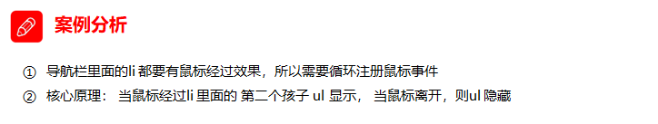

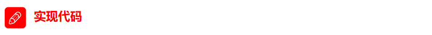

```js
    <script>
        // 1. 获取元素
        var nav = document.querySelector('.nav');
        var lis = nav.children; // 得到4个小li
        // 2.循环注册事件
        for (var i = 0; i < lis.length; i++) {
            lis[i].onmouseover = function() {
                this.children[1].style.display = 'block';
            }
            lis[i].onmouseout = function() {
                this.children[1].style.display = 'none';
            }
        }
    </script>
```

### 1.6.6. 兄弟节点

**下一个兄弟节点**（包括所有类型的节点）


**上一个兄弟节点**


```js
    <div>我是div</div>
    <span>我是span</span>
    <script>
        var div = document.querySelector('div');
        // 1.nextSibling 下一个兄弟节点 包含元素节点或者 文本节点等等
        console.log(div.nextSibling);
        console.log(div.previousSibling);
        // 2. nextElementSibling 得到下一个兄弟元素节点
        console.log(div.nextElementSibling);
        console.log(div.previousElementSibling);
    </script>
```

**下一个兄弟<u>元素</u>节点（有兼容性问题）**


**上一个兄弟<u>元素</u>节点（有兼容性问题）**


**注意：nextElementSibling和previousElementSibling有兼容性问题，IE9以上才支持**


```js
   function getNextElementSibling(element) {
      var el = element;
      while (el = el.nextSibling) {
        if (el.nodeType === 1) {
            return el;
        }
      }
      return null;
    }  
```

### 1.6.7. 创建元素节点

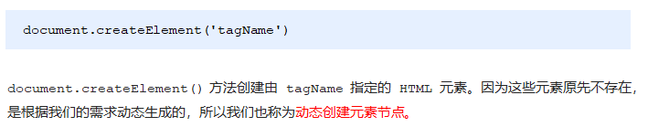

### 1.6.8. 添加元素节点


```js
    <ul>
        <li>123</li>
    </ul>
    <script>
        // 1. 创建节点元素节点
        var li = document.createElement('li');
        // 2. 添加节点 node.appendChild(child)  node 父级  child 是子级 后面追加元素
        var ul = document.querySelector('ul');
        ul.appendChild(li);
        // 3. 添加节点 node.insertBefore(child, 指定元素);
        var lili = document.createElement('li');
        ul.insertBefore(lili, ul.children[0]);
        // 4. 我们想要页面添加一个新的元素 ： 1. 创建元素 2. 添加元素
    </script>
```

### 1.6.9. 案例：简单版发布留言


```js
<body>
    <textarea name="" id=""></textarea>
    <button>发布</button>
    <ul>

    </ul>
    <script>
        // 1. 获取元素
        var btn = document.querySelector('button');
        var text = document.querySelector('textarea');
        var ul = document.querySelector('ul');
        // 2. 注册事件
        btn.onclick = function() {
            if (text.value == '') {
                alert('您没有输入内容');
                return false;
            } else {
                // console.log(text.value);
                // (1) 创建元素
                var li = document.createElement('li');
                // 先有li 才能赋值
                li.innerHTML = text.value;
                // (2) 添加元素
                // ul.appendChild(li);
                ul.insertBefore(li, ul.children[0]);
            }
        }
    </script>
</body>
```

# day03 - Web APIs

> 学习目标：
>
> 能够使用removeChild()方法删除节点
>
> 能够完成动态生成表格案例
>
> 能够使用传统方式和监听方式给元素注册事件
>
> 能够说出事件流执行的三个阶段
>
> 能够在事件处理函数中获取事件对象
>
> 能够使用事件对象取消默认行为
>
> 能够使用事件对象阻止事件冒泡
>
> 能够使用事件对象获取鼠标的位置
>
> 能够完成跟随鼠标的天使案例

## 1.1. 节点操作

### 1.1.1 删除节点


node.removeChild() 方法从 node节点中删除一个子节点，返回删除的节点。

```js
    <button>删除</button>
    <ul>
        <li>熊大</li>
        <li>熊二</li>
        <li>光头强</li>
    </ul>
    <script>
        // 1.获取元素
        var ul = document.querySelector('ul');
        var btn = document.querySelector('button');
        // 2. 删除元素  node.removeChild(child)
        // ul.removeChild(ul.children[0]);
        // 3. 点击按钮依次删除里面的孩子
        btn.onclick = function() {
            if (ul.children.length == 0) {
                this.disabled = true;
            } else {
                ul.removeChild(ul.children[0]);
            }
        }
    </script>
```


### 1.1.2 案例：删除留言


```js
    <textarea name="" id=""></textarea>
    <button>发布</button>
    <ul>

    </ul>
    <script>
        // 1. 获取元素
        var btn = document.querySelector('button');
        var text = document.querySelector('textarea');
        var ul = document.querySelector('ul');
        // 2. 注册事件
        btn.onclick = function() {
            if (text.value == '') {
                alert('您没有输入内容');
                return false;
            } else {
                // console.log(text.value);
                // (1) 创建元素
                var li = document.createElement('li');
                // 先有li 才能赋值
                li.innerHTML = text.value + "<a href='javascript:;'>删除</a>";
                // (2) 添加元素
                // ul.appendChild(li);
                ul.insertBefore(li, ul.children[0]);
                // (3) 删除元素 删除的是当前链接的li  它的父亲
                var as = document.querySelectorAll('a');
                for (var i = 0; i < as.length; i++) {
                    as[i].onclick = function() {
                        // 删除的是 li 当前a所在的li  this.parentNode;
                        ul.removeChild(this.parentNode);
                    }
                }
            }
        }
    </script>
```

### 1.1.3 复制（克隆）节点


```js
    <ul>
        <li>1111</li>
        <li>2</li>
        <li>3</li>
    </ul>
    <script>
        var ul = document.querySelector('ul');
        // 1. node.cloneNode(); 括号为空或者里面是false 浅拷贝 只复制标签不复制里面的内容
        // 2. node.cloneNode(true); 括号为true 深拷贝 复制标签复制里面的内容
        var lili = ul.children[0].cloneNode(true);
        ul.appendChild(lili);
    </script>
```

### 1.1.4 案例：动态生成表格


```js
    <script>
        // 1.先去准备好学生的数据
        var datas = [{
            name: '魏璎珞',
            subject: 'JavaScript',
            score: 100
        }, {
            name: '弘历',
            subject: 'JavaScript',
            score: 98
        }, {
            name: '傅恒',
            subject: 'JavaScript',
            score: 99
        }, {
            name: '明玉',
            subject: 'JavaScript',
            score: 88
        }, {
            name: '大猪蹄子',
            subject: 'JavaScript',
            score: 0
        }];
        // 2. 往tbody 里面创建行： 有几个人（通过数组的长度）我们就创建几行
        var tbody = document.querySelector('tbody');
		// 遍历数组
        for (var i = 0; i < datas.length; i++) { 
            // 1. 创建 tr行
            var tr = document.createElement('tr');
            tbody.appendChild(tr);
            // 2. 行里面创建单元格td 单元格的数量取决于每个对象里面的属性个数  
            // 使用for in遍历学生对象
            for (var k in datas[i]) { 
                // 创建单元格 
                var td = document.createElement('td');
                // 把对象里面的属性值 datas[i][k] 给 td  
                td.innerHTML = datas[i][k];
                tr.appendChild(td);
            }
            // 3. 创建有删除2个字的单元格 
            var td = document.createElement('td');
            td.innerHTML = '<a href="javascript:;">删除 </a>';
            tr.appendChild(td);

        }
        // 4. 删除操作 开始 
        var as = document.querySelectorAll('a');
        for (var i = 0; i < as.length; i++) {
            as[i].onclick = function() {
                // 点击a 删除 当前a 所在的行(链接的爸爸的爸爸)  node.removeChild(child)  
                tbody.removeChild(this.parentNode.parentNode)
            }
        }
    </script>
```

### 1.1.5 创建元素的三种方式


```js
    <script>
        // 三种创建元素方式区别 
        // 1. document.write() 创建元素  如果页面文档流加载完毕，再调用这句话会导致页面重绘
         var btn = document.querySelector('button');
         btn.onclick = function() {
             document.write('<div>123</div>');
         }

        // 2. innerHTML 拼接字符串形式创建元素
        var inner = document.querySelector('.inner');
         for (var i = 0; i <= 100; i++) {
             inner.innerHTML += '<a href="#">百度</a>'
         }
		// innerHTML 数组形式创建元素
        var arr = [];
        for (var i = 0; i <= 100; i++) {
            arr.push('<a href="#">百度</a>');
        }
        inner.innerHTML = arr.join('');
        // 3. document.createElement() 创建元素
        var create = document.querySelector('.create');
        for (var i = 0; i <= 100; i++) {
            var a = document.createElement('a');
            create.appendChild(a);
        }
    </script>
```

### 1.1.6 innerTHML和createElement效率对比

**拼接字符串形式要在内存中创建大量的中间字符串，效率非常低，把所有字符串放到数组中，然后再给innerHtml一次性赋值，效率最高，建议使用**

**innerHTML字符串拼接方式（效率低）**

```js
<script>
    function fn() {
        var d1 = +new Date();
        var str = '';
        for (var i = 0; i < 1000; i++) {
            document.body.innerHTML += '<div style="width:100px; height:2px; border:1px solid blue;"></div>';
        }
        var d2 = +new Date();
        console.log(d2 - d1);
    }
    fn();
</script>
```

**createElement方式（效率一般）**

```js
<script>
    function fn() {
        var d1 = +new Date();

        for (var i = 0; i < 1000; i++) {
            var div = document.createElement('div');
            div.style.width = '100px';
            div.style.height = '2px';
            div.style.border = '1px solid red';
            document.body.appendChild(div);
        }
        var d2 = +new Date();
        console.log(d2 - d1);
    }
    fn();
</script>
```

**innerHTML数组方式（效率高）**

```js
<script>
    function fn() {
        var d1 = +new Date();
        var array = [];
        for (var i = 0; i < 1000; i++) {
            array.push('<div style="width:100px; height:2px; border:1px solid blue;"></div>');
        }
        document.body.innerHTML = array.join('');
        var d2 = +new Date();
        console.log(d2 - d1);
    }
    fn();
</script>
```


## 1.2. DOM的核心总结


关于dom操作，我们主要针对于元素的操作。主要有创建、增、删、改、查、属性操作、事件操作。

### 1.2.1. 创建

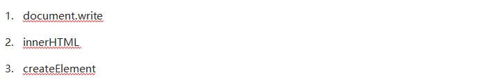

### 1.2.2. 增加


### 1.2.3. 删


### 1.2.4. 改


### 1.2.5. 查


### 1.2.6. 属性操作


### 1.2.7. 事件操作（重点）


## 1.3. 事件高级

### 1.3.1. 注册事件（2种方式）


（监听器就是指事件处理函数）

### 1.3.2 事件监听

#### addEventListener()事件监听（IE9以后支持）


eventTarget.addEventListener()方法将指定的监听器注册到 eventTarget（目标对象）上，当该对象触发指定的事件时，就会执行事件处理函数。


#### attacheEvent()事件监听（IE678支持）


​	eventTarget.attachEvent()方法将指定的监听器注册到 eventTarget（目标对象） 上，当该对象触发指定的事件时，指定的回调函数就会被执行。


```js
<button>传统注册事件</button>
<button>方法监听注册事件</button>
<button>ie9 attachEvent</button>
<script>
    var btns = document.querySelectorAll('button');
    // 1. 传统方式注册事件
    btns[0].onclick = function() {
        alert('hi');
    }
    btns[0].onclick = function() {
            alert('hao a u');
        }
   // 2. 事件侦听注册事件 addEventListener 
   // (1) 里面的事件类型是字符串 必定加引号 而且不带on
   // (2) 同一个元素 同一个事件可以添加多个侦听器（事件处理程序）
    btns[1].addEventListener('click', function() {
        alert(22);
    })
    btns[1].addEventListener('click', function() {
            alert(33);
    })
    // 3. attachEvent ie9以前的版本支持
    btns[2].attachEvent('onclick', function() {
        alert(11);
    })
</script>
```
#### 事件监听兼容性解决方案

封装一个函数，函数中判断浏览器的类型：


### 1.3.3. 删除事件（解绑事件）


```js
    <div>1</div>
    <div>2</div>
    <div>3</div>
    <script>
        var divs = document.querySelectorAll('div');
        divs[0].onclick = function() {
            alert(11);
            // 1. 传统方式删除事件
            divs[0].onclick = null;
        }
        // 2. removeEventListener 删除事件
//移除事件的时候，需要指出函数名，所以在绑定事件的时候，也不能采用匿名的方式了，需要指定函数名
        divs[1].addEventListener('click', fn) // 里面的fn 不需要调用加小括号
        function fn() {
            alert(22);
            divs[1].removeEventListener('click', fn);
        }
        // 3. detachEvent
        divs[2].attachEvent('onclick', fn1);

        function fn1() {
            alert(33);
            divs[2].detachEvent('onclick', fn1);
        }
    </script>
```

**删除事件兼容性解决方案 **

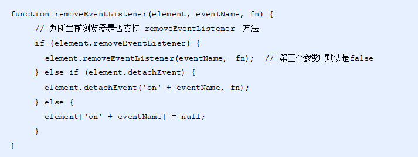

### 1.3.4. DOM事件流

> html中的标签都是相互嵌套的，我们可以将元素想象成一个盒子装一个盒子，document是最外面的大盒子。
> 当你点击一个div时，同时你也点击了div的父元素，甚至整个页面。
>
> 那么是先执行父元素的点击事件，还是先执行div的点击事件 呢？


> 比如：我们给页面中的一个div注册了单击事件，当你单击了div时，也就单击了body，单击了html，单击了document。


> ```
> 当时的2大浏览器霸主谁也不服谁！
> IE 提出从目标元素开始，然后一层一层向外接收事件并响应，也就是冒泡型事件流。
> 
> Netscape（网景公司）提出从最外层开始，然后一层一层向内接收事件并响应，也就是捕获型事件流。 
> 
> 最终，w3c 采用折中的方式，平息了战火，制定了统一的标准 —--— 先捕获再冒泡。
> 现代浏览器都遵循了此标准，所以当事件发生时，会经历3个阶段。
> ```

DOM 事件流会经历3个阶段： 

1. 捕获阶段

2. 当前目标阶段

3. 冒泡阶段 

​	这就类似于，我们向水里面扔一块石头，首先它会有一个下降的过程，这个过程就可以理解为从最顶层向事件发生的最具体元素（目标点）的捕获过程；之后会产生泡泡，会在最低点（ 最具体元素）之后漂浮到水面上，这个过程相当于事件冒泡。 


注意：


1. JS 代码中只能执行捕获或者冒泡中的一个阶段。

2. onclick 和 attachEvent（ie） 只能得到冒泡阶段。

3. addEventListener可以通过第三个参数设置执行捕获阶段还是冒泡阶段， 如果addEventListener 第三个参数是 true 那么执行捕获阶段 document -> html -> body -> father -> son
4. 如果addEventListener 第三个参数是 false 或者 省略 那么则执行冒泡阶段 son -> father ->body -> html -> document
5. 实际开发中我们很少使用事件捕获，我们更关注事件冒泡
6. 有些事件是没有冒泡的，比如onblur，onfocus，onmouseenter，onmouseleave

**事件冒泡**

```js
    <div class="father">
        <div class="son">son盒子</div>
    </div>
    <script>
        // onclick 和 attachEvent（ie） 在冒泡阶段触发
        // 冒泡阶段 如果addEventListener 第三个参数是 false 或者 省略 
        // son -> father ->body -> html -> document
        var son = document.querySelector('.son');
		// 给son注册单击事件，第三个参数为false
        son.addEventListener('click', function() {
            alert('son');
        }, false);
		// 给father注册单击事件，第三个参数为false
        var father = document.querySelector('.father');
        father.addEventListener('click', function() {
            alert('father');
        }, false);
		// 给document注册单击事件，省略第3个参数
        document.addEventListener('click', function() {
            alert('document');
        })
    </script>
```

**事件捕获**

```js
    <div class="father">
        <div class="son">son盒子</div>
    </div>
    <script>
        // 如果addEventListener() 第三个参数是 true 那么在捕获阶段触发
        // document -> html -> body -> father -> son
         var son = document.querySelector('.son');
		// 给son注册单击事件，第3个参数为true
         son.addEventListener('click', function() {
             alert('son');
         }, true);
         var father = document.querySelector('.father');
		// 给father注册单击事件，第3个参数为true
         father.addEventListener('click', function() {
             alert('father');
         }, true);
		// 给document注册单击事件，第3个参数为true
        document.addEventListener('click', function() {
            alert('document');
        }, true)
    </script>
```

### 1.3.5. 事件对象

#### 什么是事件对象

事件发生后，跟事件相关的一系列信息数据的集合都放到这个对象里面，这个对象就是事件对象。

比如：  

1. 谁绑定了这个事件。

2. 鼠标触发事件的话，会得到鼠标的相关信息，如鼠标位置。

3. 键盘触发事件的话，会得到键盘的相关信息，如按了哪个键。

#### 事件对象的使用

事件触发发生时就会产生事件对象，**并且系统会自动将其以实参的形式传给事件处理函数**。

所以，在事件处理函数中声明1个形参用来接收事件对象。


#### 事件对象的兼容性处理

事件对象本身的获取存在兼容问题：

1. 标准浏览器中是浏览器给方法传递的参数，只需要定义形参 e 就可以获取到。

2. 在 IE6~8 中，浏览器不会给方法传递参数，如果需要的话，需要到 window.event 中获取查找。


```js
    <div>123</div>
    <script>
        var div = document.querySelector('div');
        div.onclick = function(e) {
                // 事件对象
                e = e || window.event;
                console.log(e);
        }
    </script>
```

#### 事件对象的属性和方法


#### e.target 和 this 的区别

-  this 是事件绑定的元素（绑定这个事件处理函数的元素） 。

-  e.target 是事件触发的元素。

> ```
> 常情况下terget 和 this是一致的，
> 但有一种情况不同，那就是在事件冒泡时（父子元素中给父元素绑定了事件，单击子元素，触发父元素的事件处理函数），这时候this指向的是父元素，因为它是绑定事件的元素对象，而target指向的是子元素，因为他是触发事件的那个具体元素对象。
> ```

```js
    <div>123</div>
    <script>
        var div = document.querySelector('div');
        div.addEventListener('click', function(e) {
            // e.target 和 this指向的都是div
            console.log(e.target);
            console.log(this);
        });
    </script>
```

事件冒泡下的e.target和this

```js
    <ul>
        <li>abc</li>
        <li>abc</li>
        <li>abc</li>
    </ul>
    <script>
        var ul = document.querySelector('ul');
        ul.addEventListener('click', function(e) {
              // 我们给ul 绑定了事件  那么this 就指向ul  
              console.log(this); // ul
              // e.target 触发了事件的对象 我们点击的是li e.target 指向的就是li
              console.log(e.target); // li
        });
    </script>
```

### 1.3.6 阻止默认行为

> html中一些标签有默认行为，例如a标签被单击后，默认会进行页面跳转。

```js
    <a href="http://www.baidu.com">百度</a>
    <script>
        // 阻止默认行为 让链接不跳转 
        var a = document.querySelector('a');
        a.addEventListener('click', function(e) {
             e.preventDefault(); //  dom 标准写法
        });
        // 传统的注册方式
        a.onclick = function(e) {
            // 普通浏览器 e.preventDefault();  方法
            e.preventDefault();
            // 低版本浏览器 ie678  returnValue  属性
            e.returnValue = false;
            // 没有兼容性问题的话，我们可以利用return false，但是后边代码就不会继续执行了
            return false;
        }
    </script>
```

### 1.3.7 阻止事件冒泡

事件冒泡本身的特性，会带来的坏处，也会带来的好处。


```js
    <div class="father">
        <div class="son">son儿子</div>
    </div>
    <script>
        var son = document.querySelector('.son');
		// 给son注册单击事件
        son.addEventListener('click', function(e) {
            alert('son');
            e.stopPropagation(); // stop 停止  Propagation 传播
            window.event.cancelBubble = true; // 非标准 cancel 取消 bubble 泡泡
        }, false);

        var father = document.querySelector('.father');
		// 给father注册单击事件
        father.addEventListener('click', function() {
            alert('father');
        }, false);
		// 给document注册单击事件
        document.addEventListener('click', function() {
            alert('document');
        })
    </script>
```

**阻止事件冒泡的兼容性处理**


注意：这里只给son添加阻止冒泡了，如果点击father的话，还会冒泡到document的

### 1.3.8 事件委托（事件代理、事件委派）

事件冒泡本身的特性，会带来的坏处，也会带来的好处。

#### 什么是事件委托

```
把事情委托给别人，代为处理。
```

事件委托也称为事件代理，在 jQuery 里面称为事件委派。

> 说白了就是，不给子元素注册事件，给父元素注册事件，把处理代码在父元素的事件中执行。


**生活中的代理：**


**js事件中的代理：**


#### 事件委托的原理

给父元素注册事件，利用事件冒泡，当子元素的事件触发，会冒泡到父元素，触发父元素的事件处理函数，并且可以通过事件对象的target来找到触发事件的子元素，从而控制相应的子元素。

#### 事件委托的作用

- 我们只操作了一次 DOM ，提高了程序的性能。

- 动态新创建的子元素，也拥有事件。

```js
    <ul>
        <li>知否知否，点我应有弹框在手！</li>
        <li>知否知否，点我应有弹框在手！</li>
        <li>知否知否，点我应有弹框在手！</li>
        <li>知否知否，点我应有弹框在手！</li>
        <li>知否知否，点我应有弹框在手！</li>
    </ul>
    <script>
        // 事件委托的核心原理：给父节点添加侦听器， 利用事件冒泡影响每一个子节点
        var ul = document.querySelector('ul');
        ul.addEventListener('click', function(e) {
            // e.target 这个可以得到我们点击的对象
            e.target.style.backgroundColor = 'pink';
        })
    </script>
```

## 1.4. 常用鼠标事件


### 1.4.1 案例：禁止选中文字和禁止右键菜单


```js
<body>
    我是一段不愿意分享的文字
    <script>
        // 1. contextmenu 我们可以禁用右键菜单
        document.addEventListener('contextmenu', function(e) {
                e.preventDefault();
        })
        // 2. 禁止选中文字 selectstart
        document.addEventListener('selectstart', function(e) {
            e.preventDefault();
        })
    </script>
</body>
```

### 1.4.2 鼠标事件对象


### 1.4.3 获取鼠标在页面的坐标

```js
    <script>
        // 鼠标事件对象 MouseEvent
        document.addEventListener('click', function(e) {
            // 1. client 鼠标在可视区的x和y坐标（不受滚动条影响）
            console.log(e.clientX);
            console.log(e.clientY);
            console.log('---------------------');

            // 2. page 鼠标在页面文档的x和y坐标（受滚动条影响）
            console.log(e.pageX);
            console.log(e.pageY);
            console.log('---------------------');

            // 3. screen 鼠标在电脑屏幕的x和y坐标
            console.log(e.screenX);
            console.log(e.screenY);

        })
    </script>
```

### 1.4.4 案例：跟随鼠标的天使

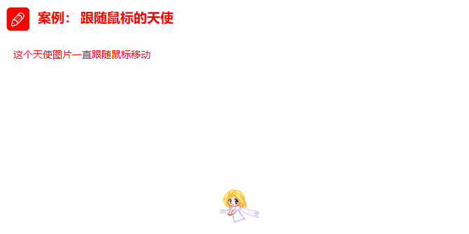


```js
    
    <script>
        var pic = document.querySelector('img');
        document.addEventListener('mousemove', function(e) {
        	// 1. mousemove只要我们鼠标移动1px 就会触发这个事件
        	// 2.核心原理： 每次鼠标移动，我们都会获得最新的鼠标坐标， 
            // 把这个x和y坐标做为图片的top和left 值就可以移动图片
        	var x = e.pageX;
        	var y = e.pageY;
        	console.log('x坐标是' + x, 'y坐标是' + y);
        	//3 . 千万不要忘记给left 和top 添加px 单位
        	pic.style.left = x - 50 + 'px';
        	pic.style.top = y - 40 + 'px';
    	});
    </script>
```

# day04 - Web APIs

> 学习目标：
>
> 能够说出常用的3-5个键盘事件
>
> 能够知道如何获取当前键盘按下的是哪个键
>
> 能够知道浏览器的顶级对象window
>
> 能够使用window.onload事件
>
> 能够使用window.onresize事件
>
> 能够说出两种定时器的区别
>
> 能够使用location对象的href属性完成页面之间的跳转
>
> 能够使用location对象获取url中的参数部分
>
> 能够使用history提供的方法实现页面刷新

## 1.1. 常用的键盘事件

### 1.1.1 键盘事件


```js
    <script>
        // 常用的键盘事件
        //1. keyup 按键弹起的时候触发 
        document.addEventListener('keyup', function() {
            console.log('我弹起了');
        })

        //3. keypress 按键按下的时候触发  不能识别功能键 比如 ctrl shift 左右箭头啊
        document.addEventListener('keypress', function() {
                console.log('我按下了press');
        })
        //2. keydown 按键按下的时候触发  能识别功能键 比如 ctrl shift 左右箭头啊
        document.addEventListener('keydown', function() {
                console.log('我按下了down');
        })
        // 4. 三个事件的执行顺序  keydown -- keypress -- keyup
    </script>
```

### 1.1.2 键盘事件对象


**使用keyCode属性判断用户按下哪个键**

```js
    <script>
        // 键盘事件对象中的keyCode属性可以得到相应键的ASCII码值
        document.addEventListener('keyup', function(e) {
            console.log('up:' + e.keyCode);
            // 我们可以利用keycode返回的ASCII码值来判断用户按下了那个键
            if (e.keyCode === 65) {
                alert('您按下的a键');
            } else {
                alert('您没有按下a键')
            }
        })
        document.addEventListener('keypress', function(e) {
            // console.log(e);
            console.log('press:' + e.keyCode);
        })
    </script>
```

### 1.1.3 案例：模拟京东按键输入内容

当我们按下 s 键， 光标就定位到搜索框（文本框获得焦点）。


> 注意：触发获得焦点事件，可以使用 元素对象.focus()

```js
    <input type="text">
    <script>
        // 获取输入框
        var search = document.querySelector('input');
		// 给document注册keyup事件
        document.addEventListener('keyup', function(e) {
            // 判断keyCode的值
            if (e.keyCode === 83) {
                // 触发输入框的获得焦点事件
                search.focus();
            }
        })
    </script>
```

### 1.1.4 案例：模拟京东快递单号查询

要求：当我们在文本框中输入内容时，文本框上面自动显示大字号的内容。


```js
    <div class="search">
        <div class="con">123</div>
        <input type="text" placeholder="请输入您的快递单号" class="jd">
    </div>
    <script>
        // 获取要操作的元素
        var con = document.querySelector('.con');
        var jd_input = document.querySelector('.jd');
		// 给输入框注册keyup事件
        jd_input.addEventListener('keyup', function() {
				// 判断输入框内容是否为空
                if (this.value == '') {
                    // 为空，隐藏放大提示盒子
                    con.style.display = 'none';
                } else {
                    // 不为空，显示放大提示盒子，设置盒子的内容
                    con.style.display = 'block';
                    con.innerText = this.value;
                }
            })
        // 给输入框注册失去焦点事件，隐藏放大提示盒子
        jd_input.addEventListener('blur', function() {
                con.style.display = 'none';
            })
        // 给输入框注册获得焦点事件
        jd_input.addEventListener('focus', function() {
            // 判断输入框内容是否为空
            if (this.value !== '') {
                // 不为空则显示提示盒子
                con.style.display = 'block';
            }
        })
    </script>
```

## 1.2. BOM

### 1.2.1. 什么是BOM

​	BOM（Browser Object Model）即浏览器对象模型，它提供了独立于内容而与浏览器窗口进行交互的对象，其核心对象是 window。

​	BOM 由一系列相关的对象构成，并且每个对象都提供了很多方法与属性。

​	BOM 缺乏标准，JavaScript 语法的标准化组织是 ECMA，DOM 的标准化组织是 W3C，BOM 最初是Netscape 浏览器标准的一部分。


### 1.2.2. BOM的构成

BOM 比 DOM 更大，它包含 DOM。

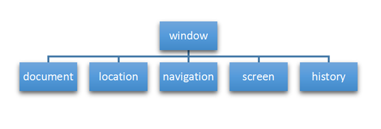

### 1.2.3. 顶级对象window


### 1.2.4. window对象的常见事件

#### 页面（窗口）加载事件（2种）

**第1种**


window.onload 是窗口 (页面）加载事件，**当文档内容完全加载完成**会触发该事件(包括图像、脚本文件、CSS 文件等), 就调用的处理函数。


**第2种**

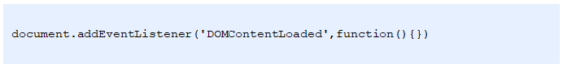

​	DOMContentLoaded 事件触发时，仅当DOM加载完成，不包括样式表，图片，flash等等。

​	IE9以上才支持！！！

​	如果页面的图片很多的话, 从用户访问到onload触发可能需要较长的时间, 交互效果就不能实现，必然影响用户的体验，此时用 DOMContentLoaded 事件比较合适。

```js
    <script>
        window.addEventListener('load', function() {
            var btn = document.querySelector('button');
            btn.addEventListener('click', function() {
                alert('点击我');
            })
        })
        window.addEventListener('load', function() {
            alert(22);
        })
        document.addEventListener('DOMContentLoaded', function() {
            alert(33);
        })
    </script>
```

#### 调整窗口大小事件


​	window.onresize 是调整窗口大小加载事件,  当触发时就调用的处理函数。

注意：

1. 只要窗口大小发生像素变化，就会触发这个事件。

2. 我们经常利用这个事件完成响应式布局。 window.innerWidth 当前屏幕的宽度

```js
    <script>
        // 注册页面加载事件
        window.addEventListener('load', function() {
            var div = document.querySelector('div');
        	// 注册调整窗口大小事件
            window.addEventListener('resize', function() {
                // window.innerWidth 获取窗口大小
                console.log('变化了');
                if (window.innerWidth <= 800) {
                    div.style.display = 'none';
                } else {
                    div.style.display = 'block';
                }
            })
        })
    </script>
    <div></div>
```


### 1.2.5. 定时器（两种）

window 对象给我们提供了 2 个非常好用的方法-定时器。

- setTimeout() 

- setInterval()  

#### setTimeout() 炸弹定时器

##### 开启定时器


> ```
> 普通函数是按照代码顺序直接调用。
> 
> 简单理解： 回调，就是回头调用的意思。上一件事干完，再回头再调用这个函数。
> 例如：定时器中的调用函数，事件处理函数，也是回调函数。
> 
> 以前我们讲的   element.onclick = function(){}   或者  element.addEventListener(“click”, fn);   里面的 函数也是回调函数。
> 
> ```


```js
    <script>
        // 回调函数是一个匿名函数
         setTimeout(function() {
             console.log('时间到了');

         }, 2000);
        function callback() {
            console.log('爆炸了');
        }
		// 回调函数是一个有名函数
        var timer1 = setTimeout(callback, 3000);
        var timer2 = setTimeout(callback, 5000);
    </script>
```

##### 案例：5秒后关闭广告


```js
<body>
    
    <script>
        // 获取要操作的元素
        var ad = document.querySelector('.ad');
		// 开启定时器
        setTimeout(function() {
            ad.style.display = 'none';
        }, 5000);
    </script>
</body>
```

##### 停止定时器


```js
    <button>点击停止定时器</button>
    <script>
        var btn = document.querySelector('button');
		// 开启定时器
        var timer = setTimeout(function() {
            console.log('爆炸了');
        }, 5000);
		// 给按钮注册单击事件
        btn.addEventListener('click', function() {
            // 停止定时器
            clearTimeout(timer);
        })
    </script>
```


#### setInterval() 闹钟定时器

##### 开启定时器


```js
    <script>
        // 1. setInterval 
        setInterval(function() {
            console.log('继续输出');
        }, 1000);
    </script>
```

##### 案例：倒计时


```js
    <div>
        <span class="hour">1</span>
        <span class="minute">2</span>
        <span class="second">3</span>
    </div>
    <script>
        // 1. 获取元素（时分秒盒子） 
        var hour = document.querySelector('.hour'); // 小时的黑色盒子
        var minute = document.querySelector('.minute'); // 分钟的黑色盒子
        var second = document.querySelector('.second'); // 秒数的黑色盒子
        var inputTime = +new Date('2019-5-1 18:00:00'); // 返回的是用户输入时间总的毫秒数

        countDown(); // 我们先调用一次这个函数，防止第一次刷新页面有空白 

        // 2. 开启定时器
        setInterval(countDown, 1000);
		
        function countDown() {
            var nowTime = +new Date(); // 返回的是当前时间总的毫秒数
            var times = (inputTime - nowTime) / 1000; // times是剩余时间总的秒数 
            var h = parseInt(times / 60 / 60 % 24); //时
            h = h < 10 ? '0' + h : h;
            hour.innerHTML = h; // 把剩余的小时给 小时黑色盒子
            var m = parseInt(times / 60 % 60); // 分
            m = m < 10 ? '0' + m : m;
            minute.innerHTML = m;
            var s = parseInt(times % 60); // 当前的秒
            s = s < 10 ? '0' + s : s;
            second.innerHTML = s;
        }
    </script>
```

##### 停止定时器


#### 案例：发送短信倒计时

​	点击按钮后，该按钮60秒之内不能再次点击，防止重复发送短信。


```js
    手机号码： <input type="number"> <button>发送</button>
    <script>
        var btn = document.querySelector('button');
		// 全局变量，定义剩下的秒数
        var time = 3; 
		// 注册单击事件
        btn.addEventListener('click', function() {
            // 禁用按钮
            btn.disabled = true;
            // 开启定时器
            var timer = setInterval(function() {
                // 判断剩余秒数
                if (time == 0) {
                    // 清除定时器和复原按钮
                    clearInterval(timer);
                    btn.disabled = false;
                    btn.innerHTML = '发送';
                } else {
                    btn.innerHTML = '还剩下' + time + '秒';
                    time--;
                }
            }, 1000);
        });
    </script>
```


### 1.2.6. this指向问题

​	this的指向在函数定义的时候是确定不了的，只有函数执行的时候才能确定this到底指向谁，一般情况下this的最终指向的是那个调用它的对象。

现阶段，我们先了解一下几个this指向

1. 全局作用域或者普通函数中this指向全局对象window（注意定时器里面的this指向window）

2. 方法调用中谁调用this指向谁
3. 构造函数中this指向构造函数的实例

```js
    <button>点击</button>
    <script>
        // this 指向问题 一般情况下this的最终指向的是那个调用它的对象
        // 1. 全局作用域或者普通函数中this指向全局对象window（ 注意定时器里面的this指向window）
        console.log(this);
        function fn() {
            console.log(this);
        }
        window.fn();
        window.setTimeout(function() {
            console.log(this);
        }, 1000);
        // 2. 方法调用中谁调用this指向谁
        var o = {
            sayHi: function() {
                console.log(this); // this指向的是 o 这个对象
            }
        }
        o.sayHi();
        var btn = document.querySelector('button');
        btn.addEventListener('click', function() {
                console.log(this); // 事件处理函数中的this指向的是btn这个按钮对象
            })
        // 3. 构造函数中this指向构造函数的实例
        function Fun() {
            console.log(this); // this 指向的是fun 实例对象
        }
        var fun = new Fun();
    </script>
```


### 1.2.7. location对象

#### 什么是 location 对象


#### URL


#### location 对象的属性


#### 案例：5分钟自动跳转页面


```js
    <button>点击</button>
    <div></div>
    <script>
        var btn = document.querySelector('button');
        var div = document.querySelector('div');
        btn.addEventListener('click', function() {
            // console.log(location.href);
            location.href = 'http://www.itcast.cn';
        })
        var timer = 5;
        setInterval(function() {
            if (timer == 0) {
                location.href = 'http://www.itcast.cn';
            } else {
                div.innerHTML = '您将在' + timer + '秒钟之后跳转到首页';
                timer--;
            }
        }, 1000);
    </script>
```

#### 案例：获取URL参数


```js
    <div></div>
	<script>
        console.log(location.search); // ?uname=andy
        // 1.先去掉？  substr('起始的位置'，截取几个字符);
        var params = location.search.substr(1); // uname=andy
        console.log(params);
        // 2. 利用=把字符串分割为数组 split('=');
        var arr = params.split('=');
        console.log(arr); // ["uname", "ANDY"]
        var div = document.querySelector('div');
        // 3.把数据写入div中
        div.innerHTML = arr[1] + '欢迎您';
    </script>
```

#### location对象的常见方法


```js
    <button>点击</button>
    <script>
        var btn = document.querySelector('button');
        btn.addEventListener('click', function() {
            // 记录浏览历史，所以可以实现后退功能
            // location.assign('http://www.itcast.cn');
            // 不记录浏览历史，所以不可以实现后退功能
            // location.replace('http://www.itcast.cn');
            location.reload(true);
        })
    </script>
```

### 1.2.8. navigator对象

​	navigator 对象包含有关浏览器的信息，它有很多属性，我们最常用的是 userAgent，该属性可以返回由客户机发送服务器的 user-agent 头部的值。

下面前端代码可以判断用户那个终端打开页面，实现跳转

```js
if((navigator.userAgent.match(/(phone|pad|pod|iPhone|iPod|ios|iPad|Android|Mobile|BlackBerry|IEMobile|MQQBrowser|JUC|Fennec|wOSBrowser|BrowserNG|WebOS|Symbian|Windows Phone)/i))) {
    window.location.href = "";     //手机
 } else {
    window.location.href = "";     //电脑
 }
```

### 1.2.9 history对象

​	window对象给我们提供了一个 history对象，与浏览器历史记录进行交互。该对象包含用户（在浏览器窗口中）访问过的URL。


history对象一般在实际开发中比较少用，但是会在一些 OA 办公系统中见到。


## 1.3. JS执行机制

以下代码执行的结果是什么？

```js
 console.log(1);
 
 setTimeout(function () {
     console.log(3);
 }, 1000);
 
 console.log(2);
```

以下代码执行的结果是什么？

```js
 console.log(1);
 
 setTimeout(function () {
     console.log(3);
 }, 0);
 
 console.log(2);
```


### 1.3.1 JS 是单线程


```js
	单线程就意味着，所有任务需要排队，前一个任务结束，才会执行后一个任务。如果前一个任务耗时很长，后一个任务就不得不一直等着。
	这样所导致的问题是： 如果 JS 执行的时间过长，这样就会造成页面的渲染不连贯，导致页面渲染加载阻塞的感觉。
```

### 1.3.2 同步任务和异步任务

​	单线程导致的问题就是后面的任务等待前面任务完成，如果前面任务很耗时（比如读取网络数据），后面任务不得不一直等待！！

​	为了解决这个问题，利用多核 CPU 的计算能力，HTML5 提出 Web Worker 标准，允许 JavaScript 脚本创建多个线程，但是子线程完全受主线程控制。于是，JS 中出现了**同步任务**和**异步任务**。

#### 同步

​	前一个任务结束后再执行后一个任务，程序的执行顺序与任务的排列顺序是一致的、同步的。比如做饭的同步做法：我们要烧水煮饭，等水开了（10分钟之后），再去切菜，炒菜。

#### 异步

​	你在做一件事情时，因为这件事情会花费很长时间，在做这件事的同时，你还可以去处理其他事情。比如做饭的异步做法，我们在烧水的同时，利用这10分钟，去切菜，炒菜。


> ```js
> JS中所有任务可以分成两种，一种是同步任务（synchronous），另一种是异步任务（asynchronous）。
> 
> 同步任务指的是：
> 	在主线程上排队执行的任务，只有前一个任务执行完毕，才能执行后一个任务；
> 异步任务指的是：
> 	不进入主线程、而进入”任务队列”的任务，当主线程中的任务运行完了，才会从”任务队列”取出异步任务放入主线程执行。
> ```


### 1.3.3 JS执行机制（事件循环）


### 1.3.4 代码思考题

```js
 console.log(1);
 document.onclick = function() {
   console.log('click');
 }

 setTimeout(function() {
   console.log(3)
 }, 3000)
 console.log(2);
```

