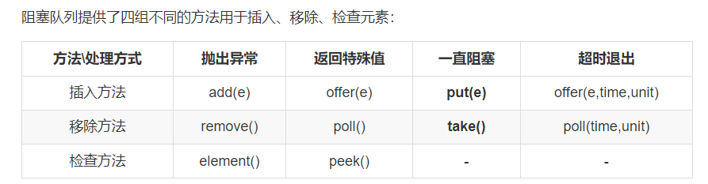

## 线程池原理 

### 为什么要用线程池？

1. 创建销毁线程需要资源，要复用

2. 控制并发的数量

3. 可以对线程做统一的管理

   ---

   线程池的顶层接口是Executor接口， ThreadPoolExecutor是他的常用实现类，其中最重要的是execute函数，流程如下：

   ​	当一个Runable对象被传入后，先判断当前线程数是否小于coreSize，如果是就新建程程处理，如果已经满了就往等待队列里放，然后检查运行状态是不是running，如果不是就移除任务，执行拒绝策略。

1. 线程总数量 < corePoolSize，无论线程是否空闲，都会新建一个核心线程执行任务（让核心线程数量快速达到corePoolSize，在核心线程数量 < corePoolSize时）。**注意，这一步需要获得全局锁。**
2. 线程总数量 >= corePoolSize时，新来的线程任务会进入任务队列中等待，然后空闲的核心线程会依次去缓存队列中取任务来执行（体现了**线程复用**）。
3. 当缓存队列满了，说明这个时候任务已经多到爆棚，需要一些“临时工”来执行这些任务了。于是会创建非核心线程去执行这个任务。**注意，这一步需要获得全局锁。**
4. 缓存队列满了， 且总线程数达到了maximumPoolSize，则会采取上面提到的拒绝策略进行处理。

execute提供了几种静态方法，其实就是调用ThreadPoolExecutor的不同构造方法。

newCachedThreadPool

### newFixedThreadPool

### newSingleThreadExecutor

###  newScheduledThreadPool

但是《阿里巴巴开发手册》不建议我们直接使用Executors类中的线程池，而是通过`ThreadPoolExecutor`的方式，这样的处理方式让写的同学需要更加明确线程池的运行规则，规避资源耗尽的风险。

---

## 阻塞队列

> BlockingQueue是Java util.concurrent包下重要的数据结构，区别于普通的队列，BlockingQueue提供了**线程安全的队列访问方式**，并发包下很多高级同步类的实现都是基于BlockingQueue实现的。

BlockingQueue一般用于生产者-消费者模式，生产者是往队列里添加元素的线程，消费者是从队列里拿元素的线程。**BlockingQueue就是存放元素的容器**。

实现类有：

1. **ArrayBlockingQueue** 由**数组**结构组成的**有界**阻塞队列。内部结构是数组，故具有数组的特性。

2. **LinkedBlockingQueue** 由**链表**结构组成的**有界**阻塞队列。内部结构是链表，具有链表的特性。默认队列的大小是`Integer.MAX_VALUE`，也可以指定大小。此队列按照**先进先出**的原则对元素进行排序。

3. **DelayQueue** 该队列中的元素只有当其指定的延迟时间到了，才能够从队列中获取到该元素 。

4. **PriorityBlockingQueue**   基于优先级的无界阻塞队列（优先级的判断通过构造函数传入的Compator对象来决定），内部控制线程同步的锁采用的是非公平锁。

5.  **SynchronousQueue**  这个队列比较特殊，**没有任何内部容量**，甚至连一个队列的容量都没有。并且每个 put 必须等待一个 take，反之亦然。

### 阻塞队列的原理(arrayBolockingQueue为例)

​	阻塞队列的原理很简单，利用了Lock锁的多条件（Condition）阻塞控制。首先是构造器，除了初始化队列的大小和是否是公平锁之外，还对同一个锁（lock）初始化了两个监视器，分别是notEmpty和notFull。这两个监视器的作用目前可以简单理解为标记分组，当该线程是put操作时，给他加上监视器notFull,标记这个线程是一个生产者；当线程是take操作时，给他加上监视器notEmpty，标记这个线程是消费者。

1. put和take操作都需要**先获取锁**，没有获取到锁的线程会被挡在第一道大门之外自旋拿锁，直到获取到锁。
2. 就算拿到锁了之后，也**不一定**会顺利进行put/take操作，需要判断**队列是否可用**（是否满/空），如果不可用，则会被阻塞，**并释放锁**。
3. 在第2点被阻塞的线程会被唤醒，但是在唤醒之后，**依然需要拿到锁**才能继续往下执行，否则，自旋拿锁，拿到锁了再while判断队列是否可用（这也是为什么不用if判断，而使用while判断的原因）。
