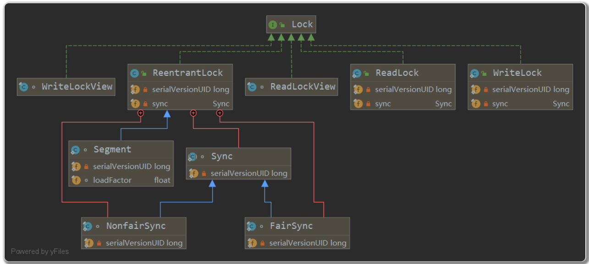

## Lock接口

​	为什么有了synchronized还需要锁？ 答：synchronized的锁方式比较死板，隐式的在同步块前后加解锁，而lock带来更多的灵活性，可以自己手动加解锁，可以加多个锁，以不同的顺序解锁。

​	手动使用锁需要遵守以下的结构，以保证锁的安全：

``` java
Lock l = ...;
 l.lock();
 try {
   // access the resource protected by this lock
 } finally {
   l.unlock();
 
```


```java
void lock() //获取一个锁对象
void lockInterruptibly() throws InterruptedException;//如果当前线程未被中断，则获取锁。如果锁可用，则获取锁并立即返回.
boolean tryLock();//立即获取一个锁，成功true，失败false 常见用法：
    Lock lock = ...;
    if (lock.tryLock()) {
        try {
            // manipulate protected state
        } finally {
            lock.unlock();
        }
    } else {
        // perform alternative actions
    }

 boolean tryLock(long time, TimeUnit unit) throws InterruptedException//加了最长等待时间
 void unlock();//解锁
Condition newCondition();// 返回condition对象，可以用来线程通信await n
```

