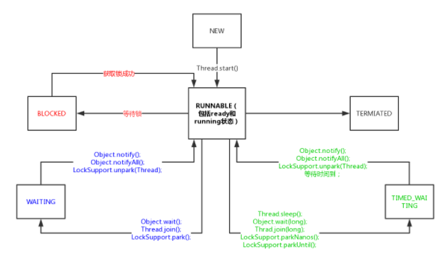

## Thread和Runnable接口的比较：

* 由于java单继承多实现的原因，实现runnable接口的灵活性比较大
* runnable降低了任务与线程的耦合
* runnable更符合面向对象的思想

## Callable,Future与FutureTask

​	runnable和thread执行完异步任务都是没有返回值的，所以需要callable。

​	那一般是怎么使用`Callable`的呢？`Callable`一般是配合线程池工具`ExecutorService`来使用的。我们会在后续章节解释线程池的使用。这里只介绍`ExecutorService`可以使用`submit`方法来让一个`Callable`接口执行。它会返回一个`Future`，我们后续的程序可以通过这个`Future`的`get`方法得到结果。

``` java
 public static void main(String[] args) throws Exception {
        ExecutorService executor= Executors.newCachedThreadPool();
        Callable task=()->{
            Thread.sleep(2000);
            return 2;
        };
        Future<Integer> res=executor.submit(task);
        System.out.println(res.get());
        System.out.println(1);			//这里会被前面阻塞
    }
```


FutureTask的写法：

``` java
public static void main(String[] args) throws Exception {
        ExecutorService executor= Executors.newCachedThreadPool();
        FutureTask<Integer> futureTask=new FutureTask<Integer>(()->{Thread.sleep(2000);return 2;});
        executor.submit(futureTask);
        System.out.println(futureTask.get());
        System.out.println(1);
    }
```

在很多高并发的环境下，有可能Callable和FutureTask会创建多次。FutureTask能够在高并发环境下**确保任务只执行一次**。

> 如果某个线程优先级大于线程所在**线程组的最大优先级**，那么该线程的优先级将会失效，取而代之的是线程组的最大优先级。

## Java线程的状态及主要转化方法

1. NEW：处于NEW状态的线程此时尚未启动。这里的尚未启动指的是还没调用Thread实例的start()方法。一个线程不能被start两次

2. RUNNABLE：表示当前线程正在运行中。处于RUNNABLE状态的线程在Java虚拟机中运行，也有可能在等待其他系统资源（比如I/O）。Java线程的**RUNNABLE**状态其实是包括了传统操作系统线程的**ready**和**running**两个状态的。

3. BLOCKED：阻塞状态。处于BLOCKED状态的线程正等待锁的释放以进入同步区。

4. WAITING：等待状态。处于等待状态的线程变成RUNNABLE状态需要其他线程唤醒。

5. TIMED_WAITING：超时等待状态。线程等待一个具体的时间，时间到后会被自动唤醒。

6. TERMINATED：终止状态。此时线程已执行完毕。

   

**sleep方法是不会释放当前的锁的，而wait方法会。**

